 <p align="center">
  
  </br>
  <b><b>Санкт-Петербургский государственный политехнический университет</b></br></b>
  <b>Институт компьютерных наук и технологий</b>
  </br></br>
</p>


</br></br></br></br></br></br></br></br></br>

<div align=left>
<!-- SPbSTU 最后一行 -->
<p align="right">
 <b>Выполнил студент гр.3530904/90102&emsp;&emsp;&emsp;&emsp;&emsp;&emsp;&emsp;&emsp;&emsp;Мэн Цзянин</br></b>
 <b>Руководитель&emsp;&emsp;&emsp;&emsp;&emsp;&emsp;&emsp;Прокофьев О.В.</b>
</p>
</br></br></br></br></br>


<p align="center">
Санкт-Петербург</br>
2022
</p>

<div STYLE="page-break-after: always;"></div>


[toc]

# Лабораторная работа No.1

Одним из основных применений РСУБД является хранение и обработка данных пользовательских приложений. Специфика такого использования заключается в том, что данные постоянно добавляются/изменяются/удаляются. Схема данных достаточно устойчива и редко изменяется. В этом случае непосредственно с СУБД взаимодействует не человек, а программа, что уменьшает требования к способу взаимодействия с базой данных. Однако разработчику необходимо уметь проектировать гибкую и эффективную схему данных, использовать ограничения целостности, манипулировать данными и понимать механизмы поддержки согласованности базы данных, такие как транзакции и триггеры.

Блок практических заданий 1.1-1.4 призван сформировать у студента понимание особенностей хранения, умение настраивать и поддерживать данные.

## Проектирование схемы базы данных

### Постановка задачи

Практическое задание связано с проектированием схемы базы данных для работы приложения. Каждый индивидуальный вариант содержит предметную область, из которой должна быть проектируемая база данных. Задачей студента является решить, для чего будет использоваться создаваемая база данных, и, исходя из этого, построить её концептуальную схему. Результатом данного практического задания является схема базы данных (в виде ER-диаграммы, содержащей таблицы и связи между ними, без уточнения типов столбцов). При сдаче задания студент должен обосновать соответствие созданной схемы поставленной задаче.


**Темы для проработки**

- Модель "сущность-связь" (ER-модель).

- Первичные и внешние ключи.

- Типы связей и их моделирование.

- Нормальные формы и нормализация.

    

**Требования к схеме**

Схема должна соответствовать поставленной задаче. Связи между сущностями должны быть правильно смоделированы.

Таблицы должны удовлетворять, по крайней мере, третьей нормальной форме (т.е. каждая таблица должна состоять из ключа и других взаимно независимых атрибутов).

Желательно придерживаться какой-либо системы в именовании таблиц и столбцов.

<div STYLE="page-break-after: always;"></div>

**Вариант №20**

Предметная область для практических заданий No1.* No2.*: **Судоходство**

Пример схемы для задания No1.1,

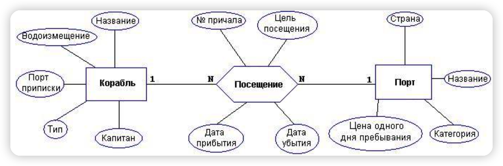

<div STYLE="page-break-after: always;"></div>

### Реализация

ER-диаграмма, полученная с помощью DataGrip:


<div STYLE="page-break-after: always;"></div>

## Создание и заполнение таблиц

### Постановка задачи

Практическое задание заключается в подготовке SQL-скрипта для создания таблиц согласно схеме, полученной в предыдущем задании (с уточнением типов столбцов). Необходимо определить первичные и внешние ключи, а также декларативные ограничения целостности (возможность принимать неопределенное значение, уникальные ключи, проверочные ограничения и т. д.). Таблицы следует создавать в отдельной базе данных. Кроме того, нужно подготовить данные для заполнения созданных таблиц. Объем подготовленных данных должен составлять не менее 10 экземпляров для каждой из стержневых (неподчиняющиеся основные сущности) сущностей и 15 экземпляров для каждой из ассоциативных (подчиненные многие-ко- многим). На основе этих данных необходимо создать SQL-скрипт для вставки соответствующих строк в таблицы БД.

### Реализация

Команды SQL, используемые для создания базы данных:

```sql
DROP DATABASE IF EXISTS db_Port;
CREATE DATABASE db_Port
WITH
  OWNER = "fox"
  TABLESPACE = "pg_default"
;
```


Команды SQL для создания таблиц:

```sql
-- Корабль
DROP TABLE IF EXISTS tb_Seacrafts;
CREATE TABLE IF NOT EXISTS tb_Seacrafts
(
	IDSeacraft				SERIAL,
	NameSeacraft			VARCHAR(255)	NOT NULL,		-- Название
	Displacement			INTEGER 		NOT NULL,		-- Водоизменение
	RegPortID				INTEGER			NOT NULL,		-- Порт приписки
	TypeID					INTEGER			NOT NULL,		-- Тип
	CaptainID				INTEGER			NOT NULL		-- Капитан
);

-- Посещение
DROP TABLE IF EXISTS tb_Arrivals;
CREATE TABLE IF NOT EXISTS tb_Arrivals
(
	IDArrival				SERIAL,
	PortID					INTEGER			NOT NULL,		-- № причала
	SeacraftID				INTEGER			NOT NULL,		
	Purpose					TEXT			NULL,		 	-- Цель посещения
	ArrivalTime				TIMESTAMP		NOT NULL,		-- Дата прибытия
	LeaveTime				TIMESTAMP		NULL 			-- Дата убытия
);

-- Порт
DROP TABLE IF EXISTS tb_Ports;
CREATE TABLE IF NOT EXISTS tb_Ports
(
	IDPort					SERIAL,
	Country					VARCHAR(255)	NOT NULL,		-- Страна
	NamePort				VARCHAR(255)	NOT NULL,		-- Название
	Price					INTEGER			NOT NULL,		-- Цена 1-ого для пребывания
	LevelID					INTEGER			NOT NULL		-- Категория
);

-- Категория
DROP TABLE IF EXISTS tb_PortLevels;
CREATE TABLE IF NOT EXISTS tb_PortLevels
(
	IDLevel					SERIAL,
	NameLevel				VARCHAR(255)	NOT NULL
);

-- Тип корабли
DROP TABLE IF EXISTS tb_TypeSeacraft;
CREATE TABLE IF NOT EXISTS tb_TypeSeacraft
(
	IDTypeSeacraft			SERIAL,
	NameTypeSeacraft		VARCHAR(255)	NOT NULL
);

-- Информации Капитана
DROP TABLE IF EXISTS tb_Captains;
CREATE TABLE IF NOT EXISTS tb_Captains
(
	IDCaptain				SERIAL,
	NameCaptain				VARCHAR(255)	NOT NULL,
	Birthday				DATE			NOT NULL,
	Telephone				VARCHAR(18)		NOT NULL
);
```

<div STYLE="page-break-after: always;"></div>

Команды SQL для создания ограничений:

```sql
ALTER TABLE tb_TypeSeacraft ADD CONSTRAINT PK_TypeSeacraft_IDTypeSeacraft 		PRIMARY KEY(IDTypeSeacraft);
ALTER TABLE tb_TypeSeacraft ADD CONSTRAINT UQ_TypeSeacraft_NameTypeSeacraft 	UNIQUE(NameTypeSeacraft);


ALTER TABLE tb_Captains ADD CONSTRAINT PK_Captain_IDCaptain PRIMARY KEY(IDCaptain);
ALTER TABLE tb_Captains ADD CONSTRAINT UQ_Captain_Telephone UNIQUE(Telephone);


ALTER TABLE tb_PortLevels ADD CONSTRAINT PK_PortGrage_IDLevel 		PRIMARY KEY(IDLevel);
ALTER TABLE tb_PortLevels ADD CONSTRAINT UQ_PortGrage_NameLevel		UNIQUE(NameLevel);


ALTER TABLE tb_Ports ADD CONSTRAINT PK_Ports_IDPort		PRIMARY KEY(IDPort);
ALTER TABLE tb_Ports ADD CONSTRAINT UQ_Ports_NamePort	UNIQUE(NamePort);
ALTER TABLE tb_Ports ADD CONSTRAINT CK_Ports_Price		CHECK(Price > 0);
ALTER TABLE tb_Ports ADD CONSTRAINT FK_Ports_LevelID	FOREIGN KEY(LevelID) REFERENCES tb_PortLevels(IDLevel);


ALTER TABLE tb_Seacrafts ADD CONSTRAINT PK_Seacrafts_IDSeacraft 				PRIMARY KEY(IDSeacraft);
ALTER TABLE tb_Seacrafts ADD CONSTRAINT FK_Seacrafts_RegPortID 					FOREIGN KEY(RegPortID) 					REFERENCES tb_Ports(IDPort);
ALTER TABLE tb_Seacrafts ADD CONSTRAINT FK_Seacrafts_TypeID 					FOREIGN KEY(TypeID)							REFERENCES tb_TypeSeacraft(IDTypeSeacraft);
ALTER TABLE tb_Seacrafts ADD CONSTRAINT FK_Seacrafts_CaptainID 					FOREIGN KEY(CaptainID) 					REFERENCES tb_Captains(IDCaptain);


ALTER TABLE tb_Arrivals ADD CONSTRAINT 	PK_Arrivals_IDArrival				PRIMARY KEY(IDArrival);
ALTER TABLE tb_Arrivals ADD CONSTRAINT 	FK_Arrivals_PortID					FOREIGN KEY(PortID)			REFERENCES tb_Ports(IDPort);
ALTER TABLE tb_Arrivals ADD CONSTRAINT 	FK_Arrivals_SeacraftID			FOREIGN KEY(SeacraftID)	REFERENCES tb_Seacrafts(IDSeacraft);
ALTER TABLE tb_Arrivals ALTER 					ArrivalTime 								SET DEFAULT now();
```

<div STYLE="page-break-after: always;"></div>

Некоторые команды SQL, используемые для вставки данных в таблицу:

```sql
INSERT INTO tb_TypeSeacraft(NameTypeSeacraft) VALUES('Container ship');		-- Контейнеровоз
INSERT INTO tb_TypeSeacraft(NameTypeSeacraft) VALUES('Bulk carrier');		-- Балкер
INSERT INTO tb_TypeSeacraft(NameTypeSeacraft) VALUES('Oil tanker');			-- Нефтяной танкер
INSERT INTO tb_TypeSeacraft(NameTypeSeacraft) VALUES('LNG carrier');		-- Газово́з

INSERT INTO tb_PortLevels(NameLevel) VALUES('Commercial port');		-- Торговый порт
INSERT INTO tb_PortLevels(NameLevel) VALUES('ndustrial port');		-- Промышленный порт
INSERT INTO tb_PortLevels(NameLevel) VALUES('Fishing port');			-- Рыболовные порты

INSERT INTO tb_Captains(NameCaptain, Birthday, Telephone) VALUES('Mark', '1991-04-09', '+ 8198-1005');
INSERT INTO tb_Captains(NameCaptain, Birthday, Telephone) VALUES('Tom', '1985-06-17', '+ 4188-3461');
INSERT INTO tb_Captains(NameCaptain, Birthday, Telephone) VALUES('Jurry', '1996-05-26', '+1 212-443-4383');
INSERT INTO tb_Captains(NameCaptain, Birthday, Telephone) VALUES('Judy', '1989-01-21', '+44 1223-80 7237');
INSERT INTO tb_Captains(NameCaptain, Birthday, Telephone) VALUES('Nick', '1980-01-12', '+44 7108 073718');


INSERT INTO tb_Ports(Country, NamePort, Price, LevelID) VALUES('Russia', 'ST.PETERSBURG', 5000, 1);
INSERT INTO tb_Ports(Country, NamePort, Price, LevelID) VALUES('Russia', 'kaliningrad', 5000, 2);
INSERT INTO tb_Ports(Country, NamePort, Price, LevelID) VALUES('Russia', 'irkutsk', 7000, 3);
INSERT INTO tb_Ports(Country, NamePort, Price, LevelID) VALUES('Russia', 'vostochny', 9100, 3);

INSERT INTO tb_Seacrafts (NameSeacraft, Displacement, RegPortID, TypeID, Captainid) VALUES ('Henry''s LLC', 550020, 19, 3, 6);
INSERT INTO tb_Seacrafts (NameSeacraft, Displacement, RegPortID, TypeID, Captainid) VALUES ('Marjorie Inc.', 290252, 9, 1, 13);
INSERT INTO tb_Seacrafts (NameSeacraft, Displacement, RegPortID, TypeID, Captainid) VALUES ('Russell LLC', 216511, 25, 3, 2);
INSERT INTO tb_Seacrafts (NameSeacraft, Displacement, RegPortID, TypeID, Captainid) VALUES ('Bradley Logistic Inc.', 640207, 3, 1, 20);
```

<div STYLE="page-break-after: always;"></div>

## Операторы манипулирования

### Постановка задачи

Практическое задание посвящено манипулированию данными с помощью операторов SQL. В ходе выполнения четвертого практического задания необходимо:

- Нужно подготовить 3-4 выборки, которые имеют осмысленное значение для предметной области, и также составить для них SQL-скрипты.
- Сформулировать 3-4 запроса на изменение и удаление из базы данных. Запросы должны быть сформулированы в терминах предметной области. Составить SQL-скрипты для выполнения этих запросов.

<div STYLE="page-break-after: always;"></div>

### Реализация

#### SELECT

Вывести информацию о судах, прибывающих в порт `ST.PETERSBURG`, отсортированную в порядке возрастания времени прибытия

```sql
WITH RegPort AS (
	SELECT idport AS IDRegPort, nameport AS NameRegPort FROM tb_ports
)
SELECT arrivaltime, nameseacraft, nametypeseacraft, displacement, NameRegPort, namecaptain
	FROM tb_ports
		INNER JOIN tb_arrivals
			ON tb_arrivals.PortID=tb_ports.IDPort
		INNER JOIN tb_seacrafts
			ON tb_seacrafts.idseacraft=tb_arrivals.seacraftid
		INNER JOIN tb_typeseacraft
			ON tb_typeseacraft.idtypeseacraft=tb_seacrafts.typeid
		INNER JOIN RegPort
			ON RegPort.IDRegPort=tb_seacrafts.RegPortID
		INNER JOIN tb_captains
			ON tb_captains.idcaptain=tb_seacrafts.captainid
	WHERE tb_ports.nameport='ST.PETERSBURG'
	ORDER BY ArrivalTime ASC
```


Вывод:

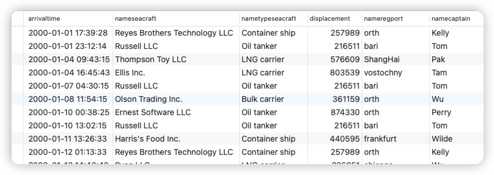

<div STYLE="page-break-after: always;"></div>

Корабль, зарегистрированные в Китае и прибывающие в Азербайджан более 2 раз

```sql
SELECT IDSeacraft, NameSeacraft, COUNT(IDSeacraft) AS Times
	FROM tb_arrivals
		INNER JOIN tb_seacrafts 
			ON tb_seacrafts.IDSeacraft=tb_arrivals.SeacraftID
	WHERE tb_arrivals.PortID 			IN (SELECT IDPort FROM tb_ports WHERE Country='Azerbaijan')
		AND tb_arrivals.SeacraftID 	IN (SELECT IDSeacraft AS SeacraftIDWithCountry FROM tb_seacrafts 
																			WHERE RegPortID IN (SELECT IDPort FROM tb_ports WHERE Country='China'))
	GROUP BY IDSeacraft, NameSeacraft
	HAVING COUNT(SeacraftID) > 2
	ORDER BY IDSeacraft
```


Вывод:


<div STYLE="page-break-after: always;"></div>

Капитаны со второй буквой своего имени `e` и количество раз, когда они прибывали к каждому пирсу. и выводить только записи с 10-й по 30-ю

```sql
WITH tb_NameCaptainWithE AS (
	SELECT * FROM tb_captains WHERE NameCaptain LIKE '_e%'
)
SELECT tb_NameCaptainWithE.NameCaptain, tb_ports.Country, tb_ports.NamePort, COUNT(tb_ports.IDPort)
	FROM tb_seacrafts
		INNER JOIN tb_arrivals
			ON tb_arrivals.SeacraftID=tb_seacrafts.IDSeacraft
		INNER JOIN tb_NameCaptainWithE
			ON tb_NameCaptainWithE.IDCaptain=tb_seacrafts.CaptainID
		INNER JOIN tb_ports
			ON tb_ports.IDPort=tb_arrivals.PortID
	GROUP BY tb_ports.Country, tb_ports.IDPort, tb_ports.NamePort, tb_NameCaptainWithE.NameCaptain
	ORDER BY tb_NameCaptainWithE.NameCaptain, tb_ports.Country, tb_ports.IDPort
	LIMIT 20 OFFSET 9
```


Вывод:

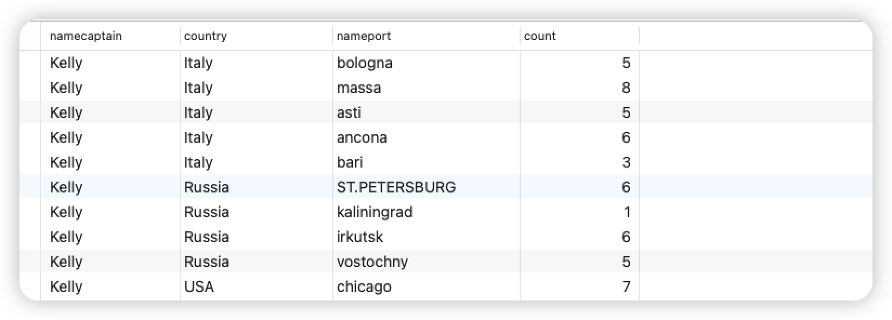


Сравнение тарифов каждого порта со средним значением тарифов по стране

```sql
SELECT IDPort, Country, NamePort, Price, AVG(Price) OVER (PARTITION BY Country)
	FROM tb_ports
	ORDER BY Country, NamePort
```


Вывод:

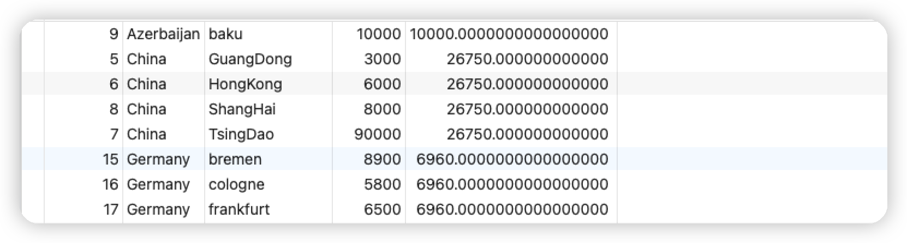


<div STYLE="page-break-after: always;"></div>

#### UPDATE

Увеличить водоизмещение всех зарегистрированных в Баку контейнеровозов водоизмещением менее 30 000 тонн на 1 000 тонн

```sql
UPDATE tb_seacrafts
	SET Displacement = Displacement + 1000
	WHERE IDSeacraft IN (
				SELECT IDSeacraft
				FROM tb_seacrafts
				WHERE RegPortID=(SELECT IDPort FROM tb_ports WHERE NamePort='baku')
				AND TypeID=(SELECT IDTypeSeacraft FROM tb_typeseacraft WHERE NameTypeSeacraft='Container ship'))
```


Вывод:

- Перед выполнением команды SQL-UPDATE

    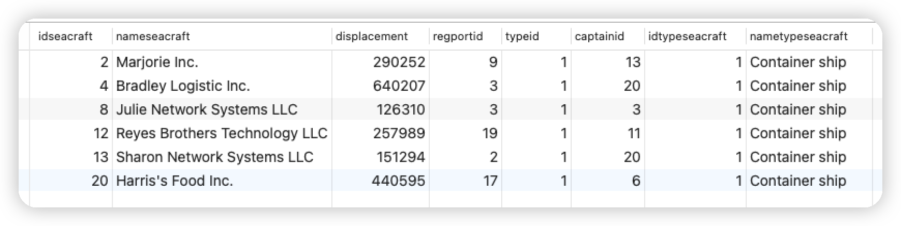
    
- После выполнения команды SQL-UPDATE

    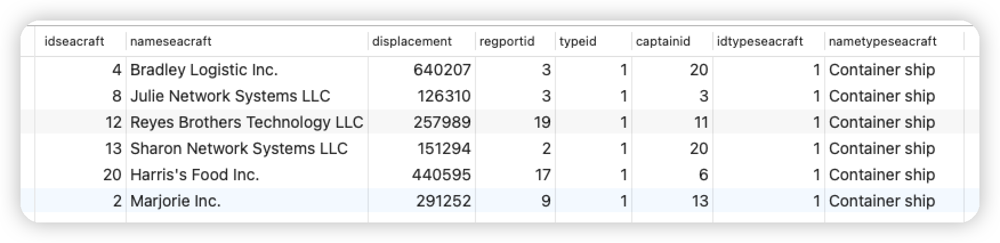

<div STYLE="page-break-after: always;"></div>

Отложить на один месяц отплытие всех корабли, прибывающих в Баку после 2020 года

```sql
UPDATE tb_arrivals
	SET LeaveTime = LeaveTime::TIMESTAMP + '1 month'
	WHERE IDArrival IN (
				SELECT IDArrival FROM tb_arrivals
				WHERE PortID=(SELECT IDPort FROM tb_ports WHERE NamePort='baku')
				AND ArrivalTime > '2020-01-01'::TIMESTAMP)
```

- Перед выполнением команды SQL-UPDATE

    
    
- После выполнения команды SQL-UPDATE
    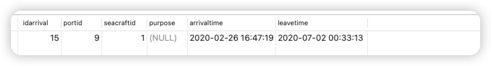

<div STYLE="page-break-after: always;"></div>

#### DELETE

Удалить записи, которые находились в Баку более 7 месяцев (только первая строка)

```SQL
DELETE FROM tb_arrivals 
	WHERE IDArrival IN (
				SELECT IDArrival FROM tb_arrivals WHERE (LeaveTime::TIMESTAMP - ArrivalTime::TIMESTAMP) > '7 month' LIMIT 1)
```


Вывод:

- Перед выполнением команды SQL-DELETE

    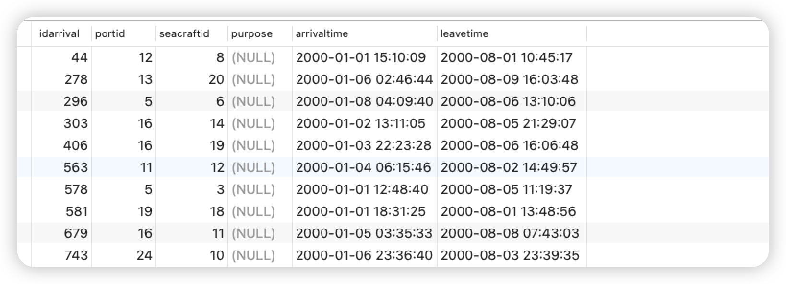
    
- После выполнения команды SQL-DELETE

    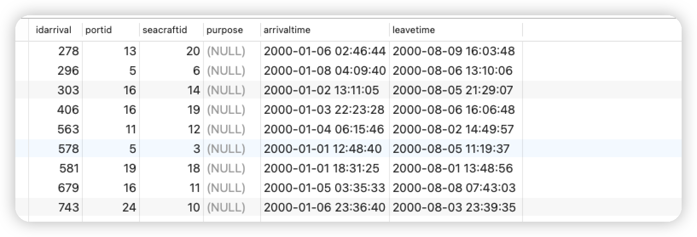

<div STYLE="page-break-after: always;"></div>

## Контроль целостности данных

### Постановка задачи

Практическое задание посвящено контролю целостности данных, который производится с помощью механизма транзакций и триггеров. Транзакции позволяют рассматривать группу операций как единое целое, либо отрабатывают все операции, либо ни одной. Это позволяет избегать несогласованности данных. Триггеры позволяют проверять целостность данных в момент выполнения транзакций, поддерживать целостность, внося изменения, и откатывать транзакции, приводящие к потере целостности.


Необходимо подготовить SQL-скрипты для проверки наличия аномалий (потерянных изменений, грязных чтений, неповторяющихся чтений, фантомов) при параллельном исполнении транзакций на различных уровнях изолированности SQL/92 (READ UNCOMMITTED, READ COMMITTED, REPEATABLE READ, SERIALIZABLE). Подготовленные скрипты должны работать с одной из таблиц, созданных в практическом задании No2.1. Для проверки наличия аномалий потребуются два параллельных сеанса, операторы в которых выполняются пошагово:

- Установить в обоих сеансах уровень изоляции READ UNCOMMITTED. Выполнить сценарии проверки наличия аномалий потерянных изменений и грязных чтений.
- Установить в обоих сеансах уровень изоляции READ COMMITTED. Выполнить сценарии проверки наличия аномалий грязных чтений и неповторяющихся чтений.
- Установить в обоих сеансах уровень изоляции REPEATABLE READ. Выполнить сценарии проверки наличия аномалий неповторяющихся чтений и фантомов.
- Установить в обоих сеансах уровень изоляции SERIALIZABLE. Выполнить сценарий проверки наличия фантомов.


Необходимо составить скрипт для создания триггера, а также подготовить несколько запросов для проверки и демонстрации его полезных свойств:

- Изменение данных для сохранения целостности.
- Проверка транзакций и их откат в случае нарушения целостности.

<div STYLE="page-break-after: always;"></div>

### Реализация

#### Триггер

Время отправления корабля не может быть меньше времени прибытия
При добавлении новой записи время прибытия корабля в порт не должно быть раньше, чем последнее время отправления, зарегистрированное для корабля в системе (т.е. оно должно покинуть порт, чтобы прибыть на новый порт).

```sql
CREATE OR REPLACE FUNCTION fc_TimeChecker() RETURNS TRIGGER
	AS $tr_TimeChecker$
	BEGIN
		CASE
		WHEN TG_OP = 'INSERT' THEN
			-- Отсутствие записи в системе, т.е. первая запись
			IF ((SELECT COUNT(*) FROM tb_arrivals WHERE SeacraftID=NEW.SeacraftID) = 0)
			THEN
			
				IF ((NEW.LeaveTime IS NOT NULL) AND (NEW.ArrivalTime::TIMESTAMP > NEW.LeaveTime::TIMESTAMP)) THEN
					raise notice '[ERROR-1] The previous record is incomplete';
					RETURN NULL;
				END IF;
				
			END IF;
		
			-- Сравнить с предыдущей записью, если это не первая запись
			IF (((SELECT LeaveTime::TIMESTAMP 
							FROM tb_arrivals 
							WHERE SeacraftID=NEW.SeacraftID
							ORDER BY LeaveTime DESC
							LIMIT 1) IS NULL)
					OR
					((SELECT LeaveTime::TIMESTAMP 
							FROM tb_arrivals 
							WHERE SeacraftID=NEW.SeacraftID
							ORDER BY LeaveTime DESC
							LIMIT 1) > NEW.ArrivalTime::TIMESTAMP)) THEN
					raise notice '[ERROR-2] Time conflict, unable to add this record';
					RETURN NULL;
			END IF;
			
			-- Сравните это с собой
			IF ((NEW.LeaveTime IS NOT NULL) AND (NEW.ArrivalTime::TIMESTAMP > NEW.LeaveTime::TIMESTAMP)) THEN
				raise notice '[ERROR-3] The leave time cannot be less than the arrival time';
				RETURN NULL;
			END IF;
	

		WHEN TG_OP = 'UPDATE' THEN
			IF ((NEW.LeaveTime IS NOT NULL) AND (NEW.ArrivalTime::TIMESTAMP > NEW.LeaveTime::TIMESTAMP)) THEN
				raise notice '[ERROR-4] The leave time cannot be less than the arrival time';
				RETURN NULL;
			END IF;
		END CASE;
	
 	RETURN NEW;
	END
	$tr_TimeChecker$ LANGUAGE plpgsql;

--
CREATE OR REPLACE TRIGGER tr_TimeChecker
	BEFORE INSERT OR UPDATE ON tb_arrivals
	FOR EACH ROW EXECUTE FUNCTION fc_TimeChecker();

DROP TRIGGER tr_TimeChecker ON tb_arrivals;
```


Вывод:

- Не Использования триггера

    - Если триггер не используются, можно вставить данные времени исключения *(Корабль отправляется позже, чем прибывает)*

        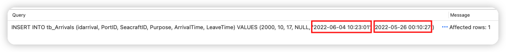
        
    - Неверная команда UPDATE также может быть успешно выполнена
    
        
        
    
- Использование триггеров

    - Если используется триггер, то данные с исключением времени не будут вставлены *(Корабль отправляется позже, чем прибывает)*

        

        и будет выведено соответствующее сообщение об ошибке

        

        

    - Данные с правильным временем могут быть вставлены

        
    
- Неверная команда UPDATE также не может быть успешно выполнена
  
    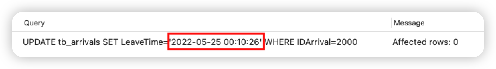
        и будет выведено соответствующее сообщение об ошибке
    
    
    
    
    
- И действительная команда UPDATE может быть успешно выполнена
  
    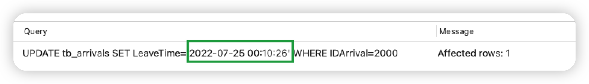

<div STYLE="page-break-after: always;"></div>

#### Аномалия сериализации

> Dan R. K. Ports and Kevin Grittner. 2012. Serializable Snapshot Isolation in PostgreSQL. Proceedings of the VLDB Endowment vol. 5 (12) , August 2012 
> ————————————————
>
> https://arxiv.org/pdf/1208.4179.pdf
>
> https://postgrespro.ru/docs/postgrespro/14/transaction-iso
>
> https://dev.to/techschoolguru/understand-isolation-levels-read-phenomena-in-mysql-postgres-c2e#isolation-levels-in-postgres
>
> https://blog.csdn.net/gp_community/article/details/109772336


<div STYLE="page-break-after: always;"></div>

##### READ UNCOMMITTED

- **[-] грязные чтении & [+] неповторяющиеся чтении**

    | **Параллельный сеанс** 1                                     | **Параллельный сеанс** 2                                     |
    | ------------------------------------------------------------ | ------------------------------------------------------------ |
    | `BEGIN TRANSACTION ISOLATION LEVEL READ UNCOMMITTED;`<br />`SHOW TRANSACTION_ISOLATION;`<br /><br />>>><br />*read uncommitted* |                                                              |
    |                                                              | `BEGIN TRANSACTION ISOLATION LEVEL READ UNCOMMITTED;`<br />`SHOW TRANSACTION_ISOLATION;`<br /><br />>>><br />*read uncommitted* |
    | `SELECT price FROM tb_ports WHERE nameport='baku';`<br /><br />>>><br />1000 |                                                              |
    |                                                              | `UPDATE tb_ports SET price=2000 WHERE nameport='baku';`      |
    |                                                              | `SELECT price FROM tb_ports WHERE nameport='baku';`<br /><br />>>><br />2000 |
    | `SELECT price FROM tb_ports WHERE nameport='baku';`<br /><br />>>>==[-] грязные чтении==<br />1000 |                                                              |
    |                                                              | `COMMIT;`                                                    |
    | `SELECT price FROM tb_ports WHERE nameport='baku';`<br /><br />>>>==[-] неповторяющиеся чтении==<br />2000 |                                                              |
    | `COMMIT;`                                                    |                                                              |

<div STYLE="page-break-after: always;"></div>

- **[-] Потерянные изменении**

  - **[-] Потерянные изменении | Lost update**
  
  - | **Параллельный сеанс** 1                                     | **Параллельный сеанс** 2                                     |
      | ------------------------------------------------------------ | ------------------------------------------------------------ |
      | `BEGIN TRANSACTION ISOLATION LEVEL READ UNCOMMITTED;`<br />`SHOW TRANSACTION_ISOLATION;`<br /><br />>>><br />*read uncommitted* |                                                              |
      |                                                              | `BEGIN TRANSACTION ISOLATION LEVEL READ UNCOMMITTED;`<br />`SHOW TRANSACTION_ISOLATION;`<br /><br />>>><br />*read uncommitted* |
      | `SELECT price FROM tb_ports WHERE nameport='baku';`<br /><br />>>><br />1000 |                                                              |
      |                                                              | `UPDATE tb_ports SET price=price-100 WHERE nameport='baku';` |
      |                                                              | `SELECT price FROM tb_ports WHERE nameport='baku';`<br /><br />>>><br />900 |
      |                                                              | `COMMIT;`                                                    |
      | `UPDATE tb_ports SET price=price+100 WHERE nameport='baku';` |                                                              |
      | `ROLLBACK;`                                                  |                                                              |
      |                                                              | `SELECT price FROM tb_ports WHERE nameport='baku';`<br /><br />>>>==[-] Потерянные изменении \| Second lost update==<br />900 |
  
      <div STYLE="page-break-after: always;"></div>
  
  - **[-] Потерянные изменении | Second lost update**
  
      | **Параллельный сеанс** 1                                     | **Параллельный сеанс** 2                                     |
      | ------------------------------------------------------------ | ------------------------------------------------------------ |
      | `BEGIN TRANSACTION ISOLATION LEVEL READ UNCOMMITTED;`<br />`SHOW TRANSACTION_ISOLATION;`<br /><br />>>><br />*read uncommitted* |                                                              |
      |                                                              | `BEGIN TRANSACTION ISOLATION LEVEL READ UNCOMMITTED;`<br />`SHOW TRANSACTION_ISOLATION;`<br /><br />>>><br />*read uncommitted* |
      | `SELECT price FROM tb_ports WHERE nameport='baku';`<br /><br />>>><br />1000 |                                                              |
      |                                                              | `UPDATE tb_ports SET price=price-100 WHERE nameport='baku';` |
      |                                                              | `SELECT price FROM tb_ports WHERE nameport='baku';`<br /><br />>>><br />900 |
      | `UPDATE tb_ports SET price=price+100 WHERE nameport='baku';`<br /><br />>>> <br />БЛОКИРУЕТСЯ |                                                              |
      |                                                              | `COMMIT;`                                                    |
      | `COMMIT;`                                                    |                                                              |
      |                                                              | `SELECT price FROM tb_ports WHERE nameport='baku';`<br /><br />>>>==[-] Потерянные изменении \| Second lost update==<br />1000 |
  


<div STYLE="page-break-after: always;"></div>

- **[+] Фантом**

    | **Параллельный сеанс** 1                                     | **Параллельный сеанс** 2                                     |
    | ------------------------------------------------------------ | ------------------------------------------------------------ |
    | `BEGIN TRANSACTION ISOLATION LEVEL READ UNCOMMITTED;`<br />`SHOW TRANSACTION_ISOLATION;`<br /><br />>>><br />*read uncommitted* |                                                              |
    |                                                              | `BEGIN TRANSACTION ISOLATION LEVEL READ UNCOMMITTED;`<br />`SHOW TRANSACTION_ISOLATION;`<br /><br />>>><br />*read uncommitted* |
    | `SELECT price FROM tb_ports WHERE nameport='baku2';`<br /><br />>>><br />(0 rows) |                                                              |
    |                                                              | `INSERT INTO tb_Ports(Country, NamePort, Price, LevelID)`<br />` VALUES('Azerbaijan', 'baku2', 2222, 3);` |
    | `SELECT price FROM tb_ports WHERE nameport='baku2';`<br /><br />>>><br />(0 rows) |                                                              |
    |                                                              | `COMMIT;`                                                    |
    | `SELECT price FROM tb_ports WHERE nameport='baku2';`<br /><br />>>>==[+] Фантом==<br />2222 |                                                              |
    | `DELETE FROM tb_ports WHERE nameport='baku2';`               |                                                              |
    | `COMMIT;`                                                    |                                                              |


<div STYLE="page-break-after: always;"></div>

- **[+] Аномалия сериализации**

    | **Параллельный сеанс** 1                                     | **Параллельный сеанс** 2                                     |
    | ------------------------------------------------------------ | ------------------------------------------------------------ |
    | `BEGIN TRANSACTION ISOLATION LEVEL READ UNCOMMITTED;`<br />`SHOW TRANSACTION_ISOLATION;`<br /><br />>>><br />*read uncommitted* |                                                              |
    |                                                              | `BEGIN TRANSACTION ISOLATION LEVEL READ UNCOMMITTED;`<br />`SHOW TRANSACTION_ISOLATION;`<br /><br />>>><br />*read uncommitted* |
    | `UPDATE tb_ports SET price=2000 WHERE nameport='baku';`      |                                                              |
    |                                                              | `UPDATE tb_ports SET price=9000 WHERE nameport='ShangHai';`  |
    | `COMMIT;`                                                    |                                                              |
    |                                                              | `COMMIT;`<br />>>>==[+] Аномалия сериализации==              |


<div STYLE="page-break-after: always;"></div>

##### READ COMMITTED

- **[-] Грязные чтении & [+] Неповторяющиеся чтении**

    | **Параллельный сеанс** 1                                     | **Параллельный сеанс** 2                                     |
    | ------------------------------------------------------------ | ------------------------------------------------------------ |
    | `BEGIN TRANSACTION ISOLATION LEVEL READ COMMITTED;`<br />`SHOW TRANSACTION_ISOLATION;`<br /><br />>>><br />*read committed* |                                                              |
    |                                                              | `BEGIN TRANSACTION ISOLATION LEVEL READ COMMITTED;`<br />`SHOW TRANSACTION_ISOLATION;`<br /><br />>>><br />*read committed* |
    | `SELECT price FROM tb_ports WHERE nameport='baku';`<br /><br />>>><br />1000 |                                                              |
    |                                                              | `UPDATE tb_ports SET price=2000 WHERE nameport='baku';`      |
    |                                                              | `SELECT price FROM tb_ports WHERE nameport='baku';`<br /><br />>>><br />2000 |
    | `SELECT price FROM tb_ports WHERE nameport='baku';`<br /><br />>>>==[-] Грязные чтении==<br />1000 |                                                              |
    |                                                              | `COMMIT;`                                                    |
    | `SELECT price FROM tb_ports WHERE nameport='baku';`<br /><br />>>>==[+] Неповторяющиеся чтении==<br />2000 |                                                              |
    | `COMMIT;`                                                    |                                                              |


<div STYLE="page-break-after: always;"></div>

- **[-] Потерянные изменении**

    - **[-] Потерянные изменении | Lost update**

    - | **Параллельный сеанс** 1                                     | **Параллельный сеанс** 2                                     |
        | ------------------------------------------------------------ | ------------------------------------------------------------ |
        | `BEGIN TRANSACTION ISOLATION LEVEL READ COMMITTED;`<br />`SHOW TRANSACTION_ISOLATION;`<br /><br />>>><br />*read committed* |                                                              |
        |                                                              | `BEGIN TRANSACTION ISOLATION LEVEL READ COMMITTED;`<br />`SHOW TRANSACTION_ISOLATION;`<br /><br />>>><br />*read committed* |
        | `SELECT price FROM tb_ports WHERE nameport='baku';`<br /><br />>>><br />1000 |                                                              |
        |                                                              | `UPDATE tb_ports SET price=price-100 WHERE nameport='baku';` |
        |                                                              | `SELECT price FROM tb_ports WHERE nameport='baku';`<br /><br />>>><br />900 |
        |                                                              | `COMMIT;`                                                    |
        | `UPDATE tb_ports SET price=price+100 WHERE nameport='baku';` |                                                              |
        | `ROLLBACK;`                                                  |                                                              |
        |                                                              | `SELECT price FROM tb_ports WHERE nameport='baku';`<br /><br />>>>==[-] Потерянные изменении \| Second lost update==<br />900 |

        <div STYLE="page-break-after: always;"></div>

    
    
    - **[-] Потерянные изменении | Second lost update**
    
        | **Параллельный сеанс** 1                                     | **Параллельный сеанс** 2                                     |
        | ------------------------------------------------------------ | ------------------------------------------------------------ |
        | `BEGIN TRANSACTION ISOLATION LEVEL READ COMMITTED;`<br />`SHOW TRANSACTION_ISOLATION;`<br /><br />>>><br />*read committed* |                                                              |
        |                                                              | `BEGIN TRANSACTION ISOLATION LEVEL READ COMMITTED;`<br />`SHOW TRANSACTION_ISOLATION;`<br /><br />>>><br />*read committed* |
        | `SELECT price FROM tb_ports WHERE nameport='baku';`<br /><br />>>><br />1000 |                                                              |
        |                                                              | `UPDATE tb_ports SET price=price-100 WHERE nameport='baku';` |
        |                                                              | `SELECT price FROM tb_ports WHERE nameport='baku';`<br /><br />>>><br />900 |
        | `UPDATE tb_ports SET price=price+100 WHERE nameport='baku';`<br /><br />>>> <br />БЛОКИРУЕТСЯ |                                                              |
        |                                                              | `COMMIT;`                                                    |
        | `COMMIT;`                                                    |                                                              |
        |                                                              | `SELECT price FROM tb_ports WHERE nameport='baku';`<br /><br />>>>==[-] Потерянные изменении \| Second lost update==<br />1000 |


<div STYLE="page-break-after: always;"></div>

- **[+] Фантом**

    | **Параллельный сеанс** 1                                     | **Параллельный сеанс** 2                                     |
    | ------------------------------------------------------------ | ------------------------------------------------------------ |
    | `BEGIN TRANSACTION ISOLATION LEVEL READ COMMITTED;`<br />`SHOW TRANSACTION_ISOLATION;`<br /><br />>>><br />*read committed* |                                                              |
    |                                                              | `BEGIN TRANSACTION ISOLATION LEVEL READ COMMITTED;`<br />`SHOW TRANSACTION_ISOLATION;`<br /><br />>>><br />*read committed* |
    | `SELECT price FROM tb_ports WHERE nameport='baku2';`<br /><br />>>><br />(0 rows) |                                                              |
    |                                                              | `INSERT INTO tb_Ports(Country, NamePort, Price, LevelID)`<br />` VALUES('Azerbaijan', 'baku2', 2222, 3);` |
    | `SELECT price FROM tb_ports WHERE nameport='baku2';`<br /><br />>>><br />(0 rows) |                                                              |
    |                                                              | `COMMIT;`                                                    |
    | `SELECT price FROM tb_ports WHERE nameport='baku2';`<br /><br />>>>==[+] Фантом==<br />2222 |                                                              |
    | `DELETE FROM tb_ports WHERE nameport='baku2';`               |                                                              |
    | `COMMIT;`                                                    |                                                              |


<div STYLE="page-break-after: always;"></div>

- **[+] Аномалия сериализации**

    | **Параллельный сеанс** 1                                     | **Параллельный сеанс** 2                                     |
    | ------------------------------------------------------------ | ------------------------------------------------------------ |
    | `BEGIN TRANSACTION ISOLATION LEVEL READ COMMITTED;`<br />`SHOW TRANSACTION_ISOLATION;`<br /><br />>>><br />*read committed* |                                                              |
    |                                                              | `BEGIN TRANSACTION ISOLATION LEVEL READ COMMITTED;`<br />`SHOW TRANSACTION_ISOLATION;`<br /><br />>>><br />*read committed* |
    | `UPDATE tb_ports SET price=2000 WHERE nameport='baku';`      |                                                              |
    |                                                              | `UPDATE tb_ports SET price=9000 WHERE nameport='ShangHai';`  |
    | `COMMIT;`                                                    |                                                              |
    |                                                              | `COMMIT;`<br />>>>==[+] Аномалия сериализации==              |

    

<div STYLE="page-break-after: always;"></div>

##### REPEATABLE READ

- **[-] Грязные чтении & [-] Неповторяющиеся чтении**

    | **Параллельный сеанс** 1                                     | **Параллельный сеанс** 2                                     |
    | ------------------------------------------------------------ | ------------------------------------------------------------ |
    | `BEGIN TRANSACTION ISOLATION LEVEL REPEATABLE READ;`<br />`SHOW TRANSACTION_ISOLATION;`<br /><br />>>><br />*repeatable read* |                                                              |
    |                                                              | `BEGIN TRANSACTION ISOLATION LEVEL REPEATABLE READ;`<br />`SHOW TRANSACTION_ISOLATION;`<br /><br />>>><br />*repeatable read* |
    | `SELECT price FROM tb_ports WHERE nameport='baku';`<br /><br />>>><br />1000 |                                                              |
    |                                                              | `UPDATE tb_ports SET price=2000 WHERE nameport='baku';`      |
    |                                                              | `SELECT price FROM tb_ports WHERE nameport='baku';`<br /><br />>>><br />2000 |
    | `SELECT price FROM tb_ports WHERE nameport='baku';`<br /><br />>>>==[-] Грязные чтении==<br />1000 |                                                              |
    |                                                              | `COMMIT;`                                                    |
    | `SELECT price FROM tb_ports WHERE nameport='baku';`<br /><br />>>>==[-] Неповторяющиеся чтении==<br />1000 |                                                              |
    | `COMMIT;`                                                    |                                                              |

<div STYLE="page-break-after: always;"></div>


- **[-] Потерянные изменении**

    - **[-] Потерянные изменении | Lost update**

    - | **Параллельный сеанс** 1                                     | **Параллельный сеанс** 2                                     |
        | ------------------------------------------------------------ | ------------------------------------------------------------ |
        | `BEGIN TRANSACTION ISOLATION LEVEL REPEATABLE READ;`<br />`SHOW TRANSACTION_ISOLATION;`<br /><br />>>><br />*repeatable read* |                                                              |
        |                                                              | `BEGIN TRANSACTION ISOLATION LEVEL REPEATABLE READ;`<br />`SHOW TRANSACTION_ISOLATION;`<br /><br />>>><br />*repeatable read* |
        | `SELECT price FROM tb_ports WHERE nameport='baku';`<br /><br />>>><br />1000 |                                                              |
        |                                                              | `UPDATE tb_ports SET price=price-100 WHERE nameport='baku';` |
        |                                                              | `SELECT price FROM tb_ports WHERE nameport='baku';`<br /><br />>>><br />900 |
        |                                                              | `COMMIT;`                                                    |
        | `UPDATE tb_ports SET price=price+100 WHERE nameport='baku';`<br /><br />>>> <br />ERROR:  could not serialize access due to concurrent update |                                                              |
        | `ROLLBACK;`                                                  |                                                              |
        |                                                              | `SELECT price FROM tb_ports WHERE nameport='baku';`<br /><br />>>>==[-] Потерянные изменении \| Second lost update==<br />900 |

        <div STYLE="page-break-after: always;"></div>

    - **[-] Потерянные изменении | Second lost update**
    
        | **Параллельный сеанс** 1                                     | **Параллельный сеанс** 2                                     |
        | ------------------------------------------------------------ | ------------------------------------------------------------ |
        | `BEGIN TRANSACTION ISOLATION LEVEL REPEATABLE READ;`<br />`SHOW TRANSACTION_ISOLATION;`<br /><br />>>><br />*repeatable read* |                                                              |
        |                                                              | `BEGIN TRANSACTION ISOLATION LEVEL REPEATABLE READ;`<br />`SHOW TRANSACTION_ISOLATION;`<br /><br />>>><br />*repeatable read* |
        | `SELECT price FROM tb_ports WHERE nameport='baku';`<br /><br />>>><br />1000 |                                                              |
        |                                                              | `UPDATE tb_ports SET price=price-100 WHERE nameport='baku';` |
        |                                                              | `SELECT price FROM tb_ports WHERE nameport='baku';`<br /><br />>>><br />900 |
        | `UPDATE tb_ports SET price=price+100 WHERE nameport='baku';`<br /><br />>>> <br />БЛОКИРУЕТСЯ |                                                              |
        |                                                              | `COMMIT;`                                                    |
        | >>><br />ERROR:  could not serialize access due to concurrent update |                                                              |
        | `COMMIT;`<br /><br />>>><br />ROLLBACK                       |                                                              |
        |                                                              | `SELECT price FROM tb_ports WHERE nameport='baku';`<br /><br />>>>==[-] Потерянные изменении \| Second lost update==<br />900 |

<div STYLE="page-break-after: always;"></div>


- **[-] Фантом**

    | **Параллельный сеанс** 1                                     | **Параллельный сеанс** 2                                     |
    | ------------------------------------------------------------ | ------------------------------------------------------------ |
    | `BEGIN TRANSACTION ISOLATION LEVEL REPEATABLE READ;`<br />`SHOW TRANSACTION_ISOLATION;`<br /><br />>>><br />*repeatable read* |                                                              |
    |                                                              | `BEGIN TRANSACTION ISOLATION LEVEL REPEATABLE READ;`<br />`SHOW TRANSACTION_ISOLATION;`<br /><br />>>><br />*repeatable read* |
    | `SELECT price FROM tb_ports WHERE nameport='baku2';`<br /><br />>>><br />(0 rows) |                                                              |
    |                                                              | `INSERT INTO tb_Ports(Country, NamePort, Price, LevelID)`<br />` VALUES('Azerbaijan', 'baku2', 2222, 3);` |
    | `SELECT price FROM tb_ports WHERE nameport='baku2';`<br /><br />>>><br />(0 rows) |                                                              |
    |                                                              | `COMMIT;`                                                    |
    | `SELECT price FROM tb_ports WHERE nameport='baku2';`<br /><br />>>>==[-] Фантом==<br />(0 rows) |                                                              |
    | `DELETE FROM tb_ports WHERE nameport='baku2';`               |                                                              |
    | `COMMIT;`                                                    |                                                              |

<div STYLE="page-break-after: always;"></div>

- **[+] Аномалия сериализации**

    | **Параллельный сеанс** 1                                     | **Параллельный сеанс** 2                                     |
    | ------------------------------------------------------------ | ------------------------------------------------------------ |
    | `BEGIN TRANSACTION ISOLATION LEVEL REPEATABLE READ;`<br />`SHOW TRANSACTION_ISOLATION;`<br /><br />>>><br />*repeatable read* |                                                              |
    |                                                              | `BEGIN TRANSACTION ISOLATION LEVEL REPEATABLE READ;`<br />`SHOW TRANSACTION_ISOLATION;`<br /><br />>>><br />*repeatable read* |
    | `UPDATE tb_ports SET price=2000 WHERE nameport='baku';`      |                                                              |
    |                                                              | `UPDATE tb_ports SET price=9000 WHERE nameport='ShangHai';`  |
    | `COMMIT;`                                                    |                                                              |
    |                                                              | `COMMIT;`<br />>>>==[+] Аномалия сериализации==              |


<div STYLE="page-break-after: always;"></div>

##### SERIALIZABLE

- **[-] Грязные чтении & [-] Неповторяющиеся чтении**

    | **Параллельный сеанс** 1                                     | **Параллельный сеанс** 2                                     |
    | ------------------------------------------------------------ | ------------------------------------------------------------ |
    | `BEGIN TRANSACTION ISOLATION LEVEL SERIALIZABLE;`<br />`SHOW TRANSACTION_ISOLATION;`<br /><br />>>><br />*serializable* |                                                              |
    |                                                              | `BEGIN TRANSACTION ISOLATION LEVEL SERIALIZABLE;`<br />`SHOW TRANSACTION_ISOLATION;`<br /><br />>>><br />*serializable* |
    | `SELECT price FROM tb_ports WHERE nameport='baku';`<br /><br />>>><br />1000 |                                                              |
    |                                                              | `UPDATE tb_ports SET price=2000 WHERE nameport='baku';`      |
    |                                                              | `SELECT price FROM tb_ports WHERE nameport='baku';`<br /><br />>>><br />2000 |
    | `SELECT price FROM tb_ports WHERE nameport='baku';`<br /><br />>>>==[-] Грязные чтении==<br />1000 |                                                              |
    |                                                              | `COMMIT;`                                                    |
    | `SELECT price FROM tb_ports WHERE nameport='baku';`<br /><br />>>>==[-] Неповторяющиеся чтении==<br />1000 |                                                              |
    | `COMMIT;`                                                    |                                                              |


<div STYLE="page-break-after: always;"></div>

- **[-] Потерянные изменении**

    - **[-] Потерянные изменении | Lost update**

    - | **Параллельный сеанс** 1                                     | **Параллельный сеанс** 2                                     |
        | ------------------------------------------------------------ | ------------------------------------------------------------ |
        | `BEGIN TRANSACTION ISOLATION LEVEL SERIALIZABLE;`<br />`SHOW TRANSACTION_ISOLATION;`<br /><br />>>><br />*serializable* |                                                              |
        |                                                              | `BEGIN TRANSACTION ISOLATION LEVEL SERIALIZABLE;`<br />`SHOW TRANSACTION_ISOLATION;`<br /><br />>>><br />*serializable* |
        | `SELECT price FROM tb_ports WHERE nameport='baku';`<br /><br />>>><br />1000 |                                                              |
        |                                                              | `UPDATE tb_ports SET price=price-100 WHERE nameport='baku';` |
        |                                                              | `SELECT price FROM tb_ports WHERE nameport='baku';`<br /><br />>>><br />900 |
        |                                                              | `COMMIT;`                                                    |
        | `UPDATE tb_ports SET price=price+100 WHERE nameport='baku';`<br /><br />>>> <br />ERROR:  could not serialize access due to concurrent update |                                                              |
        | `ROLLBACK;`                                                  |                                                              |
        |                                                              | `SELECT price FROM tb_ports WHERE nameport='baku';`<br /><br />>>>==[-] Потерянные изменении \| Second lost update==<br />900 |

        <div STYLE="page-break-after: always;"></div>

    - **[-] Потерянные изменении | Second lost update**
    
        | **Параллельный сеанс** 1                                     | **Параллельный сеанс** 2                                     |
        | ------------------------------------------------------------ | ------------------------------------------------------------ |
        | `BEGIN TRANSACTION ISOLATION LEVEL SERIALIZABLE;`<br />`SHOW TRANSACTION_ISOLATION;`<br /><br />>>><br />*serializable* |                                                              |
        |                                                              | `BEGIN TRANSACTION ISOLATION LEVEL SERIALIZABLE;`<br />`SHOW TRANSACTION_ISOLATION;`<br /><br />>>><br />*serializable* |
        | `SELECT price FROM tb_ports WHERE nameport='baku';`<br /><br />>>><br />1000 |                                                              |
        |                                                              | `UPDATE tb_ports SET price=price-100 WHERE nameport='baku';` |
        |                                                              | `SELECT price FROM tb_ports WHERE nameport='baku';`<br /><br />>>><br />900 |
        | `UPDATE tb_ports SET price=price+100 WHERE nameport='baku';`<br /><br />>>> <br />БЛОКИРУЕТСЯ |                                                              |
        |                                                              | `COMMIT;`                                                    |
        | >>><br />ERROR: could not serialize access due to concurrent update |                                                              |
        | `COMMIT;`<br /><br />>>><br />ROLLBACK                       |                                                              |
        |                                                              | `SELECT price FROM tb_ports WHERE nameport='baku';`<br /><br />>>>==[-] Потерянные изменении \| Second lost update==<br />900 |

<div STYLE="page-break-after: always;"></div>

- **[-] Фантом**

    | **Параллельный сеанс** 1                                     | **Параллельный сеанс** 2                                     |
    | ------------------------------------------------------------ | ------------------------------------------------------------ |
    | `BEGIN TRANSACTION ISOLATION LEVEL SERIALIZABLE;`<br />`SHOW TRANSACTION_ISOLATION;`<br /><br />>>><br />*serializable* |                                                              |
    |                                                              | `BEGIN TRANSACTION ISOLATION LEVEL SERIALIZABLE;`<br />`SHOW TRANSACTION_ISOLATION;`<br /><br />>>><br />*serializable* |
    | `SELECT price FROM tb_ports WHERE nameport='baku2';`<br /><br />>>><br />(0 rows) |                                                              |
    |                                                              | `INSERT INTO tb_Ports(Country, NamePort, Price, LevelID)`<br />` VALUES('Azerbaijan', 'baku2', 2222, 3);` |
    | `SELECT price FROM tb_ports WHERE nameport='baku2';`<br /><br />>>><br />(0 rows) |                                                              |
    |                                                              | `COMMIT;`                                                    |
    | `SELECT price FROM tb_ports WHERE nameport='baku2';`<br /><br />>>>==[-] Фантом==<br />(0 rows) |                                                              |
    | `DELETE FROM tb_ports WHERE nameport='baku2';`               |                                                              |
    | `COMMIT;`                                                    |                                                              |

<div STYLE="page-break-after: always;"></div>

- **[-] Аномалия сериализации**

    | **Параллельный сеанс** 1                                     | **Параллельный сеанс** 2                                     |
    | ------------------------------------------------------------ | ------------------------------------------------------------ |
    | `BEGIN TRANSACTION ISOLATION LEVEL SERIALIZABLE;`<br />`SHOW TRANSACTION_ISOLATION;`<br /><br />>>><br />*serializable* |                                                              |
    |                                                              | `BEGIN TRANSACTION ISOLATION LEVEL SERIALIZABLE;`<br />`SHOW TRANSACTION_ISOLATION;`<br /><br />>>><br />*serializable* |
    | `UPDATE tb_ports SET price=2000 WHERE nameport='baku';`      |                                                              |
    |                                                              | `UPDATE tb_ports SET price=9000 WHERE nameport='ShangHai';`  |
    | `COMMIT;`                                                    |                                                              |
    |                                                              | `COMMIT;`<br />>>>==[-] Аномалия сериализации==<br />ERROR:  could not serialize access due to read/write dependencies among transactions<br/>DETAIL:  Reason code: Canceled on identification as a pivot, during commit attempt.<br/>HINT:  The transaction might succeed if retried. |
    

<div STYLE="page-break-after: always;"></div>

### Результат

Из полученных результатов видно, что `READ COMMITED` и `READ UNCOMMITED` дают одинаковые результаты в PostgreSQL. Именно в этом PostgreSQL существенно отличается от MySQL.

| **Контроль целостности данных** | грязные чтении | неповторяющиеся чтении | Потерянные изменении | фантом | **Аномалия сериализации** |
| ------------------------------- | -------------- | ---------------------- | -------------------- | ------ | ------------------------- |
| `SERIALIZABLE`                  | -              | -                      | -                    | -      | -                         |
| `REPEATABLE READ`               | -              | -                      | -                    | -      | +                         |
| `READ COMMITED`                 | -              | +                      | -                    | +      | +                         |
| `READ UNCOMMITED`               | -              | +                      | -                    | +      | +                         |


# Лабораторная работа No.2

Разработчику базы данных необходимо уметь проектировать высокопроизводительную схему данных ориентированную на большие объемы и регулярно появляющиеся и устаревающие данные, использовать механизмы секционирования и построения индексов, анализировать планы запросов и оптимизировать их, упрощать интерфейс базы данных с помощью процедур и представлений, ограничивать доступ с помощью ролей и прав.


Блок практических заданий 2.1-2.3 призван сформировать у студента понимание особенностей настроек прав доступа к базе данных и умение их настраивать и поддерживать, научиться работать с хранимыми процедурами.

## Управление доступом

### Постановка задачи

Целью практического задания является освоение работы с представлениями и другими способами управления доступом. При выполнении задания необходимо:

- Создать пользователя test и выдать ему доступ к базе данных.
- Составить и выполнить скрипты присвоения новому пользователю прав доступа к таблицам, созданным в практическом задании No2.1. При этом права доступа к различным таблицам должны быть различными, а именно:
    - По крайней мере, для одной таблицы новому пользователю присваиваются права SELECT, INSERT, UPDATE в полном объеме.
    - По крайней мере, для одной таблицы новому пользователю присваиваются права SELECT и UPDATE только избранных столбцов.
    - По крайней мере, для одной таблицы новому пользователю присваивается только право SELECT.
- Составить SQL-скрипты для создания нескольких представлений, которые позволяли бы упростить манипуляции с данными или позволяли бы ограничить доступ к данным, предоставляя только необходимую информацию.
- Присвоить новому пользователю право доступа (SELECT) к одному из представлений
- Создать стандартную роль уровня базы данных, присвоить ей право доступа (UPDATE на некоторые столбцы) к одному из представлений, назначить новому пользователю созданную роль.
- Выполнить от имени нового пользователя некоторые выборки из таблиц и представлений. Убедиться в правильности контроля прав доступа.
- Выполнить от имени нового пользователя операторы изменения таблиц с ограниченными правами доступа. Убедиться в правильности контроля прав доступа.

<div STYLE="page-break-after: always;"></div>

### Реализация

1. **Создать пользователя test** 

```sql
-- CREATE USER fox;
CREATE ROLE test;
ALTER ROLE test PASSWORD '123';
```

Вход в систему не удался, поскольку новый пользователь не имеет привилегий для входа в систему


2. **Добавление привилегий для входа в базу данных**

    ```sql
    ALTER ROLE test LOGIN;
    ```

    

    

3. **Выдать ему доступ к базе данных**

    - Присваиваются права `SELECT`, `INSERT`, `UPDATE`

        ```sql
        GRANT SELECT, INSERT, UPDATE ON tb_portlevels TO test;
        ```

        

        Используйте соответствующую команду SQL для проверки пользователя в соответствии с предоставленными ему привилегиями

        Вывод:

        - SELECT
            

        

        - INSERT
            

              

        - UPDATE
            

              

        - DELETE
            

        

        

    - Присваиваются права `SELECT` и `UPDATE `

        ```sql
        GRANT SELECT, UPDATE ON tb_typeseacraft TO test;
        ```

        Используйте соответствующую команду SQL для проверки пользователя в соответствии с предоставленными ему привилегиями

        Вывод:

        - SELECT
            
        - INSERT
            
        - UPDATE
            
        - DELETE
            

        

    - Присваивается только право `SELECT`

        ```sql
        GRANT SELECT ON tb_ports TO test;
        ```

        Используйте соответствующую команду SQL для проверки пользователя в соответствии с предоставленными ему привилегиями

        Вывод:

        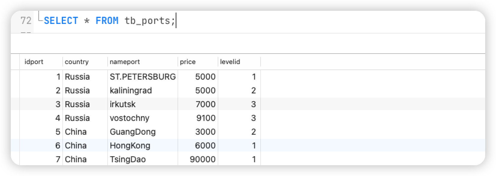

        

    - Присвоить новому пользователю право доступа (`SELECT`) к одному из представлений

        ```sql
        -- Вывод списка подробной информации о порте
        CREATE OR REPLACE VIEW VW_Ports
        AS
        SELECT IDPort, Country, NamePort, NameLevel, Price, COUNT(IDPort) AS NumArrivals
        	FROM tb_arrivals
        		INNER JOIN tb_ports ON tb_ports.idport=tb_arrivals.portid
        		INNER JOIN tb_portlevels ON tb_ports.levelid=tb_portlevels.idlevel
        	GROUP BY IDPort, Country, NamePort, NameLevel, Price 
        	ORDER BY IDPort ASC;
        
        GRANT SELECT ON VW_Ports TO test;
        ```

        

        Вывод:
        
        Когда у пользователя есть разрешение, представление доступно:
        
        
        
        
        
        Если у пользователя нет разрешения, представление недоступно:
        
        
        
        
        
    - Создать стандартную роль уровня базы данных, присвоить ей право доступа (`UPDATE` на некоторые столбцы) к одному из представлений, назначить новому пользователю созданную роль.

        ```sql
        CREATE ROLE update_vw_test;
        GRANT UPDATE (NameSeacraft) ON vw_seacrafts TO update_vw_test;
        GRANT update_vw_test TO test;
        ```

        

        Вывод:

        
        
        
        
        

4. Удалите все разрешения у пользователя и удалите пользователя

    ```sql
    REVOKE ALL ON DATABASE db_port from test;
    DROP ROLE test;
    ```


<div STYLE="page-break-after: always;"></div>

## Функции и язык PL/pgSQL

### Постановка задачи

Практическое задание посвящено упрощению работы с помощью создания и использования функций. При выполнении задания необходимо:

- Составить SQL-скрипты для создания нескольких (2-3) функций, упрощающих работу с данными.
- Продемонстрировать полученные знания о возможностях языка PL/pgSQL. В скриптах должны использоваться:
    - Циклы.
    - Ветвления.
    - Переменные.
    - Курсоры.
    - Исключения.
- Обосновать преимущества механизма функций перед механизмом представлений.


### Реализация

Оценка уровня времени, в течение которого корабль простаивает в порте

```sql
CREATE OR REPLACE FUNCTION fc_PortTimeChecker(INTEGER) RETURNS TEXT 
	LANGUAGE plpgsql
	AS $$
	DECLARE 
		t_ArrivalTime TIMESTAMP := (SELECT ArrivalTime::TIMESTAMP FROM tb_arrivals WHERE IDArrival=$1);
		t_LeaveTime TIMESTAMP := (SELECT LeaveTime::TIMESTAMP FROM tb_arrivals WHERE IDArrival=$1);
		Days INTEGER;
		msg TEXT;
	BEGIN
		IF (t_LeaveTime IS NULL) THEN 
			RAISE EXCEPTION '[ERROR] LeaveTime can not be NULL';
		END IF;
		
		Days := extract(day from t_LeaveTime - t_ArrivalTime);
		CASE
			WHEN Days BETWEEN 0 AND 30 THEN
				msg := 'Short';
			WHEN Days BETWEEN 30 AND 100 THEN
				msg := 'Normal';
			WHEN Days BETWEEN 100 AND 150 THEN
				msg := 'Long';
			ELSE
				msg := 'Very long';
		END CASE;
		
		RETURN msg;
	END;
	$$;
```


Вывод:


<div STYLE="page-break-after: always;"></div>

Оценка уровня времени, в течение которого корабль простаивает в порте (С цекром)

```sql
CREATE OR REPLACE FUNCTION fc_AllPortTimeChecker() RETURNS TEXT 
	LANGUAGE plpgsql
	AS $$
	DECLARE 
 		t_ArrivalTime TIMESTAMP;
 		t_LeaveTime TIMESTAMP;
		StartNum INTEGER := (SELECT min(idarrival) FROM tb_arrivals);
		StopNum INTEGER := (SELECT max(idarrival) FROM tb_arrivals);
		Days INTEGER;
		msg TEXT;
	BEGIN
		FOR counter IN StartNum .. StopNum LOOP
				IF (t_LeaveTime IS NULL) THEN 
					RAISE NOTICE 'IDArrival: % con not handle', counter;
				END IF;		
						
				t_ArrivalTime := (SELECT ArrivalTime::TIMESTAMP FROM tb_arrivals WHERE IDArrival=counter);
				t_LeaveTime := (SELECT LeaveTime::TIMESTAMP FROM tb_arrivals WHERE IDArrival=counter);
				Days := extract(day from t_LeaveTime - t_ArrivalTime);
				CASE
					WHEN Days BETWEEN 0 AND 30 THEN
						msg := 'Short';
					WHEN Days BETWEEN 30 AND 100 THEN
						msg := 'Normal';
					WHEN Days BETWEEN 100 AND 150 THEN
						msg := 'Long';
					ELSE
						msg := 'Very long';
				END CASE;
		
			RAISE NOTICE 'IDArrival: %, Level: %', counter, msg;
		END LOOP;
	
		RETURN msg;
	END;
	$$;
```


Вывод:

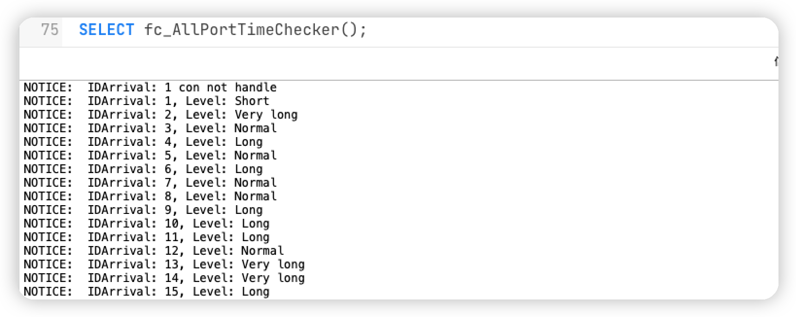

<div STYLE="page-break-after: always;"></div>

Получение пользовательского номера прибытия корабля

```sql
CREATE OR REPLACE FUNCTION get_arrival_num(INTEGER) RETURNS VARCHAR
	AS
		'SELECT to_char(ArrivalTime, ''yyyy'') 
						|| to_char(ArrivalTime, ''mm'') 
						|| to_char(ArrivalTime, ''dd'')
						|| lpad(IDArrival::TEXT, 5, ''0'')::TEXT 
						|| lpad(PortID::TEXT, 3, ''0'')::TEXT 
		FROM tb_arrivals WHERE IDArrival=$1'
	LANGUAGE SQL
	RETURNS NULL ON NULL INPUT;
```


Вывод:

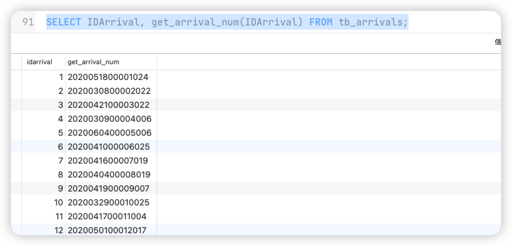

<div STYLE="page-break-after: always;"></div>

Получить общую продолжительность пребывания всех судов на основе назначенного порта

```sql
CREATE OR REPLACE FUNCTION fc_IncomePort(VARCHAR) RETURNS INTEGER
	AS
	'
			SELECT SUM(hours) AS hours FROM(
				SELECT EXTRACT(
					DAY FROM (
							SELECT SUM(LeaveTime::TIMESTAMP - ArrivalTime::TIMESTAMP)
							FROM tb_arrivals 
							WHERE PortID=(SELECT IDPort FROM tb_ports WHERE NamePort=$1)
						)
				) * 24 AS hours
				UNION ALL
				SELECT EXTRACT(
					HOUR FROM (
							SELECT SUM(LeaveTime::TIMESTAMP - ArrivalTime::TIMESTAMP)
							FROM tb_arrivals 
							WHERE PortID=(SELECT IDPort FROM tb_ports WHERE NamePort=$1)
						)
				) AS hours
		) AS hour_row
	'
	LANGUAGE SQL
	RETURNS NULL ON NULL INPUT;
```


Вывод:

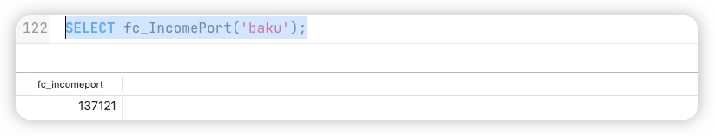

<div STYLE="page-break-after: always;"></div>


# Вывод

Освоил основные команды DDL и DML для базы данных PostgreSQL. Научился более простому использованию базы данных путем написания хранимых процедур, триггеров и т.д.

Кроме того, механизм контроля целостности данных в базе данных PostgreSQL был проверен путем самостоятельного написания SQL-команд. Я также узнал об особенностях PostgreSQL и о том, чем он отличается от MySQL.


# Приложение

## Адрес репозитория GitHub

Все исходные данные, выводы и код можно найти на GitHub, адрес репозитория:

https://github.com/NekoSilverFox/PostgreSQL-SPbSTU


## dump БД

```sql
--
-- PostgreSQL database dump
--

-- Dumped from database version 14.2
-- Dumped by pg_dump version 14.2

SET statement_timeout = 0;
SET lock_timeout = 0;
SET idle_in_transaction_session_timeout = 0;
SET client_encoding = 'UTF8';
SET standard_conforming_strings = on;
SELECT pg_catalog.set_config('search_path', '', false);
SET check_function_bodies = false;
SET xmloption = content;
SET client_min_messages = warning;
SET row_security = off;

--
-- Name: fc_allporttimechecker(); Type: FUNCTION; Schema: public; Owner: postgres
--

CREATE FUNCTION public.fc_allporttimechecker() RETURNS text
    LANGUAGE plpgsql
    AS $$
	DECLARE 
 		t_ArrivalTime TIMESTAMP;
 		t_LeaveTime TIMESTAMP;
		StartNum INTEGER := (SELECT min(idarrival) FROM tb_arrivals);
		StopNum INTEGER := (SELECT max(idarrival) FROM tb_arrivals);
		Days INTEGER;
		msg TEXT;
	BEGIN
		FOR counter IN StartNum .. StopNum LOOP
				IF (t_LeaveTime IS NULL) THEN 
					RAISE NOTICE 'IDArrival: % con not handle', counter;
				END IF;		
						
				t_ArrivalTime := (SELECT ArrivalTime::TIMESTAMP FROM tb_arrivals WHERE IDArrival=counter);
				t_LeaveTime := (SELECT LeaveTime::TIMESTAMP FROM tb_arrivals WHERE IDArrival=counter);
				Days := extract(day from t_LeaveTime - t_ArrivalTime);
				CASE
					WHEN Days BETWEEN 0 AND 30 THEN
						msg := 'Short';
					WHEN Days BETWEEN 30 AND 100 THEN
						msg := 'Normal';
					WHEN Days BETWEEN 100 AND 150 THEN
						msg := 'Long';
					ELSE
						msg := 'Very long';
				END CASE;
		
			RAISE NOTICE 'IDArrival: %, Level: %', counter, msg;
		END LOOP;
	
		RETURN msg;
	END;
	$$;


ALTER FUNCTION public.fc_allporttimechecker() OWNER TO postgres;

--
-- Name: fc_incomeport(character varying); Type: FUNCTION; Schema: public; Owner: postgres
--

CREATE FUNCTION public.fc_incomeport(character varying) RETURNS integer
    LANGUAGE sql STRICT
    AS $_$
			SELECT SUM(hours) AS hours FROM(
				SELECT EXTRACT(
					DAY FROM (
							SELECT SUM(LeaveTime::TIMESTAMP - ArrivalTime::TIMESTAMP)
							FROM tb_arrivals 
							WHERE PortID=(SELECT IDPort FROM tb_ports WHERE NamePort=$1)
						)
				) * 24 AS hours
				UNION ALL
				SELECT EXTRACT(
					HOUR FROM (
							SELECT SUM(LeaveTime::TIMESTAMP - ArrivalTime::TIMESTAMP)
							FROM tb_arrivals 
							WHERE PortID=(SELECT IDPort FROM tb_ports WHERE NamePort=$1)
						)
				) AS hours
		) AS hour_row
	$_$;


ALTER FUNCTION public.fc_incomeport(character varying) OWNER TO postgres;

--
-- Name: fc_porttimechecker(integer); Type: FUNCTION; Schema: public; Owner: postgres
--

CREATE FUNCTION public.fc_porttimechecker(integer) RETURNS text
    LANGUAGE plpgsql
    AS $_$
	DECLARE 
		t_ArrivalTime TIMESTAMP := (SELECT ArrivalTime::TIMESTAMP FROM tb_arrivals WHERE IDArrival=$1);
		t_LeaveTime TIMESTAMP := (SELECT LeaveTime::TIMESTAMP FROM tb_arrivals WHERE IDArrival=$1);
		Days INTEGER;
		msg TEXT;
	BEGIN
		IF (t_LeaveTime IS NULL) THEN 
			RAISE EXCEPTION '[ERROR] LeaveTime can not be NULL';
		END IF;
		
		Days := extract(day from t_LeaveTime - t_ArrivalTime);
		CASE
			WHEN Days BETWEEN 0 AND 30 THEN
				msg := 'Short';
			WHEN Days BETWEEN 30 AND 100 THEN
				msg := 'Normal';
			WHEN Days BETWEEN 100 AND 150 THEN
				msg := 'Long';
			ELSE
				msg := 'Very long';
		END CASE;
		
		RETURN msg;
	END;
	$_$;


ALTER FUNCTION public.fc_porttimechecker(integer) OWNER TO postgres;

--
-- Name: fc_timechecker(); Type: FUNCTION; Schema: public; Owner: postgres
--

CREATE FUNCTION public.fc_timechecker() RETURNS trigger
    LANGUAGE plpgsql
    AS $$
	BEGIN
		CASE
		WHEN TG_OP = 'INSERT' THEN
			-- 系统中无记录，即为首条记录
			IF ((SELECT COUNT(*) FROM tb_arrivals WHERE SeacraftID=NEW.SeacraftID) = 0)
			THEN
			
				IF ((NEW.LeaveTime IS NOT NULL) AND (NEW.ArrivalTime::TIMESTAMP > NEW.LeaveTime::TIMESTAMP)) THEN
					raise notice '[ERROR-1] The previous record is incomplete';
					RETURN NULL;
				END IF;
				
			END IF;
		
			-- 不是首条记录
			-- 与上条记录做对比
			IF (((SELECT LeaveTime::TIMESTAMP 
							FROM tb_arrivals 
							WHERE SeacraftID=NEW.SeacraftID
							ORDER BY LeaveTime DESC
							LIMIT 1) IS NULL)
					OR
					((SELECT LeaveTime::TIMESTAMP 
							FROM tb_arrivals 
							WHERE SeacraftID=NEW.SeacraftID
							ORDER BY LeaveTime DESC
							LIMIT 1) > NEW.ArrivalTime::TIMESTAMP)) THEN
					raise notice '[ERROR-2] Time conflict, unable to add this record';
					RETURN NULL;
			END IF;
			
			-- 再与自身作对比
			IF ((NEW.LeaveTime IS NOT NULL) AND (NEW.ArrivalTime::TIMESTAMP > NEW.LeaveTime::TIMESTAMP)) THEN
				raise notice '[ERROR-3] The leave time cannot be less than the arrival time';
				RETURN NULL;
			END IF;
	

		WHEN TG_OP = 'UPDATE' THEN
			IF ((NEW.LeaveTime IS NOT NULL) AND (NEW.ArrivalTime::TIMESTAMP > NEW.LeaveTime::TIMESTAMP)) THEN
				raise notice '[ERROR-4] The leave time cannot be less than the arrival time';
				RETURN NULL;
			END IF;
		END CASE;
	
 	RETURN NEW;
	END
	$$;


ALTER FUNCTION public.fc_timechecker() OWNER TO postgres;

--
-- Name: get_arrival_num(integer); Type: FUNCTION; Schema: public; Owner: postgres
--

CREATE FUNCTION public.get_arrival_num(integer) RETURNS character varying
    LANGUAGE sql STRICT
    AS $_$SELECT to_char(ArrivalTime, 'yyyy') 
						|| to_char(ArrivalTime, 'mm') 
						|| to_char(ArrivalTime, 'dd')
						|| lpad(IDArrival::TEXT, 5, '0')::TEXT 
						|| lpad(PortID::TEXT, 3, '0')::TEXT 
		FROM tb_arrivals WHERE IDArrival=$1$_$;


ALTER FUNCTION public.get_arrival_num(integer) OWNER TO postgres;

SET default_tablespace = '';

SET default_table_access_method = heap;

--
-- Name: tb_arrivals; Type: TABLE; Schema: public; Owner: postgres
--

CREATE TABLE public.tb_arrivals (
    idarrival integer NOT NULL,
    portid integer NOT NULL,
    seacraftid integer NOT NULL,
    purpose text,
    arrivaltime timestamp without time zone DEFAULT now() NOT NULL,
    leavetime timestamp without time zone
);


ALTER TABLE public.tb_arrivals OWNER TO postgres;

--
-- Name: tb_arrivals_idarrival_seq; Type: SEQUENCE; Schema: public; Owner: postgres
--

CREATE SEQUENCE public.tb_arrivals_idarrival_seq
    AS integer
    START WITH 1
    INCREMENT BY 1
    NO MINVALUE
    NO MAXVALUE
    CACHE 1;


ALTER TABLE public.tb_arrivals_idarrival_seq OWNER TO postgres;

--
-- Name: tb_arrivals_idarrival_seq; Type: SEQUENCE OWNED BY; Schema: public; Owner: postgres
--

ALTER SEQUENCE public.tb_arrivals_idarrival_seq OWNED BY public.tb_arrivals.idarrival;


--
-- Name: tb_captains; Type: TABLE; Schema: public; Owner: postgres
--

CREATE TABLE public.tb_captains (
    idcaptain integer NOT NULL,
    namecaptain character varying(255) NOT NULL,
    birthday date NOT NULL,
    telephone character varying(18) NOT NULL
);


ALTER TABLE public.tb_captains OWNER TO postgres;

--
-- Name: tb_captains_idcaptain_seq; Type: SEQUENCE; Schema: public; Owner: postgres
--

CREATE SEQUENCE public.tb_captains_idcaptain_seq
    AS integer
    START WITH 1
    INCREMENT BY 1
    NO MINVALUE
    NO MAXVALUE
    CACHE 1;


ALTER TABLE public.tb_captains_idcaptain_seq OWNER TO postgres;

--
-- Name: tb_captains_idcaptain_seq; Type: SEQUENCE OWNED BY; Schema: public; Owner: postgres
--

ALTER SEQUENCE public.tb_captains_idcaptain_seq OWNED BY public.tb_captains.idcaptain;


--
-- Name: tb_portlevels; Type: TABLE; Schema: public; Owner: postgres
--

CREATE TABLE public.tb_portlevels (
    idlevel integer NOT NULL,
    namelevel character varying(255) NOT NULL
);


ALTER TABLE public.tb_portlevels OWNER TO postgres;

--
-- Name: tb_portlevels_idlevel_seq; Type: SEQUENCE; Schema: public; Owner: postgres
--

CREATE SEQUENCE public.tb_portlevels_idlevel_seq
    AS integer
    START WITH 1
    INCREMENT BY 1
    NO MINVALUE
    NO MAXVALUE
    CACHE 1;


ALTER TABLE public.tb_portlevels_idlevel_seq OWNER TO postgres;

--
-- Name: tb_portlevels_idlevel_seq; Type: SEQUENCE OWNED BY; Schema: public; Owner: postgres
--

ALTER SEQUENCE public.tb_portlevels_idlevel_seq OWNED BY public.tb_portlevels.idlevel;


--
-- Name: tb_ports; Type: TABLE; Schema: public; Owner: postgres
--

CREATE TABLE public.tb_ports (
    idport integer NOT NULL,
    country character varying(255) NOT NULL,
    nameport character varying(255) NOT NULL,
    price integer NOT NULL,
    levelid integer NOT NULL,
    CONSTRAINT ck_ports_price CHECK ((price > 0))
);


ALTER TABLE public.tb_ports OWNER TO postgres;

--
-- Name: tb_ports_idport_seq; Type: SEQUENCE; Schema: public; Owner: postgres
--

CREATE SEQUENCE public.tb_ports_idport_seq
    AS integer
    START WITH 1
    INCREMENT BY 1
    NO MINVALUE
    NO MAXVALUE
    CACHE 1;


ALTER TABLE public.tb_ports_idport_seq OWNER TO postgres;

--
-- Name: tb_ports_idport_seq; Type: SEQUENCE OWNED BY; Schema: public; Owner: postgres
--

ALTER SEQUENCE public.tb_ports_idport_seq OWNED BY public.tb_ports.idport;


--
-- Name: tb_seacrafts; Type: TABLE; Schema: public; Owner: postgres
--

CREATE TABLE public.tb_seacrafts (
    idseacraft integer NOT NULL,
    nameseacraft character varying(255) NOT NULL,
    displacement integer NOT NULL,
    regportid integer NOT NULL,
    typeid integer NOT NULL,
    captainid integer NOT NULL
);


ALTER TABLE public.tb_seacrafts OWNER TO postgres;

--
-- Name: tb_seacrafts_idseacraft_seq; Type: SEQUENCE; Schema: public; Owner: postgres
--

CREATE SEQUENCE public.tb_seacrafts_idseacraft_seq
    AS integer
    START WITH 1
    INCREMENT BY 1
    NO MINVALUE
    NO MAXVALUE
    CACHE 1;


ALTER TABLE public.tb_seacrafts_idseacraft_seq OWNER TO postgres;

--
-- Name: tb_seacrafts_idseacraft_seq; Type: SEQUENCE OWNED BY; Schema: public; Owner: postgres
--

ALTER SEQUENCE public.tb_seacrafts_idseacraft_seq OWNED BY public.tb_seacrafts.idseacraft;


--
-- Name: tb_typeseacraft; Type: TABLE; Schema: public; Owner: postgres
--

CREATE TABLE public.tb_typeseacraft (
    idtypeseacraft integer NOT NULL,
    nametypeseacraft character varying(255) NOT NULL
);


ALTER TABLE public.tb_typeseacraft OWNER TO postgres;

--
-- Name: tb_typeseacraft_idtypeseacraft_seq; Type: SEQUENCE; Schema: public; Owner: postgres
--

CREATE SEQUENCE public.tb_typeseacraft_idtypeseacraft_seq
    AS integer
    START WITH 1
    INCREMENT BY 1
    NO MINVALUE
    NO MAXVALUE
    CACHE 1;


ALTER TABLE public.tb_typeseacraft_idtypeseacraft_seq OWNER TO postgres;

--
-- Name: tb_typeseacraft_idtypeseacraft_seq; Type: SEQUENCE OWNED BY; Schema: public; Owner: postgres
--

ALTER SEQUENCE public.tb_typeseacraft_idtypeseacraft_seq OWNED BY public.tb_typeseacraft.idtypeseacraft;


--
-- Name: tb_arrivals idarrival; Type: DEFAULT; Schema: public; Owner: postgres
--

ALTER TABLE ONLY public.tb_arrivals ALTER COLUMN idarrival SET DEFAULT nextval('public.tb_arrivals_idarrival_seq'::regclass);


--
-- Name: tb_captains idcaptain; Type: DEFAULT; Schema: public; Owner: postgres
--

ALTER TABLE ONLY public.tb_captains ALTER COLUMN idcaptain SET DEFAULT nextval('public.tb_captains_idcaptain_seq'::regclass);


--
-- Name: tb_portlevels idlevel; Type: DEFAULT; Schema: public; Owner: postgres
--

ALTER TABLE ONLY public.tb_portlevels ALTER COLUMN idlevel SET DEFAULT nextval('public.tb_portlevels_idlevel_seq'::regclass);


--
-- Name: tb_ports idport; Type: DEFAULT; Schema: public; Owner: postgres
--

ALTER TABLE ONLY public.tb_ports ALTER COLUMN idport SET DEFAULT nextval('public.tb_ports_idport_seq'::regclass);


--
-- Name: tb_seacrafts idseacraft; Type: DEFAULT; Schema: public; Owner: postgres
--

ALTER TABLE ONLY public.tb_seacrafts ALTER COLUMN idseacraft SET DEFAULT nextval('public.tb_seacrafts_idseacraft_seq'::regclass);


--
-- Name: tb_typeseacraft idtypeseacraft; Type: DEFAULT; Schema: public; Owner: postgres
--

ALTER TABLE ONLY public.tb_typeseacraft ALTER COLUMN idtypeseacraft SET DEFAULT nextval('public.tb_typeseacraft_idtypeseacraft_seq'::regclass);


--
-- Data for Name: tb_arrivals; Type: TABLE DATA; Schema: public; Owner: postgres
--

COPY public.tb_arrivals (idarrival, portid, seacraftid, purpose, arrivaltime, leavetime) FROM stdin;
1	24	9	\N	2020-05-18 03:49:02	2020-06-02 23:11:29
2	22	11	\N	2020-03-08 17:54:40	2020-09-08 07:24:17
3	22	4	\N	2020-04-21 15:28:52	2020-06-28 03:18:59
4	6	3	\N	2020-03-09 10:10:08	2020-08-04 21:08:54
5	6	20	\N	2020-06-04 02:50:25	2020-08-30 15:31:27
6	25	11	\N	2020-04-10 18:30:13	2020-09-04 23:48:04
7	19	15	\N	2020-04-16 12:21:01	2020-07-24 10:35:22
8	19	7	\N	2020-04-04 08:14:54	2020-06-16 18:41:37
9	7	6	\N	2020-04-19 08:04:06	2020-08-26 07:09:29
10	25	4	\N	2020-03-29 19:49:01	2020-08-27 04:52:24
11	4	20	\N	2020-04-17 02:56:27	2020-08-05 11:17:51
12	17	15	\N	2020-05-01 14:38:42	2020-06-09 09:31:54
13	3	10	\N	2020-01-12 14:32:17	2020-07-04 23:01:19
14	10	13	\N	2020-02-12 14:31:04	2020-09-07 10:39:49
16	23	14	\N	2020-06-06 05:15:37	2020-09-05 14:12:02
17	16	3	\N	2020-03-27 01:15:57	2020-08-29 10:10:59
18	21	10	\N	2020-01-08 22:30:44	2020-06-14 12:16:34
19	5	13	\N	2020-03-18 08:53:23	2020-07-01 06:06:08
20	19	16	\N	2020-02-13 12:47:16	2020-06-28 14:06:45
21	22	14	\N	2000-02-02 22:48:45	2000-07-23 17:11:25
22	13	13	\N	2000-02-18 09:34:40	2000-07-05 12:45:05
23	19	20	\N	2000-01-09 22:57:33	2000-04-25 18:16:04
24	20	16	\N	2000-01-11 16:53:57	2000-05-08 03:22:54
25	4	10	\N	2000-02-12 16:08:48	2000-04-26 03:28:19
26	6	1	\N	2000-02-10 16:20:10	2000-07-10 06:17:17
27	17	15	\N	2000-02-26 21:18:41	2000-07-17 23:12:53
28	6	16	\N	2000-01-17 15:04:35	2000-04-09 19:34:59
29	17	18	\N	2000-01-21 12:05:25	2000-08-03 14:16:17
30	12	7	\N	2000-01-10 10:30:29	2000-05-11 17:59:23
31	10	7	\N	2000-02-11 07:29:36	2000-07-10 05:38:33
32	17	3	\N	2000-02-20 09:51:48	2000-07-24 17:53:38
33	25	18	\N	2000-03-06 15:27:42	2000-05-20 00:30:45
34	7	14	\N	2000-02-09 00:06:26	2000-04-28 04:07:31
35	17	7	\N	2000-01-12 04:59:35	2000-06-23 13:22:28
36	9	20	\N	2000-01-30 03:58:01	2000-05-09 17:51:56
37	11	10	\N	2000-01-27 13:17:19	2000-04-16 13:45:12
38	3	14	\N	2000-03-06 01:34:07	2000-06-18 16:54:33
39	2	20	\N	2000-01-13 09:31:41	2000-07-19 04:36:50
40	13	2	\N	2000-01-16 07:15:55	2000-06-01 09:46:49
41	15	3	\N	2000-01-05 07:07:47	2000-08-01 14:59:20
42	3	13	\N	2000-02-12 22:47:35	2000-04-27 06:08:17
43	3	14	\N	2000-02-09 16:19:40	2000-07-02 15:20:52
45	1	13	\N	2000-01-20 08:10:43	2000-07-11 08:33:03
46	4	12	\N	2000-02-14 10:12:01	2000-07-19 07:13:40
47	19	8	\N	2000-01-14 14:24:00	2000-06-20 18:04:09
48	3	18	\N	2000-01-11 18:41:07	2000-08-03 19:15:38
49	2	6	\N	2000-02-21 19:14:17	2000-06-06 13:35:01
50	4	7	\N	2000-01-03 14:51:50	2000-07-29 01:42:44
51	22	12	\N	2000-01-26 08:49:36	2000-04-21 10:17:39
52	20	5	\N	2000-02-11 17:19:08	2000-07-06 05:54:37
53	1	10	\N	2000-01-20 15:46:51	2000-07-22 16:00:03
54	11	4	\N	2000-01-17 22:37:52	2000-06-08 10:00:21
55	24	11	\N	2000-03-01 00:00:56	2000-06-22 17:51:04
56	13	20	\N	2000-01-16 21:11:30	2000-07-21 15:43:30
57	17	2	\N	2000-02-04 21:29:23	2000-05-22 04:47:15
58	25	4	\N	2000-01-20 16:22:12	2000-07-15 08:26:31
59	6	17	\N	2000-01-17 23:20:22	2000-04-27 04:57:59
60	10	14	\N	2000-02-03 11:44:48	2000-07-13 01:42:49
61	19	10	\N	2000-03-08 21:24:20	2000-07-13 15:59:48
62	18	20	\N	2000-01-04 14:00:27	2000-04-17 14:28:21
63	9	12	\N	2000-02-29 21:31:10	2000-06-12 15:16:46
64	5	3	\N	2000-02-07 18:21:12	2000-05-29 19:58:44
65	4	6	\N	2000-01-26 10:59:21	2000-04-14 05:23:43
66	3	10	\N	2000-02-22 23:30:08	2000-07-27 12:51:11
67	1	19	\N	2000-01-13 14:40:40	2000-07-16 23:21:01
68	7	11	\N	2000-02-13 06:03:22	2000-08-04 02:05:00
69	7	12	\N	2000-01-19 06:52:30	2000-07-20 01:10:35
70	24	16	\N	2000-03-06 20:52:50	2000-07-31 12:57:28
71	21	13	\N	2000-01-22 14:23:36	2000-07-02 11:11:12
72	3	15	\N	2000-02-11 10:48:13	2000-07-22 00:03:36
73	16	6	\N	2000-01-10 23:00:49	2000-07-09 19:28:44
74	10	18	\N	2000-02-09 22:52:02	2000-05-02 08:28:57
75	5	12	\N	2000-01-26 00:27:21	2000-05-10 11:53:38
76	25	8	\N	2000-02-17 21:00:39	2000-05-01 23:32:19
77	15	19	\N	2000-02-03 05:43:18	2000-05-01 01:42:26
78	6	7	\N	2000-01-27 10:52:39	2000-05-25 01:35:10
79	16	3	\N	2000-01-06 17:20:56	2000-04-13 11:25:59
80	1	16	\N	2000-02-05 17:00:06	2000-08-08 02:54:30
81	19	9	\N	2000-01-11 03:41:37	2000-04-16 17:15:49
82	12	1	\N	2000-02-17 04:37:32	2000-06-08 22:14:23
83	15	2	\N	2000-01-05 18:04:47	2000-04-12 10:47:08
84	9	18	\N	2000-02-13 13:57:33	2000-08-03 05:47:39
85	20	15	\N	2000-01-14 05:29:26	2000-05-26 02:52:51
86	21	7	\N	2000-01-29 14:12:43	2000-07-30 11:23:18
87	18	10	\N	2000-03-07 02:36:28	2000-07-23 02:36:06
88	22	18	\N	2000-02-14 05:20:51	2000-06-11 20:47:14
89	6	11	\N	2000-03-05 23:34:50	2000-07-24 19:08:05
90	23	8	\N	2000-01-10 00:08:56	2000-07-21 12:18:38
91	18	18	\N	2000-01-18 05:29:13	2000-07-09 19:35:50
92	2	2	\N	2000-02-16 08:06:29	2000-07-24 08:24:35
93	12	5	\N	2000-02-19 17:21:37	2000-06-13 05:38:47
94	19	11	\N	2000-02-07 21:54:30	2000-07-15 00:40:21
95	25	19	\N	2000-01-01 21:09:20	2000-07-29 16:30:31
96	19	19	\N	2000-01-22 12:42:26	2000-07-24 10:41:53
97	18	13	\N	2000-03-08 09:57:14	2000-08-02 12:49:22
98	22	16	\N	2000-01-02 20:50:48	2000-06-15 00:47:00
99	18	1	\N	2000-03-02 06:11:04	2000-06-10 20:48:05
100	22	18	\N	2000-03-06 12:53:47	2000-05-31 16:46:56
101	21	3	\N	2000-02-07 05:59:06	2000-07-12 12:09:55
102	13	5	\N	2000-02-27 03:59:30	2000-05-23 10:50:52
103	10	7	\N	2000-02-13 20:20:57	2000-07-15 20:09:10
104	24	17	\N	2000-03-07 11:48:53	2000-06-29 02:31:27
105	9	14	\N	2000-02-03 02:22:21	2000-08-01 07:39:52
106	10	12	\N	2000-02-25 20:07:06	2000-06-21 04:42:50
107	19	12	\N	2000-01-09 18:42:13	2000-07-23 10:25:25
108	25	8	\N	2000-01-29 12:03:34	2000-04-13 08:04:05
109	20	20	\N	2000-03-07 20:00:12	2000-05-06 06:04:49
110	2	20	\N	2000-02-25 08:09:26	2000-04-14 16:40:08
111	22	20	\N	2000-01-26 22:35:44	2000-06-29 19:59:46
112	2	6	\N	2000-02-25 18:19:56	2000-07-01 20:46:08
113	19	4	\N	2000-01-10 14:52:34	2000-04-10 20:27:51
114	1	18	\N	2000-01-18 03:25:18	2000-07-08 08:05:03
115	17	20	\N	2000-01-21 19:45:56	2000-08-06 07:03:49
116	5	7	\N	2000-02-25 13:23:50	2000-07-26 21:22:08
117	20	19	\N	2000-02-10 15:56:43	2000-06-20 07:18:21
118	24	2	\N	2000-02-03 14:18:41	2000-07-30 01:36:52
119	5	13	\N	2000-02-02 08:58:23	2000-06-29 12:06:29
120	25	17	\N	2000-02-04 16:15:33	2000-04-28 15:06:39
121	21	4	\N	2000-01-30 16:41:38	2000-05-06 00:43:58
122	9	2	\N	2000-02-14 01:45:21	2000-05-02 01:21:52
123	4	13	\N	2000-01-20 17:10:51	2000-05-06 16:12:57
124	12	6	\N	2000-02-20 21:04:18	2000-07-02 04:19:27
125	9	17	\N	2000-02-02 01:54:24	2000-08-06 20:55:01
126	1	5	\N	2000-02-26 15:00:29	2000-07-06 06:38:57
127	20	5	\N	2000-01-13 16:43:55	2000-04-11 12:44:10
128	8	4	\N	2000-01-22 21:59:15	2000-07-29 00:20:37
129	12	5	\N	2000-01-17 14:29:55	2000-05-23 20:56:27
130	25	5	\N	2000-01-11 19:03:43	2000-07-15 19:21:01
131	17	2	\N	2000-01-17 15:26:59	2000-05-17 10:12:28
132	12	4	\N	2000-01-14 10:22:47	2000-07-28 01:06:56
133	16	4	\N	2000-02-02 02:59:31	2000-06-20 02:47:15
134	11	2	\N	2000-02-06 04:18:11	2000-07-30 00:47:50
135	1	15	\N	2000-01-22 08:21:00	2000-07-08 09:24:18
136	10	1	\N	2000-01-07 20:07:33	2000-04-09 20:07:30
137	11	19	\N	2000-02-21 10:59:10	2000-07-28 05:28:07
138	12	5	\N	2000-03-04 11:17:56	2000-07-01 11:18:01
139	23	3	\N	2000-03-08 09:15:49	2000-07-06 21:45:13
140	19	3	\N	2000-01-18 01:52:42	2000-04-26 00:19:43
141	3	9	\N	2000-02-08 16:18:22	2000-04-25 07:03:24
142	9	4	\N	2000-02-28 12:32:10	2000-06-29 10:08:16
143	17	4	\N	2000-01-18 03:47:03	2000-05-14 04:42:07
144	17	9	\N	2000-02-26 10:16:54	2000-06-11 19:10:00
145	10	10	\N	2000-01-16 06:30:41	2000-04-22 13:01:11
146	22	12	\N	2000-02-27 13:57:33	2000-06-02 04:18:37
147	2	20	\N	2000-01-21 10:37:34	2000-05-18 08:39:39
148	4	4	\N	2000-03-02 06:13:45	2000-04-18 18:12:29
149	18	19	\N	2000-02-28 13:38:02	2000-07-28 14:34:46
150	15	9	\N	2000-02-26 05:45:11	2000-06-18 18:53:46
151	2	2	\N	2000-03-09 12:45:55	2000-06-30 06:56:01
152	17	20	\N	2000-01-26 02:58:48	2000-07-30 04:43:31
153	6	17	\N	2000-02-24 10:56:26	2000-07-13 00:41:13
154	4	5	\N	2000-01-13 13:30:18	2000-07-25 21:35:37
155	9	14	\N	2000-02-29 03:07:55	2000-06-02 21:30:22
156	10	18	\N	2000-01-03 04:25:20	2000-06-18 16:52:49
157	16	9	\N	2000-01-02 14:20:39	2000-07-23 17:01:57
158	25	3	\N	2000-01-26 10:24:51	2000-06-08 03:47:57
159	25	6	\N	2000-01-19 07:24:19	2000-07-21 18:50:20
160	19	9	\N	2000-02-17 12:57:27	2000-07-20 10:16:17
161	7	3	\N	2000-01-16 07:18:46	2000-07-25 03:55:07
162	17	11	\N	2000-01-17 00:22:41	2000-04-26 18:02:29
163	13	7	\N	2000-01-31 11:18:53	2000-05-20 13:17:16
164	4	17	\N	2000-02-18 23:05:40	2000-06-21 03:11:22
165	23	12	\N	2000-01-27 17:55:27	2000-06-06 10:27:31
166	11	12	\N	2000-02-29 06:05:12	2000-07-04 20:05:09
167	15	2	\N	2000-01-28 14:50:51	2000-06-14 17:51:51
168	17	14	\N	2000-02-16 02:51:12	2000-05-23 09:17:27
169	24	18	\N	2000-01-11 15:38:24	2000-06-09 01:51:31
170	12	14	\N	2000-02-17 00:48:39	2000-05-04 02:37:03
171	10	2	\N	2000-02-06 21:11:51	2000-07-09 06:10:07
172	5	3	\N	2000-01-24 10:41:58	2000-08-06 04:06:05
173	3	20	\N	2000-02-09 12:54:05	2000-08-02 09:42:35
174	24	10	\N	2000-03-06 05:03:14	2000-06-18 09:46:37
175	17	20	\N	2000-03-05 11:18:33	2000-07-29 23:11:02
176	17	11	\N	2000-01-28 17:23:34	2000-05-15 23:47:41
177	9	15	\N	2000-01-03 06:10:48	2000-06-07 04:35:28
178	19	6	\N	2000-02-28 23:47:43	2000-04-20 08:31:46
179	25	14	\N	2000-01-10 07:56:37	2000-05-14 09:11:22
180	15	6	\N	2000-03-04 20:22:24	2000-08-09 14:15:59
181	20	10	\N	2000-02-17 05:57:58	2000-06-06 06:39:08
182	8	20	\N	2000-02-08 19:28:31	2000-05-27 12:45:49
183	1	14	\N	2000-01-14 09:07:05	2000-04-27 15:08:51
184	22	1	\N	2000-02-21 23:58:31	2000-05-19 15:54:44
185	20	20	\N	2000-01-31 09:43:59	2000-05-27 03:53:28
186	21	13	\N	2000-01-16 15:12:05	2000-07-13 08:16:39
187	18	5	\N	2000-03-02 01:41:37	2000-05-16 06:03:40
188	22	12	\N	2000-01-08 01:49:05	2000-06-15 17:56:48
189	14	13	\N	2000-02-08 21:55:21	2000-07-24 00:00:10
190	14	20	\N	2000-01-24 02:15:54	2000-07-13 22:38:31
191	2	2	\N	2000-02-12 16:20:43	2000-07-12 15:23:19
192	12	8	\N	2000-02-23 11:19:10	2000-06-14 23:14:08
193	12	3	\N	2000-02-09 20:05:37	2000-06-06 16:06:21
194	6	7	\N	2000-02-14 16:08:13	2000-05-04 21:17:06
195	18	16	\N	2000-02-02 11:51:14	2000-04-24 16:56:28
196	14	14	\N	2000-01-08 10:42:12	2000-07-26 12:03:47
197	9	18	\N	2000-01-19 01:39:20	2000-06-11 04:52:28
198	2	7	\N	2000-02-21 23:55:22	2000-07-05 17:27:00
199	2	8	\N	2000-01-18 00:16:54	2000-07-27 04:13:21
200	3	9	\N	2000-01-30 01:22:45	2000-07-06 06:26:01
201	10	2	\N	2000-02-17 02:21:40	2000-05-17 18:42:14
202	3	9	\N	2000-03-07 02:40:06	2000-05-10 14:44:53
203	5	16	\N	2000-02-13 00:09:18	2000-07-16 20:02:58
204	2	1	\N	2000-01-30 01:24:34	2000-08-02 11:19:33
205	6	20	\N	2000-01-05 08:27:52	2000-06-09 01:42:25
206	4	3	\N	2000-02-22 08:12:18	2000-05-18 01:32:56
207	15	19	\N	2000-01-10 23:18:24	2000-08-01 22:34:20
208	18	8	\N	2000-02-12 19:29:32	2000-04-30 22:22:50
209	14	5	\N	2000-03-04 16:45:40	2000-04-17 07:37:19
210	20	5	\N	2000-01-29 23:46:08	2000-06-28 17:39:57
211	7	10	\N	2000-03-03 10:52:03	2000-04-29 00:53:19
212	17	4	\N	2000-02-21 05:18:45	2000-08-07 02:31:27
213	22	13	\N	2000-01-09 12:36:36	2000-04-16 21:21:58
214	15	15	\N	2000-01-02 13:33:06	2000-06-04 11:07:29
215	11	1	\N	2000-02-16 23:44:58	2000-06-11 10:48:14
216	3	19	\N	2000-01-01 18:19:59	2000-06-06 03:55:49
217	8	14	\N	2000-02-07 10:19:44	2000-06-01 03:15:25
218	8	10	\N	2000-03-01 14:06:02	2000-06-11 10:49:51
219	12	1	\N	2000-01-17 19:10:20	2000-06-25 16:00:44
220	11	11	\N	2000-02-14 14:03:44	2000-06-07 12:09:20
221	17	6	\N	2000-02-11 02:30:25	2000-05-08 11:21:06
222	17	8	\N	2000-01-09 04:58:10	2000-05-22 07:12:12
223	16	20	\N	2000-02-29 23:18:45	2000-04-29 11:25:53
224	10	6	\N	2000-02-18 22:10:10	2000-08-07 18:43:15
225	13	8	\N	2000-01-29 16:35:48	2000-05-31 13:57:27
226	8	19	\N	2000-01-19 12:33:54	2000-07-07 16:27:00
227	9	19	\N	2000-02-25 00:15:17	2000-05-22 02:21:24
228	16	14	\N	2000-01-12 22:40:16	2000-07-29 03:46:21
229	22	11	\N	2000-02-15 11:40:27	2000-04-21 23:03:50
230	18	10	\N	2000-01-08 18:02:20	2000-07-26 02:03:37
231	6	2	\N	2000-02-20 15:12:04	2000-06-12 01:08:35
232	10	5	\N	2000-01-01 21:40:12	2000-05-09 00:13:03
233	24	16	\N	2000-02-19 02:53:40	2000-07-30 14:38:57
234	15	9	\N	2000-01-13 09:01:20	2000-05-19 02:52:13
235	8	16	\N	2000-01-02 11:14:57	2000-07-09 10:12:53
236	8	8	\N	2000-02-16 05:38:23	2000-07-09 23:38:20
237	11	9	\N	2000-03-01 08:29:40	2000-08-04 04:19:10
238	22	12	\N	2000-02-19 14:37:11	2000-07-10 03:16:04
239	18	6	\N	2000-01-31 06:18:30	2000-04-25 15:45:59
240	18	17	\N	2000-01-16 00:22:37	2000-04-09 23:11:31
241	7	1	\N	2000-01-30 22:21:35	2000-05-05 03:47:18
242	16	3	\N	2000-02-29 05:31:09	2000-05-17 19:10:09
243	20	10	\N	2000-02-26 16:19:46	2000-05-19 09:04:03
244	12	8	\N	2000-02-17 13:38:44	2000-05-12 20:13:40
245	7	10	\N	2000-02-09 22:38:31	2000-07-25 16:27:01
246	7	14	\N	2000-01-11 16:46:59	2000-04-12 07:47:16
247	4	13	\N	2000-01-16 17:41:28	2000-06-05 09:15:30
248	23	2	\N	2000-01-12 01:40:33	2000-04-19 22:52:44
249	4	3	\N	2000-01-03 23:11:49	2000-07-07 01:10:24
250	10	17	\N	2000-02-04 10:23:01	2000-04-26 00:10:27
251	2	11	\N	2000-01-10 04:06:27	2000-05-24 15:16:23
252	19	9	\N	2000-02-18 06:07:39	2000-05-06 18:41:35
253	15	12	\N	2000-02-13 14:06:03	2000-04-29 23:44:17
254	18	9	\N	2000-01-29 09:04:54	2000-07-27 04:43:04
255	14	14	\N	2000-02-19 12:38:53	2000-06-19 17:15:20
256	24	1	\N	2000-01-06 14:30:16	2000-05-14 20:09:20
257	10	12	\N	2000-01-16 05:55:24	2000-05-21 09:15:03
258	9	4	\N	2000-01-14 16:50:29	2000-04-30 00:16:14
259	22	12	\N	2000-01-11 16:55:22	2000-07-03 07:57:30
260	8	15	\N	2000-02-13 16:54:27	2000-07-26 02:33:00
261	8	19	\N	2000-02-22 08:16:52	2000-07-04 23:33:16
262	13	15	\N	2000-01-01 07:52:02	2000-05-02 16:18:30
263	3	11	\N	2000-02-17 03:00:12	2000-04-15 00:58:33
264	2	5	\N	2000-03-02 07:24:12	2000-07-23 06:27:26
265	24	18	\N	2000-01-20 16:16:44	2000-06-19 19:40:37
266	20	3	\N	2000-01-18 03:08:01	2000-08-03 13:18:36
267	16	17	\N	2000-01-17 23:04:05	2000-05-08 19:48:33
268	20	10	\N	2000-01-16 03:06:54	2000-06-14 06:04:25
269	2	8	\N	2000-02-16 13:53:57	2000-04-21 02:43:06
270	10	15	\N	2000-02-05 18:37:07	2000-08-05 00:55:05
271	2	14	\N	2000-03-03 03:06:07	2000-08-02 02:12:21
272	7	11	\N	2000-01-29 03:21:59	2000-04-27 05:09:49
273	9	12	\N	2000-02-10 05:41:50	2000-04-20 17:14:30
274	19	5	\N	2000-01-03 18:23:47	2000-07-23 01:28:11
275	7	9	\N	2000-02-13 22:44:18	2000-05-30 20:35:34
276	24	8	\N	2000-01-27 08:27:03	2000-05-23 16:58:48
277	25	18	\N	2000-03-02 17:00:31	2000-06-05 16:21:54
278	13	20	\N	2000-01-06 02:46:44	2000-08-09 16:03:48
279	9	13	\N	2000-01-12 06:09:40	2000-07-31 18:18:01
280	25	10	\N	2000-02-04 00:44:17	2000-07-06 15:01:40
281	16	7	\N	2000-01-02 13:27:04	2000-07-18 10:40:01
282	7	11	\N	2000-03-04 12:19:19	2000-08-09 07:29:56
283	1	11	\N	2000-01-16 18:42:15	2000-06-11 16:20:31
284	1	18	\N	2000-03-01 01:08:09	2000-06-14 00:46:13
285	13	11	\N	2000-01-09 08:28:03	2000-08-05 12:45:32
286	14	11	\N	2000-01-06 22:50:50	2000-05-30 01:17:40
287	5	5	\N	2000-02-07 04:22:25	2000-06-12 08:34:25
288	21	12	\N	2000-01-30 14:17:06	2000-06-27 08:39:26
289	2	7	\N	2000-02-27 21:06:21	2000-07-26 06:02:50
290	17	3	\N	2000-02-08 10:45:50	2000-06-11 10:26:25
291	15	13	\N	2000-01-29 22:28:31	2000-04-19 16:41:10
292	17	9	\N	2000-01-11 18:38:20	2000-07-23 20:51:08
293	5	16	\N	2000-02-28 10:04:13	2000-07-22 17:59:01
294	17	20	\N	2000-01-21 07:35:05	2000-05-07 23:22:34
295	22	2	\N	2000-03-07 04:37:48	2000-07-07 15:14:05
296	5	6	\N	2000-01-08 04:09:40	2000-08-06 13:10:06
297	9	19	\N	2000-02-22 20:07:57	2000-05-23 06:26:18
298	21	12	\N	2000-01-27 15:17:51	2000-07-31 18:24:26
299	17	20	\N	2000-03-07 04:20:35	2000-06-11 14:28:11
300	12	18	\N	2000-02-22 09:53:28	2000-05-02 23:50:00
301	5	12	\N	2000-01-07 04:08:44	2000-06-17 12:35:47
302	2	20	\N	2000-02-08 16:01:14	2000-04-09 20:05:39
303	16	14	\N	2000-01-02 13:11:05	2000-08-05 21:29:07
304	15	16	\N	2000-01-03 21:49:22	2000-04-22 09:02:53
305	7	2	\N	2000-02-20 21:44:29	2000-07-29 00:03:39
306	6	13	\N	2000-01-24 11:58:07	2000-06-20 10:47:17
307	17	19	\N	2000-02-02 09:33:48	2000-07-06 23:36:00
308	16	16	\N	2000-03-09 01:00:08	2000-04-21 18:59:13
309	19	10	\N	2000-01-11 00:10:29	2000-07-11 23:51:10
310	9	1	\N	2000-02-15 11:35:44	2000-05-04 02:39:35
311	1	5	\N	2000-02-27 16:18:27	2000-08-04 20:33:40
312	22	20	\N	2000-02-15 10:42:13	2000-06-01 14:06:45
313	5	3	\N	2000-01-27 16:43:44	2000-06-17 21:28:09
314	11	17	\N	2000-01-13 03:04:41	2000-07-14 16:27:11
315	9	1	\N	2000-01-06 10:41:16	2000-04-29 05:04:59
316	24	10	\N	2000-01-08 18:43:59	2000-04-12 07:56:45
317	17	16	\N	2000-01-09 12:10:24	2000-07-02 22:51:46
318	24	20	\N	2000-01-15 04:11:19	2000-07-04 21:45:46
319	13	20	\N	2000-01-19 05:38:45	2000-04-26 06:45:58
320	20	6	\N	2000-02-25 18:29:17	2000-05-13 16:47:26
321	23	1	\N	2000-01-23 19:17:24	2000-05-01 23:25:59
322	10	2	\N	2000-01-25 22:58:44	2000-05-31 07:18:56
323	11	7	\N	2000-01-17 19:01:14	2000-04-16 15:37:23
324	17	2	\N	2000-03-06 14:00:26	2000-04-26 21:50:55
325	21	9	\N	2000-01-23 22:44:13	2000-06-12 04:17:23
326	7	10	\N	2000-03-04 08:51:42	2000-07-06 11:32:32
327	20	9	\N	2000-02-24 07:44:56	2000-04-27 11:35:18
328	2	14	\N	2000-01-19 16:15:50	2000-04-16 18:56:51
329	16	13	\N	2000-01-22 20:10:42	2000-07-30 03:05:28
330	21	7	\N	2000-03-06 09:49:55	2000-04-17 20:12:41
331	25	7	\N	2000-01-07 00:11:35	2000-06-16 23:07:00
332	17	14	\N	2000-01-01 18:47:08	2000-05-25 14:19:30
333	17	15	\N	2000-01-02 22:00:32	2000-07-22 23:09:47
334	17	10	\N	2000-01-23 16:01:10	2000-07-31 04:28:46
335	21	3	\N	2000-01-31 18:56:41	2000-06-29 01:34:14
336	25	16	\N	2000-02-29 07:31:04	2000-06-04 04:41:19
337	13	20	\N	2000-02-11 21:02:17	2000-06-19 20:33:34
338	22	5	\N	2000-02-08 11:47:53	2000-08-02 04:55:35
339	15	15	\N	2000-01-21 11:41:29	2000-07-15 05:39:40
340	7	14	\N	2000-01-16 06:20:41	2000-07-02 04:34:27
341	24	1	\N	2000-02-02 08:20:07	2000-04-15 16:58:16
342	22	8	\N	2000-01-18 05:13:50	2000-08-05 05:36:13
343	11	4	\N	2000-02-19 15:53:11	2000-07-09 18:38:12
344	14	5	\N	2000-01-21 14:34:26	2000-08-01 21:33:27
345	5	11	\N	2000-01-12 01:59:54	2000-05-03 09:41:21
346	8	1	\N	2000-01-08 19:15:47	2000-04-28 23:24:54
347	1	3	\N	2000-01-07 04:30:15	2000-07-23 20:55:35
348	24	1	\N	2000-01-25 03:22:08	2000-05-01 13:48:30
349	7	8	\N	2000-01-05 10:49:44	2000-06-09 17:05:07
350	16	5	\N	2000-01-31 20:52:46	2000-07-06 06:12:25
351	13	15	\N	2000-01-29 06:10:10	2000-04-14 13:55:08
352	15	18	\N	2000-02-10 18:38:04	2000-06-13 22:57:37
353	10	10	\N	2000-01-16 03:49:08	2000-04-09 12:06:15
354	24	3	\N	2000-01-07 20:46:24	2000-07-24 07:05:18
355	1	8	\N	2000-02-14 00:29:57	2000-07-20 13:23:48
356	18	2	\N	2000-03-09 03:52:29	2000-06-14 09:45:04
357	1	16	\N	2000-02-14 02:12:17	2000-05-27 18:08:52
358	12	17	\N	2000-02-15 04:28:58	2000-06-12 12:49:41
359	19	6	\N	2000-01-25 10:09:30	2000-07-11 06:25:41
360	16	10	\N	2000-01-30 05:02:04	2000-07-17 21:18:16
361	16	1	\N	2000-02-19 15:35:32	2000-07-06 03:39:24
362	10	2	\N	2000-02-20 16:46:47	2000-07-30 13:15:43
363	11	14	\N	2000-01-05 01:32:46	2000-07-11 10:54:51
364	1	7	\N	2000-02-11 12:54:49	2000-08-01 02:28:19
365	20	19	\N	2000-03-09 04:19:34	2000-07-01 12:14:35
366	7	8	\N	2000-01-01 06:04:58	2000-05-15 14:06:29
367	11	20	\N	2000-02-07 05:47:00	2000-06-22 12:43:30
368	22	9	\N	2000-02-16 07:58:07	2000-08-04 21:28:16
369	2	8	\N	2000-02-26 14:15:13	2000-07-09 13:24:55
370	24	6	\N	2000-01-04 10:36:48	2000-04-21 04:40:22
371	10	1	\N	2000-01-03 10:05:29	2000-07-29 10:16:13
372	16	11	\N	2000-01-06 22:13:31	2000-07-31 22:17:09
373	10	20	\N	2000-02-08 13:54:07	2000-04-15 11:31:49
374	25	11	\N	2000-01-30 21:13:47	2000-04-30 06:43:53
375	6	11	\N	2000-01-05 06:01:35	2000-05-09 22:40:52
376	6	1	\N	2000-03-04 14:11:03	2000-04-26 19:11:17
377	12	13	\N	2000-01-20 14:52:02	2000-08-06 12:53:23
378	1	7	\N	2000-02-19 15:12:37	2000-05-04 18:05:42
379	22	1	\N	2000-03-09 05:42:56	2000-07-07 16:38:32
380	2	14	\N	2000-01-31 12:53:19	2000-07-26 02:52:03
381	5	13	\N	2000-01-03 08:37:00	2000-06-01 00:00:28
382	22	3	\N	2000-02-08 14:50:13	2000-07-27 13:19:11
383	8	13	\N	2000-01-31 02:24:57	2000-07-23 20:38:44
384	3	7	\N	2000-01-03 17:32:26	2000-05-31 04:04:58
385	18	6	\N	2000-01-27 06:27:37	2000-06-05 05:00:54
386	17	4	\N	2000-01-06 11:58:09	2000-08-03 07:19:53
387	18	6	\N	2000-02-17 03:58:46	2000-08-07 19:35:52
388	23	5	\N	2000-02-08 03:27:37	2000-07-21 04:50:59
389	1	13	\N	2000-01-20 01:19:54	2000-08-07 11:30:55
390	23	12	\N	2000-01-20 23:02:04	2000-04-21 11:07:25
391	15	6	\N	2000-01-24 01:05:14	2000-08-01 09:37:03
392	23	10	\N	2000-01-09 01:31:46	2000-06-06 03:47:19
393	14	15	\N	2000-02-18 05:43:21	2000-04-25 14:28:31
394	10	15	\N	2000-01-14 06:44:45	2000-07-05 08:42:42
395	3	10	\N	2000-01-18 15:52:44	2000-04-09 23:55:30
396	22	11	\N	2000-02-07 07:56:21	2000-06-02 12:29:39
397	3	10	\N	2000-01-15 05:57:31	2000-06-15 10:45:20
398	11	9	\N	2000-01-10 20:31:07	2000-07-10 19:19:07
399	10	19	\N	2000-01-29 13:54:11	2000-04-16 21:05:14
400	12	12	\N	2000-02-02 12:31:38	2000-05-04 23:16:40
401	25	20	\N	2000-03-05 12:36:32	2000-07-29 22:03:02
402	1	12	\N	2000-01-12 01:13:33	2000-06-21 21:49:28
403	16	9	\N	2000-01-06 13:39:18	2000-05-28 09:56:18
404	19	12	\N	2000-02-16 13:29:26	2000-07-06 11:03:56
405	4	15	\N	2000-02-08 00:44:36	2000-06-21 02:07:30
406	16	19	\N	2000-01-03 22:23:28	2000-08-06 16:06:48
407	18	4	\N	2000-01-10 08:58:26	2000-05-04 07:34:03
408	12	10	\N	2000-02-02 20:52:47	2000-04-28 17:27:24
409	9	15	\N	2000-01-31 07:35:28	2000-07-08 10:15:13
410	7	7	\N	2000-01-19 16:14:27	2000-06-30 08:00:19
411	14	9	\N	2000-01-29 05:52:44	2000-04-29 13:43:30
412	20	1	\N	2000-02-07 00:06:06	2000-08-03 05:18:27
413	16	13	\N	2000-03-02 20:00:55	2000-06-05 03:53:50
414	1	20	\N	2000-01-26 12:50:16	2000-04-23 19:23:35
415	2	8	\N	2000-01-05 19:10:47	2000-04-17 19:24:03
416	14	17	\N	2000-01-06 02:13:36	2000-05-22 19:03:12
417	11	5	\N	2000-02-09 17:08:46	2000-05-21 07:49:09
418	4	15	\N	2000-02-08 10:50:24	2000-05-16 17:55:13
419	4	7	\N	2000-01-23 04:13:56	2000-05-12 08:18:12
420	18	7	\N	2000-02-09 12:51:49	2000-06-22 01:49:56
421	19	3	\N	2000-01-13 18:35:07	2000-07-02 01:19:26
422	20	14	\N	2000-01-04 20:59:30	2000-05-23 05:30:19
423	13	11	\N	2000-01-22 00:34:46	2000-05-26 16:48:27
424	3	17	\N	2000-02-05 23:17:53	2000-07-31 20:04:59
425	20	13	\N	2000-02-26 09:28:31	2000-04-13 19:03:14
426	12	1	\N	2000-02-10 08:15:49	2000-05-12 14:23:31
427	4	9	\N	2000-01-18 22:40:56	2000-04-22 07:51:23
428	20	2	\N	2000-01-10 19:26:05	2000-07-06 21:24:39
429	4	8	\N	2000-01-24 07:17:53	2000-07-09 18:54:44
430	16	16	\N	2000-01-25 06:38:54	2000-06-28 19:32:17
431	12	2	\N	2000-03-03 14:14:39	2000-05-23 07:35:44
432	8	19	\N	2000-03-06 12:14:10	2000-08-01 02:36:05
433	18	13	\N	2000-02-16 16:43:48	2000-06-20 23:41:51
434	21	16	\N	2000-01-13 06:09:00	2000-05-11 03:44:11
435	21	14	\N	2000-01-16 22:08:57	2000-06-23 11:11:41
436	15	13	\N	2000-01-09 07:15:57	2000-05-29 19:08:02
437	4	7	\N	2000-01-09 19:31:01	2000-06-20 05:24:25
438	13	19	\N	2000-01-14 22:58:56	2000-04-26 18:36:38
439	25	18	\N	2000-01-07 00:32:21	2000-07-20 12:29:40
440	2	1	\N	2000-02-21 02:15:55	2000-04-14 07:01:12
441	13	13	\N	2000-01-18 18:28:00	2000-06-09 15:40:37
442	1	18	\N	2000-01-10 00:38:25	2000-05-14 02:51:10
443	6	13	\N	2000-02-19 03:02:43	2000-04-10 21:39:47
444	13	14	\N	2000-02-15 20:36:46	2000-06-26 04:14:45
445	9	3	\N	2000-02-09 19:46:25	2000-06-06 12:52:17
446	1	4	\N	2000-02-10 02:06:11	2000-05-25 09:54:52
447	18	10	\N	2000-02-06 20:40:02	2000-06-23 01:36:50
448	9	10	\N	2000-01-05 02:56:34	2000-05-23 11:17:12
449	4	16	\N	2000-01-01 16:34:41	2000-06-02 23:51:02
450	3	5	\N	2000-01-06 07:20:15	2000-07-31 03:45:37
451	11	1	\N	2000-01-31 08:48:11	2000-06-02 07:03:12
452	18	18	\N	2000-02-17 17:34:34	2000-07-12 22:42:10
453	24	7	\N	2000-01-29 07:38:00	2000-08-03 23:28:20
454	15	6	\N	2000-03-08 18:30:59	2000-07-16 10:36:29
455	13	9	\N	2000-01-29 15:58:27	2000-05-03 19:13:39
456	22	8	\N	2000-02-01 20:59:26	2000-07-08 18:02:57
457	21	14	\N	2000-02-21 01:59:01	2000-04-16 18:29:08
458	4	8	\N	2000-02-19 01:17:09	2000-05-06 04:47:22
459	9	10	\N	2000-02-10 12:07:30	2000-04-12 18:04:43
460	6	3	\N	2000-02-21 20:43:28	2000-07-31 09:18:56
461	13	2	\N	2000-02-14 05:19:46	2000-05-23 18:34:18
462	10	13	\N	2000-01-22 16:37:33	2000-05-16 04:37:23
463	25	13	\N	2000-01-13 03:57:55	2000-07-28 09:28:40
464	14	11	\N	2000-03-04 20:19:58	2000-07-18 05:38:39
465	21	13	\N	2000-01-27 01:51:40	2000-04-19 14:14:55
466	19	2	\N	2000-02-09 18:00:20	2000-06-25 02:26:06
467	13	19	\N	2000-01-30 03:01:05	2000-04-15 09:35:27
468	2	8	\N	2000-01-12 18:01:21	2000-06-04 16:55:49
469	7	19	\N	2000-03-07 10:09:39	2000-06-13 00:40:02
470	17	13	\N	2000-02-03 06:06:57	2000-06-29 03:42:00
471	16	19	\N	2000-02-29 08:18:39	2000-04-29 05:34:38
472	19	20	\N	2000-02-14 09:03:10	2000-07-13 11:38:08
473	12	3	\N	2000-01-10 21:54:19	2000-06-12 19:16:50
474	19	15	\N	2000-03-09 09:18:24	2000-07-13 06:34:35
475	24	6	\N	2000-02-06 04:11:27	2000-07-29 00:36:19
476	4	1	\N	2000-01-13 09:46:29	2000-04-28 15:15:04
477	25	8	\N	2000-01-21 15:34:05	2000-06-10 15:54:13
478	20	7	\N	2000-01-12 11:50:29	2000-06-07 01:07:38
479	10	12	\N	2000-02-15 06:47:05	2000-07-12 12:21:44
480	22	19	\N	2000-01-18 13:24:12	2000-06-08 21:22:59
481	18	6	\N	2000-02-24 11:22:59	2000-07-07 17:05:50
482	13	5	\N	2000-02-25 19:13:17	2000-07-15 11:25:42
483	21	6	\N	2000-02-24 19:44:26	2000-06-16 13:09:21
484	9	7	\N	2000-02-05 10:06:53	2000-07-14 22:33:46
485	22	10	\N	2000-03-01 00:33:10	2000-05-09 04:17:23
486	15	17	\N	2000-03-09 16:05:57	2000-06-08 07:49:00
487	14	1	\N	2000-02-21 00:25:42	2000-05-25 00:41:43
488	23	5	\N	2000-02-10 06:48:21	2000-08-08 05:37:39
489	7	9	\N	2000-02-18 04:46:02	2000-05-16 14:09:36
490	4	6	\N	2000-03-09 13:58:57	2000-04-18 01:07:09
491	7	13	\N	2000-01-06 18:49:41	2000-04-14 22:29:06
492	25	15	\N	2000-01-11 17:01:58	2000-08-04 15:01:22
493	22	9	\N	2000-01-19 16:54:24	2000-07-31 12:59:33
494	12	7	\N	2000-03-05 17:13:08	2000-04-14 23:15:43
495	19	7	\N	2000-02-02 22:13:49	2000-08-05 12:02:22
496	9	12	\N	2000-01-12 07:59:24	2000-06-05 18:07:06
497	7	18	\N	2000-03-09 16:48:11	2000-07-14 11:23:08
498	21	20	\N	2000-01-25 00:18:17	2000-06-15 01:27:58
499	20	3	\N	2000-02-14 14:55:47	2000-07-27 18:09:28
500	8	11	\N	2000-01-25 09:44:55	2000-06-04 17:55:54
501	1	3	\N	2000-01-10 13:02:15	2000-07-02 00:36:27
502	14	14	\N	2000-01-01 06:04:52	2000-05-27 23:43:06
503	16	5	\N	2000-02-22 09:56:55	2000-07-12 09:22:10
504	16	15	\N	2000-03-02 18:38:57	2000-06-21 16:29:13
505	20	6	\N	2000-01-10 07:12:51	2000-04-12 15:10:06
506	18	4	\N	2000-01-04 19:52:42	2000-07-03 19:35:08
507	4	14	\N	2000-03-04 21:40:12	2000-07-24 22:52:25
508	18	18	\N	2000-02-26 22:10:50	2000-07-23 10:33:33
509	4	9	\N	2000-01-27 12:20:14	2000-04-14 18:41:29
510	25	10	\N	2000-01-24 12:24:46	2000-07-06 03:15:01
511	23	2	\N	2000-02-27 23:44:51	2000-05-02 20:18:17
512	6	7	\N	2000-03-09 11:42:53	2000-07-24 14:12:14
513	5	15	\N	2000-01-29 18:47:48	2000-04-17 15:46:48
514	3	11	\N	2000-01-17 14:33:20	2000-04-30 18:40:30
515	16	11	\N	2000-01-10 07:39:45	2000-04-16 07:24:16
516	7	14	\N	2000-02-02 23:47:29	2000-07-14 19:21:38
517	7	9	\N	2000-02-01 18:57:42	2000-07-26 18:29:53
518	2	17	\N	2000-02-14 23:22:29	2000-06-20 12:23:02
519	8	12	\N	2000-01-15 07:12:11	2000-04-24 02:43:37
520	4	8	\N	2000-02-02 00:31:26	2000-04-09 03:59:41
521	6	7	\N	2000-02-14 19:59:29	2000-07-26 07:07:11
522	13	13	\N	2000-01-29 06:29:27	2000-04-14 19:29:48
523	4	9	\N	2000-01-17 19:47:23	2000-05-29 21:16:06
524	25	17	\N	2000-03-07 09:29:32	2000-05-21 02:09:13
525	11	19	\N	2000-01-05 17:27:13	2000-04-12 03:26:14
526	3	17	\N	2000-03-02 02:13:53	2000-05-03 11:32:57
527	4	17	\N	2000-01-05 06:46:46	2000-07-15 07:51:31
528	25	4	\N	2000-01-13 04:53:13	2000-05-06 06:28:47
529	25	5	\N	2000-02-21 04:19:58	2000-07-02 14:19:58
530	11	7	\N	2000-02-01 05:46:08	2000-06-26 14:29:48
531	25	18	\N	2000-01-24 11:48:29	2000-06-05 13:30:06
532	13	9	\N	2000-02-07 12:32:59	2000-05-16 19:57:14
533	19	3	\N	2000-02-12 05:08:33	2000-07-24 22:36:35
534	24	19	\N	2000-02-19 14:21:55	2000-07-27 11:53:12
535	23	13	\N	2000-01-24 04:33:15	2000-05-31 23:12:36
536	14	12	\N	2000-01-02 10:06:24	2000-07-15 03:26:27
537	20	5	\N	2000-01-23 08:10:04	2000-04-25 13:31:31
538	20	10	\N	2000-01-08 05:24:28	2000-05-11 20:34:00
539	20	12	\N	2000-02-18 10:55:58	2000-06-29 02:43:41
540	24	15	\N	2000-02-16 21:34:06	2000-04-27 23:34:01
541	3	3	\N	2000-01-25 15:12:05	2000-05-13 20:08:33
542	13	5	\N	2000-01-02 03:56:47	2000-05-20 12:04:16
543	4	18	\N	2000-03-07 16:02:02	2000-08-05 07:02:12
544	4	14	\N	2000-01-25 12:20:21	2000-07-02 23:50:06
545	3	5	\N	2000-01-03 09:20:54	2000-07-18 17:06:39
546	10	3	\N	2000-01-29 08:06:25	2000-04-22 03:39:31
547	5	2	\N	2000-01-08 01:50:37	2000-07-23 12:05:05
548	22	12	\N	2000-01-16 07:07:14	2000-07-22 20:03:23
549	17	16	\N	2000-02-26 05:51:27	2000-04-15 07:22:45
550	24	14	\N	2000-01-20 01:26:26	2000-06-20 05:59:56
551	25	6	\N	2000-02-01 19:38:38	2000-06-05 02:46:24
552	3	20	\N	2000-01-02 19:17:52	2000-06-13 10:06:55
553	17	2	\N	2000-02-15 08:25:09	2000-06-19 02:14:50
554	3	4	\N	2000-01-02 22:15:52	2000-05-02 10:30:27
555	25	8	\N	2000-01-18 10:36:40	2000-06-04 15:11:52
556	8	17	\N	2000-03-08 12:25:37	2000-06-23 02:49:51
557	24	13	\N	2000-02-28 18:37:51	2000-06-13 16:44:00
558	11	10	\N	2000-02-08 03:21:17	2000-05-27 01:58:35
559	18	19	\N	2000-02-20 07:14:15	2000-06-25 08:59:15
560	3	20	\N	2000-02-20 22:08:16	2000-07-13 07:06:33
561	17	3	\N	2000-02-23 21:53:23	2000-07-03 08:11:46
562	13	10	\N	2000-01-15 09:23:35	2000-05-05 22:56:39
563	11	12	\N	2000-01-04 06:15:46	2000-08-02 14:49:57
564	8	1	\N	2000-01-09 05:42:01	2000-06-22 22:12:30
565	4	18	\N	2000-02-28 19:30:36	2000-07-04 11:10:31
566	25	19	\N	2000-02-13 06:24:51	2000-05-03 14:54:30
567	19	2	\N	2000-02-01 20:29:16	2000-06-03 17:55:32
568	16	10	\N	2000-01-21 17:04:00	2000-07-14 17:22:07
569	23	17	\N	2000-02-02 06:42:02	2000-06-17 17:40:07
570	3	5	\N	2000-03-04 14:32:35	2000-06-18 21:33:13
571	18	15	\N	2000-01-23 06:13:57	2000-07-11 07:32:56
572	4	5	\N	2000-03-01 18:13:46	2000-06-26 19:57:10
573	5	18	\N	2000-02-28 16:03:04	2000-05-29 16:49:20
574	6	3	\N	2000-01-08 04:57:24	2000-05-23 03:55:26
575	1	3	\N	2000-03-09 17:30:54	2000-08-05 22:54:04
576	5	20	\N	2000-01-12 19:45:16	2000-06-03 02:54:01
577	21	13	\N	2000-01-26 05:00:02	2000-07-29 01:53:44
578	5	3	\N	2000-01-01 12:48:40	2000-08-05 11:19:37
579	2	13	\N	2000-01-21 20:42:04	2000-05-05 22:00:30
580	20	19	\N	2000-01-29 07:01:16	2000-06-30 06:25:20
581	19	18	\N	2000-01-01 18:31:25	2000-08-01 13:48:56
582	25	4	\N	2000-01-28 16:43:20	2000-04-11 19:31:41
583	6	16	\N	2000-01-24 16:49:03	2000-04-10 19:22:41
584	22	6	\N	2000-02-03 10:04:17	2000-07-27 20:05:41
585	12	15	\N	2000-02-27 01:48:50	2000-04-24 05:44:18
586	14	10	\N	2000-01-15 18:12:31	2000-06-18 19:54:09
587	9	9	\N	2000-01-10 11:34:00	2000-07-31 06:52:50
588	19	15	\N	2000-02-27 19:18:25	2000-07-22 02:40:35
589	18	6	\N	2000-02-04 05:46:39	2000-06-14 05:33:52
590	24	12	\N	2000-01-13 04:01:46	2000-05-08 06:37:47
591	5	16	\N	2000-02-09 14:40:25	2000-04-12 03:57:20
592	24	19	\N	2000-02-14 20:29:20	2000-05-20 08:39:54
593	18	13	\N	2000-01-03 00:37:26	2000-05-01 12:54:40
594	20	20	\N	2000-02-06 21:27:32	2000-07-04 13:53:00
595	11	2	\N	2000-03-05 19:47:16	2000-04-14 19:51:08
596	1	9	\N	2000-01-08 11:54:15	2000-07-26 17:06:18
597	20	7	\N	2000-01-24 03:28:05	2000-07-25 19:38:53
598	20	11	\N	2000-02-17 00:42:40	2000-05-09 12:36:20
599	8	18	\N	2000-02-19 11:01:11	2000-06-13 21:58:59
600	8	9	\N	2000-01-13 03:03:36	2000-04-09 13:13:24
601	16	4	\N	2000-02-16 06:34:49	2000-07-15 12:40:36
602	23	10	\N	2000-02-11 11:46:55	2000-05-29 01:02:46
603	10	4	\N	2000-01-20 01:58:15	2000-07-26 18:54:30
604	17	7	\N	2000-01-09 20:47:47	2000-06-18 22:46:54
605	2	7	\N	2000-01-31 12:41:14	2000-07-27 14:20:25
606	1	20	\N	2000-01-11 13:26:33	2000-06-08 21:53:05
607	14	16	\N	2000-02-24 11:48:03	2000-05-19 15:40:15
608	10	14	\N	2000-02-07 11:21:38	2000-07-20 13:51:36
609	5	10	\N	2000-01-09 00:30:08	2000-07-22 10:55:30
610	11	2	\N	2000-02-27 17:39:36	2000-07-11 21:01:50
611	25	20	\N	2000-01-09 19:41:45	2000-04-24 05:56:26
612	15	11	\N	2000-01-24 09:16:55	2000-07-11 05:54:20
613	18	4	\N	2000-01-07 06:36:06	2000-06-18 08:29:21
614	22	8	\N	2000-02-12 15:45:32	2000-04-24 16:42:49
615	7	3	\N	2000-03-02 16:24:17	2000-06-27 09:32:12
616	6	19	\N	2000-03-05 14:19:02	2000-08-03 11:54:49
617	11	13	\N	2000-01-11 02:44:08	2000-06-06 10:22:36
618	15	7	\N	2000-01-22 21:27:02	2000-08-07 07:13:18
619	24	1	\N	2000-01-05 19:36:24	2000-06-26 23:23:44
620	24	16	\N	2000-03-09 03:04:50	2000-05-07 10:43:20
621	3	11	\N	2000-01-06 01:44:15	2000-05-25 07:22:24
622	4	9	\N	2000-01-16 22:22:37	2000-07-22 07:02:41
623	24	20	\N	2000-03-04 10:33:19	2000-08-06 03:56:47
624	11	15	\N	2000-01-20 17:38:13	2000-08-03 16:18:26
625	14	2	\N	2000-02-18 21:59:43	2000-04-13 16:43:12
626	12	3	\N	2000-03-01 14:33:04	2000-04-23 23:35:51
627	21	11	\N	2000-01-20 18:25:43	2000-04-17 17:51:28
628	10	3	\N	2000-02-08 20:39:04	2000-04-30 14:07:49
629	3	3	\N	2000-02-03 09:36:50	2000-05-01 19:41:52
630	13	16	\N	2000-01-19 16:05:09	2000-04-28 07:31:42
631	8	3	\N	2000-02-13 18:56:40	2000-07-30 11:14:18
632	3	3	\N	2000-01-18 04:17:56	2000-04-11 21:19:23
633	24	12	\N	2000-02-09 16:43:09	2000-06-06 23:47:57
634	22	13	\N	2000-01-18 16:09:11	2000-05-18 12:55:24
635	16	15	\N	2000-02-08 18:52:33	2000-06-25 07:18:06
636	13	2	\N	2000-01-11 08:32:31	2000-07-14 18:59:59
637	15	17	\N	2000-02-13 15:09:00	2000-07-29 13:07:20
638	16	12	\N	2000-03-08 15:33:02	2000-08-06 14:50:47
639	24	1	\N	2000-02-09 08:39:55	2000-04-25 01:46:15
640	12	19	\N	2000-01-23 12:44:31	2000-05-28 05:56:34
641	3	10	\N	2000-03-04 01:17:09	2000-07-07 20:22:06
642	7	14	\N	2000-01-02 05:08:53	2000-06-20 22:04:32
643	1	4	\N	2000-01-21 23:48:12	2000-07-15 14:20:53
644	8	8	\N	2000-01-30 08:16:05	2000-05-31 04:23:04
645	8	17	\N	2000-01-31 13:04:26	2000-07-15 20:50:50
646	22	20	\N	2000-01-28 01:09:49	2000-08-08 03:51:39
647	18	13	\N	2000-01-18 08:28:23	2000-04-15 03:29:37
648	9	6	\N	2000-02-06 20:17:09	2000-06-30 10:18:18
649	9	8	\N	2000-02-16 09:42:32	2000-07-07 08:40:48
650	16	15	\N	2000-02-25 07:48:23	2000-05-11 12:38:03
651	10	10	\N	2000-01-26 06:56:11	2000-05-07 02:50:14
652	7	17	\N	2000-01-25 07:52:01	2000-04-18 21:06:47
653	20	8	\N	2000-02-11 06:45:46	2000-06-08 20:52:30
654	22	13	\N	2000-02-22 03:08:14	2000-05-18 04:23:49
655	9	17	\N	2000-01-31 15:55:14	2000-04-28 05:09:46
656	23	16	\N	2000-01-14 14:33:17	2000-05-27 13:40:50
657	3	10	\N	2000-01-30 13:23:42	2000-06-27 02:54:56
658	5	3	\N	2000-01-30 14:25:41	2000-07-19 11:19:43
659	16	1	\N	2000-02-11 18:43:18	2000-06-18 00:48:10
660	25	12	\N	2000-02-11 16:12:58	2000-04-16 08:25:48
661	10	12	\N	2000-02-13 08:49:34	2000-05-03 22:18:28
662	20	6	\N	2000-03-02 13:38:13	2000-07-12 03:40:03
663	15	4	\N	2000-03-05 03:43:46	2000-07-16 00:59:13
664	1	3	\N	2000-02-20 05:13:50	2000-05-08 10:22:02
665	12	10	\N	2000-01-19 23:06:49	2000-07-27 19:06:48
666	13	1	\N	2000-02-20 12:28:08	2000-07-22 10:21:39
667	12	4	\N	2000-01-15 18:39:37	2000-08-01 11:47:15
668	15	9	\N	2000-01-14 14:38:13	2000-07-16 03:55:04
669	22	17	\N	2000-01-16 10:40:58	2000-05-24 07:51:01
670	14	10	\N	2000-01-07 04:22:02	2000-04-24 06:17:47
671	7	15	\N	2000-03-04 02:05:54	2000-05-10 16:27:30
672	4	10	\N	2000-03-04 19:41:43	2000-05-03 22:57:42
673	23	11	\N	2000-02-05 13:06:07	2000-04-30 08:02:03
674	11	6	\N	2000-01-21 11:41:46	2000-07-05 04:17:37
675	16	11	\N	2000-01-17 01:33:19	2000-04-15 13:40:47
676	12	9	\N	2000-01-05 18:54:11	2000-04-29 03:55:56
677	6	10	\N	2000-01-22 10:27:43	2000-04-26 14:03:13
678	21	13	\N	2000-02-03 14:06:38	2000-04-21 10:32:08
679	16	11	\N	2000-01-05 03:35:33	2000-08-08 07:43:03
680	18	1	\N	2000-01-13 20:09:11	2000-06-04 23:38:25
681	9	10	\N	2000-03-08 04:10:42	2000-05-11 14:49:38
682	9	2	\N	2000-02-03 19:33:34	2000-07-26 17:27:45
683	5	11	\N	2000-02-21 22:40:15	2000-06-03 07:28:04
684	18	7	\N	2000-02-12 22:18:58	2000-05-25 10:11:01
685	12	13	\N	2000-02-11 20:56:47	2000-06-15 20:07:30
686	23	16	\N	2000-03-02 08:00:08	2000-06-19 02:38:12
687	13	12	\N	2000-02-29 22:52:34	2000-04-28 05:35:25
688	14	9	\N	2000-01-01 01:58:54	2000-05-03 15:37:58
689	22	8	\N	2000-02-09 01:30:38	2000-08-07 00:08:13
690	5	14	\N	2000-02-13 15:31:33	2000-05-20 06:39:23
691	25	2	\N	2000-01-09 12:44:33	2000-05-21 03:58:41
692	25	17	\N	2000-02-18 15:34:23	2000-04-16 03:15:17
693	25	14	\N	2000-01-23 23:34:07	2000-06-18 13:18:40
694	5	4	\N	2000-02-07 03:57:57	2000-07-05 00:17:26
695	6	10	\N	2000-03-02 22:04:50	2000-06-11 13:14:26
696	16	15	\N	2000-01-07 06:51:14	2000-04-14 19:55:45
697	23	15	\N	2000-01-02 22:27:59	2000-07-11 04:07:19
698	7	7	\N	2000-01-31 14:33:05	2000-05-01 10:07:58
699	23	1	\N	2000-02-20 02:48:22	2000-08-09 01:11:21
700	24	19	\N	2000-01-07 09:14:38	2000-05-12 01:12:32
701	18	5	\N	2000-03-08 04:34:38	2000-07-05 20:07:09
702	14	16	\N	2000-02-29 17:55:06	2000-05-20 07:52:33
703	18	13	\N	2000-01-12 01:25:30	2000-06-20 19:41:39
704	19	18	\N	2000-03-03 13:40:59	2000-07-27 12:04:57
705	10	5	\N	2000-01-09 07:50:17	2000-05-19 10:38:59
706	1	12	\N	2000-03-09 19:32:36	2000-06-03 14:35:46
707	16	3	\N	2000-02-26 18:55:30	2000-05-03 21:51:21
708	2	9	\N	2000-03-03 12:36:52	2000-07-19 15:44:42
709	11	3	\N	2000-01-15 06:06:46	2000-06-09 04:00:03
710	22	16	\N	2000-01-26 03:04:52	2000-07-27 16:51:16
711	8	18	\N	2000-01-05 08:14:35	2000-05-13 20:29:48
712	15	18	\N	2000-01-16 19:05:00	2000-07-03 09:46:30
713	10	15	\N	2000-01-16 23:02:49	2000-08-04 20:22:55
714	11	2	\N	2000-02-29 09:41:46	2000-06-28 02:43:12
715	1	5	\N	2000-02-29 09:01:29	2000-05-06 04:46:38
716	10	4	\N	2000-02-18 06:23:43	2000-06-19 20:34:21
717	11	15	\N	2000-02-21 00:06:39	2000-07-04 17:37:39
718	3	6	\N	2000-02-21 02:22:50	2000-07-09 15:28:27
719	20	7	\N	2000-02-07 18:32:20	2000-07-25 17:04:30
720	17	19	\N	2000-01-27 16:49:53	2000-07-19 13:15:42
721	8	9	\N	2000-01-28 08:02:23	2000-07-18 01:19:34
722	12	14	\N	2000-01-11 17:16:40	2000-07-21 16:00:01
723	4	19	\N	2000-01-01 00:13:12	2000-07-26 01:51:40
724	7	11	\N	2000-02-25 22:26:48	2000-06-09 04:51:12
725	22	19	\N	2000-02-24 15:40:36	2000-04-19 01:00:52
726	1	12	\N	2000-01-01 17:39:28	2000-04-20 22:12:20
727	23	4	\N	2000-01-10 08:01:07	2000-06-21 09:46:04
728	2	2	\N	2000-02-09 14:06:16	2000-07-27 19:51:29
729	9	2	\N	2000-01-10 14:41:07	2000-06-06 11:17:40
730	13	18	\N	2000-01-02 08:14:42	2000-04-17 22:16:17
731	24	10	\N	2000-02-20 12:32:00	2000-05-27 02:32:48
732	10	4	\N	2000-02-25 04:22:44	2000-06-16 09:28:56
733	18	8	\N	2000-03-06 01:35:18	2000-06-13 07:43:37
734	21	1	\N	2000-03-06 21:12:10	2000-05-24 18:05:09
735	21	5	\N	2000-01-15 14:22:17	2000-06-01 19:52:32
736	22	9	\N	2000-01-19 19:22:36	2000-06-29 15:00:45
737	18	17	\N	2000-02-04 00:56:32	2000-06-21 23:58:11
738	15	6	\N	2000-01-12 04:48:54	2000-07-08 20:39:04
739	22	20	\N	2000-02-08 06:46:29	2000-08-01 05:13:16
740	21	15	\N	2000-02-29 19:25:20	2000-06-10 00:26:14
741	15	16	\N	2000-02-08 17:51:15	2000-07-03 14:47:59
742	3	12	\N	2000-02-03 08:31:20	2000-06-12 19:49:22
743	24	10	\N	2000-01-06 23:36:40	2000-08-03 23:39:35
744	20	2	\N	2000-01-04 10:38:05	2000-05-07 12:28:21
745	14	17	\N	2000-01-19 19:17:13	2000-05-23 19:46:45
746	13	1	\N	2000-02-24 10:26:28	2000-05-19 03:57:09
747	12	1	\N	2000-02-03 15:03:46	2000-05-07 01:24:18
748	7	10	\N	2000-02-13 05:25:11	2000-06-25 10:50:13
749	1	2	\N	2000-01-16 13:21:15	2000-05-16 02:19:37
750	25	18	\N	2000-02-04 09:48:33	2000-07-03 19:46:08
751	8	19	\N	2000-03-03 00:54:54	2000-04-15 02:12:44
752	6	20	\N	2000-01-08 22:51:24	2000-06-23 23:17:24
753	3	18	\N	2000-03-05 22:56:01	2000-07-13 14:37:32
754	12	8	\N	2000-01-15 10:08:10	2000-08-03 21:59:26
755	9	19	\N	2000-01-23 05:10:18	2000-06-03 11:08:03
756	20	16	\N	2000-02-28 19:16:06	2000-06-21 06:15:41
757	21	8	\N	2000-02-09 00:39:45	2000-06-27 23:18:58
758	24	8	\N	2000-03-01 18:19:27	2000-06-08 15:00:46
759	18	10	\N	2000-01-30 21:52:27	2000-04-30 20:06:57
760	2	9	\N	2000-02-20 00:40:43	2000-07-23 21:36:58
761	24	7	\N	2000-01-19 03:32:36	2000-06-17 01:56:01
762	19	3	\N	2000-02-08 06:13:39	2000-07-08 20:52:17
763	13	20	\N	2000-01-22 14:45:44	2000-05-19 15:11:22
764	17	3	\N	2000-03-03 09:48:19	2000-07-07 18:15:13
765	10	12	\N	2000-01-26 16:18:52	2000-06-12 04:25:53
766	12	6	\N	2000-03-03 13:00:40	2000-05-19 21:08:32
767	19	18	\N	2000-01-25 19:09:15	2000-04-30 11:08:26
768	5	10	\N	2000-01-16 04:16:15	2000-04-15 02:06:34
769	7	8	\N	2000-01-20 23:21:57	2000-06-11 12:04:56
770	8	17	\N	2000-01-01 16:19:36	2000-05-28 09:30:40
771	18	2	\N	2000-02-13 21:24:42	2000-07-11 22:29:44
772	11	14	\N	2000-01-05 04:06:37	2000-05-15 18:53:17
773	2	8	\N	2000-01-26 23:48:35	2000-04-20 14:33:23
774	14	12	\N	2000-01-02 09:05:48	2000-07-22 17:35:36
775	7	13	\N	2000-01-23 02:58:56	2000-05-04 14:57:10
776	15	18	\N	2000-01-14 17:39:29	2000-06-30 16:15:42
777	23	2	\N	2000-01-25 19:05:36	2000-06-07 07:22:38
778	17	18	\N	2000-01-30 16:19:50	2000-07-04 17:28:43
779	23	20	\N	2000-03-05 06:03:33	2000-06-11 17:39:50
780	17	13	\N	2000-01-22 13:12:04	2000-07-31 23:17:18
781	2	20	\N	2000-01-07 18:47:37	2000-05-15 20:00:08
782	2	17	\N	2000-01-06 18:52:19	2000-07-28 08:42:29
783	21	18	\N	2000-02-20 16:40:06	2000-04-26 08:24:04
784	6	10	\N	2000-01-18 04:10:59	2000-07-09 11:50:06
785	16	13	\N	2000-02-22 05:40:05	2000-05-11 23:50:25
786	7	7	\N	2000-01-31 10:02:35	2000-08-02 02:04:09
787	21	7	\N	2000-02-26 19:39:41	2000-08-09 23:43:47
788	16	2	\N	2000-01-22 12:23:32	2000-07-03 03:52:38
789	7	20	\N	2000-02-17 09:35:07	2000-08-07 18:28:09
790	15	8	\N	2000-02-22 09:38:31	2000-07-08 05:39:57
791	10	20	\N	2000-03-09 07:39:30	2000-08-04 09:01:23
792	13	9	\N	2000-02-21 16:29:45	2000-06-06 15:03:58
793	9	4	\N	2000-03-08 04:13:18	2000-06-06 18:53:31
794	9	19	\N	2000-02-15 08:18:43	2000-06-06 10:07:13
795	15	16	\N	2000-02-04 19:31:35	2000-07-07 23:23:16
796	1	18	\N	2000-02-10 13:57:41	2000-06-18 15:43:04
797	22	20	\N	2000-01-29 02:54:33	2000-06-24 09:55:33
798	9	6	\N	2000-01-29 04:17:55	2000-04-22 17:41:49
799	22	20	\N	2000-02-27 04:31:02	2000-05-03 04:25:01
800	24	15	\N	2000-01-18 02:13:23	2000-07-30 15:28:51
801	12	13	\N	2000-02-29 13:06:48	2000-07-22 01:48:50
802	7	17	\N	2000-02-13 01:39:48	2000-06-27 08:04:24
803	6	1	\N	2000-02-08 04:58:55	2000-06-01 06:21:04
804	22	9	\N	2000-02-29 14:52:50	2000-04-12 06:03:09
805	23	13	\N	2000-02-20 17:36:08	2000-06-10 06:55:35
806	22	5	\N	2000-01-29 18:04:05	2000-06-22 10:07:22
807	10	9	\N	2000-02-09 08:48:38	2000-04-23 07:13:36
808	10	9	\N	2000-01-28 22:58:26	2000-06-09 04:01:47
809	3	20	\N	2000-02-23 22:09:35	2000-07-23 02:51:24
810	21	5	\N	2000-01-23 01:53:05	2000-04-18 11:31:37
811	8	14	\N	2000-02-28 15:01:40	2000-06-15 01:55:36
812	19	15	\N	2000-02-29 22:32:32	2000-04-28 14:29:56
813	7	1	\N	2000-01-21 19:22:05	2000-05-15 22:18:37
814	22	9	\N	2000-01-22 09:47:03	2000-05-16 20:49:14
815	4	14	\N	2000-01-06 02:38:54	2000-04-21 05:45:49
816	15	13	\N	2000-01-17 22:12:25	2000-05-24 02:44:15
817	22	7	\N	2000-02-18 09:10:35	2000-05-05 05:09:53
818	7	18	\N	2000-01-09 15:49:31	2000-07-26 17:36:26
819	1	10	\N	2000-01-04 16:45:43	2000-04-24 21:40:09
820	24	8	\N	2000-02-21 19:36:24	2000-08-08 14:19:36
821	18	2	\N	2000-02-22 21:04:36	2000-04-25 18:39:16
822	18	4	\N	2000-02-27 05:21:34	2000-08-04 07:22:39
823	18	7	\N	2000-01-23 15:36:40	2000-04-28 18:25:55
824	11	14	\N	2000-01-20 17:24:33	2000-07-07 03:44:23
825	18	14	\N	2000-01-30 12:23:29	2000-06-28 23:17:54
826	10	16	\N	2000-02-12 17:25:22	2000-06-14 13:28:26
827	16	16	\N	2000-03-08 12:30:15	2000-04-13 22:04:32
828	13	10	\N	2000-01-02 21:18:29	2000-06-11 11:06:52
829	3	16	\N	2000-02-15 04:30:49	2000-05-22 18:42:05
830	19	8	\N	2000-02-07 12:42:15	2000-05-12 15:05:32
831	22	6	\N	2000-01-12 18:25:35	2000-06-03 23:10:10
832	8	1	\N	2000-01-18 20:59:20	2000-05-13 11:38:24
833	21	13	\N	2000-01-12 04:35:28	2000-05-08 14:57:20
834	7	14	\N	2000-02-08 20:30:27	2000-04-10 17:13:25
835	7	6	\N	2000-01-25 08:35:17	2000-06-04 14:25:27
836	1	11	\N	2000-02-20 17:24:04	2000-06-22 12:19:41
837	20	4	\N	2000-01-08 23:27:39	2000-04-09 21:00:16
838	24	13	\N	2000-01-17 23:16:43	2000-08-03 12:19:38
839	12	4	\N	2000-01-06 07:46:22	2000-05-04 04:22:07
840	19	3	\N	2000-01-09 21:03:17	2000-04-18 13:09:40
841	3	6	\N	2000-01-26 21:41:24	2000-07-15 16:57:05
842	5	15	\N	2000-03-06 03:23:40	2000-06-17 08:32:10
843	13	19	\N	2000-02-17 13:26:33	2000-05-08 13:54:41
844	17	7	\N	2000-02-17 12:48:00	2000-06-10 20:01:12
845	23	3	\N	2000-01-18 18:07:05	2000-07-04 19:08:51
846	19	2	\N	2000-01-30 01:32:46	2000-04-28 16:07:28
847	3	6	\N	2000-03-09 08:27:18	2000-05-04 17:47:28
848	1	16	\N	2000-01-29 13:16:07	2000-04-25 03:45:46
849	20	20	\N	2000-03-01 21:09:12	2000-05-03 09:28:48
850	15	16	\N	2000-03-01 19:44:38	2000-06-22 19:48:15
851	12	15	\N	2000-02-28 00:16:01	2000-07-13 07:40:20
852	24	5	\N	2000-02-29 13:30:36	2000-04-15 15:22:33
853	25	8	\N	2000-01-25 15:24:36	2000-05-20 13:49:27
854	4	16	\N	2000-01-08 21:15:55	2000-06-20 00:05:41
855	9	12	\N	2000-01-27 06:18:24	2000-07-08 17:39:41
856	17	16	\N	2000-03-01 19:11:10	2000-07-18 02:24:27
857	4	5	\N	2000-01-29 18:29:35	2000-06-13 22:24:09
858	5	3	\N	2000-01-30 19:08:21	2000-05-27 16:47:55
859	21	10	\N	2000-03-02 03:21:23	2000-05-29 04:34:23
860	25	13	\N	2000-01-28 19:35:41	2000-06-27 05:13:16
861	25	9	\N	2000-02-16 06:37:18	2000-05-05 10:26:39
862	12	8	\N	2000-03-05 01:33:34	2000-05-29 05:39:59
863	8	6	\N	2000-03-06 11:53:58	2000-07-30 01:14:25
864	20	17	\N	2000-02-28 22:31:33	2000-05-08 16:14:47
865	17	13	\N	2000-01-04 02:24:06	2000-07-28 23:25:08
866	7	13	\N	2000-01-12 16:21:08	2000-04-09 10:09:38
867	15	20	\N	2000-02-04 21:36:17	2000-08-02 16:51:19
868	10	17	\N	2000-01-23 17:11:36	2000-04-30 17:15:29
869	3	14	\N	2000-01-25 10:28:37	2000-06-18 08:49:11
870	15	13	\N	2000-01-05 14:02:39	2000-06-04 20:51:49
871	4	9	\N	2000-01-20 10:03:58	2000-05-14 23:56:07
872	11	16	\N	2000-01-07 20:14:30	2000-07-30 20:20:27
873	5	4	\N	2000-01-27 02:17:05	2000-07-13 23:08:24
874	4	3	\N	2000-03-07 01:03:36	2000-07-07 23:54:37
875	4	20	\N	2000-02-15 23:08:55	2000-05-28 05:26:32
876	8	8	\N	2000-01-24 22:00:14	2000-07-13 17:16:20
877	20	2	\N	2000-01-25 10:01:07	2000-08-08 17:34:21
878	2	7	\N	2000-02-06 17:02:01	2000-04-22 13:50:39
879	17	8	\N	2000-01-10 22:35:51	2000-06-13 15:28:14
880	9	8	\N	2000-01-08 02:56:49	2000-06-15 02:58:46
881	6	1	\N	2000-01-08 15:40:20	2000-07-16 10:16:56
882	3	3	\N	2000-01-11 16:44:05	2000-06-08 14:04:27
883	19	20	\N	2000-02-16 01:12:52	2000-08-07 20:46:03
884	3	20	\N	2000-02-11 06:16:34	2000-04-19 10:31:54
885	13	14	\N	2000-02-23 04:06:04	2000-04-17 21:51:08
886	13	10	\N	2000-01-19 21:55:59	2000-07-01 07:09:05
887	18	11	\N	2000-01-11 08:39:50	2000-07-15 18:56:27
888	3	12	\N	2000-01-14 02:24:51	2000-07-28 19:30:42
889	6	14	\N	2000-02-11 20:23:57	2000-06-05 16:35:46
890	8	11	\N	2000-03-04 18:10:02	2000-07-16 07:13:32
891	5	3	\N	2000-01-10 22:51:26	2000-04-12 08:00:21
892	5	12	\N	2000-01-21 07:24:55	2000-06-19 07:50:24
893	15	17	\N	2000-01-26 08:32:47	2000-06-24 20:59:37
894	19	7	\N	2000-01-05 17:27:11	2000-06-08 12:20:05
895	17	1	\N	2000-01-02 17:01:40	2000-04-28 02:48:17
896	9	5	\N	2000-01-13 01:06:02	2000-08-01 12:08:00
897	10	9	\N	2000-01-14 14:08:00	2000-05-06 21:08:01
898	24	12	\N	2000-01-09 03:17:00	2000-04-15 18:36:33
899	20	15	\N	2000-02-23 11:39:53	2000-07-30 03:14:29
900	24	4	\N	2000-02-09 08:40:19	2000-04-23 18:49:50
901	17	7	\N	2000-01-11 21:49:59	2000-05-03 07:55:44
902	7	1	\N	2000-01-30 08:29:20	2000-07-26 08:26:41
903	20	9	\N	2000-01-14 22:56:05	2000-05-25 07:54:44
904	15	10	\N	2000-01-14 04:12:31	2000-04-22 10:13:43
905	13	18	\N	2000-01-12 11:33:25	2000-05-20 23:21:58
906	4	1	\N	2000-02-28 10:53:19	2000-04-28 13:51:32
907	9	5	\N	2000-02-15 14:10:23	2000-08-04 08:04:28
908	16	7	\N	2000-01-01 17:48:43	2000-04-16 11:22:15
909	13	16	\N	2000-01-04 16:44:12	2000-06-02 13:33:04
910	1	3	\N	2000-02-17 18:34:21	2000-07-26 19:15:44
911	24	20	\N	2000-02-25 23:05:08	2000-05-29 10:05:18
912	15	14	\N	2000-02-10 08:29:14	2000-08-06 17:15:39
913	24	12	\N	2000-01-15 11:43:03	2000-05-05 10:08:24
914	7	18	\N	2000-01-03 00:46:36	2000-05-11 04:34:17
915	4	9	\N	2000-01-05 01:40:48	2000-05-14 18:18:22
916	9	17	\N	2000-02-25 10:47:19	2000-07-22 06:45:04
917	19	5	\N	2000-01-30 00:14:03	2000-07-24 13:36:02
918	6	1	\N	2000-01-15 20:14:22	2000-07-22 03:36:29
919	20	3	\N	2000-03-07 09:42:41	2000-07-11 22:40:11
920	8	8	\N	2000-02-29 00:39:24	2000-06-01 04:04:25
921	12	2	\N	2000-01-13 16:29:07	2000-06-19 05:08:39
922	6	1	\N	2000-01-16 19:10:19	2000-04-27 12:27:50
923	3	12	\N	2000-02-02 15:46:26	2000-07-30 22:07:01
924	15	14	\N	2000-01-16 22:54:58	2000-05-02 08:09:48
925	18	10	\N	2000-01-10 23:27:58	2000-04-17 11:00:37
926	11	13	\N	2000-03-09 23:12:55	2000-06-27 15:07:18
927	4	12	\N	2000-02-28 13:10:41	2000-05-26 17:27:18
928	23	20	\N	2000-03-07 07:54:47	2000-08-01 03:40:59
929	23	4	\N	2000-01-28 01:39:38	2000-06-22 15:07:32
930	1	17	\N	2000-01-04 09:43:15	2000-05-01 12:56:01
931	1	3	\N	2000-01-01 23:12:14	2000-05-25 12:09:51
932	13	7	\N	2000-01-31 21:57:12	2000-07-29 04:36:36
933	20	5	\N	2000-02-07 06:44:20	2000-06-19 15:04:24
934	18	10	\N	2000-01-18 02:56:20	2000-07-23 10:01:15
935	15	20	\N	2000-03-03 03:22:01	2000-04-30 21:27:29
936	10	17	\N	2000-02-20 22:24:08	2000-07-14 09:45:47
937	4	8	\N	2000-01-29 07:20:35	2000-08-07 21:31:58
938	9	16	\N	2000-02-15 04:28:18	2000-05-30 16:00:11
939	7	6	\N	2000-01-25 16:54:30	2000-05-14 12:32:41
940	5	17	\N	2000-02-21 10:04:56	2000-04-25 01:21:14
941	16	18	\N	2000-02-28 09:18:24	2000-06-28 13:19:18
942	3	9	\N	2000-02-01 17:27:57	2000-05-04 06:16:32
943	18	1	\N	2000-01-16 07:43:25	2000-04-26 05:43:22
944	5	16	\N	2000-02-24 03:04:42	2000-07-12 16:24:30
945	4	7	\N	2000-02-28 23:40:59	2000-07-27 23:26:01
946	7	18	\N	2000-02-28 04:55:37	2000-06-26 13:20:10
947	13	17	\N	2000-03-04 07:01:39	2000-05-29 22:32:24
948	23	12	\N	2000-02-24 20:27:13	2000-05-27 09:27:40
949	12	10	\N	2000-02-14 03:51:58	2000-08-04 03:23:57
950	25	15	\N	2000-01-12 06:10:27	2000-05-23 08:30:03
951	6	10	\N	2000-02-20 13:57:28	2000-08-06 15:27:26
952	3	4	\N	2000-02-26 20:53:31	2000-07-24 09:20:53
953	7	1	\N	2000-01-30 20:56:09	2000-06-15 21:06:56
954	8	3	\N	2000-02-14 11:07:20	2000-06-24 10:10:25
955	2	7	\N	2000-01-28 15:24:07	2000-04-23 12:05:44
956	18	19	\N	2000-01-22 03:48:11	2000-05-07 19:47:13
957	16	11	\N	2000-03-02 08:17:53	2000-04-17 14:32:34
958	12	5	\N	2000-01-25 15:22:43	2000-04-09 11:02:20
959	5	2	\N	2000-02-23 17:18:58	2000-05-22 12:31:12
960	3	11	\N	2000-01-14 07:03:24	2000-07-13 20:45:58
961	11	14	\N	2000-01-27 00:04:29	2000-05-04 12:24:54
962	4	4	\N	2000-01-28 19:28:44	2000-04-22 20:27:27
963	23	10	\N	2000-02-08 07:34:48	2000-05-25 08:39:54
964	18	9	\N	2000-01-30 10:31:16	2000-06-15 09:34:40
965	21	11	\N	2000-01-11 12:43:21	2000-07-21 02:32:23
966	2	20	\N	2000-01-14 16:41:15	2000-04-26 15:04:52
967	6	8	\N	2000-02-18 12:29:06	2000-05-17 22:54:27
968	3	2	\N	2000-01-28 10:55:44	2000-07-12 16:33:07
969	2	18	\N	2000-02-03 07:35:25	2000-05-01 17:05:14
970	24	5	\N	2000-02-05 06:25:57	2000-05-16 12:36:03
971	4	1	\N	2000-02-08 03:12:30	2000-04-10 14:23:58
972	22	10	\N	2000-01-24 14:49:52	2000-05-14 11:36:14
973	21	12	\N	2000-02-17 05:54:39	2000-06-03 10:56:14
974	13	20	\N	2000-01-16 05:40:01	2000-05-29 22:58:47
975	2	3	\N	2000-01-05 10:34:08	2000-04-24 00:57:31
976	4	2	\N	2000-02-11 16:50:22	2000-05-13 11:37:23
977	25	4	\N	2000-01-12 22:20:30	2000-05-14 00:36:49
978	20	9	\N	2000-03-07 18:33:04	2000-05-01 04:27:23
979	24	20	\N	2000-02-22 06:47:35	2000-05-31 18:02:40
980	16	11	\N	2000-01-11 04:06:28	2000-06-23 06:40:39
981	22	10	\N	2000-01-28 08:16:37	2000-06-26 15:19:32
982	4	9	\N	2000-03-02 11:03:38	2000-08-01 18:09:55
983	20	8	\N	2000-01-02 06:01:06	2000-07-04 20:03:30
984	16	11	\N	2000-01-24 15:01:53	2000-05-02 12:03:10
985	21	10	\N	2000-01-11 19:24:00	2000-07-26 10:37:31
986	21	13	\N	2000-02-02 05:26:30	2000-04-23 21:47:25
987	14	15	\N	2000-02-09 23:17:19	2000-05-21 03:26:46
988	13	8	\N	2000-01-02 00:37:36	2000-06-07 19:04:14
989	12	6	\N	2000-03-03 11:29:26	2000-05-14 05:14:35
990	3	2	\N	2000-01-23 22:54:12	2000-07-23 00:29:16
991	16	11	\N	2000-02-11 01:17:23	2000-05-09 13:16:47
992	6	15	\N	2000-01-29 03:25:09	2000-07-26 15:07:36
993	1	19	\N	2000-02-19 19:12:44	2000-04-09 23:44:35
994	7	15	\N	2000-03-04 11:41:36	2000-08-04 20:20:18
995	5	19	\N	2000-01-19 10:29:58	2000-06-26 05:07:59
996	18	12	\N	2000-03-05 04:00:48	2000-05-04 18:08:45
997	8	8	\N	2000-01-20 11:30:05	2000-05-07 10:14:04
998	15	10	\N	2000-02-19 01:51:08	2000-05-04 04:53:20
999	20	2	\N	2000-03-03 13:26:53	2000-07-13 20:31:50
1000	19	4	\N	2000-01-28 13:10:46	2000-07-31 02:11:48
1001	8	20	\N	2000-01-13 08:00:21	2000-05-07 15:07:33
1002	13	11	\N	2000-01-30 11:22:52	2000-08-06 01:58:14
1003	9	19	\N	2000-02-27 19:47:37	2000-06-26 23:33:05
1004	9	20	\N	2000-01-09 03:39:07	2000-06-06 12:53:50
1005	6	3	\N	2000-02-09 05:41:38	2000-07-13 21:04:30
1006	11	15	\N	2000-01-29 02:31:28	2000-06-29 21:49:37
1007	18	17	\N	2000-01-27 19:01:41	2000-07-28 09:34:27
1008	8	19	\N	2000-02-01 02:24:22	2000-07-29 21:57:45
1009	11	2	\N	2000-03-03 22:41:24	2000-08-07 14:15:15
1010	17	4	\N	2000-03-07 18:48:14	2000-04-12 02:29:11
1011	18	18	\N	2000-02-28 08:17:03	2000-04-30 18:58:16
1012	24	18	\N	2000-01-26 13:50:36	2000-05-27 21:42:57
1013	9	19	\N	2000-01-05 20:44:39	2000-05-01 12:41:34
1014	8	6	\N	2000-01-13 08:51:23	2000-06-30 16:48:14
1015	10	15	\N	2000-02-01 11:04:44	2000-05-25 05:16:14
1016	11	12	\N	2000-01-20 09:51:24	2000-04-11 16:49:19
1017	23	9	\N	2000-01-11 09:42:27	2000-07-24 01:53:21
1018	2	7	\N	2000-01-23 14:22:45	2000-08-04 00:40:10
1019	5	11	\N	2000-01-06 11:02:01	2000-07-30 19:11:48
1020	8	10	\N	2000-01-12 10:16:55	2000-07-26 04:21:21
15	9	1	\N	2020-02-26 16:47:19	2020-07-02 00:33:13
\.


--
-- Data for Name: tb_captains; Type: TABLE DATA; Schema: public; Owner: postgres
--

COPY public.tb_captains (idcaptain, namecaptain, birthday, telephone) FROM stdin;
1	Mark	1991-04-09	+ 8198-1005
2	Tom	1985-06-17	+ 4188-3461
3	Jurry	1996-05-26	+1 212-443-4383
4	Judy	1989-01-21	+44 1223-80 7237
5	Nick	1980-01-12	+44 7108 073718
6	Wilde	2003-07-13	+86 150-7814-9979
7	Hopps	1982-12-06	+86 28-555-5423
8	Fisher	1991-08-26	+81 52-467-3540
9	Lau	1982-05-12	+2 1426-1149
10	Lee	1977-11-24	+2 2425-9688
11	Kelly	2001-01-20	+81 90-2392-7844
12	Perry	1983-11-24	+81 80-9044-2019
13	Fisher	1990-09-22	+81 70-2684-4336
14	Yeow	1994-12-03	+81 70-1870-8264
15	Kwok	1989-06-05	+1 312-978-2188
16	Pak	1994-12-10	+44 116-822 0722
17	Tam	1978-10-24	+81 11-997-1390
18	Stewart	1989-05-24	+86 174-1724-0195
19	Wu	1990-10-09	+1 212-968-8315
20	Chavez	1981-09-23	+81 52-449-9028
\.


--
-- Data for Name: tb_portlevels; Type: TABLE DATA; Schema: public; Owner: postgres
--

COPY public.tb_portlevels (idlevel, namelevel) FROM stdin;
1	Commercial port
2	ndustrial port
3	Fishing port
\.


--
-- Data for Name: tb_ports; Type: TABLE DATA; Schema: public; Owner: postgres
--

COPY public.tb_ports (idport, country, nameport, price, levelid) FROM stdin;
1	Russia	ST.PETERSBURG	5000	1
2	Russia	kaliningrad	5000	2
3	Russia	irkutsk	7000	3
4	Russia	vostochny	9100	3
5	China	GuangDong	3000	2
6	China	HongKong	6000	1
7	China	TsingDao	90000	1
8	China	ShangHai	8000	2
9	Azerbaijan	baku	10000	3
10	USA	chicago	9500	1
11	USA	houston	8300	2
12	USA	boston	8030	1
13	USA	new york	2900	1
14	USA	los angeles	7800	1
15	Germany	bremen	8900	2
16	Germany	cologne	5800	1
17	Germany	frankfurt	6500	3
18	Germany	hamburg	4500	1
19	Germany	orth	9100	2
20	Italy	catania	6800	1
21	Italy	bologna	8600	3
22	Italy	massa	6300	3
23	Italy	asti	7000	1
24	Italy	ancona	1900	2
25	Italy	bari	8700	1
\.


--
-- Data for Name: tb_seacrafts; Type: TABLE DATA; Schema: public; Owner: postgres
--

COPY public.tb_seacrafts (idseacraft, nameseacraft, displacement, regportid, typeid, captainid) FROM stdin;
1	Henry's LLC	550020	19	3	6
3	Russell LLC	216511	25	3	2
4	Bradley Logistic Inc.	640207	3	1	20
5	Russell Brothers Technology LLC	548642	24	2	11
6	Louis LLC	450401	4	3	1
7	King's Food LLC	494573	1	4	19
8	Julie Network Systems LLC	126310	3	1	3
9	Olson Trading Inc.	361159	19	2	19
10	Ellis Inc.	803539	4	4	17
11	Martha Food LLC	881351	14	3	2
12	Reyes Brothers Technology LLC	257989	19	1	11
13	Sharon Network Systems LLC	151294	2	1	20
14	Harris Trading LLC	502181	6	2	17
15	Chris Software LLC	763727	14	4	3
16	Spencer Communications LLC	879937	4	3	15
17	Thompson Toy LLC	576609	8	4	16
18	Ernest Software LLC	874330	19	3	12
19	Ryan LLC	226851	10	4	19
20	Harris's Food Inc.	440595	17	1	6
2	Marjorie Inc.	291252	9	1	13
\.


--
-- Data for Name: tb_typeseacraft; Type: TABLE DATA; Schema: public; Owner: postgres
--

COPY public.tb_typeseacraft (idtypeseacraft, nametypeseacraft) FROM stdin;
1	Container ship
2	Bulk carrier
3	Oil tanker
4	LNG carrier
\.


--
-- Name: tb_arrivals_idarrival_seq; Type: SEQUENCE SET; Schema: public; Owner: postgres
--

SELECT pg_catalog.setval('public.tb_arrivals_idarrival_seq', 1020, true);


--
-- Name: tb_captains_idcaptain_seq; Type: SEQUENCE SET; Schema: public; Owner: postgres
--

SELECT pg_catalog.setval('public.tb_captains_idcaptain_seq', 20, true);


--
-- Name: tb_portlevels_idlevel_seq; Type: SEQUENCE SET; Schema: public; Owner: postgres
--

SELECT pg_catalog.setval('public.tb_portlevels_idlevel_seq', 3, true);


--
-- Name: tb_ports_idport_seq; Type: SEQUENCE SET; Schema: public; Owner: postgres
--

SELECT pg_catalog.setval('public.tb_ports_idport_seq', 25, true);


--
-- Name: tb_seacrafts_idseacraft_seq; Type: SEQUENCE SET; Schema: public; Owner: postgres
--

SELECT pg_catalog.setval('public.tb_seacrafts_idseacraft_seq', 20, true);


--
-- Name: tb_typeseacraft_idtypeseacraft_seq; Type: SEQUENCE SET; Schema: public; Owner: postgres
--

SELECT pg_catalog.setval('public.tb_typeseacraft_idtypeseacraft_seq', 4, true);


--
-- Name: tb_arrivals pk_arrivals_idarrival; Type: CONSTRAINT; Schema: public; Owner: postgres
--

ALTER TABLE ONLY public.tb_arrivals
    ADD CONSTRAINT pk_arrivals_idarrival PRIMARY KEY (idarrival);


--
-- Name: tb_captains pk_captain_idcaptain; Type: CONSTRAINT; Schema: public; Owner: postgres
--

ALTER TABLE ONLY public.tb_captains
    ADD CONSTRAINT pk_captain_idcaptain PRIMARY KEY (idcaptain);


--
-- Name: tb_portlevels pk_portgrage_idlevel; Type: CONSTRAINT; Schema: public; Owner: postgres
--

ALTER TABLE ONLY public.tb_portlevels
    ADD CONSTRAINT pk_portgrage_idlevel PRIMARY KEY (idlevel);


--
-- Name: tb_ports pk_ports_idport; Type: CONSTRAINT; Schema: public; Owner: postgres
--

ALTER TABLE ONLY public.tb_ports
    ADD CONSTRAINT pk_ports_idport PRIMARY KEY (idport);


--
-- Name: tb_seacrafts pk_seacrafts_idseacraft; Type: CONSTRAINT; Schema: public; Owner: postgres
--

ALTER TABLE ONLY public.tb_seacrafts
    ADD CONSTRAINT pk_seacrafts_idseacraft PRIMARY KEY (idseacraft);


--
-- Name: tb_typeseacraft pk_typeseacraft_idtypeseacraft; Type: CONSTRAINT; Schema: public; Owner: postgres
--

ALTER TABLE ONLY public.tb_typeseacraft
    ADD CONSTRAINT pk_typeseacraft_idtypeseacraft PRIMARY KEY (idtypeseacraft);


--
-- Name: tb_captains uq_captain_telephone; Type: CONSTRAINT; Schema: public; Owner: postgres
--

ALTER TABLE ONLY public.tb_captains
    ADD CONSTRAINT uq_captain_telephone UNIQUE (telephone);


--
-- Name: tb_portlevels uq_portgrage_namelevel; Type: CONSTRAINT; Schema: public; Owner: postgres
--

ALTER TABLE ONLY public.tb_portlevels
    ADD CONSTRAINT uq_portgrage_namelevel UNIQUE (namelevel);


--
-- Name: tb_ports uq_ports_nameport; Type: CONSTRAINT; Schema: public; Owner: postgres
--

ALTER TABLE ONLY public.tb_ports
    ADD CONSTRAINT uq_ports_nameport UNIQUE (nameport);


--
-- Name: tb_typeseacraft uq_typeseacraft_nametypeseacraft; Type: CONSTRAINT; Schema: public; Owner: postgres
--

ALTER TABLE ONLY public.tb_typeseacraft
    ADD CONSTRAINT uq_typeseacraft_nametypeseacraft UNIQUE (nametypeseacraft);


--
-- Name: tb_arrivals fk_arrivals_portid; Type: FK CONSTRAINT; Schema: public; Owner: postgres
--

ALTER TABLE ONLY public.tb_arrivals
    ADD CONSTRAINT fk_arrivals_portid FOREIGN KEY (portid) REFERENCES public.tb_ports(idport);


--
-- Name: tb_arrivals fk_arrivals_seacraftid; Type: FK CONSTRAINT; Schema: public; Owner: postgres
--

ALTER TABLE ONLY public.tb_arrivals
    ADD CONSTRAINT fk_arrivals_seacraftid FOREIGN KEY (seacraftid) REFERENCES public.tb_seacrafts(idseacraft);


--
-- Name: tb_ports fk_ports_levelid; Type: FK CONSTRAINT; Schema: public; Owner: postgres
--

ALTER TABLE ONLY public.tb_ports
    ADD CONSTRAINT fk_ports_levelid FOREIGN KEY (levelid) REFERENCES public.tb_portlevels(idlevel);


--
-- Name: tb_seacrafts fk_seacrafts_captainid; Type: FK CONSTRAINT; Schema: public; Owner: postgres
--

ALTER TABLE ONLY public.tb_seacrafts
    ADD CONSTRAINT fk_seacrafts_captainid FOREIGN KEY (captainid) REFERENCES public.tb_captains(idcaptain);


--
-- Name: tb_seacrafts fk_seacrafts_regportid; Type: FK CONSTRAINT; Schema: public; Owner: postgres
--

ALTER TABLE ONLY public.tb_seacrafts
    ADD CONSTRAINT fk_seacrafts_regportid FOREIGN KEY (regportid) REFERENCES public.tb_ports(idport);


--
-- Name: tb_seacrafts fk_seacrafts_typeid; Type: FK CONSTRAINT; Schema: public; Owner: postgres
--

ALTER TABLE ONLY public.tb_seacrafts
    ADD CONSTRAINT fk_seacrafts_typeid FOREIGN KEY (typeid) REFERENCES public.tb_typeseacraft(idtypeseacraft);


--
-- PostgreSQL database dump complete
--


```


# lab 3

## lab 3.1

> **第 46 章 PL/Python — Python 过程语言**：
>
> http://www.postgres.cn/docs/14/plpython-funcs.html（向后几页都是）
>
> https://www.cnblogs.com/whitebai/p/12924270.html
>
> http://www.postgres.cn/docs/14/performance-tips.html
>
> https://juejin.cn/post/6960674004969455623


### Постановка задачи

Седьмое практическое задание связано с проектированием схемы базы данных для аналитики. Будем исходить из того, что приложение, для которого была сделана база данных в задании стала очень популярной и по ней каждый день можно собирать большой объем статистической информации. Результатом данного практического задания являются: **скрипты создания базы данных, хранимая процедура (генератор) для ее заполнения**, **анализ плана выполнения запроса**.


**Требования к БД**

- Как минимум одна таблица должна содержать не меньше 10 млн. записей, которые со временем теряют актуальность.

- Другая таблица, связанная с первой, должна содержать не меньше 1 млн. записей.

- В одной из таблиц с количество записей больше 1 млн. должна быть колонка с текстом, по

    которой будет необходимо настроить полнотекстовый поиск.


### ER диаграммы


### Хранимая процедура (генератор)

```sql
CREATE EXTENSION plpython3u;

------------------------------------------------------------------------------------------------------
-- 向 tb_arrivals 中插入 10000 0000 条随机数据记录
-- Вставьте 100 000 000 случайных записей данных в tb_arrivals
CREATE OR REPLACE FUNCTION fc_InsertArrivals()
	RETURNS TEXT
	AS $$
import random
import datetime


COL_NUM = 100000000


def get_random_text():
    """
    生成一段随机 `text`
    Сгенерируйте случайный `текст`.
    
    :return: text -> string
    """
    text = ''
    num_word = random.randint(1, 20)
    for i in range(num_word):
        len_word = random.randint(1, 10)
        word = ''.join(random.sample('zyxwvutsrqponmlkjihgfedcba', len_word))
        text += (word + ' ')

    return "'" + text + "'"


def get_random_start_end_time():
    """
    获取一个随机开始时间 `start_time_str` 和随机结束时间 `end_time_str` 合并之后的字符串
    Получить строку со случайным начальным временем `start_time_str` и случайным конечным временем `end_time_str`, 
    объединенными вместе
    
    :return: string -> start time and end time
    """
    start = '1900-01-01 00:00:00'
    end = '2022-04-15 00:00:00'
    frmt = '%Y-%m-%d %H:%M:%S'
    num_hour = random.randint(12, 7 * 24)
    stime = datetime.datetime.strptime(start, frmt)
    etime = datetime.datetime.strptime(end, frmt)
    time_datetime = random.random() * (etime - stime) + stime
    start_time_str = time_datetime.strftime(frmt)
    end_time_str = (time_datetime + datetime.timedelta(hours=num_hour)).strftime(frmt)

    return "'" + start_time_str + "', '" + end_time_str + "'"


if __name__ == '__main__':
    try:
        num_port = plpy.execute("SELECT COUNT(*) FROM tb_ports")[0]['count']
        num_seacraft = plpy.execute("SELECT COUNT(*) FROM tb_seacrafts")[0]['count']
        # return str(num_port)
            
        for i in range(COL_NUM):
            portid = random.randint(1, num_port)
            seacraftid = random.randint(1, num_seacraft)
            purpose = get_random_text()
            arrival_leave_time = get_random_start_end_time()
            command = 'INSERT INTO tb_Arrivals (PortID, SeacraftID, Purpose, ArrivalTime, LeaveTime) VALUES ('
            command = command + str(portid) + ', ' + str(seacraftid) + ', ' + purpose + ', ' + arrival_leave_time + ');'
            # return command
            plpy.execute(command)

    except plpy.SPIError as e:
        return "[ERROR] %s" % e.sqlstate

    else:
        return "[Info] Successful insert"
        
$$ LANGUAGE plpython3u;

----------------------------------------------------------

TRUNCATE TABLE tb_arrivals CASCADE;
SELECT fc_InsertArrivals();  -- 运行时间 13040 秒


SELECT COUNT(*) FROM tb_arrivals; -- 运行时间 26.195 秒

```


```python

------------------------------------------------------------------------------------------------------
-- 向 tb_seacraft 中插入 1000000 条随机数据记录
-- Вставьте 1 000 000 случайных записей данных в tb_arrivals
CREATE OR REPLACE FUNCTION fc_InsertSeacrafts()
	RETURNS TEXT
	AS $$
import random
import datetime


COL_NUM = 1000000


def get_random_name():
    """
    生成一段随机 `name`
    Сгенерируйте случайный `name`.
    
    :return: text -> string
    """
    len_word = random.randint(1, 10)
    word = ''.join(random.sample('zyxwvutsrqponmlkjihgfedcba', len_word))

    return word


if __name__ == '__main__':
    try:
        num_captain = plpy.execute("SELECT COUNT(*) FROM tb_captains")[0]['count']
        num_port = plpy.execute("SELECT COUNT(*) FROM tb_ports")[0]['count']
        num_type = plpy.execute("SELECT COUNT(*) FROM tb_portlevels")[0]['count']
            
        for i in range(COL_NUM):
            regportid = random.randint(1, num_port)
            captainid = random.randint(1, num_captain)
            typeid = random.randint(1, num_type)
            displacement = random.randint(10000, 1000000)
            nameseacraft = get_random_word()

            command = 'INSERT INTO tb_seacraft(NameSeacraft, Displacement, RegPortID, TypeID, CaptainID) VALUES ('
            command = command + str(nameseacraft) + ', ' + str(displacement) + ', ' + str(regportid) + ', ' + str(typeid) + str(captainid) + ');'
            # return command
            plpy.execute(command)

    except plpy.SPIError as e:
        return "[ERROR] %s" % e.sqlstate

    else:
        return "[Info] Successful insert"
        
$$ LANGUAGE plpython3u;

----------------------------------------------------------
```


### Анализ плана выполнения запроса

> http://www.postgres.cn/docs/14/performance-tips.html
>
> http://www.postgres.cn/docs/14/using-explain.html#USING-EXPLAIN-BASICS
>
> http://www.postgres.cn/docs/14/runtime-config-query.html#RUNTIME-CONFIG-QUERY-CONSTANTS
>
> https://blog.csdn.net/kmblack1/article/details/80761647


****

**Константы стоимости для планировщика**

| Константы                              | Описание                                                     | Значение по умолчанию (стоимость) |
| -------------------------------------- | ------------------------------------------------------------ | --------------------------------- |
| `cpu_tuple_cost(floating point)`       | Задаёт приблизительную стоимость обработки ==каждой строки== при выполнении запроса | 0.01                              |
| `cpu_index_tuple_cost(floating point)` | Задаёт приблизительную стоимость обработки ==каждой записи индекса== при сканировании индекса | 0.005                             |
| `cpu_operator_cost(floating point)`    | Задаёт приблизительную стоимость обработки ==оператора или функции== при выполнении запроса | 0.0025                            |


- ==[1]== **Запрос к одной таблице, содержащий фильтрацию по нескольким полям.**

  ​    

    1. Получить план выполнения запроса **без использования индексов** (удаление индекса или отключение его использования в плане запроса).

        ```sql
        SELECT * FROM tb_arrivals WHERE ArrivalTime BETWEEN '2000-01-01 00:00:00'::TIMESTAMP AND '2001-01-01 00:00:00' AND PortID > 1000;
        
        DROP INDEX IX_ArriverTime;
        DROP INDEX IX_PortID;
        ```

        

    2. Получить статистику (IO и Time) выполнения запроса **без использования индексов**.

        ```sql
        db_port=# EXPLAIN ANALYZE SELECT * FROM tb_arrivals WHERE ArrivalTime BETWEEN '2000-01-01 00:00:00'::TIMESTAMP AND '2001-01-01 00:00:00' AND PortID > 1000;
                                                                                            QUERY PLAN
        -----------------------------------------------------------------------------------------------------------------------------------------------------------------------------------
         Gather  (cost=1000.00..2348941.17 rows=326215 width=97) (actual time=1.252..27359.813 rows=332165 loops=1)
           Workers Planned: 2
           Workers Launched: 2
           ->  Parallel Seq Scan on tb_arrivals  (cost=0.00..2315319.67 rows=135923 width=97) (actual time=0.427..27321.096 rows=110722 loops=3)
                 Filter: ((arrivaltime >= '2000-01-01 00:00:00'::timestamp without time zone) AND (arrivaltime <= '2001-01-01 00:00:00'::timestamp without time zone) AND (portid > 1000))
                 Rows Removed by Filter: 33222612
         Planning Time: 3.485 ms
         Execution Time: 27368.246 ms
        (8 rows)
        ```

         

    3. Создать нужные индексы, позволяющие ускорить запрос.

        ```sql
        CREATE INDEX IX_ArriverTime ON tb_arrivals(ArrivalTime);
        CREATE INDEX IX_PortID ON tb_arrivals(PortID);
        ```

        

        Получить план выполнения запроса с использованием индексов и сравнить с первоначальным планом.

        ```sql
        db_port=# EXPLAIN ANALYZE SELECT * FROM tb_arrivals WHERE ArrivalTime BETWEEN '2000-01-01 00:00:00'::TIMESTAMP AND '2001-01-01 00:00:00' AND PortID > 1000;
                                                                                               QUERY PLAN
        -----------------------------------------------------------------------------------------------------------------------------------------------------------------------------------------
         Gather  (cost=459271.16..1940524.67 rows=326215 width=97) (actual time=557.093..23659.834 rows=332165 loops=1)
           Workers Planned: 2
           Workers Launched: 2
           ->  Parallel Bitmap Heap Scan on tb_arrivals  (cost=458271.16..1906903.17 rows=135923 width=97) (actual time=537.187..23605.583 rows=110722 loops=3)
                 Recheck Cond: ((arrivaltime >= '2000-01-01 00:00:00'::timestamp without time zone) AND (arrivaltime <= '2001-01-01 00:00:00'::timestamp without time zone) AND (portid > 1000))
                 Rows Removed by Index Recheck: 12492294
                 Heap Blocks: exact=14079 lossy=199261
                 ->  BitmapAnd  (cost=458271.16..458271.16 rows=326215 width=0) (actual time=551.432..551.432 rows=0 loops=1)
                       ->  Bitmap Index Scan on ix_arrivertime  (cost=0.00..16861.76 rows=804919 width=0) (actual time=96.028..96.028 rows=818208 loops=1)
                             Index Cond: ((arrivaltime >= '2000-01-01 00:00:00'::timestamp without time zone) AND (arrivaltime <= '2001-01-01 00:00:00'::timestamp without time zone))
                       ->  Bitmap Index Scan on ix_portid  (cost=0.00..441246.04 rows=40527663 width=0) (actual time=448.839..448.839 rows=40516196 loops=1)
                             Index Cond: (portid > 1000)
         Planning Time: 0.142 ms
         Execution Time: 23671.716 ms
        (14 rows)
        ```

        

    5. Получить статистику выполнения запроса с использованием индексов и сравнить с первоначальной статистикой.

        |                                | **cost**              | **actual time**    | **Planning Time** | **Execution Time** |
        | ------------------------------ | --------------------- | ------------------ | ----------------- | ------------------ |
        | **без использования индексов** | 1000.00..2348941.17   | 1.252..27359.813   | 3.485 ms          | 27368.246 ms       |
        | **с использованием индексов**  | 459271.16..1940524.67 | 557.093..23659.834 | 0.142 ms          | 23671.716 ms       |
        | **Разница**                    | -866687.6599          | -4255.82           | -3.343 ms         | -3696.5299 ms      |

        

    6. Оценить эффективность выполнения оптимизированного запроса.

        После использования индекса ==приблизительная стоимость запуска(cost)== значительно увеличилась, однако ==приблизительная общая стоимость (cost)== и ==фактическое время (Execution Time)== значительно уменьшились. ==Фактическое время (Execution Time)== сократилось на 13,506%


---


- ==[2]== **Запрос к нескольким связанным таблицам, содержащий фильтрацию по нескольким полям**

  ​    

    1. Получить план выполнения запроса **без использования индексов** (удаление индекса или отключение его использования в плане запроса).

        ```sql
        SELECT * FROM tb_arrivals INNER JOIN tb_seacrafts ON tb_arrivals.seacraftID=tb_seacrafts.IDSeacraft INNER JOIN tb_ports ON tb_arrivals.portID=tb_ports.IDPort WHERE NameSeacraft='cmari' AND NamePort='St Petersburg';
        
        DROP INDEX IX_NameSeacraft;
        DROP INDEX IX_NamePort;
        ```

        

    2. Получить статистику (IO и Time) выполнения запроса **без использования индексов**.

        ```sql
        db_port=# EXPLAIN ANALYZE SELECT * FROM tb_arrivals INNER JOIN tb_seacrafts ON tb_arrivals.seacraftID=tb_seacrafts.IDSeacraft INNER JOIN tb_ports ON tb_arrivals.portID=tb_ports.IDPort WHERE NameSeacraft='cmari' AND NamePort='St Petersburg';
                                                                               QUERY PLAN
        ---------------------------------------------------------------------------------------------------------------------------------------------------------
         Nested Loop  (cost=1008.31..2140204.13 rows=1 width=161) (actual time=698.274..29483.075 rows=6 loops=1)
           Join Filter: (tb_arrivals.seacraftid = tb_seacrafts.idseacraft)
           Rows Removed by Join Filter: 59539
           ->  Seq Scan on tb_seacrafts  (cost=0.00..20033.00 rows=1 width=29) (actual time=0.177..55.336 rows=1 loops=1)
                 Filter: ((nameseacraft)::text = 'cmari'::text)
                 Rows Removed by Filter: 999999
           ->  Gather  (cost=1008.31..2119427.53 rows=59488 width=132) (actual time=4.875..29424.577 rows=59545 loops=1)
                 Workers Planned: 2
                 Workers Launched: 2
                 ->  Hash Join  (cost=8.31..2112478.73 rows=24787 width=132) (actual time=6.244..29400.751 rows=19848 loops=3)
                       Hash Cond: (tb_arrivals.portid = tb_ports.idport)
                       ->  Parallel Seq Scan on tb_arrivals  (cost=0.00..2002819.67 rows=41666667 width=97) (actual time=0.345..27659.885 rows=33333333 loops=3)
                       ->  Hash  (cost=8.29..8.29 rows=1 width=35) (actual time=0.165..0.165 rows=1 loops=3)
                             Buckets: 1024  Batches: 1  Memory Usage: 9kB
                             ->  Index Scan using uq_ports_nameport on tb_ports  (cost=0.28..8.29 rows=1 width=35) (actual time=0.118..0.119 rows=1 loops=3)
                                   Index Cond: ((nameport)::text = 'St Petersburg'::text)
         Planning Time: 7.004 ms
         Execution Time: 29483.181 ms
        (18 rows)
        ```

         

    3. Создать нужные индексы, позволяющие ускорить запрос.

        ```sql
        CREATE INDEX IX_NameSeacraft ON tb_seacrafts(NameSeacraft);
        CREATE INDEX IX_NamePort ON tb_ports(NamePort);
        ```

        

        Получить план выполнения запроса с использованием индексов и сравнить с первоначальным планом.

        ```sql
        db_port=# EXPLAIN ANALYZE SELECT * FROM tb_arrivals INNER JOIN tb_seacrafts ON tb_arrivals.seacraftID=tb_seacrafts.IDSeacraft INNER JOIN tb_ports ON tb_arrivals.portID=tb_ports.IDPort WHERE NameSeacraft='cmari' AND NamePort='St Petersburg';
                                                                               QUERY PLAN
        ---------------------------------------------------------------------------------------------------------------------------------------------------------
         Gather  (cost=1016.76..2113212.11 rows=1 width=161) (actual time=9437.606..29046.762 rows=6 loops=1)
           Workers Planned: 2
           Workers Launched: 2
           ->  Hash Join  (cost=16.76..2112212.01 rows=1 width=161) (actual time=6601.278..29032.137 rows=2 loops=3)
                 Hash Cond: (tb_arrivals.portid = tb_ports.idport)
                 ->  Hash Join  (cost=8.46..2112203.59 rows=42 width=126) (actual time=6.039..29030.866 rows=3333 loops=3)
                       Hash Cond: (tb_arrivals.seacraftid = tb_seacrafts.idseacraft)
                       ->  Parallel Seq Scan on tb_arrivals  (cost=0.00..2002819.67 rows=41666667 width=97) (actual time=0.461..27245.982 rows=33333333 loops=3)
                       ->  Hash  (cost=8.44..8.44 rows=1 width=29) (actual time=0.353..0.356 rows=1 loops=3)
                             Buckets: 1024  Batches: 1  Memory Usage: 9kB
                             ->  Index Scan using ix_nameseacraft on tb_seacrafts  (cost=0.42..8.44 rows=1 width=29) (actual time=0.349..0.350 rows=1 loops=3)
                                   Index Cond: ((nameseacraft)::text = 'cmari'::text)
                 ->  Hash  (cost=8.29..8.29 rows=1 width=35) (actual time=0.222..0.223 rows=1 loops=3)
                       Buckets: 1024  Batches: 1  Memory Usage: 9kB
                       ->  Index Scan using ix_nameport on tb_ports  (cost=0.28..8.29 rows=1 width=35) (actual time=0.215..0.215 rows=1 loops=3)
                             Index Cond: ((nameport)::text = 'St Petersburg'::text)
         Planning Time: 3.746 ms
         Execution Time: 29047.011 ms
        (18 rows)
        ```

        

        ---

        

    4. Создать нужные индексы, позволяющие ускорить запрос.

        ```sql
        CREATE EXTENSION pg_trgm;
        CREATE INDEX IX_NameSeacraft ON tb_seacrafts USING GIN(NameSeacraft gin_trgm_ops);
        CREATE INDEX IX_NamePort ON tb_ports USING GIN(NamePort gin_trgm_ops);
        ```

        
  
        Получить план выполнения запроса с использованием индексов и сравнить с первоначальным планом.
  
        ```sql
        db_port=# EXPLAIN ANALYZE SELECT * FROM tb_arrivals INNER JOIN tb_seacrafts ON tb_arrivals.seacraftID=tb_seacrafts.IDSeacraft INNER JOIN tb_ports ON tb_arrivals.portID=tb_ports.IDPort WHERE NameSeacraft='cmari' AND NamePort='St Petersburg';
                                                                                         QUERY PLAN
        -----------------------------------------------------------------------------------------------------------------------------------------------------------------------------
         Gather  (cost=1088.34..2321635.00 rows=1 width=161) (actual time=11391.572..35022.070 rows=6 loops=1)
           Workers Planned: 2
           Workers Launched: 2
           ->  Hash Join  (cost=88.34..2320634.90 rows=1 width=161) (actual time=12996.658..35002.537 rows=2 loops=3)
                 Hash Cond: (tb_arrivals.portid = tb_ports.idport)
                 ->  Hash Join  (cost=80.03..2320626.48 rows=42 width=126) (actual time=10.302..34999.074 rows=3333 loops=3)
                       Hash Cond: (tb_arrivals.seacraftid = tb_seacrafts.idseacraft)
                       ->  Parallel Append  (cost=0.00..2211170.01 rows=41667034 width=97) (actual time=1.530..32921.062 rows=33333333 loops=3)
                             ->  Parallel Seq Scan on tb_arrivals tb_arrivals_1  (cost=0.00..2002819.67 rows=41666667 width=97) (actual time=1.517..31469.568 rows=33333333 loops=3)
                             ->  Parallel Seq Scan on tb_child_arrivals tb_arrivals_2  (cost=0.00..15.18 rows=518 width=60) (actual time=0.001..0.001 rows=0 loops=1)
                       ->  Hash  (cost=80.02..80.02 rows=1 width=29) (actual time=1.348..1.349 rows=1 loops=3)
                             Buckets: 1024  Batches: 1  Memory Usage: 9kB
                             ->  Bitmap Heap Scan on tb_seacrafts  (cost=76.01..80.02 rows=1 width=29) (actual time=1.346..1.347 rows=1 loops=3)
                                   Recheck Cond: ((nameseacraft)::text = 'cmari'::text)
                                   Heap Blocks: exact=1
                                   ->  Bitmap Index Scan on ix_nameseacraft  (cost=0.00..76.01 rows=1 width=0) (actual time=1.339..1.339 rows=1 loops=3)
                                         Index Cond: ((nameseacraft)::text = 'cmari'::text)
                 ->  Hash  (cost=8.29..8.29 rows=1 width=35) (actual time=0.151..0.152 rows=1 loops=3)
                       Buckets: 1024  Batches: 1  Memory Usage: 9kB
                       ->  Index Scan using uq_ports_nameport on tb_ports  (cost=0.28..8.29 rows=1 width=35) (actual time=0.083..0.084 rows=1 loops=3)
                             Index Cond: ((nameport)::text = 'St Petersburg'::text)
         Planning Time: 1.025 ms
         Execution Time: 35022.279 ms
        (23 rows)
        ```
  
        
  
    5. Получить статистику выполнения запроса с использованием индексов и сравнить с первоначальной статистикой.
  
        |                                     | **cost**            | **actual time**      | **Planning Time** | **Execution Time** | **Разница Execution Time с неиспользуемыми индексами** |
        | ----------------------------------- | ------------------- | -------------------- | ----------------- | ------------------ | ------------------------------------------------------ |
        | **без использования индексов**      | 1008.31..2140204.13 | 698.274..29483.075   | 7.004 ms          | 29483.181 ms       |                                                        |
        | **==с использованием индексов==**   | 1016.76..2113212.11 | 9437.606..29046.762  | 3.746 ms          | 29047.011 ms       | -436.17 ms                                             |
        | **с использованием индексов (GIN)** | 1088.34..2321635.00 | 11180.878..35380.249 | 1.025             | 35022.279 ms       | +5539.09 ms                                            |
        
        
        
    6. Оценить эффективность выполнения оптимизированного запроса.
  
        При добавлении индексов к двум полям `varchar` подтаблицы значительного улучшения **в скорости запросов не наблюдается.** GIN-индексирование в этом случае вместо того, чтобы ускорить запрос, делает его медленнее.
  
        

---


- ==[3]== **Также необходимо продемонстрировать полезность индексов для организации полнотекстового поиска.**

  ​    

    1. Получить план выполнения запроса **без использования индексов** (удаление индекса или отключение его использования в плане запроса).

        ```sql
        SELECT * FROM tb_arrivals WHERE Purpose LIKE '%at%';
        
        DROP INDEX IX_Purpose;
        ```

        

    2. Получить статистику (IO и Time) выполнения запроса **без использования индексов**.

        ```sql
        db_port=# EXPLAIN ANALYZE SELECT * FROM tb_arrivals WHERE Purpose LIKE '% at %';
                                                                      QUERY PLAN
        --------------------------------------------------------------------------------------------------------------------------------------
         Gather  (cost=1000.00..2108981.63 rows=9953 width=97) (actual time=2.708..35207.244 rows=145614 loops=1)
           Workers Planned: 2
           Workers Launched: 2
           ->  Parallel Seq Scan on tb_arrivals  (cost=0.00..2106986.33 rows=4147 width=97) (actual time=2.798..35181.150 rows=48538 loops=3)
                 Filter: (purpose ~~ '% at %'::text)
                 Rows Removed by Filter: 33284795
         Planning Time: 0.337 ms
         Execution Time: 35212.464 ms
        (8 rows)
        ```

         

    3. Создать нужные индексы, позволяющие ускорить запрос.

        ```sql
        CREATE INDEX IX_Purpose ON tb_arrivals(Purpose);
        ```

        

        Получить план выполнения запроса с использованием индексов и сравнить с первоначальным планом.

        ```sql
        db_port=# EXPLAIN ANALYZE SELECT * FROM tb_arrivals WHERE Purpose LIKE '% at %';
                                                                      QUERY PLAN
        --------------------------------------------------------------------------------------------------------------------------------------
         Gather  (cost=1000.00..2108981.63 rows=9953 width=97) (actual time=3.036..36736.283 rows=145614 loops=1)
           Workers Planned: 2
           Workers Launched: 2
           ->  Parallel Seq Scan on tb_arrivals  (cost=0.00..2106986.33 rows=4147 width=97) (actual time=0.982..36713.617 rows=48538 loops=3)
                 Filter: (purpose ~~ '% at %'::text)
                 Rows Removed by Filter: 33284795
         Planning Time: 5.599 ms
         Execution Time: 36741.591 ms
        (8 rows)
        ```

        

    4. Создать нужные индексы (GIN), позволяющие ускорить запрос.

        ```sql
        CREATE INDEX IX_Purpose ON tb_arrivals USING GIN(Purpose gin_trgm_ops);
        ```

        

        Получить план выполнения запроса с использованием индексов и сравнить с первоначальным планом.
  
        ```sql
        db_port=# EXPLAIN ANALYZE SELECT * FROM tb_arrivals WHERE Purpose LIKE '% at %';
                                                                              QUERY PLAN
        -------------------------------------------------------------------------------------------------------------------------------------------------------
         Append  (cost=1277.14..38806.13 rows=9960 width=97) (actual time=711.662..21840.648 rows=145614 loops=1)
           ->  Bitmap Heap Scan on tb_arrivals tb_arrivals_1  (cost=1277.14..38735.33 rows=9953 width=97) (actual time=711.661..21829.443 rows=145614 loops=1)
                 Recheck Cond: (purpose ~~ '% at %'::text)
                 Rows Removed by Index Recheck: 8520120
                 Heap Blocks: exact=33655 lossy=137020
                 ->  Bitmap Index Scan on ix_purpose  (cost=0.00..1274.65 rows=9953 width=0) (actual time=706.322..706.322 rows=180530 loops=1)
                       Index Cond: (purpose ~~ '% at %'::text)
           ->  Seq Scan on tb_child_arrivals tb_arrivals_2  (cost=0.00..21.00 rows=7 width=60) (actual time=0.062..0.062 rows=0 loops=1)
                 Filter: (purpose ~~ '% at %'::text)
         Planning Time: 27.951 ms
         Execution Time: 21846.879 ms
        (11 rows)
        ```

        

        

    5. Получить статистику выполнения запроса с использованием индексов и сравнить с первоначальной статистикой.
  
        |                                | **cost**            | **actual time**  | **Planning Time** | **Execution Time** |
        | ------------------------------ | ------------------- | ---------------- | ----------------- | ------------------ |
        | **без использования индексов** | 1000.00..2108981.63 | 2.708..35207.244 | 0.337 ms          | 35212.464 ms       |
        | **с использованием индексов**  | 1000.00..2108981.63 | 3.032..36313.774 | 4.645 ms          | 36319.114 ms       |
        | с использованием индексов(GIN) |                     |                  | 27.951 ms         | 21846.879 ms       |
        | **Разница**                    | 0                   | 1106.2059        | 4.308 ms          | 1106.65 ms         |

        

    6. Оценить эффективность выполнения оптимизированного запроса.

        Несмотря на то, что для текстового поля создан индекс, база данных **не использует его для запросов**
  
        

---


- ==[4]== **Также необходимо продемонстрировать полезность индексов для организации полнотекстового поиска.**

  ​    

    1. Получить план выполнения запроса **без использования индексов** (удаление индекса или отключение его использования в плане запроса).

        ```sql
        SELECT * FROM tb_arrivals WHERE char_length(Purpose) > 20;
        
        DROP INDEX IX_Purpose;
        ```

        

    2. Получить статистику (IO и Time) выполнения запроса **без использования индексов**.

        ```sql
        db_port=*# EXPLAIN ANALYZE SELECT * FROM tb_arrivals WHERE char_length(Purpose) > 20;
                                                                            QUERY PLAN
        --------------------------------------------------------------------------------------------------------------------------------------------------
         Append  (cost=0.00..3252844.33 rows=33333626 width=97) (actual time=0.522..22543.607 rows=86235207 loops=1)
           ->  Seq Scan on tb_arrivals tb_arrivals_1  (cost=0.00..3086153.00 rows=33333333 width=97) (actual time=0.521..19450.968 rows=86235207 loops=1)
                 Filter: (char_length(purpose) > 20)
                 Rows Removed by Filter: 13764793
           ->  Seq Scan on tb_child_arrivals tb_arrivals_2  (cost=0.00..23.20 rows=293 width=60) (actual time=0.026..0.026 rows=0 loops=1)
                 Filter: (char_length(purpose) > 20)
         Planning Time: 2.516 ms
         Execution Time: 24233.586 ms
        (8 rows)
        ```

         

    3. Получить план выполнения запроса с использованием индексов и сравнить с первоначальным планом.

        ```sql
        CREATE INDEX IX_Purpose ON tb_arrivals USING GIN(Purpose gin_trgm_ops);
        ```

        

        Получить план выполнения запроса с использованием индексов и сравнить с первоначальным планом.
  
        ```sql
        db_port=# EXPLAIN ANALYZE SELECT * FROM tb_arrivals WHERE char_length(Purpose) > 20;
                                                                            QUERY PLAN
        --------------------------------------------------------------------------------------------------------------------------------------------------
         Append  (cost=0.00..3252844.33 rows=33333626 width=97) (actual time=0.514..23314.352 rows=86235207 loops=1)
           ->  Seq Scan on tb_arrivals tb_arrivals_1  (cost=0.00..3086153.00 rows=33333333 width=97) (actual time=0.513..20128.237 rows=86235207 loops=1)
                 Filter: (char_length(purpose) > 20)
                 Rows Removed by Filter: 13764793
           ->  Seq Scan on tb_child_arrivals tb_arrivals_2  (cost=0.00..23.20 rows=293 width=60) (actual time=0.042..0.042 rows=0 loops=1)
                 Filter: (char_length(purpose) > 20)
         Planning Time: 0.602 ms
         Execution Time: 25058.894 ms
        (8 rows)
        ```

        

        

    4. Получить статистику выполнения запроса с использованием индексов и сравнить с первоначальной статистикой.
  
        |                                | **cost**         | **actual time**  | **Planning Time** | **Execution Time** |
        | ------------------------------ | ---------------- | ---------------- | ----------------- | ------------------ |
        | **без использования индексов** | 0.00..3252844.33 | 0.522..22543.607 | 2.516 ms          | 24233.586 ms       |
        | с использованием индексов(GIN) | 0.00..3252844.33 | 0.514..23314.352 | 0.602 ms          | 25058.894 ms       |
        
  

---


- ==[5]== **Также необходимо продемонстрировать полезность индексов для организации полнотекстового поиска.**

  ​    

    1. Получить план выполнения запроса **без использования индексов** (удаление индекса или отключение его использования в плане запроса).

        ```sql
        SELECT * FROM tb_arrivals WHERE Purpose='sfrht';
        
        DROP INDEX IX_Purpose;
        ```

        

    2. Получить статистику (IO и Time) выполнения запроса **без использования индексов**.

        ```sql
        db_port=*# EXPLAIN ANALYZE SELECT * FROM tb_arrivals WHERE Purpose='sfrht';
                                                                              QUERY PLAN
        -------------------------------------------------------------------------------------------------------------------------------------------------------
         Gather  (cost=1000.00..2108005.45 rows=26 width=91) (actual time=30218.895..30220.101 rows=0 loops=1)
           Workers Planned: 2
           Workers Launched: 2
           ->  Parallel Append  (cost=0.00..2107002.85 rows=10 width=91) (actual time=30192.606..30192.609 rows=0 loops=3)
                 ->  Parallel Seq Scan on tb_arrivals tb_arrivals_1  (cost=0.00..2106986.33 rows=9 width=97) (actual time=30192.604..30192.604 rows=0 loops=3)
                       Filter: (purpose = 'sfrht'::text)
                       Rows Removed by Filter: 33333333
                 ->  Parallel Seq Scan on tb_child_arrivals tb_arrivals_2  (cost=0.00..16.47 rows=2 width=60) (actual time=0.002..0.002 rows=0 loops=1)
                       Filter: (purpose = 'sfrht'::text)
         Planning Time: 1.095 ms
         Execution Time: 30220.227 ms
        (11 rows)
        ```

         

    3. Получить план выполнения запроса с использованием индексов и сравнить с первоначальным планом.

        ```sql
        CREATE INDEX IX_Purpose ON tb_arrivals USING GIN(Purpose gin_trgm_ops);
        ```

        

        Получить план выполнения запроса с использованием индексов и сравнить с первоначальным планом.
  
        ```sql
        db_port=# EXPLAIN ANALYZE SELECT * FROM tb_arrivals WHERE Purpose='sfrht';
                                                                         QUERY PLAN
        ---------------------------------------------------------------------------------------------------------------------------------------------
         Append  (cost=2396.17..2505.33 rows=26 width=91) (actual time=657.419..657.419 rows=0 loops=1)
           ->  Bitmap Heap Scan on tb_arrivals tb_arrivals_1  (cost=2396.17..2484.20 rows=22 width=97) (actual time=657.409..657.409 rows=0 loops=1)
                 Recheck Cond: (purpose = 'sfrht'::text)
                 Rows Removed by Index Recheck: 23
                 Heap Blocks: exact=23
                 ->  Bitmap Index Scan on ix_purpose  (cost=0.00..2396.17 rows=22 width=0) (actual time=642.080..642.080 rows=23 loops=1)
                       Index Cond: (purpose = 'sfrht'::text)
           ->  Seq Scan on tb_child_arrivals tb_arrivals_2  (cost=0.00..21.00 rows=4 width=60) (actual time=0.008..0.008 rows=0 loops=1)
                 Filter: (purpose = 'sfrht'::text)
         Planning Time: 14.311 ms
         Execution Time: 657.908 ms
        (11 rows)
        ```

        

        

    4. Получить статистику выполнения запроса с использованием индексов и сравнить с первоначальной статистикой.
  
        |                                    | **cost**            | **actual time**      | **Planning Time** | **Execution Time** |
        | ---------------------------------- | ------------------- | -------------------- | ----------------- | ------------------ |
        | **без использования индексов**     | 1000.00..2108005.45 | 30218.895..30220.101 | 1.095 ms          | 30220.227 ms       |
        | **с использованием индексов(GIN)** | 2396.17..2505.33    | 657.419..657.419     | 14.311 ms         | 657.908 ms         |
        | **Разница**                        |                     |                      |                   | -29562.319 ms      |


## lab 3.2

> http://www.postgres.cn/docs/14/datatype-json.html
>
> https://juejin.cn/post/6844903857009623048
>
> https://segmentfault.com/a/1190000019344353
>
> https://programmers.buzz/posts/start-exploring-database-indices/
>
> https://habr.com/ru/company/oleg-bunin/blog/646987/

### IMDB-JSONB

Были использованы все три набора данных: `actors.list.txt`, `actresses.list.txt`, `name.basics.tsv`.

Скрипты, используемые для обработки данных:

1. Из-за того, что одновременная обработка всех данных может занимать много памяти. Поэтому используйте скрипт Python для разделения набора данных на более мелкие части и их последующего объединения

    Объединенный результат сохраняется в виде двоичного файла с использованием сериализации Python для уменьшения использования памяти и жесткого диска, а также для облегчения последующей обработки.

    

    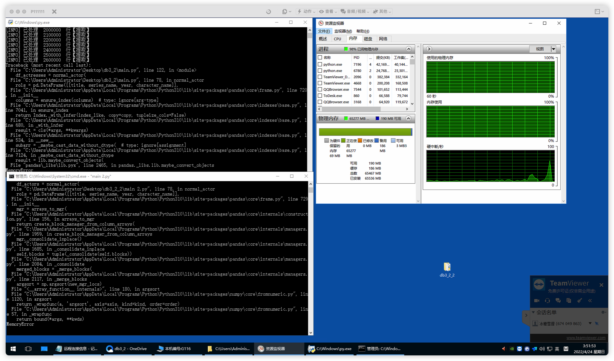

    

    В этом скрипте можно объединить все фильмы одного актера в один

    ```python
    # ------*------ coding: utf-8 ------*------
    # @Time    : 2022/4/26 16:39
    # @Author  : 冰糖雪狸 (NekoSilverfox)
    # @Project : IMDB 数据处理
    # @File    : 切割提取.py
    # @Software: PyCharm
    # @Github  ：https://github.com/NekoSilverFox
    # -----------------------------------------
    import pandas as pd
    import numpy as np
    import datetime
    import pickle
    import re
    
    
    def normal_actor(source_data: pd.DataFrame, dump_name_title: str, dump_df_res: str) -> pd.DataFrame:
        """
        将 IMDB 的演员数据标准化为 pd.DataFrame。每个演员及其各个作品独占一行（类似于交叉表）
        建议之前将数据通过 VS Code 处理
        :param file_path:
        :return: pd.DataFrame
        """
    
        """
        使用正则表达式提取作品名、上映日期、系列名，并将他们作为新的 DataFrame
        所以取得的结果为带 MutIndex 的 DataFrame
        """
        print('>>' * 50)
        print('[INFO] 开始提取字符串中的信息')
        time_start = datetime.datetime.now()
        list_name_title = []
        i = 1
        name_list = []
        for col in source_data.values:
            if col[0] is not np.nan:
                names = col[0]
                name_list = names.split(', ')
    
            if len(name_list) == 0:
                continue
    
            for this_name in name_list:
    
                title_mix = col[1]
    
                # Регулярные выражения используются для извлечения
                """title 电影标题 字符串前一部分 """
                title = re.search(r'^[^\(\{\[]*', title_mix)
                if title is not None:
                    title = str(title.group()[:-1])
    
                """year 上映年份 ()"""
                year = re.search(r'(?!=\({1})[\d]{4}(?!=\){1})', title_mix)
                if year is not None:
                    year = int(year.group())
    
                """series name 系列名称： {}"""
                series_name = re.search(r'\{(.*?)\}', title_mix)
                if series_name is not None:
                    series_name = str(series_name.group()[1:-1])
    
                """character name 角色名称"""
                character_name = re.search(r'\[(.*?)\]', title_mix)
                if character_name is not None:
                    character_name = str(character_name.group()[1:-1])
                # name_title.append([this_name, title, series_name, year, character_name])
                # name_title.append([this_name, [title, series_name, year, character_name]])
                rols = pd.DataFrame([[title, series_name, year, character_name]],
                                    columns=['title', 'series name', 'year', 'character name'])
    
                list_name_title.append([this_name, rols])  # this_name 是 str, rols 是DataFrame
    
            if i % 10000 == 0:
                use_sec = (datetime.datetime.now() - time_start).seconds
                print('[INFO] 已处理 ', i, ' 行 | ', (i / source_data.shape[0]) * 100, '% | 已用时：', use_sec, ' 秒（', use_sec / 60,
                      '）分钟')
            i += 1
    
        use_sec = (datetime.datetime.now() - time_start).seconds
        print('[INFO] 数据提取结束，用时：', use_sec, ' 秒（', use_sec / 60, '）分钟')
    
        """将取得的结果 df_name_title 为带 MutIndex 的 DataFrame"""
        print('>>' * 50)
        print('[INFO] 将取得的结果 df_name_title 为带 MutIndex 的 DataFrame')
        time_start = datetime.datetime.now()
        df_name_title = pd.DataFrame(list_name_title, columns=['name', 'rols'])
        list_name_title = []
        df_name_title.sort_values(by='name', inplace=True)
        df_name_title.reset_index(drop=True, inplace=True)
        use_sec = (datetime.datetime.now() - time_start).seconds
        print('[INFO] DataFrame 转换结束，用时：', use_sec, ' 秒（', use_sec / 60, '）分钟')
    
        # print('>>' * 50)
        # print('[INFO] 开始序列化（备份）df_name_title')
        # time_start = datetime.datetime.now()
        # f = open(dump_name_title, 'wb')
        # pickle.dump(obj=df_name_title, file=f)
        # f.close()
        # use_sec = (datetime.datetime.now() - time_start).seconds
        # print('[INFO] 序列化（备份）结束，用时：', use_sec, ' 秒（', use_sec / 60, '）分钟')
    
        """合并重复的 name，使其唯一。rols 中增加同一演员的信息"""
        print('>>' * 50)
        print('[INFO] 开始合并重复的 name')
        time_start = datetime.datetime.now()
        name = None
        tmp_df_rols = []
        res_list_name_rols = []
        for i in range(df_name_title.shape[0]):
    
            """如果为同一人，即将作品合并的到一个 DataFrame 中"""
            if name == df_name_title.loc[i]['name']:
                tmp_df_rols = pd.concat([tmp_df_rols, df_name_title.loc[i]['rols']])
    
            else:
                """开始下一个人
                    先将上一个人的信息写入到新的 list 中，再重置 name 和 tmp_df_rols 为当前行的内容
                """
                if name is not None:
                    res_list_name_rols.append([name, tmp_df_rols])
    
                    # if name == '$haniqua':
                    #     print(tmp_df_rols)
    
                name = df_name_title.loc[i]['name']
                tmp_df_rols = df_name_title.loc[i]['rols']
    
            if i % 10000 == 0:
                use_sec = (datetime.datetime.now() - time_start).seconds
                print('[INFO] 已处理 ', i, ' 行 | ', (i / df_name_title.shape[0]) * 100, '% | 已用时：', use_sec, ' 秒（',
                      use_sec / 60, '）分钟')
    
        res_list_name_rols = pd.DataFrame(data=res_list_name_rols, columns=['name', 'rols'])
    
        # print('>>' * 50)
        # print('[INFO] 开始序列化（备份）res_list_name_rols')
        # time_start = datetime.datetime.now()
        # f = open(dump_df_res, 'wb')
        # pickle.dump(obj=res_list_name_rols, file=f)
        # f.close()
        # use_sec = (datetime.datetime.now() - time_start).seconds
        # print('[INFO] 序列化（备份）res_list_name_rols 结束，用时：', use_sec, ' 秒（', use_sec / 60, '）分钟')
    
        return res_list_name_rols
    
    
    if __name__ == '__main__':
        print('>>' * 50)
        print('[INFO] 开始执行')
    
        ##################################################################################################################
        # 演员信息表
        print('>>' * 50)
        print('[INFO] 开始读取 `name.basics.tsv`')
        time_start = datetime.datetime.now()
        df_name_info = pd.read_csv(
            filepath_or_buffer='/Users/fox/Library/CloudStorage/OneDrive-PetertheGreatSt'
                               '.PetersburgPolytechnicalUniversity/СПБПУ/3 курс/6 семестр/СУБД/资料/DataSet/name.basics.tsv',
            header=0,
            sep='\t'
        )
        df_name_info = df_name_info.iloc[:, :-1]
        df_name_info.columns = ['nconst', 'name', 'birthYear', 'deathYear', 'profession']
        time_end = datetime.datetime.now()
        print('[INFO] 读取 `name.basics.tsv`结束，用时：', (time_end - time_start).seconds, ' 秒')
        ##################################################################################################################
    
        ##################################################################################################################
        # 处理缺失值为 None，方便转换为 JSON
        print('>>' * 50)
        print('[INFO] 开始处理缺失值为 None 并移除重复值，方便转换为 JSON')
        time_start = datetime.datetime.now()
        df_name_info.replace(to_replace=['\\N', np.nan], value=None, inplace=True)
        df_name_info.drop_duplicates(subset='name', keep='first', inplace=True)
        time_end = datetime.datetime.now()
        print('[INFO] 处理缺失值并移除重复值结束，用时：', (time_end - time_start).seconds, ' 秒')
        ##################################################################################################################
    
    
        ##################################################################################################################
        print('>>' * 50)
        print('[INFO] 开始读取文件', '/Users/fox/Library/CloudStorage/OneDrive-PetertheGreatSt'
                               '.PetersburgPolytechnicalUniversity/СПБПУ/3 курс/6 '
                               'семестр/СУБД/资料/DataSet/data_actors.list.txt')
        time_start = datetime.datetime.now()
        # source_data = pd.read_csv(
        #     filepath_or_buffer='/Users/fox/Library/CloudStorage/OneDrive-PetertheGreatSt.PetersburgPolytechnicalUniversity/СПБПУ/3 '
        #               'курс/6 семестр/СУБД/资料/DataSet/data_actresses.list.txt',
        #     header=0,
        #     sep='\t'
        # )
    
        # 男演员列表df
        source_data = pd.read_csv(
            filepath_or_buffer='/Users/fox/Library/CloudStorage/OneDrive-PetertheGreatSt.PetersburgPolytechnicalUniversity/СПБПУ/3 '
                      'курс/6 семестр/СУБД/资料/DataSet/data_actors.list.txt',
            header=0,
            sep='\t'
        )
        time_end = datetime.datetime.now()
        print('[INFO] 读取文件结束，用时：', (time_end - time_start).seconds, ' 秒')
    
    
    
        print('>>' * 50)
        print('[INFO] 开始数据预处理')
        time_start = datetime.datetime.now()
        source_data.columns = ['name', 't1', 't2', 't3']
        source_data['t1'].fillna(value='', inplace=True)
        source_data['t2'].fillna(value='', inplace=True)
        source_data['t3'].fillna(value='', inplace=True)
    
        movie_list = source_data['t1'] + source_data['t2'] + source_data['t3']
        source_data = pd.concat([source_data['name'], movie_list], axis=1)
        source_data.columns = ['name', 'title_mix']
    
        # source_data = source_data.iloc[:1000, :]
    
        time_end = datetime.datetime.now()
        print('[INFO] 数据预处理结束，用时：', (time_end - time_start).seconds, ' 秒')
    
    
        start_index = 0
        step_index = 1000000
        end_index = start_index + step_index
        times = 31
    
    
    
        for i in range(1, times):
            print('\n\n')
            print('>>' * 20, ' 开始执行第 ', i, ' 个循环', '<<' * 20)
    
            tmp_source_data = source_data.iloc[start_index:end_index, :]
    
            ##################################################################################################################
            # # 女演员列表df
            # print('[INFO]  main -> 开始处理 `data_actresses.list.txt`')
            # df_actresses = normal_actor(
            #     source_data=tmp_source_data,
            #     dump_name_title='./result/dump_df_actresses_name_title.bits',
            #     dump_df_res='./result/dump_df_actresses.bits'
            # )
            # tmp_source_data = None
            # print('[INFO] main <- 处理 `data_actresses.list.txt`结束')
            ##################################################################################################################
    
    
            ##################################################################################################################
            # # 男演员列表df
            # print('[INFO] Start handle `data_actors.list.txt`')
            # df_actors = normal_actor(
            #     file_path='/Users/fox/Library/CloudStorage/OneDrive-PetertheGreatSt.PetersburgPolytechnicalUniversity/СПБПУ/3 '
            #               'курс/6 семестр/СУБД/资料/DataSet/data_actors.list.txt'
            # )
            print('[INFO]  main -> 开始处理 `data_actors.list.txt`')
            df_actresses = normal_actor(
                source_data=tmp_source_data,
                dump_name_title='./result/dump_df_actors_name_title.bits',
                dump_df_res='./result/dump_df_actors.bits'
            )
            tmp_source_data = None
            print('[INFO] main <- 处理 `data_actresses.list.txt`结束')
            ##################################################################################################################
    
            ##################################################################################################################
            print('>>' * 50)
            print('[INFO] 开始 merge 两张大表，以处理为最终结果')
            time_start = datetime.datetime.now()
            df_all = pd.merge(left=df_name_info,
                              right=df_actresses,
                              how='inner',
                              on='name')
            time_end = datetime.datetime.now()
            print('[INFO] merge 结束，用时：', (time_end - time_start).seconds, ' 秒')
    
            df_actresses = None
            print('[INFO] 释放内存')
            ##################################################################################################################
    
            print('>>' * 50)
            print('[INFO] 开始序列化（备份）合并后的最终结果')
            time_start = datetime.datetime.now()
            dump_df_res = '/Users/fox/Library/CloudStorage/OneDrive-PetertheGreatSt.PetersburgPolytechnicalUniversity/СПБПУ/3 курс/6 семестр/СУБД/资料/DataSet/result_dump_actors/dump_actors_' + str(i) +'.bits'
            f = open(dump_df_res, 'wb')
            pickle.dump(obj=df_all, file=f)
            f.close()
            use_sec = (datetime.datetime.now() - time_start).seconds
            print('[INFO] 序列化（备份）合并后的最终结果结束，用时：', use_sec, ' 秒（', use_sec / 60, '）分钟')
    
    
            ##################################################################################################################
            print('[INFO] Start write to JSON file')
            df_all.to_json(
                path_or_buf='/Users/fox/Library/CloudStorage/OneDrive-PetertheGreatSt.PetersburgPolytechnicalUniversity'
                            '/СПБПУ/3 курс/6 семестр/СУБД/资料/DataSet/result_json_actors/df_final_actors_' + str(i) + '.json',
                orient='records',
                lines=True)
            print('[INFO] JSON 写入完成')
            df_all = None
            print('[INFO] 释放内存')
            ##################################################################################################################
    
            start_index += step_index
            end_index += step_index
    
        pass
    
    ```

    

2. Десериализовать все полученные малые наборы данных и сшить их вместе в большой набор данных, а также удалить дублирующиеся значения

    ```python
    # ------*------ coding: utf-8 ------*------
    # @Time    : 2022/4/27 14:37
    # @Author  : 冰糖雪狸 (NekoSilverfox)
    # @Project : IMDB 数据处理
    # @File    : 反序列化数据.py.py
    # @Software: PyCharm
    # @Github  ：https://github.com/NekoSilverFox
    # -----------------------------------------
    import pickle
    import datetime
    import pandas as pd
    
    
    def concat_df(bits_file_path_header: str,
                  max_index: int,
                  path_result_bits_save: str) -> pd.DataFrame:
        """
        从许多序列化文件中反序列化，并且拼接他们
        :param bits_file_path_header: 序列化文件的【文件头】
        :param max_index: 文件头的最大索引
        :param path_result_bits_save: 合并结果的反序列化保存位置
        :return: 反序列化后的 DataFrame
        """
        df_result = None
    
        for i in range(1, max_index + 1):
            print('-' * 50)
            print('[INFO] 开始读取第 ', i, '个文件')
            time_start = datetime.datetime.now()
            bits_file_path = bits_file_path_header + str(i) + '.bits'
            f = open(bits_file_path, 'rb')
            df_obj = pickle.load(file=f)
            f.close()
            time_end = datetime.datetime.now()
            print('[INFO] 读取第 ', i, '个文件结束，用时：', (time_end - time_start).seconds, ' 秒\n')
    
            if i == 1:
                df_result = df_obj
                continue
    
            print('[INFO] 开始拼接第 ', i, '个文件')
            time_start = datetime.datetime.now()
            df_result = pd.concat([df_result, df_obj])
            time_end = datetime.datetime.now()
            print('[INFO] 拼接第 ', i, '个文件结束，用时：', (time_end - time_start).seconds, ' 秒\n')
    
        # 合并结束，使用序列化保存结果
        print('-' * 50)
        print('[INFO] 合并结束，使用序列化保存结果')
        time_start = datetime.datetime.now()
        f = open(path_result_bits_save, 'wb')
        pickle.dump(obj=df_result, file=f)
        f.close()
        time_end = datetime.datetime.now()
        print('[INFO] 序列化保存结果结束，用时：', (time_end - time_start).seconds, ' 秒\n')
    
        return df_result
    
    
    def merge_duplicates(df_source: pd.DataFrame) -> pd.DataFrame:
        """
        将最终的结果再次去重
        :param df_source: 合并男女演员是数组
        :return: 合并去重后的 DataFrame
        """
        df_source.sort_values(by='nconst', inplace=True)
        df_source.reset_index(drop=True, inplace=True)
    
        i_current = 0
        i_next = i_current + 1
        stop_index = df_source.shape[0]
        while i_next <= stop_index:
            while df_source.loc[i_current]['nconst'] == df_source.loc[i_next]['nconst']:
                df_source.loc[i_current]['rols'] = pd.concat([df_source.loc[i_current]['rols'], df_source.loc[i_next]['rols']])
                df_source.drop(index=i_next, inplace=True)
                i_next += 1
    
                if i_next == stop_index:
                    df_source.reset_index(drop=True, inplace=True)
                    return df_source
    
            print('[INFO] 已合并 ', i_current, ' 行 | ', round(i_current / df_source.shape[0] * 100, 4), '%')
            i_current = i_next
            i_next += 1
    
        df_source.reset_index(drop=True, inplace=True)
        return df_source
    
    
    if __name__ == '__main__':
        ################################################################################################################
        # 合并所有男演员（actors）
        ################################################################################################################
        print('>>' * 50)
        bits_file_path_header = '/Users/fox/Library/CloudStorage/OneDrive-PetertheGreatSt' \
                                '.PetersburgPolytechnicalUniversity/СПБПУ/3 курс/6 ' \
                                'семестр/СУБД/资料/DataSet/result_dump_actors/dump_actors_'
    
        path_result_bits_save = '/Users/fox/Library/CloudStorage/OneDrive-PetertheGreatSt' \
                                '.PetersburgPolytechnicalUniversity/СПБПУ/3 курс/6 ' \
                                'семестр/СУБД/资料/DataSet/result_dump_actors/dump_actors_ALL.bits'
    
        df_all_actors = concat_df(bits_file_path_header=bits_file_path_header,
                                  max_index=20,
                                  path_result_bits_save=path_result_bits_save)
        print('[INFO] 合并并序列化输出成功！\n输出至：', path_result_bits_save)
    
    
        ################################################################################################################
        # 合并所有女演员（actors）
        ################################################################################################################
        print('>>' * 50)
        bits_file_path_header = '/Users/fox/Library/CloudStorage/OneDrive-PetertheGreatSt' \
                                '.PetersburgPolytechnicalUniversity/СПБПУ/3 курс/6 ' \
                                'семестр/СУБД/资料/DataSet/result_dump_actresses/dump_actresses_'
    
        path_result_bits_save = '/Users/fox/Library/CloudStorage/OneDrive-PetertheGreatSt' \
                                '.PetersburgPolytechnicalUniversity/СПБПУ/3 курс/6 ' \
                                'семестр/СУБД/资料/DataSet/result_dump_actresses/dump_actresses_ALL.bits'
    
        df_all_actresses = concat_df(bits_file_path_header=bits_file_path_header,
                                     max_index=13,
                                     path_result_bits_save=path_result_bits_save)
        print('[INFO] 合并并序列化输出成功！\n输出至：', path_result_bits_save)
    
    
        ################################################################################################################
        # 合并所有男演员（actors）和女演员（actors）
        ################################################################################################################
        print('>>' * 50)
        print('[INFO] 合并所有男演员（actors）和女演员（actors）')
        time_start = datetime.datetime.now()
    
        df_result_all = pd.concat([df_all_actors, df_all_actresses])
    
        time_end = datetime.datetime.now()
        print('[INFO] 合并所有男演员（actors）和女演员（actors）结束，用时：', (time_end - time_start).seconds, ' 秒\n')
    
        ################################################################################################################
        df_all_actors = None
        df_all_actresses = None
        print('[INFO] 内存释放')
        ################################################################################################################
    
    
        ################################################################################################################
        # 合并后的最终结果再次去重
        ################################################################################################################
        print('>>' * 50)
        print('[INFO] 合并后的最终结果再次去重')
        time_start = datetime.datetime.now()
        df_result_all = merge_duplicates(df_source=df_result_all)
        time_end = datetime.datetime.now()
        print('[INFO] 合并后的最终结果再次去重结束：', (time_end - time_start).seconds, ' 秒\n')  # [INFO] 合并后的最终结果再次去重结束： 9714  秒
    
        ################################################################################################################
        # 合并后的最终结果再序列化并保存为 JSON 文件
        ################################################################################################################
        path_result_bits_save = '/Users/fox/Library/CloudStorage/OneDrive-PetertheGreatSt' \
                                '.PetersburgPolytechnicalUniversity/СПБПУ/3 курс/6 ' \
                                'семестр/СУБД/资料/DataSet/result_ALL/dump_ALL.bits'
        print('>>' * 50)
        print('[INFO] 合并结束，使用序列化保存[最终]结果')
        time_start = datetime.datetime.now()
        f = open(path_result_bits_save, 'wb')
        pickle.dump(obj=df_result_all, file=f)
        f.close()
        time_end = datetime.datetime.now()
        print('[INFO] 序列化保存结果结束，用时：', (time_end - time_start).seconds, ' 秒\n')
    
    
        path_result_json_save = '/Users/fox/Library/CloudStorage/OneDrive-PetertheGreatSt' \
                                '.PetersburgPolytechnicalUniversity/СПБПУ/3 курс/6 ' \
                                'семестр/СУБД/资料/DataSet/result_ALL/dump_ALL.json'
        print('>>' * 50)
        print('[INFO] 保存[最终]结果为 JSON')
        time_start = datetime.datetime.now()
        df_result_all.to_json(path_or_buf=path_result_json_save,
                              orient='records',
                              lines=True)
        time_end = datetime.datetime.now()
        print('[INFO] 保存[最终]结果为 JSON，用时：', (time_end - time_start).seconds, ' 秒\n')
        ################################################################################################################
        pass
    
    ```

    

3. Выполнение тестов на скорость, сериализация и построение результатов в виде изображений

    ```sql
    # ------*------ coding: utf-8 ------*------
    # @Time    : 2022/4/28 14:22
    # @Author  : 冰糖雪狸 (NekoSilverfox)
    # @Project : JSON 速度测试
    # @File    : 速度测试.py
    # @Software: PyCharm
    # @Github  ：https://github.com/NekoSilverFox
    # -----------------------------------------
    import psycopg2 as pg
    import matplotlib.pyplot as plt
    import pandas as pd
    import datetime
    import pickle
    
    
    def get_id_len_json_df():
        """
        获取数据库中每个 ID 对应 JSON data 的长度
        :return:
        """
        # 如果数据库不存在，那么它将自动创建，最后将返回一个数据库对象
        print('>>' * 50)
        print('[INFO] Start connect database')
        conn = pg.connect(database="db_imdb",
                          user="postgres",
                          password="postgres",
                          host="localhost",
                          port="5432")
        cur = conn.cursor()
        print('[INFO] Connect database successfully')
    
        # 获取行数
        cur.execute("SELECT COUNT(*) FROM tb_json;")
        count_row = cur.fetchall()[0][0]
        print('行数：', count_row)
    
        # 用于统计的 DataFrame
        df_counter = pd.DataFrame([[0, 0]], columns=['id', 'len_json'])
    
        # 执行查询并记录时间
        for i in range(1, count_row):
            print('[INFO] 正在测试第 ' + str(i) + '行 | ' + str(round(i / count_row * 100, 4)) + '%')
    
            comm_sql = 'SELECT imdata FROM tb_json WHERE iddata=' + str(i) + ';'
            cur.execute(comm_sql)
            len_row_json = len(str(cur.fetchall()[0]))  # JSON(B)长度
    
            df_tmp = pd.DataFrame([[i, len_row_json]], columns=['id', 'len_json'])
            df_counter = pd.concat([df_counter, df_tmp])
    
        conn.close()
    
        df_counter = df_counter.iloc[1:, :]
        df_counter.sort_values(by='len_json', inplace=True)
    
        print('>>' * 50)
        print('[INFO] 合并结束，使用序列化保存[最终]结果')
        time_start = datetime.datetime.now()
        f = open('./result/df_id_json_len.bits', 'wb')
        pickle.dump(obj=df_counter, file=f)
        f.close()
        time_end = datetime.datetime.now()
        print('[INFO] 序列化保存结果结束，用时：', (time_end - time_start).seconds, ' 秒\n')
    
    
    def json_by_id_only_full_row_test():
        # 如果数据库不存在，那么它将自动创建，最后将返回一个数据库对象
        print('>>' * 50)
        print('[INFO] Start connect database')
        conn = pg.connect(database="db_imdb",
                          user="postgres",
                          password="postgres",
                          host="localhost",
                          port="5432")
        cur = conn.cursor()
        print('[INFO] Connect database successfully')
    
        # 获取行数
        cur.execute("SELECT COUNT(*) FROM tb_json;")
        count_row = cur.fetchall()[0][0]
        print('行数：', count_row)
    
        # 用于统计的 DataFrame
        df_counter = pd.DataFrame([[0, 0]], columns=['len_row', 'use_time_ms'])
    
        # 执行查询并记录时间
        for i in range(1, 3000):
            print('[INFO] 正在测试第 ' + str(i) + '行 | ' + str(round(i / count_row * 100, 4)) + '%')
    
            comm_sql = 'SELECT imdata FROM tb_json WHERE iddata=' + str(i) + ';'
            start_time = datetime.datetime.now()
            cur.execute(comm_sql)
            end_time = datetime.datetime.now()
            use_time_ms = (end_time - start_time).microseconds
            # print('用时：', (end_time - start_time).microseconds, 'ms')
    
            row = cur.fetchall()[0]
            len_row_json = len(str(row))  # JSON(B)长度
    
            df_tmp = pd.DataFrame([[len_row_json, use_time_ms]], columns=['len_row', 'use_time_ms'])
            df_counter = pd.concat([df_counter, df_tmp])
    
        conn.close()
    
        df_counter = df_counter.iloc[1:, :]
        df_counter.sort_values(by='len_row', inplace=True)
    
        print('>>' * 50)
        print('[INFO] 合并结束，使用序列化保存[最终]结果')
        time_start = datetime.datetime.now()
        f = open('./result/json/res_id.bits', 'wb')
        pickle.dump(obj=df_counter, file=f)
        f.close()
        time_end = datetime.datetime.now()
        print('[INFO] 序列化保存结果结束，用时：', (time_end - time_start).seconds, ' 秒\n')
    
        # print(df_counter)
    
        """绘制结果"""
        plt.figure(figsize=(20, 10), dpi=100)
        plt.scatter(x=df_counter['len_row'].values,
                    y=df_counter['use_time_ms'].values)
        plt.title('Query by key `ID` in tb_json')
        plt.xlabel('Length of JSON')
        plt.ylabel('Query time (milliseconds)')
        plt.savefig('./result/json/res_id.png')
        # plt.show()
    
    
    def jsonb_by_id_only_full_row_test():
        # 如果数据库不存在，那么它将自动创建，最后将返回一个数据库对象
        print('>>' * 50)
        print('[INFO] Start connect database')
        conn = pg.connect(database="db_imdb",
                          user="postgres",
                          password="postgres",
                          host="localhost",
                          port="5432")
        cur = conn.cursor()
        print('[INFO] Connect database successfully')
    
        # 获取行数
        cur.execute("SELECT COUNT(*) FROM tb_jsonb;")
        count_row = cur.fetchall()[0][0]
        print('行数：', count_row)
    
        # 用于统计的 DataFrame
        df_counter = pd.DataFrame([[0, 0]], columns=['len_row', 'use_time_ms'])
    
        # 执行查询并记录时间
        for i in range(1, 3000):
            print('[INFO] 正在测试第 ' + str(i) + '行 | ' + str(round(i / count_row * 100, 4)) + '%')
            comm_sql = 'SELECT imdata FROM tb_jsonb WHERE iddata=' + str(i) + ';'
    
            start_time = datetime.datetime.now()
            cur.execute(comm_sql)
            end_time = datetime.datetime.now()
            use_time_ms = (end_time - start_time).microseconds
            # print('用时：', (end_time - start_time).microseconds, 'ms')
    
            row = cur.fetchall()[0]
            len_row_json = len(str(row))  # JSON(B)长度
    
            df_tmp = pd.DataFrame([[len_row_json, use_time_ms]], columns=['len_row', 'use_time_ms'])
            df_counter = pd.concat([df_counter, df_tmp])
    
        conn.close()
    
        df_counter = df_counter.iloc[1:, :]
        df_counter.sort_values(by='len_row', inplace=True)
    
        print('>>' * 50)
        print('[INFO] 合并结束，使用序列化保存[最终]结果')
        time_start = datetime.datetime.now()
        f = open('./result/jsonb/res_id.bits', 'wb')
        pickle.dump(obj=df_counter, file=f)
        f.close()
        time_end = datetime.datetime.now()
        print('[INFO] 序列化保存结果结束，用时：', (time_end - time_start).seconds, ' 秒\n')
    
        # print(df_counter)
    
        """绘制结果"""
        plt.figure(figsize=(20, 10), dpi=100)
        plt.scatter(x=df_counter['len_row'].values,
                    y=df_counter['use_time_ms'].values)
        plt.title('Query by key `ID` in tb_jsonb')
        plt.xlabel('Length of JSONB')
        plt.ylabel('Query time (milliseconds)')
        plt.savefig('./result/jsonb/res_id.png')
        # plt.show()
    
    
    def json_by_id_every_col_test():
        # 如果数据库不存在，那么它将自动创建，最后将返回一个数据库对象
        print('>>' * 50)
        print('[INFO] Start connect database')
        conn = pg.connect(database="db_imdb",
                          user="postgres",
                          password="postgres",
                          host="localhost",
                          port="5432")
        cur = conn.cursor()
        print('[INFO] Connect database successfully')
    
        # 获取行数
        cur.execute("SELECT COUNT(*) FROM tb_json;")
        count_row = cur.fetchall()[0][0]
        print('行数：', count_row)
    
        # 用于统计的 DataFrame
        df_counter = pd.DataFrame([[0, 0, 0, 0, 0, 0, 0]],
                                  columns=['len_row', 'full_ms', 'nconst_ms', 'name_ms', 'birthYear_ms', 'profession_ms', 'rols_ms'])
    
        # 执行查询并记录时间
        for i in range(1, count_row):
            print('[INFO] 正在测试第 ' + str(i) + '行 | ' + str(round(i / count_row * 100, 4)) + '%')
    
            # 整个 data 行所有字段
            comm_sql = 'SELECT imdata FROM tb_json WHERE iddata=' + str(i) + ';'
            start_time = datetime.datetime.now()
            cur.execute(comm_sql)
            end_time = datetime.datetime.now()
            full_use_time_ms = (end_time - start_time).microseconds
            row = cur.fetchall()[0]
            len_row_json = len(str(row))  # JSON(B)长度
    
            # 整个 data 行的字段 nconst
            comm_sql = "SELECT imdata->>'nconst' FROM tb_json WHERE iddata=" + str(i) + ';'
            start_time = datetime.datetime.now()
            cur.execute(comm_sql)
            end_time = datetime.datetime.now()
            nconst_use_time_ms = (end_time - start_time).microseconds
    
            # 整个 data 行的字段 name
            comm_sql = "SELECT imdata->>'name' FROM tb_json WHERE iddata=" + str(i) + ';'
            start_time = datetime.datetime.now()
            cur.execute(comm_sql)
            end_time = datetime.datetime.now()
            name_use_time_ms = (end_time - start_time).microseconds
    
            # 整个 data 行的字段 birthYear
            comm_sql = "SELECT imdata->>'birthYear' FROM tb_json WHERE iddata=" + str(i) + ';'
            start_time = datetime.datetime.now()
            cur.execute(comm_sql)
            end_time = datetime.datetime.now()
            birthYear_use_time_ms = (end_time - start_time).microseconds
    
            # 整个 data 行的字段 profession
            comm_sql = "SELECT imdata->>'profession' FROM tb_json WHERE iddata=" + str(i) + ';'
            start_time = datetime.datetime.now()
            cur.execute(comm_sql)
            end_time = datetime.datetime.now()
            profession_use_time_ms = (end_time - start_time).microseconds
    
            # 整个 data 行的字段 rols
            comm_sql = "SELECT imdata->>'rols' FROM tb_json WHERE iddata=" + str(i) + ';'
            start_time = datetime.datetime.now()
            cur.execute(comm_sql)
            end_time = datetime.datetime.now()
            rols_use_time_ms = (end_time - start_time).microseconds
    
            df_tmp = pd.DataFrame([[len_row_json, full_use_time_ms, nconst_use_time_ms, name_use_time_ms, birthYear_use_time_ms, profession_use_time_ms, rols_use_time_ms]],
                                  columns=['len_row', 'full_ms', 'nconst_ms', 'name_ms', 'birthYear_ms', 'profession_ms', 'rols_ms'])
            df_counter = pd.concat([df_counter, df_tmp])
    
        conn.close()
    
        df_counter = df_counter.iloc[1:, :]
        df_counter.sort_values(by='len_row', inplace=True)
    
        print('>>' * 50)
        print('[INFO] 合并结束，使用序列化保存[最终]结果')
        time_start = datetime.datetime.now()
        f = open('./result/json/res_id_ix_every_col.bits', 'wb')
        pickle.dump(obj=df_counter, file=f)
        f.close()
        time_end = datetime.datetime.now()
        print('[INFO] 序列化保存结果结束，用时：', (time_end - time_start).seconds, ' 秒\n')
    
        # print(df_counter)
    
        """绘制结果"""
        plt.figure(figsize=(20, 10), dpi=100)
        plt.scatter(x=df_counter['len_row'].values,
                    y=df_counter['full_ms'].values,
                    label='full row')
        plt.scatter(x=df_counter['len_row'].values,
                    y=df_counter['nconst_ms'].values,
                    label='nconst')
        plt.scatter(x=df_counter['len_row'].values,
                    y=df_counter['name_ms'].values,
                    label='name')
        plt.scatter(x=df_counter['len_row'].values,
                    y=df_counter['birthYear_ms'].values,
                    label='birthYear')
        plt.scatter(x=df_counter['len_row'].values,
                    y=df_counter['profession_ms'].values,
                    label='profession')
        plt.scatter(x=df_counter['len_row'].values,
                    y=df_counter['rols_ms'].values,
                    label='rols')
        plt.legend()
        plt.title('Query by key `ID` in tb_json')
        plt.xlabel('Length of JSON')
        plt.ylabel('Query time (milliseconds)')
        plt.savefig('./result/json/res_id_ix_every_col.png')
        # plt.show()
    
    
    def jsonb_by_id_every_col_test():
        # 如果数据库不存在，那么它将自动创建，最后将返回一个数据库对象
        print('>>' * 50)
        print('[INFO] Start connect database')
        conn = pg.connect(database="db_imdb",
                          user="postgres",
                          password="postgres",
                          host="localhost",
                          port="5432")
        cur = conn.cursor()
        print('[INFO] Connect database successfully')
    
        # 获取行数
        cur.execute("SELECT COUNT(*) FROM tb_jsonb;")
        count_row = cur.fetchall()[0][0]
        print('行数：', count_row)
    
        # 用于统计的 DataFrame
        df_counter = pd.DataFrame([[0, 0, 0, 0, 0, 0, 0]],
                                  columns=['len_row', 'full_ms', 'nconst_ms', 'name_ms', 'birthYear_ms', 'profession_ms', 'rols_ms'])
    
        # 执行查询并记录时间
        for i in range(1, count_row):
            print('[INFO] 正在测试第 ' + str(i) + '行 | ' + str(round(i / count_row * 100, 4)) + '%')
    
            # 整个 data 行所有字段
            comm_sql = 'SELECT imdata FROM tb_jsonb WHERE iddata=' + str(i) + ';'
            start_time = datetime.datetime.now()
            cur.execute(comm_sql)
            end_time = datetime.datetime.now()
            full_use_time_ms = (end_time - start_time).microseconds
            row = cur.fetchall()[0]
            len_row_jsonb = len(str(row))  # JSON(B)长度
    
            # 整个 data 行的字段 nconst
            comm_sql = "SELECT imdata->>'nconst' FROM tb_jsonb WHERE iddata=" + str(i) + ';'
            start_time = datetime.datetime.now()
            cur.execute(comm_sql)
            end_time = datetime.datetime.now()
            nconst_use_time_ms = (end_time - start_time).microseconds
    
            # 整个 data 行的字段 name
            comm_sql = "SELECT imdata->>'name' FROM tb_jsonb WHERE iddata=" + str(i) + ';'
            start_time = datetime.datetime.now()
            cur.execute(comm_sql)
            end_time = datetime.datetime.now()
            name_use_time_ms = (end_time - start_time).microseconds
    
            # 整个 data 行的字段 birthYear
            comm_sql = "SELECT imdata->>'birthYear' FROM tb_jsonb WHERE iddata=" + str(i) + ';'
            start_time = datetime.datetime.now()
            cur.execute(comm_sql)
            end_time = datetime.datetime.now()
            birthYear_use_time_ms = (end_time - start_time).microseconds
    
            # 整个 data 行的字段 profession
            comm_sql = "SELECT imdata->>'profession' FROM tb_jsonb WHERE iddata=" + str(i) + ';'
            start_time = datetime.datetime.now()
            cur.execute(comm_sql)
            end_time = datetime.datetime.now()
            profession_use_time_ms = (end_time - start_time).microseconds
    
            # 整个 data 行的字段 rols
            comm_sql = "SELECT imdata->>'rols' FROM tb_jsonb WHERE iddata=" + str(i) + ';'
            start_time = datetime.datetime.now()
            cur.execute(comm_sql)
            end_time = datetime.datetime.now()
            rols_use_time_ms = (end_time - start_time).microseconds
    
            df_tmp = pd.DataFrame([[len_row_jsonb, full_use_time_ms, nconst_use_time_ms, name_use_time_ms, birthYear_use_time_ms, profession_use_time_ms, rols_use_time_ms]],
                                  columns=['len_row', 'full_ms', 'nconst_ms', 'name_ms', 'birthYear_ms', 'profession_ms', 'rols_ms'])
            df_counter = pd.concat([df_counter, df_tmp])
    
        conn.close()
    
        df_counter = df_counter.iloc[1:, :]
        df_counter.sort_values(by='len_row', inplace=True)
    
        print('>>' * 50)
        print('[INFO] 合并结束，使用序列化保存[最终]结果')
        time_start = datetime.datetime.now()
        f = open('./result/jsonb/res_id_ix_every_col.bits', 'wb')
        pickle.dump(obj=df_counter, file=f)
        f.close()
        time_end = datetime.datetime.now()
        print('[INFO] 序列化保存结果结束，用时：', (time_end - time_start).seconds, ' 秒\n')
    
        # print(df_counter)
    
        """绘制结果"""
        plt.figure(figsize=(20, 10), dpi=100)
        plt.scatter(x=df_counter['len_row'].values,
                    y=df_counter['full_ms'].values,
                    label='full row')
        plt.scatter(x=df_counter['len_row'].values,
                    y=df_counter['nconst_ms'].values,
                    label='nconst')
        plt.scatter(x=df_counter['len_row'].values,
                    y=df_counter['name_ms'].values,
                    label='name')
        plt.scatter(x=df_counter['len_row'].values,
                    y=df_counter['birthYear_ms'].values,
                    label='birthYear')
        plt.scatter(x=df_counter['len_row'].values,
                    y=df_counter['profession_ms'].values,
                    label='profession')
        plt.scatter(x=df_counter['len_row'].values,
                    y=df_counter['rols_ms'].values,
                    label='rols')
        plt.legend()
        plt.title('Query by key `ID` in tb_jsonb')
        plt.xlabel('Length of JSONB')
        plt.ylabel('Query time (milliseconds)')
        plt.savefig('./result/jsonb/res_id_ix_every_col.png')
        # plt.show()
    
    
    def json_update_by_id_every_col_test():
        # 如果数据库不存在，那么它将自动创建，最后将返回一个数据库对象
        print('>>' * 50)
        print('[INFO] Start connect database')
        conn = pg.connect(database="db_imdb",
                          user="postgres",
                          password="postgres",
                          host="localhost",
                          port="5432")
        cur = conn.cursor()
        print('[INFO] Connect database successfully')
    
        # 获取行数
        cur.execute("SELECT COUNT(*) FROM tb_json;")
        count_row = cur.fetchall()[0][0]
        print('行数：', count_row)
    
        # 用于统计的 DataFrame
        df_counter = pd.DataFrame([[0, 0, 0, 0, 0]],
                                  columns=['len_row', 'nconst_ms', 'name_ms', 'birthYear_ms', 'rols_ms'])
    
        # 执行查询并记录时间
        for i in range(1, count_row):
            print('\n[INFO] 正在测试第 ' + str(i) + '行 | ' + str(round(i / count_row * 100, 4)) + '%')
    
            try:
                # 整个 data 行所有字段
                comm_sql = 'SELECT imdata FROM tb_json WHERE iddata=' + str(i) + ';'
                cur.execute(comm_sql)
                len_row_json = len(str(cur.fetchall()[0]))  # JSON(B)长度
    
                cur.execute('BEGIN;')
    
                print('\tBEGIN;')
    
                # 整个 data 行的字段 nconst
                comm_sql = "UPDATE tb_json SET imdata=jsonb_set(imdata::jsonb, '{nconst}', '\"tt0000009\"'::jsonb) WHERE iddata=" + str(i) + ';'
                start_time = datetime.datetime.now()
                cur.execute(comm_sql)
                end_time = datetime.datetime.now()
                nconst_use_time_ms = (end_time - start_time).microseconds
                print('\tnconst 测试结束, 用时：', nconst_use_time_ms, ' ms')
    
                # 整个 data 行的字段 name
                comm_sql = "UPDATE tb_json SET imdata=jsonb_set(imdata::jsonb, '{name}', '\"tt_name\"'::jsonb) WHERE iddata=" + str(i) + ';'
                start_time = datetime.datetime.now()
                cur.execute(comm_sql)
                end_time = datetime.datetime.now()
                name_use_time_ms = (end_time - start_time).microseconds
                print('\tname 测试结束, 用时：', name_use_time_ms, ' ms')
    
                # 整个 data 行的字段 birthYear
                comm_sql = "UPDATE tb_json SET imdata=jsonb_set(imdata::jsonb, '{birthYear}', '\"2222\"'::jsonb) WHERE iddata=" + str(i) + ';'
                start_time = datetime.datetime.now()
                cur.execute(comm_sql)
                end_time = datetime.datetime.now()
                birthYear_use_time_ms = (end_time - start_time).microseconds
                print('\tbirthYear 测试结束, 用时：', birthYear_use_time_ms, ' ms')
    
                # 整个 data 行的字段 rols
                comm_sql = 'UPDATE tb_json SET imdata=jsonb_set(imdata::jsonb, \'{rols}\', \'[{"year": 2000, "title": "t_title", "series name": "t_series", "character name": "t_character_name"}]\'::jsonb) WHERE iddata=' + str(i) + ';'
                start_time = datetime.datetime.now()
                cur.execute(comm_sql)
                end_time = datetime.datetime.now()
                rols_use_time_ms = (end_time - start_time).microseconds
                print('\trols 测试结束, 用时：', rols_use_time_ms, ' ms')
    
            except:
                cur.execute('ROLLBACK;')
                continue
    
            cur.execute('ROLLBACK;')
            df_tmp = pd.DataFrame([[len_row_json, nconst_use_time_ms, name_use_time_ms, birthYear_use_time_ms, rols_use_time_ms]],
                                  columns=['len_row', 'nconst_ms', 'name_ms', 'birthYear_ms', 'rols_ms'])
            df_counter = pd.concat([df_counter, df_tmp])
    
        conn.close()
    
        df_counter = df_counter.iloc[1:, :]
        df_counter.sort_values(by='len_row', inplace=True)
    
        print('>>' * 50)
        print('[INFO] 合并结束，使用序列化保存[最终]结果')
        time_start = datetime.datetime.now()
        f = open('./result/json/res_update_id_ix_every_col.bits', 'wb')
        pickle.dump(obj=df_counter, file=f)
        f.close()
        time_end = datetime.datetime.now()
        print('[INFO] 序列化保存结果结束，用时：', (time_end - time_start).seconds, ' 秒\n')
    
        # print(df_counter)
    
        """绘制结果"""
        plt.figure(figsize=(20, 10), dpi=100)
        plt.scatter(x=df_counter['len_row'].values,
                    y=df_counter['nconst_ms'].values,
                    label='nconst')
        plt.scatter(x=df_counter['len_row'].values,
                    y=df_counter['name_ms'].values,
                    label='name')
        plt.scatter(x=df_counter['len_row'].values,
                    y=df_counter['birthYear_ms'].values,
                    label='birthYear')
        plt.scatter(x=df_counter['len_row'].values,
                    y=df_counter['rols_ms'].values,
                    label='rols')
        plt.legend()
        plt.title('Test UPDATE, query by key `ID` in tb_json')
        plt.xlabel('Length of JSON')
        plt.ylabel('Query time (milliseconds)')
        plt.savefig('./result/json/res_update_id_ix_every_col.png')
        # plt.show()
    
    
    def jsonb_update_by_id_every_col_test():
        # 如果数据库不存在，那么它将自动创建，最后将返回一个数据库对象
        print('>>' * 50)
        print('[INFO] Start connect database')
        conn = pg.connect(database="db_imdb",
                          user="postgres",
                          password="postgres",
                          host="localhost",
                          port="5432")
        cur = conn.cursor()
        print('[INFO] Connect database successfully')
    
        # 获取行数
        cur.execute("SELECT COUNT(*) FROM tb_jsonb;")
        count_row = cur.fetchall()[0][0]
        print('行数：', count_row)
    
        # 用于统计的 DataFrame
        df_counter = pd.DataFrame([[0, 0, 0, 0, 0]],
                                  columns=['len_row', 'nconst_ms', 'name_ms', 'birthYear_ms', 'rols_ms'])
    
        # 执行查询并记录时间
        for i in range(1, count_row):
            print('\n[INFO] 正在测试第 ' + str(i) + '行 | ' + str(round(i / count_row * 100, 4)) + '%')
    
            try:
                # 整个 data 行所有字段
                comm_sql = 'SELECT imdata FROM tb_jsonb WHERE iddata=' + str(i) + ';'
                cur.execute(comm_sql)
                len_row_jsonb = len(str(cur.fetchall()[0]))  # JSON(B)长度
    
                cur.execute('BEGIN;')
    
                print('\tBEGIN;')
    
                # 整个 data 行的字段 nconst
                comm_sql = "UPDATE tb_jsonb SET imdata=jsonb_set(imdata::jsonb, '{nconst}', '\"tt0000009\"'::jsonb) WHERE iddata=" + str(i) + ';'
                # comm_sql = "UPDATE tb_jsonb SET imdata=jsonb_set(imdata::jsonb, \'{nconst}\', \'\"tt0000009\"\'::jsonb) WHERE iddata=" + str(i) + ';'
                # print(comm_sql)
                start_time = datetime.datetime.now()
                cur.execute(comm_sql)
                end_time = datetime.datetime.now()
                nconst_use_time_ms = (end_time - start_time).microseconds
                print('\tnconst 测试结束, 用时：', nconst_use_time_ms, ' ms')
    
                # 整个 data 行的字段 name
                comm_sql = "UPDATE tb_jsonb SET imdata=jsonb_set(imdata::jsonb, '{name}', '\"tt_name\"'::jsonb) WHERE iddata=" + str(i) + ';'
                start_time = datetime.datetime.now()
                cur.execute(comm_sql)
                end_time = datetime.datetime.now()
                name_use_time_ms = (end_time - start_time).microseconds
                print('\tname 测试结束, 用时：', name_use_time_ms, ' ms')
    
                # 整个 data 行的字段 birthYear
                comm_sql = "UPDATE tb_jsonb SET imdata=jsonb_set(imdata::jsonb, '{birthYear}', '\"2222\"'::jsonb) WHERE iddata=" + str(i) + ';'
                start_time = datetime.datetime.now()
                cur.execute(comm_sql)
                end_time = datetime.datetime.now()
                birthYear_use_time_ms = (end_time - start_time).microseconds
                print('\tbirthYear 测试结束, 用时：', birthYear_use_time_ms, ' ms')
    
                # 整个 data 行的字段 rols
                comm_sql = 'UPDATE tb_jsonb SET imdata=jsonb_set(imdata::jsonb, \'{rols}\', \'[{"year": 2000, "title": "t_title", "series name": "t_series", "character name": "t_character_name"}]\'::jsonb) WHERE iddata=' + str(i) + ';'
                start_time = datetime.datetime.now()
                cur.execute(comm_sql)
                end_time = datetime.datetime.now()
                rols_use_time_ms = (end_time - start_time).microseconds
                print('\trols 测试结束, 用时：', rols_use_time_ms, ' ms')
    
            except:
                cur.execute('ROLLBACK;')
                continue
    
            cur.execute('ROLLBACK;')
            df_tmp = pd.DataFrame([[len_row_jsonb, nconst_use_time_ms, name_use_time_ms, birthYear_use_time_ms, rols_use_time_ms]],
                                  columns=['len_row', 'nconst_ms', 'name_ms', 'birthYear_ms', 'rols_ms'])
            df_counter = pd.concat([df_counter, df_tmp])
    
        conn.close()
    
        df_counter = df_counter.iloc[1:, :]
        df_counter.sort_values(by='len_row', inplace=True)
    
        print('>>' * 50)
        print('[INFO] 合并结束，使用序列化保存[最终]结果')
        time_start = datetime.datetime.now()
        f = open('./result/jsonb/res_update_id_ix_every_col.bits', 'wb')
        pickle.dump(obj=df_counter, file=f)
        f.close()
        time_end = datetime.datetime.now()
        print('[INFO] 序列化保存结果结束，用时：', (time_end - time_start).seconds, ' 秒\n')
    
        # print(df_counter)
    
        """绘制结果"""
        plt.figure(figsize=(20, 10), dpi=100)
        plt.scatter(x=df_counter['len_row'].values,
                    y=df_counter['nconst_ms'].values,
                    label='nconst')
        plt.scatter(x=df_counter['len_row'].values,
                    y=df_counter['name_ms'].values,
                    label='name')
        plt.scatter(x=df_counter['len_row'].values,
                    y=df_counter['birthYear_ms'].values,
                    label='birthYear')
        plt.scatter(x=df_counter['len_row'].values,
                    y=df_counter['rols_ms'].values,
                    label='rols')
        plt.legend()
        plt.title('Test UPDATE, query by key `ID` in tb_jsonb')
        plt.xlabel('Length of JSONB')
        plt.ylabel('Query time (milliseconds)')
        plt.savefig('./result/jsonb/res_update_id_ix_every_col.png')
        # plt.show()
    
    
    def json_where_name_test():
        print('>>' * 50)
        print('[INFO] 读取序列化数据')
        time_start = datetime.datetime.now()
        f = open('/Users/fox/Library/CloudStorage/OneDrive-PetertheGreatSt.PetersburgPolytechnicalUniversity/СПБПУ/3 '
                 'курс/6 семестр/СУБД/资料/DataSet/result_ALL/dump_ALL.bits', 'rb')
        arr_name = pickle.load(file=f)
        f.close()
        arr_name = arr_name['name'].values
        time_end = datetime.datetime.now()
        print('[INFO] 读取序列化数据结束，用时：', (time_end - time_start).seconds, ' 秒\n')
    
        print('>>' * 50)
        print('[INFO] Start connect database')
        conn = pg.connect(database="db_imdb",
                          user="postgres",
                          password="postgres",
                          host="localhost",
                          port="5432")
        cur = conn.cursor()
        print('[INFO] Connect database successfully')
    
        i = 0
        count_row = len(arr_name)
        # 用于统计的 DataFrame
        df_counter = pd.DataFrame([[0, 0]], columns=['len_row', 'use_time_ms'])
        # TODO 取消分割
        for name in arr_name[244:250]:
            i += 1
            print('[INFO] 正在测试第 ' + str(i) + ' 行 | ' + str(round(i / count_row * 100, 4)) + '% | name = ', name)
    
            comm_sql = "SELECT imdata FROM tb_json WHERE imdata::json->> 'name' = '" + name + "';"
            start_time = datetime.datetime.now()
            try:
                cur.execute(comm_sql)
            except:
                print('[INFO] 第 ' + str(i) + ' 行取消 | name = ', name)
                continue
            end_time = datetime.datetime.now()
            use_time_ms = (end_time - start_time).microseconds
            # print('用时：', (end_time - start_time).microseconds, 'ms')
    
            row = cur.fetchall()[0]
            len_row_json = len(str(row))  # JSON(B)长度
            df_tmp = pd.DataFrame([[len_row_json, use_time_ms]], columns=['len_row', 'use_time_ms'])
            df_counter = pd.concat([df_counter, df_tmp])
    
        conn.close()
    
        df_counter = df_counter.iloc[1:, :]
        df_counter.sort_values(by='len_row', inplace=True)
    
        print('>>' * 50)
        print('[INFO] 合并结束，使用序列化保存[最终]结果')
        time_start = datetime.datetime.now()
        f = open('./result/json/res_name.bits', 'wb')
        pickle.dump(obj=df_counter, file=f)
        f.close()
        time_end = datetime.datetime.now()
        print('[INFO] 序列化保存结果结束，用时：', (time_end - time_start).seconds, ' 秒\n')
    
        # print(df_counter)
    
        """绘制结果"""
        plt.figure(figsize=(20, 10), dpi=100)
        plt.scatter(x=df_counter['len_row'].values,
                    y=df_counter['use_time_ms'].values)
        plt.title('Query by key `name` in tb_json')
        plt.xlabel('Length of JSON')
        plt.ylabel('Query time (milliseconds)')
        plt.savefig('./result/json/res_name.png')
        # plt.show()  # TODO 注释掉
    
    
    def jsonb_where_name_test():
        print('>>' * 50)
        print('[INFO] 读取序列化数据')
        time_start = datetime.datetime.now()
        f = open('/Users/fox/Library/CloudStorage/OneDrive-PetertheGreatSt.PetersburgPolytechnicalUniversity/СПБПУ/3 '
                 'курс/6 семестр/СУБД/资料/DataSet/result_ALL/dump_ALL.bits', 'rb')
        arr_name = pickle.load(file=f)
        f.close()
        arr_name = arr_name['name'].values
        time_end = datetime.datetime.now()
        print('[INFO] 读取序列化数据结束，用时：', (time_end - time_start).seconds, ' 秒\n')
    
        print('>>' * 50)
        print('[INFO] Start connect database')
        conn = pg.connect(database="db_imdb",
                          user="postgres",
                          password="postgres",
                          host="localhost",
                          port="5432")
        cur = conn.cursor()
        print('[INFO] Connect database successfully')
    
        i = 0
        count_row = len(arr_name)
        # 用于统计的 DataFrame
        df_counter = pd.DataFrame([[0, 0]], columns=['len_row', 'use_time_ms'])
        # TODO 取消分割
        for name in arr_name[:3000]:
            i += 1
            print('[INFO] 正在测试第 ' + str(i) + ' 行 | ' + str(round(i / count_row * 100, 4)) + '% | name = ', name)
    
            comm_sql = "SELECT imdata FROM tb_jsonb WHERE imdata::jsonb->> 'name' = '" + name + "';"
            start_time = datetime.datetime.now()
            try:
                cur.execute(comm_sql)
            except:
                print('[INFO] 第 ' + str(i) + ' 行取消 | name = ', name)
                continue
            end_time = datetime.datetime.now()
            use_time_ms = (end_time - start_time).microseconds
            # print('用时：', (end_time - start_time).microseconds, 'ms')
    
            row = cur.fetchall()[0]
            len_row_json = len(str(row))  # JSON(B)长度
            df_tmp = pd.DataFrame([[len_row_json, use_time_ms]], columns=['len_row', 'use_time_ms'])
            df_counter = pd.concat([df_counter, df_tmp])
    
            # print(rows)  # TODO 注释掉
            # print(len(str(rows)))  # TODO 注释掉
    
        conn.close()
    
        df_counter = df_counter.iloc[1:, :]
        df_counter.sort_values(by='len_row', inplace=True)
    
        print('>>' * 50)
        print('[INFO] 合并结束，使用序列化保存[最终]结果')
        time_start = datetime.datetime.now()
        f = open('./result/jsonb/res_name.bits', 'wb')
        pickle.dump(obj=df_counter, file=f)
        f.close()
        time_end = datetime.datetime.now()
        print('[INFO] 序列化保存结果结束，用时：', (time_end - time_start).seconds, ' 秒\n')
    
        # print(df_counter)
    
        """绘制结果"""
        plt.figure(figsize=(20, 10), dpi=100)
        plt.scatter(x=df_counter['len_row'].values,
                    y=df_counter['use_time_ms'].values)
        plt.title('Query by key `name` in tb_jsonb')
        plt.xlabel('Length of JSONB')
        plt.ylabel('Query time (milliseconds)')
        plt.savefig('./result/jsonb/res_name.png')
        # plt.show()  # TODO 注释掉
    
    
    def json_by_where_nconst_only_full_row_test():
        print('>>' * 50)
        print('[INFO] 读取序列化数据')
        time_start = datetime.datetime.now()
        f = open('/Users/fox/Library/CloudStorage/OneDrive-PetertheGreatSt.PetersburgPolytechnicalUniversity/СПБПУ/3 '
                 'курс/6 семестр/СУБД/资料/DataSet/result_ALL/dump_ALL.bits', 'rb')
        arr_nconst = pickle.load(file=f)
        f.close()
        arr_nconst = arr_nconst['nconst'].values
        time_end = datetime.datetime.now()
        print('[INFO] 读取序列化数据结束，用时：', (time_end - time_start).seconds, ' 秒\n')
    
        print('>>' * 50)
        print('[INFO] Start connect database')
        conn = pg.connect(database="db_imdb",
                          user="postgres",
                          password="postgres",
                          host="localhost",
                          port="5432")
        cur = conn.cursor()
        print('[INFO] Connect database successfully')
    
        i = 0
        count_row = len(arr_nconst)
        # 用于统计的 DataFrame
        df_counter = pd.DataFrame([[0, 0]], columns=['len_row', 'use_time_ms'])
        # TODO 取消分割
        for nconst in arr_nconst[:1000]:
            i += 1
            print('[INFO] 正在测试第 ' + str(i) + ' 行 | ' + str(round(i / count_row * 100, 4)) + '% | nconst = ', nconst)
    
            comm_sql = "SELECT imdata FROM tb_json WHERE imdata::json->> 'nconst' = '" + nconst + "';"
            start_time = datetime.datetime.now()
            try:
                cur.execute(comm_sql)
            except:
                print('[INFO] 第 ' + str(i) + ' 行取消 | nconst = ', nconst)
                continue
            end_time = datetime.datetime.now()
            use_time_ms = (end_time - start_time).microseconds
            print('\t用时：', (end_time - start_time).seconds, 's')
    
            row = cur.fetchall()[0]
            len_row_json = len(str(row))  # JSON(B)长度
            df_tmp = pd.DataFrame([[len_row_json, use_time_ms]], columns=['len_row', 'use_time_ms'])
            df_counter = pd.concat([df_counter, df_tmp])
    
        conn.close()
    
        df_counter = df_counter.iloc[1:, :]
        df_counter.sort_values(by='len_row', inplace=True)
    
        print('>>' * 50)
        print('[INFO] 合并结束，使用序列化保存[最终]结果')
        time_start = datetime.datetime.now()
        f = open('./result/json/res_nconst.bits', 'wb')
        pickle.dump(obj=df_counter, file=f)
        f.close()
        time_end = datetime.datetime.now()
        print('[INFO] 序列化保存结果结束，用时：', (time_end - time_start).seconds, ' 秒\n')
    
        # print(df_counter)
    
        """绘制结果"""
        plt.figure(figsize=(20, 10), dpi=100)
        plt.scatter(x=df_counter['len_row'].values,
                    y=df_counter['use_time_ms'].values)
        plt.title('Query by key `nconst` in tb_json')
        plt.xlabel('Length of JSON')
        plt.ylabel('Query time (milliseconds)')
        plt.savefig('./result/json/res_nconst.png')
        # plt.show()  # TODO 注释掉
    
    
    def jsonb_by_where_nconst_only_full_row_test():
        print('>>' * 50)
        print('[INFO] 读取序列化数据')
        time_start = datetime.datetime.now()
        f = open('/Users/fox/Library/CloudStorage/OneDrive-PetertheGreatSt.PetersburgPolytechnicalUniversity/СПБПУ/3 '
                 'курс/6 семестр/СУБД/资料/DataSet/result_ALL/dump_ALL.bits', 'rb')
        arr_nconst = pickle.load(file=f)
        f.close()
        arr_nconst = arr_nconst['nconst'].values
        time_end = datetime.datetime.now()
        print('[INFO] 读取序列化数据结束，用时：', (time_end - time_start).seconds, ' 秒\n')
    
        print('>>' * 50)
        print('[INFO] Start connect database')
        conn = pg.connect(database="db_imdb",
                          user="postgres",
                          password="postgres",
                          host="localhost",
                          port="5432")
        cur = conn.cursor()
        print('[INFO] Connect database successfully')
    
        i = 0
        count_row = len(arr_nconst)
        # 用于统计的 DataFrame
        df_counter = pd.DataFrame([[0, 0]], columns=['len_row', 'use_time_ms'])
        # TODO 取消分割
        for nconst in arr_nconst[:3000]:
            i += 1
            print('\n[INFO] 正在测试第 ' + str(i) + ' 行 | ' + str(round(i / count_row * 100, 4)) + '% | nconst = ', nconst)
    
            comm_sql = "SELECT imdata FROM tb_jsonb WHERE imdata::jsonb->> 'nconst' = '" + nconst + "';"
            start_time = datetime.datetime.now()
            try:
                cur.execute(comm_sql)
            except:
                print('[INFO] 第 ' + str(i) + ' 行取消 | nconst = ', nconst)
                continue
            end_time = datetime.datetime.now()
            use_time_ms = (end_time - start_time).microseconds
            print('\t用时：', (end_time - start_time).seconds, 's')
    
            row = cur.fetchall()[0]
            len_row_json = len(str(row))  # JSON(B)长度
            df_tmp = pd.DataFrame([[len_row_json, use_time_ms]], columns=['len_row', 'use_time_ms'])
            df_counter = pd.concat([df_counter, df_tmp])
    
        conn.close()
    
        df_counter = df_counter.iloc[1:, :]
        df_counter.sort_values(by='len_row', inplace=True)
    
        print('>>' * 50)
        print('[INFO] 合并结束，使用序列化保存[最终]结果')
        time_start = datetime.datetime.now()
        f = open('./result/jsonb/res_nconst.bits', 'wb')
        pickle.dump(obj=df_counter, file=f)
        f.close()
        time_end = datetime.datetime.now()
        print('[INFO] 序列化保存结果结束，用时：', (time_end - time_start).seconds, ' 秒\n')
    
        # print(df_counter)
    
        """绘制结果"""
        plt.figure(figsize=(20, 10), dpi=100)
        plt.scatter(x=df_counter['len_row'].values,
                    y=df_counter['use_time_ms'].values)
        plt.title('Query by key `nconst` in tb_jsonb')
        plt.xlabel('Length of JSONB')
        plt.ylabel('Query time (milliseconds)')
        plt.savefig('./result/jsonb/res_nconst.png')
        # plt.show()  # TODO 注释掉
    
    
    def json_by_where_nconst_every_col_test():
        print('>>' * 50)
        print('[INFO] 读取序列化数据')
        time_start = datetime.datetime.now()
        f = open('/Users/fox/Library/CloudStorage/OneDrive-PetertheGreatSt.PetersburgPolytechnicalUniversity/СПБПУ/3 '
                 'курс/6 семестр/СУБД/资料/DataSet/result_ALL/dump_ALL.bits', 'rb')
        arr_nconst = pickle.load(file=f)
        f.close()
        arr_nconst = arr_nconst['nconst'].values
        time_end = datetime.datetime.now()
        print('[INFO] 读取序列化数据结束，用时：', (time_end - time_start).seconds, ' 秒\n')
    
        print('>>' * 50)
        print('[INFO] Start connect database')
        conn = pg.connect(database="db_imdb",
                          user="postgres",
                          password="postgres",
                          host="localhost",
                          port="5432")
        cur = conn.cursor()
        print('[INFO] Connect database successfully')
    
        i = 0
        count_row = len(arr_nconst)
        # 用于统计的 DataFrame
        df_counter = pd.DataFrame([[0, 0, 0, 0, 0, 0, 0]],
                                  columns=['len_row', 'full_ms', 'nconst_ms', 'name_ms', 'birthYear_ms', 'profession_ms',
                                           'rols_ms'])
        # TODO 取消分割
        # for nconst in arr_nconst[:2000]:
        for nconst in arr_nconst[:10]:
            i += 1
            print('\n[INFO] 正在测试第 ' + str(i) + ' 行 | ' + str(round(i / count_row * 100, 4)) + '% | nconst = ', nconst)
    
            # 整个 data 行所有字段
            comm_sql = "SELECT imdata FROM tb_json WHERE imdata::json->>'nconst' = '" + nconst + "';"
            start_time = datetime.datetime.now()
            try:
                cur.execute(comm_sql)
            except:
                print('[INFO] 第 ' + str(i) + ' 行取消 | nconst = ', nconst)
                continue
            end_time = datetime.datetime.now()
            full_use_time_ms = (end_time - start_time).microseconds
            row = cur.fetchall()[0]
            len_row_json = len(str(row))  # JSON(B)长度
            print('\tfull row 用时：', (end_time - start_time).seconds, 's')
    
            # 整个 data 行的字段 nconst
            comm_sql = "SELECT imdata->>'nconst' FROM tb_json WHERE imdata::json->>'nconst' = '" + nconst + "';"
            start_time = datetime.datetime.now()
            cur.execute(comm_sql)
            end_time = datetime.datetime.now()
            nconst_use_time_ms = (end_time - start_time).microseconds
            print('\tnconst 用时：', (end_time - start_time).seconds, 's')
    
    
    
            # 整个 data 行的字段 name
            comm_sql = "SELECT imdata->>'name' FROM tb_json WHERE imdata::json->>'nconst' = '" + nconst + "';"
            start_time = datetime.datetime.now()
            cur.execute(comm_sql)
            end_time = datetime.datetime.now()
            name_use_time_ms = (end_time - start_time).microseconds
            print('\tname 用时：', (end_time - start_time).seconds, 's')
    
            # 整个 data 行的字段 birthYear
            comm_sql = "SELECT imdata->>'birthYear' FROM tb_json WHERE imdata::json->>'nconst' = '" + nconst + "';"
            start_time = datetime.datetime.now()
            cur.execute(comm_sql)
            end_time = datetime.datetime.now()
            birthYear_use_time_ms = (end_time - start_time).microseconds
            print('\tbirthYear 用时：', (end_time - start_time).seconds, 's')
    
            # 整个 data 行的字段 profession
            comm_sql = "SELECT imdata->>'profession' FROM tb_json WHERE imdata::json->>'nconst' = '" + nconst + "';"
            start_time = datetime.datetime.now()
            cur.execute(comm_sql)
            end_time = datetime.datetime.now()
            profession_use_time_ms = (end_time - start_time).microseconds
            print('\tprofession 用时：', (end_time - start_time).seconds, 's')
    
            # 整个 data 行的字段 rols
            comm_sql = "SELECT imdata->>'rols' FROM tb_json WHERE imdata::json->>'nconst' = '" + nconst + "';"
            start_time = datetime.datetime.now()
            cur.execute(comm_sql)
            end_time = datetime.datetime.now()
            rols_use_time_ms = (end_time - start_time).microseconds
            print('\trols 用时：', (end_time - start_time).seconds, 's')
    
    
            df_tmp = pd.DataFrame([[len_row_json, full_use_time_ms, nconst_use_time_ms, name_use_time_ms, birthYear_use_time_ms, profession_use_time_ms, rols_use_time_ms]],
                                  columns=['len_row', 'full_ms', 'nconst_ms', 'name_ms', 'birthYear_ms', 'profession_ms', 'rols_ms'])
            df_counter = pd.concat([df_counter, df_tmp])
    
        conn.close()
    
        df_counter = df_counter.iloc[1:, :]
        df_counter.sort_values(by='len_row', inplace=True)
    
        print('>>' * 50)
        print('[INFO] 合并结束，使用序列化保存[最终]结果')
        time_start = datetime.datetime.now()
        f = open('./result/json/res_by_nconst_all_col.bits', 'wb')
        pickle.dump(obj=df_counter, file=f)
        f.close()
        time_end = datetime.datetime.now()
        print('[INFO] 序列化保存结果结束，用时：', (time_end - time_start).seconds, ' 秒\n')
    
        # print(df_counter)
    
        """绘制结果"""
        plt.figure(figsize=(20, 10), dpi=100)
        plt.scatter(x=df_counter['len_row'].values,
                    y=df_counter['full_ms'].values,
                    label='full row')
        plt.scatter(x=df_counter['len_row'].values,
                    y=df_counter['nconst_ms'].values,
                    label='nconst')
        plt.scatter(x=df_counter['len_row'].values,
                    y=df_counter['name_ms'].values,
                    label='name')
        plt.scatter(x=df_counter['len_row'].values,
                    y=df_counter['birthYear_ms'].values,
                    label='birthYear')
        plt.scatter(x=df_counter['len_row'].values,
                    y=df_counter['profession_ms'].values,
                    label='profession')
        plt.scatter(x=df_counter['len_row'].values,
                    y=df_counter['rols_ms'].values,
                    label='rols')
        plt.legend()
        plt.title('Query by key `nconst` in tb_json')
        plt.xlabel('Length of JSON')
        plt.ylabel('Query time (milliseconds)')
        plt.savefig('./result/json/res_by_nconst_all_col.png')
        # plt.show()
    
    
    def jsonb_by_where_nconst_every_col_test():
        print('>>' * 50)
        print('[INFO] 读取序列化数据')
        time_start = datetime.datetime.now()
        f = open('/Users/fox/Library/CloudStorage/OneDrive-PetertheGreatSt.PetersburgPolytechnicalUniversity/СПБПУ/3 '
                 'курс/6 семестр/СУБД/资料/DataSet/result_ALL/dump_ALL.bits', 'rb')
        arr_nconst = pickle.load(file=f)
        f.close()
        arr_nconst = arr_nconst['nconst'].values
        time_end = datetime.datetime.now()
        print('[INFO] 读取序列化数据结束，用时：', (time_end - time_start).seconds, ' 秒\n')
    
        print('>>' * 50)
        print('[INFO] Start connect database')
        conn = pg.connect(database="db_imdb",
                          user="postgres",
                          password="postgres",
                          host="localhost",
                          port="5432")
        cur = conn.cursor()
        print('[INFO] Connect database successfully')
    
        i = 0
        count_row = len(arr_nconst)
        # 用于统计的 DataFrame
        df_counter = pd.DataFrame([[0, 0, 0, 0, 0, 0, 0]],
                                  columns=['len_row', 'full_ms', 'nconst_ms', 'name_ms', 'birthYear_ms', 'profession_ms',
                                           'rols_ms'])
        # TODO 取消分割
        # for nconst in arr_nconst[:1000]:
        for nconst in arr_nconst[:2500]:
            i += 1
            print('[INFO] 正在测试第 ' + str(i) + ' 行 | ' + str(round(i / 2500 * 100, 4)) + '% | nconst = ', nconst)
    
            # 整个 data 行所有字段
            comm_sql = "SELECT imdata FROM tb_jsonb WHERE imdata::jsonb->>'nconst' = '" + nconst + "';"
            start_time = datetime.datetime.now()
            try:
                cur.execute(comm_sql)
            except:
                print('[INFO] 第 ' + str(i) + ' 行取消 | nconst = ', nconst)
                continue
            end_time = datetime.datetime.now()
            full_use_time_ms = (end_time - start_time).microseconds
            row = cur.fetchall()[0]
            len_row_jsonb = len(str(row))  # JSON(B)长度
            print('\tfull row 用时：', (end_time - start_time).seconds, 's')
    
            # 整个 data 行的字段 nconst
            comm_sql = "SELECT imdata->>'nconst' FROM tb_jsonb WHERE imdata::jsonb->>'nconst' = '" + nconst + "';"
            start_time = datetime.datetime.now()
            cur.execute(comm_sql)
            end_time = datetime.datetime.now()
            nconst_use_time_ms = (end_time - start_time).microseconds
            print('\tnconst 用时：', (end_time - start_time).seconds, 's')
    
    
            # 整个 data 行的字段 name
            comm_sql = "SELECT imdata->>'name' FROM tb_jsonb WHERE imdata::jsonb->>'nconst' = '" + nconst + "';"
            start_time = datetime.datetime.now()
            cur.execute(comm_sql)
            end_time = datetime.datetime.now()
            name_use_time_ms = (end_time - start_time).microseconds
            print('\tname 用时：', (end_time - start_time).seconds, 's')
    
            # 整个 data 行的字段 birthYear
            comm_sql = "SELECT imdata->>'birthYear' FROM tb_jsonb WHERE imdata::jsonb->>'nconst' = '" + nconst + "';"
            start_time = datetime.datetime.now()
            cur.execute(comm_sql)
            end_time = datetime.datetime.now()
            birthYear_use_time_ms = (end_time - start_time).microseconds
            print('\tbirthYear 用时：', (end_time - start_time).seconds, 's')
    
            # 整个 data 行的字段 profession
            comm_sql = "SELECT imdata->>'profession' FROM tb_jsonb WHERE imdata::jsonb->>'nconst' = '" + nconst + "';"
            start_time = datetime.datetime.now()
            cur.execute(comm_sql)
            end_time = datetime.datetime.now()
            profession_use_time_ms = (end_time - start_time).microseconds
            print('\tprofession 用时：', (end_time - start_time).seconds, 's')
    
            # 整个 data 行的字段 rols
            comm_sql = "SELECT imdata->>'rols' FROM tb_jsonb WHERE imdata::jsonb->>'nconst' = '" + nconst + "';"
            start_time = datetime.datetime.now()
            cur.execute(comm_sql)
            end_time = datetime.datetime.now()
            rols_use_time_ms = (end_time - start_time).microseconds
            print('\trols 用时：', (end_time - start_time).seconds, 's')
    
    
            df_tmp = pd.DataFrame([[len_row_jsonb, full_use_time_ms, nconst_use_time_ms, name_use_time_ms, birthYear_use_time_ms, profession_use_time_ms, rols_use_time_ms]],
                                  columns=['len_row', 'full_ms', 'nconst_ms', 'name_ms', 'birthYear_ms', 'profession_ms', 'rols_ms'])
            df_counter = pd.concat([df_counter, df_tmp])
    
        conn.close()
    
        df_counter = df_counter.iloc[1:, :]
        df_counter.sort_values(by='len_row', inplace=True)
    
        print('>>' * 50)
        print('[INFO] 合并结束，使用序列化保存[最终]结果')
        time_start = datetime.datetime.now()
        f = open('./result/jsonb/res_by_nconst_all_col.bits', 'wb')
        pickle.dump(obj=df_counter, file=f)
        f.close()
        time_end = datetime.datetime.now()
        print('[INFO] 序列化保存结果结束，用时：', (time_end - time_start).seconds, ' 秒\n')
    
        # print(df_counter)
    
        """绘制结果"""
        plt.figure(figsize=(20, 10), dpi=100)
        plt.scatter(x=df_counter['len_row'].values,
                    y=df_counter['full_ms'].values,
                    label='full row')
        plt.scatter(x=df_counter['len_row'].values,
                    y=df_counter['nconst_ms'].values,
                    label='nconst')
        plt.scatter(x=df_counter['len_row'].values,
                    y=df_counter['name_ms'].values,
                    label='name')
        plt.scatter(x=df_counter['len_row'].values,
                    y=df_counter['birthYear_ms'].values,
                    label='birthYear')
        plt.scatter(x=df_counter['len_row'].values,
                    y=df_counter['profession_ms'].values,
                    label='profession')
        plt.scatter(x=df_counter['len_row'].values,
                    y=df_counter['rols_ms'].values,
                    label='rols')
        plt.legend()
        plt.title('Query by key `nconst` in tb_jsonb')
        plt.xlabel('Length of JSONB')
        plt.ylabel('Query time (milliseconds)')
        plt.savefig('./result/jsonb/res_by_nconst_all_col.png')
        # plt.show()
    
    
    if __name__ == '__main__':
        # get_id_len_json_df()
    
        json_by_id_every_col_test()
    
        jsonb_by_id_every_col_test()
    
        # json_id_test()
    
        # jsonb_id_test()
    
        # json_where_name_test()
    
        # jsonb_name_test()
    
        # jsonb_where_nconst_test()
    
        # json_where_nconst_test()
    
        # jsonb_by_where_nconst_every_col_test()
    
        # json_by_where_nconst_every_col_test()
    
        json_update_by_id_every_col_test()
    
        jsonb_update_by_id_every_col_test()
    ```

    


**Сравнение времени, затрачиваемого JSON и JSONB при вставке данных в базу данных:**

| Типа  | Времия |
| ----- | ------ |
| JSON  | 49s    |
| JSONB | 79.32s |


**Сравнение времени SELECT для каждого поля JSON в таблице tb_json：**

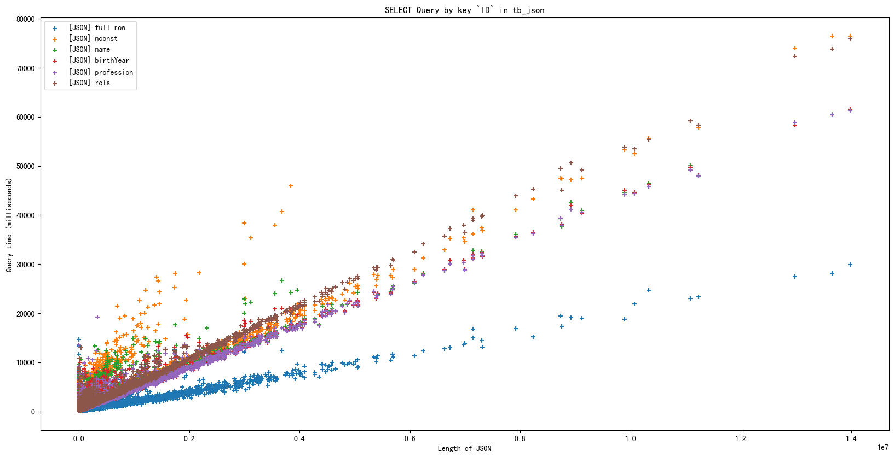


 **Сравнение времени SELECT для каждого поля JSONB в таблице tb_jsonb：**

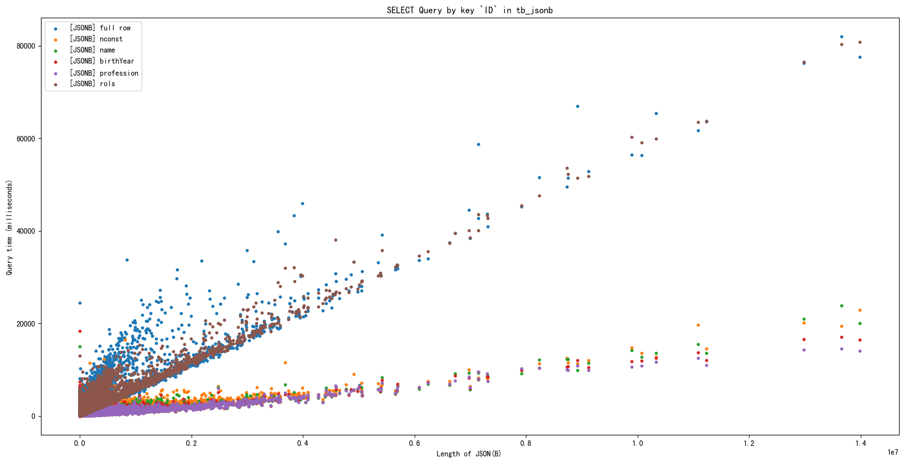


**Сравнение скорости запросов к таблицам JSON и JSONB для всех полей：**

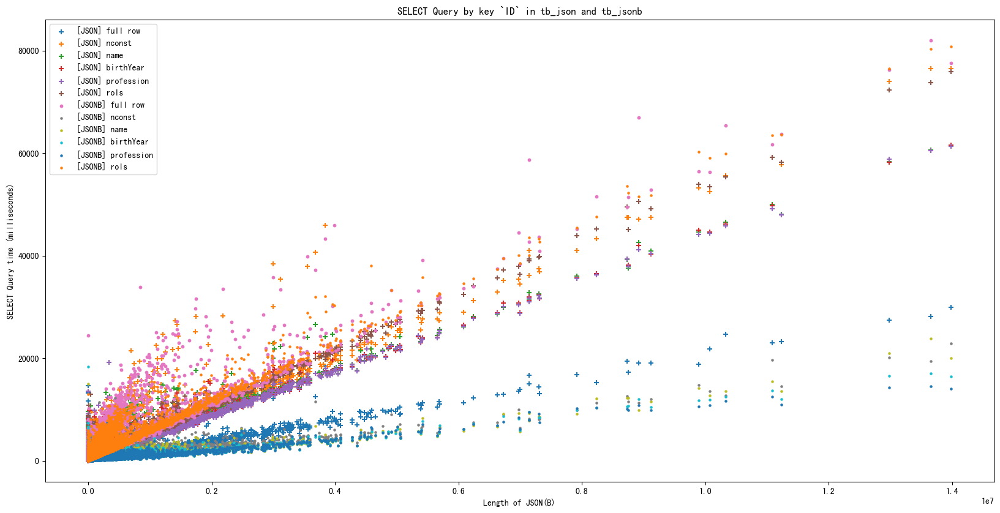

---

**Сравнение времени UPDATE для каждого поля JSON в таблице tb_json：**

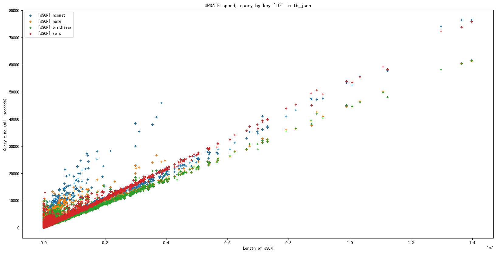


**Сравнение времени UPDATE для каждого поля JSONB в таблице tb_jsonb：**

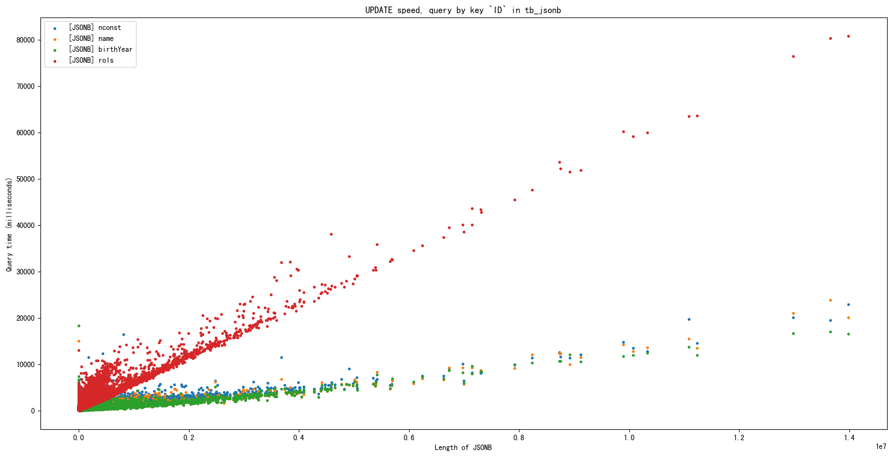


**Сравнение скорости UPDATE к таблицам JSON и JSONB для всех полей：**

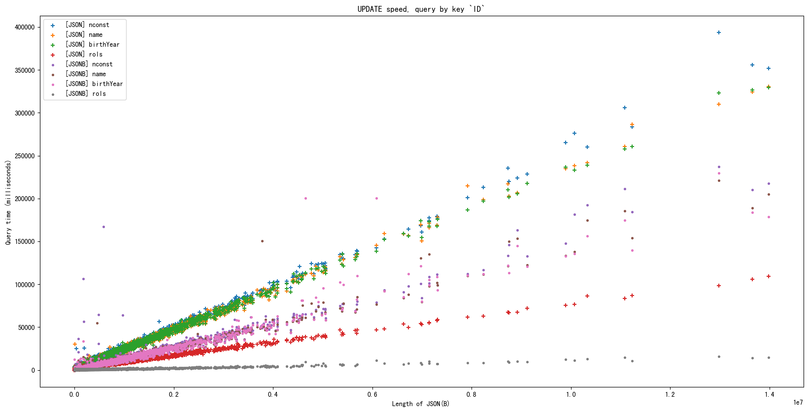

---

### TOAST

<p>
    <!-- 在PG中，页是数据在文件存储中的基本单位，其大小是固定的且只能在编译期指定，之后无法修改，默认的大小为8KB。同时，PG不允许一行数据跨页存储。那么对于超长的行数据，PG就会启动TOAST，将大的字段压缩或切片成多个物理行存到另一张系统表中（TOAST表），这种存储方式叫行外存储。-->
</p>

В PG **страница является основной единицей хранения данных в файле**, ее размер фиксирован и может быть задан только во время компиляции и не может быть изменен впоследствии, **размер по умолчанию составляет 8 КБ**. 

Кроме того, **PG не позволяет хранить строку данных на разных страницах**. Для очень длинных строк данных PG инициирует TOAST, который сжимает или нарезает большие поля на несколько физических строк и сохраняет их в другой системной таблице (таблица TOAST), этот тип хранения называется **внерядным хранением**.

<p>
    <!--
 在 PG 中每个表字段有四种 TOAST 的策略：
    PLAIN —— 避免压缩和行外存储。只有那些不需要 TOAST 策略就能存放的数据类型允许选择（例如 int 类型），而对于 text 这类要求存储长度超过页大小的类型，是不允许采用此策略的。
    EXTENDED —— 允许压缩和行外存储。一般会先压缩，如果还是太大，就会行外存储。这是大多数可以TOAST的数据类型的默认策略。
    EXTERNAL —— 允许行外存储，但不许压缩。这让在text类型和bytea类型字段上的子串操作更快。类似字符串这种会对数据的一部分进行操作的字段，采用此策略可能获得更高的性能，因为不需要读取出整行数据再解压。
    MAIN —— 允许压缩，但不许行外存储。不过实际上，为了保证过大数据的存储，行外存储在其它方式（例如压缩）都无法满足需求的情况下，作为最后手段还是会被启动。因此理解为：尽量不使用行外存储更贴切
-->
</p>

**Для каждого поля таблицы в PG существует четыре стратегии TOAST.**

- `PLAIN` - **позволяет избежать сжатия и хранения вне ряда**. Разрешается выбирать только те типы данных, для хранения которых не требуется политика TOAST (например, типы int), в то время как для таких типов, как текст, требующих длины хранения, превышающей размер страницы, эта политика недопустима.
- `EXTENDED` - **позволяет сжимать и хранить вне ряда**. Как правило, сначала он сжимается, а если он все еще слишком большой, то сохраняется вне очереди. Это политика по умолчанию для большинства типов данных, которые могут быть TOASTed.
- `EXTERNAL` - **позволяет хранить данные вне ряда**, но без сжатия. Это значительно ускоряет операции подстроки для полей типа text и bytea. Такие поля, как строки, которые работают с частью данных, могут достичь более высокой производительности при использовании этой политики, поскольку нет необходимости считывать всю строку данных и затем распаковывать ее.
- `MAIN` - **позволяет сжимать, но не хранить вне линии**. На практике, однако, внепоточное хранение активируется в крайнем случае, когда других методов (например, сжатия) недостаточно для гарантированного хранения больших данных. Поэтому правильнее будет сказать, что хранение вне ряда вообще не должно использоваться.


**Просмотр политики TOAST для таблицы tb_jsonb:**

```bash
postgres=# \d+ tb_jsonb;

                                   Table "public.tb_jsonb"
 Column |  Type   | Collation | Nullable | Storage  | Compression | Stats target | Description
--------+---------+-----------+----------+----------+-------------+--------------+-------------
 iddata | integer |           | not null | plain    |             |              |
 imdata | jsonb   |           |          | extended |             |              |
 
Indexes:
    "ix_jsonb_iddata" btree (iddata)
Access method: heap


db_imdb=# select relname, relfilenode, reltoastrelid from pg_class where relname='tb_jsonb';
 relname  | relfilenode | reltoastrelid
----------+-------------+---------------
 tb_jsonb |      162078 |        162082
(1 row)

------------------------------------------------------------------------------------------------------------------
TOAST表有三个字段：
chunk_id —— 用来表示特定 TOAST 值的 OID ，可以理解为具有同样 chunk_id 值的所有行组成原表（这里的 blog ）的 TOAST 字段的一行数据。
chunk_seq —— 用来表示该行数据在整个数据中的位置。
chunk_data —— 该Chunk实际的数据
------------------------------------------------------------------------------------------------------------------
Таблица TOAST имеет три поля.
chunk_id -- используется для указания OID конкретного значения TOAST, которое можно интерпретировать как все строки с одинаковым значением chunk_id, образующие строку данных в поле TOAST исходной таблицы (в данном случае, блога).
chunk_seq -- используется для указания позиции данных ряда в общем массиве данных.
chunk_data -- фактические данные чанка
------------------------------------------------------------------------------------------------------------------

db_imdb=# \d+ pg_toast.pg_toast_162078;
TOAST table "pg_toast.pg_toast_162078"
   Column   |  Type   | Storage
------------+---------+---------
 chunk_id   | oid     | plain
 chunk_seq  | integer | plain
 chunk_data | bytea   | plain
Owning table: "public.tb_jsonb"
Indexes:
    "pg_toast_162078_index" PRIMARY KEY, btree (chunk_id, chunk_seq)
Access method: heap


postgres=# select * from pg_toast.pg_toast_162078;
```


**Тестирование политики TOAST в Postgresql**

1. **==[EXTENDED]== Сравнить изменение объема БД для актера с малым кол-вом ролей**

    ```sql
    BEGIN;
    SELECT * FROM tb_jsonb WHERE iddata=51989;
    SELECT pg_table_size('tb_jsonb');  -- 1145241600 Byte
    SELECT pg_size_pretty(pg_table_size('tb_jsonb'));  -- 1092 MB
    SELECT iddata, pg_column_size(imdata) , imdata, imdata->>'{name}' FROM tb_jsonb WHERE iddata=51989;  -- 202 Byte
    
    UPDATE tb_jsonb SET imdata=jsonb_set(imdata::jsonb, '{name}', '"Bf AAAAAAAAAAAAAAAAAAAAAAAAA"'::jsonb) WHERE iddata=51989;
    
    SELECT iddata, pg_column_size(imdata) , imdata, imdata->>'{name}' FROM tb_jsonb WHERE iddata=51989;  -- 230 Byte
    SELECT pg_table_size('tb_jsonb');  -- 1145241600 Byte
    SELECT pg_size_pretty(pg_table_size('tb_jsonb'));  -- 1092 MB
    ROLLBACK;
    ```

    

2. **==[EXTERNAL]== Сравнить изменение объема БД для актера с малым кол-вом ролей**

    Политика TOAST изменена на EXTERNAL для отключения сжатия

    ```BASH
    postgres=# BEGIN;
    postgres=# ALTER TABLE tb_jsonb ALTER imdata SET STORAGE EXTERNAL;
    
    db_imdb=*# \d+ tb_jsonb;
                                       Table "public.tb_jsonb"
     Column |  Type   | Collation | Nullable | Storage  | Compression | Stats target | Description
    --------+---------+-----------+----------+----------+-------------+--------------+-------------
     iddata | integer |           | not null | plain    |             |              |
     imdata | jsonb   |           |          | external |             |              |
    Indexes:
        "ix_jsonb_iddata" btree (iddata)
    Access method: heap
    
    ```

    

    ```sql
    BEGIN;
    ALTER TABLE tb_jsonb ALTER imdata SET STORAGE EXTERNAL;
    
    SELECT * FROM tb_jsonb WHERE iddata=51989;
    SELECT pg_table_size('tb_jsonb');  -- 1202307072 Byte
    SELECT pg_size_pretty(pg_table_size('tb_jsonb'));  -- 1147 MB
    SELECT iddata, pg_column_size(imdata) , imdata, imdata->>'{name}' FROM tb_jsonb WHERE iddata=51989;  -- 202 Byte
    select count(*) from pg_toast.pg_toast_162078; -- 511805
    
    UPDATE tb_jsonb SET imdata=jsonb_set(imdata::jsonb, '{name}', '"Bf AAAAAAAAAAAAAAAAAAAAAAAAA"'::jsonb) WHERE iddata=51989;
    
    SELECT iddata, pg_column_size(imdata) , imdata, imdata->>'{name}' FROM tb_jsonb WHERE iddata=51989;  -- 230 Byte
    SELECT pg_table_size('tb_jsonb');  -- 1202307072 Byte
    SELECT pg_size_pretty(pg_table_size('tb_jsonb'));  -- 1147 MB
    select count(*) from pg_toast.pg_toast_162078; -- 511805
    ROLLBACK;
    ```

    
    
3. **==[EXTENDED]== Сравнить изменение объема БД для актера с большим кол-вом ролей**

    ```sql
    BEGIN;
    SELECT pg_table_size('tb_jsonb');  -- 1145241600 Byte
    SELECT pg_size_pretty(pg_table_size('tb_jsonb'));  -- 1092 MB
    SELECT iddata, pg_column_size(imdata) , imdata, imdata->>'{name}' FROM tb_jsonb WHERE iddata=3789;  -- 4034997 Byte
    
    UPDATE tb_jsonb SET imdata=jsonb_set(imdata::jsonb, '{name}', '"David AAAAAAAAAAAAAAAAAAAAAAAAA"'::jsonb) WHERE iddata=3789;
    
    SELECT iddata, pg_column_size(imdata) , imdata, imdata->>'{name}' FROM tb_jsonb WHERE iddata=3789;  -- 4035007 [+10]  Byte
    SELECT pg_table_size('tb_jsonb');  -- 1149378560 [+4136960]  Byte
    SELECT pg_size_pretty(pg_table_size('tb_jsonb'));  -- 1096 MB [+3.9453125 MB]
    ROLLBACK;
    ```

    

4. **==[EXTERNAL]== Сравнить изменение объема БД для актера с большим кол-вом ролей**

    Политика TOAST изменена на EXTERNAL для отключения сжатия

    ```BASH
    postgres=# BEGIN;
    postgres=# ALTER TABLE tb_jsonb ALTER imdata SET STORAGE EXTERNAL;
    
    db_imdb=*# \d+ tb_jsonb;
                                                             Table "public.tb_jsonb"
     Column |  Type   | Collation | Nullable | Storage  | Compression | Stats target | Description
    --------+---------+-----------+----------+----------+-------------+--------------+-------------
     iddata | integer |           | not null | plain    |             |              |
     imdata | jsonb   |           |          | external |             |              |
    Indexes:
        "ix_jsonb_iddata" btree (iddata)
    Access method: heap
    
    ```

    

    Вы можете видеть, что объем данных значительно больше без включенного сжатия.

    ```sql
    BEGIN;
    ALTER TABLE tb_jsonb ALTER imdata SET STORAGE EXTERNAL;
    
    SELECT pg_table_size('tb_jsonb');  -- 1186045952 Byte
    SELECT pg_size_pretty(pg_table_size('tb_jsonb'));  -- 1131 MB
    SELECT iddata, pg_column_size(imdata) , imdata, imdata->>'{name}' FROM tb_jsonb WHERE iddata=3789;  -- 4034997 Byte
    
    UPDATE tb_jsonb SET imdata=jsonb_set(imdata::jsonb, '{name}', '"David AAAAAAAAAAAAAAAAAAAAAAAAA"'::jsonb) WHERE iddata=3789;
    
    SELECT iddata, pg_column_size(imdata) , imdata, imdata->>'{name}' FROM tb_jsonb WHERE iddata=3789;  -- 15845197 [+11810200] Byte
    SELECT pg_table_size('tb_jsonb');  -- 1202307072 [+16261120] Byte
    SELECT pg_size_pretty(pg_table_size('tb_jsonb'));  -- 1147 MB [+16 MB]
    ROLLBACK;
    ```

    

    **Результат:**

    <p>
    <!--
        如果策略允许压缩，则TOAST优先选择压缩。
        不管是否压缩，一旦数据超过2KB左右，就会启用行外存储。
        修改TOAST策略，不会影响现有数据的存储方式。
    -->
    </p>

    - Если политика разрешает сжатие, TOAST предпочитает сжатие.
    - Хранение вне ряда включается, когда объем данных превышает примерно 2 КБ, независимо от того, сжаты они или нет.
    - Изменение политики TOAST **не** повлияет на способ хранения существующих данных.


