 <p align="center">
  
  </br>
  </br>
  <b><b>Санкт-Петербургский государственный политехнический университет</b></br></b>
  <b>Институт компьютерных наук и технологий</b>
  </br></br>
</p>


<div align=left>
<!-- SPbSTU 最后一行 -->
<p align="right">
 <b>Мэн Цзянин</br></b>
 <b>3530904/90102</b>
</p>


# Лабораторная работа No.1

## Лабораторная работа No.1.1

### Постановка задачи

Практическое задание связано с проектированием схемы базы данных для работы приложения. Каждый индивидуальный вариант содержит предметную область, из которой должна быть проектируемая база данных. Задачей студента является решить, для чего будет использоваться создаваемая база данных, и, исходя из этого, построить её концептуальную схему. Результатом данного практического задания является схема базы данных (в виде ER-диаграммы, содержащей таблицы и связи между ними, без уточнения типов столбцов). При сдаче задания студент должен обосновать соответствие созданной схемы поставленной задаче.


## Лабораторная работа No.1.2


## Лабораторная работа No.1.3


## Лабораторная работа No.1.4


## 【lab 1.4】 Контроль целостности данных

### Результат

| **Контроль целостности данных** | грязные чтении | неповторяющиеся чтении | Потерянные изменении | фантом | **Аномалия сериализации** |
| ------------------------------- | -------------- | ---------------------- | -------------------- | ------ | ------------------------- |
| `serializable`                  | -              | -                      | -                    | -      | -                         |
| `repeatable read`               | -              | -                      | -                    | -      | +                         |
| `read commited`                 | -              | +                      | -                    | +      | +                         |
| `read uncommited`               | -              | +                      | -                    | +      | +                         |


### Аномалия сериализации

We can conclude that Postgres uses a `dependencies detection` mechanism to detect potential `read phenomena` and stop them by throwing out an error.

> Dan R. K. Ports and Kevin Grittner. 2012. Serializable Snapshot Isolation in PostgreSQL. Proceedings of the VLDB Endowment vol. 5 (12) , August 2012 
> ————————————————
>
> https://arxiv.org/pdf/1208.4179.pdf
>
> https://postgrespro.ru/docs/postgrespro/14/transaction-iso
>
> https://dev.to/techschoolguru/understand-isolation-levels-read-phenomena-in-mysql-postgres-c2e#isolation-levels-in-postgres
>
> https://blog.csdn.net/gp_community/article/details/109772336


---


## READ UNCOMMITTED

- **[-] грязные чтении & [+] неповторяющиеся чтении**

    | **Параллельный сеанс** 1                                     | **Параллельный сеанс** 2                                     |
    | ------------------------------------------------------------ | ------------------------------------------------------------ |
    | `BEGIN TRANSACTION ISOLATION LEVEL READ UNCOMMITTED;`<br />`SHOW TRANSACTION_ISOLATION;`<br /><br />>>><br />*read uncommitted* |                                                              |
    |                                                              | `BEGIN TRANSACTION ISOLATION LEVEL READ UNCOMMITTED;`<br />`SHOW TRANSACTION_ISOLATION;`<br /><br />>>><br />*read uncommitted* |
    | `SELECT price FROM tb_ports WHERE nameport='baku';`<br /><br />>>><br />1000 |                                                              |
    |                                                              | `UPDATE tb_ports SET price=2000 WHERE nameport='baku';`      |
    |                                                              | `SELECT price FROM tb_ports WHERE nameport='baku';`<br /><br />>>><br />2000 |
    | `SELECT price FROM tb_ports WHERE nameport='baku';`<br /><br />>>>==[-] грязные чтении==<br />1000 |                                                              |
    |                                                              | `COMMIT;`                                                    |
    | `SELECT price FROM tb_ports WHERE nameport='baku';`<br /><br />>>>==[-] неповторяющиеся чтении==<br />2000 |                                                              |
    | `COMMIT;`                                                    |                                                              |


- **[-] Потерянные изменении**

  - **[-] Потерянные изменении | Lost update**
  
  - | **Параллельный сеанс** 1                                     | **Параллельный сеанс** 2                                     |
      | ------------------------------------------------------------ | ------------------------------------------------------------ |
      | `BEGIN TRANSACTION ISOLATION LEVEL READ UNCOMMITTED;`<br />`SHOW TRANSACTION_ISOLATION;`<br /><br />>>><br />*read uncommitted* |                                                              |
      |                                                              | `BEGIN TRANSACTION ISOLATION LEVEL READ UNCOMMITTED;`<br />`SHOW TRANSACTION_ISOLATION;`<br /><br />>>><br />*read uncommitted* |
      | `SELECT price FROM tb_ports WHERE nameport='baku';`<br /><br />>>><br />1000 |                                                              |
      |                                                              | `UPDATE tb_ports SET price=price-100 WHERE nameport='baku';` |
      |                                                              | `SELECT price FROM tb_ports WHERE nameport='baku';`<br /><br />>>><br />900 |
      |                                                              | `COMMIT;`                                                    |
      | `UPDATE tb_ports SET price=price+100 WHERE nameport='baku';` |                                                              |
      | `ROLLBACK;`                                                  |                                                              |
      |                                                              | `SELECT price FROM tb_ports WHERE nameport='baku';`<br /><br />>>>==[-] Потерянные изменении \| Second lost update==<br />900 |
  
      **[-] Потерянные изменении | Second lost update**
  
      | **Параллельный сеанс** 1                                     | **Параллельный сеанс** 2                                     |
      | ------------------------------------------------------------ | ------------------------------------------------------------ |
      | `BEGIN TRANSACTION ISOLATION LEVEL READ UNCOMMITTED;`<br />`SHOW TRANSACTION_ISOLATION;`<br /><br />>>><br />*read uncommitted* |                                                              |
      |                                                              | `BEGIN TRANSACTION ISOLATION LEVEL READ UNCOMMITTED;`<br />`SHOW TRANSACTION_ISOLATION;`<br /><br />>>><br />*read uncommitted* |
      | `SELECT price FROM tb_ports WHERE nameport='baku';`<br /><br />>>><br />1000 |                                                              |
      |                                                              | `UPDATE tb_ports SET price=price-100 WHERE nameport='baku';` |
      |                                                              | `SELECT price FROM tb_ports WHERE nameport='baku';`<br /><br />>>><br />900 |
      | `UPDATE tb_ports SET price=price+100 WHERE nameport='baku';`<br /><br />>>> <br />БЛОКИРУЕТСЯ |                                                              |
      |                                                              | `COMMIT;`                                                    |
      | `COMMIT;`                                                    |                                                              |
      |                                                              | `SELECT price FROM tb_ports WHERE nameport='baku';`<br /><br />>>>==[-] Потерянные изменении \| Second lost update==<br />1000 |
  


- **[+] Фантом**

    | **Параллельный сеанс** 1                                     | **Параллельный сеанс** 2                                     |
    | ------------------------------------------------------------ | ------------------------------------------------------------ |
    | `BEGIN TRANSACTION ISOLATION LEVEL READ UNCOMMITTED;`<br />`SHOW TRANSACTION_ISOLATION;`<br /><br />>>><br />*read uncommitted* |                                                              |
    |                                                              | `BEGIN TRANSACTION ISOLATION LEVEL READ UNCOMMITTED;`<br />`SHOW TRANSACTION_ISOLATION;`<br /><br />>>><br />*read uncommitted* |
    | `SELECT price FROM tb_ports WHERE nameport='baku2';`<br /><br />>>><br />(0 rows) |                                                              |
    |                                                              | `INSERT INTO tb_Ports(Country, NamePort, Price, LevelID)`<br />` VALUES('Azerbaijan', 'baku2', 2222, 3);` |
    | `SELECT price FROM tb_ports WHERE nameport='baku2';`<br /><br />>>><br />(0 rows) |                                                              |
    |                                                              | `COMMIT;`                                                    |
    | `SELECT price FROM tb_ports WHERE nameport='baku2';`<br /><br />>>>==[+] Фантом==<br />2222 |                                                              |
    | `DELETE FROM tb_ports WHERE nameport='baku2';`               |                                                              |
    | `COMMIT;`                                                    |                                                              |


- **[+] Аномалия сериализации**

    | **Параллельный сеанс** 1                                     | **Параллельный сеанс** 2                                     |
    | ------------------------------------------------------------ | ------------------------------------------------------------ |
    | `BEGIN TRANSACTION ISOLATION LEVEL READ UNCOMMITTED;`<br />`SHOW TRANSACTION_ISOLATION;`<br /><br />>>><br />*read uncommitted* |                                                              |
    |                                                              | `BEGIN TRANSACTION ISOLATION LEVEL READ UNCOMMITTED;`<br />`SHOW TRANSACTION_ISOLATION;`<br /><br />>>><br />*read uncommitted* |
    | `UPDATE tb_ports SET price=2000 WHERE nameport='baku';`      |                                                              |
    |                                                              | `UPDATE tb_ports SET price=9000 WHERE nameport='ShangHai';`  |
    | `COMMIT;`                                                    |                                                              |
    |                                                              | `COMMIT;`<br />>>>==[+] Аномалия сериализации==              |

    


---


## READ COMMITTED

- **[-] Грязные чтении & [+] Неповторяющиеся чтении**

    | **Параллельный сеанс** 1                                     | **Параллельный сеанс** 2                                     |
    | ------------------------------------------------------------ | ------------------------------------------------------------ |
    | `BEGIN TRANSACTION ISOLATION LEVEL READ COMMITTED;`<br />`SHOW TRANSACTION_ISOLATION;`<br /><br />>>><br />*read committed* |                                                              |
    |                                                              | `BEGIN TRANSACTION ISOLATION LEVEL READ COMMITTED;`<br />`SHOW TRANSACTION_ISOLATION;`<br /><br />>>><br />*read committed* |
    | `SELECT price FROM tb_ports WHERE nameport='baku';`<br /><br />>>><br />1000 |                                                              |
    |                                                              | `UPDATE tb_ports SET price=2000 WHERE nameport='baku';`      |
    |                                                              | `SELECT price FROM tb_ports WHERE nameport='baku';`<br /><br />>>><br />2000 |
    | `SELECT price FROM tb_ports WHERE nameport='baku';`<br /><br />>>>==[-] Грязные чтении==<br />1000 |                                                              |
    |                                                              | `COMMIT;`                                                    |
    | `SELECT price FROM tb_ports WHERE nameport='baku';`<br /><br />>>>==[+] Неповторяющиеся чтении==<br />2000 |                                                              |
    | `COMMIT;`                                                    |                                                              |


- **[-] Потерянные изменении**

    - **[-] Потерянные изменении | Lost update**

    - | **Параллельный сеанс** 1                                     | **Параллельный сеанс** 2                                     |
        | ------------------------------------------------------------ | ------------------------------------------------------------ |
        | `BEGIN TRANSACTION ISOLATION LEVEL READ COMMITTED;`<br />`SHOW TRANSACTION_ISOLATION;`<br /><br />>>><br />*read committed* |                                                              |
        |                                                              | `BEGIN TRANSACTION ISOLATION LEVEL READ COMMITTED;`<br />`SHOW TRANSACTION_ISOLATION;`<br /><br />>>><br />*read committed* |
        | `SELECT price FROM tb_ports WHERE nameport='baku';`<br /><br />>>><br />1000 |                                                              |
        |                                                              | `UPDATE tb_ports SET price=price-100 WHERE nameport='baku';` |
        |                                                              | `SELECT price FROM tb_ports WHERE nameport='baku';`<br /><br />>>><br />900 |
        |                                                              | `COMMIT;`                                                    |
        | `UPDATE tb_ports SET price=price+100 WHERE nameport='baku';` |                                                              |
        | `ROLLBACK;`                                                  |                                                              |
        |                                                              | `SELECT price FROM tb_ports WHERE nameport='baku';`<br /><br />>>>==[-] Потерянные изменении \| Second lost update==<br />900 |

        **[-] Потерянные изменении | Second lost update**

        | **Параллельный сеанс** 1                                     | **Параллельный сеанс** 2                                     |
        | ------------------------------------------------------------ | ------------------------------------------------------------ |
        | `BEGIN TRANSACTION ISOLATION LEVEL READ COMMITTED;`<br />`SHOW TRANSACTION_ISOLATION;`<br /><br />>>><br />*read committed* |                                                              |
        |                                                              | `BEGIN TRANSACTION ISOLATION LEVEL READ COMMITTED;`<br />`SHOW TRANSACTION_ISOLATION;`<br /><br />>>><br />*read committed* |
        | `SELECT price FROM tb_ports WHERE nameport='baku';`<br /><br />>>><br />1000 |                                                              |
        |                                                              | `UPDATE tb_ports SET price=price-100 WHERE nameport='baku';` |
        |                                                              | `SELECT price FROM tb_ports WHERE nameport='baku';`<br /><br />>>><br />900 |
        | `UPDATE tb_ports SET price=price+100 WHERE nameport='baku';`<br /><br />>>> <br />БЛОКИРУЕТСЯ |                                                              |
        |                                                              | `COMMIT;`                                                    |
        | `COMMIT;`                                                    |                                                              |
        |                                                              | `SELECT price FROM tb_ports WHERE nameport='baku';`<br /><br />>>>==[-] Потерянные изменении \| Second lost update==<br />1000 |


- **[+] Фантом**

    | **Параллельный сеанс** 1                                     | **Параллельный сеанс** 2                                     |
    | ------------------------------------------------------------ | ------------------------------------------------------------ |
    | `BEGIN TRANSACTION ISOLATION LEVEL READ COMMITTED;`<br />`SHOW TRANSACTION_ISOLATION;`<br /><br />>>><br />*read committed* |                                                              |
    |                                                              | `BEGIN TRANSACTION ISOLATION LEVEL READ COMMITTED;`<br />`SHOW TRANSACTION_ISOLATION;`<br /><br />>>><br />*read committed* |
    | `SELECT price FROM tb_ports WHERE nameport='baku2';`<br /><br />>>><br />(0 rows) |                                                              |
    |                                                              | `INSERT INTO tb_Ports(Country, NamePort, Price, LevelID)`<br />` VALUES('Azerbaijan', 'baku2', 2222, 3);` |
    | `SELECT price FROM tb_ports WHERE nameport='baku2';`<br /><br />>>><br />(0 rows) |                                                              |
    |                                                              | `COMMIT;`                                                    |
    | `SELECT price FROM tb_ports WHERE nameport='baku2';`<br /><br />>>>==[+] Фантом==<br />2222 |                                                              |
    | `DELETE FROM tb_ports WHERE nameport='baku2';`               |                                                              |
    | `COMMIT;`                                                    |                                                              |


- **[+] Аномалия сериализации**

    | **Параллельный сеанс** 1                                     | **Параллельный сеанс** 2                                     |
    | ------------------------------------------------------------ | ------------------------------------------------------------ |
    | `BEGIN TRANSACTION ISOLATION LEVEL READ COMMITTED;`<br />`SHOW TRANSACTION_ISOLATION;`<br /><br />>>><br />*read committed* |                                                              |
    |                                                              | `BEGIN TRANSACTION ISOLATION LEVEL READ COMMITTED;`<br />`SHOW TRANSACTION_ISOLATION;`<br /><br />>>><br />*read committed* |
    | `UPDATE tb_ports SET price=2000 WHERE nameport='baku';`      |                                                              |
    |                                                              | `UPDATE tb_ports SET price=9000 WHERE nameport='ShangHai';`  |
    | `COMMIT;`                                                    |                                                              |
    |                                                              | `COMMIT;`<br />>>>==[+] Аномалия сериализации==              |

    


---


## REPEATABLE READ

- **[-] Грязные чтении & [-] Неповторяющиеся чтении**

    | **Параллельный сеанс** 1                                     | **Параллельный сеанс** 2                                     |
    | ------------------------------------------------------------ | ------------------------------------------------------------ |
    | `BEGIN TRANSACTION ISOLATION LEVEL REPEATABLE READ;`<br />`SHOW TRANSACTION_ISOLATION;`<br /><br />>>><br />*repeatable read* |                                                              |
    |                                                              | `BEGIN TRANSACTION ISOLATION LEVEL REPEATABLE READ;`<br />`SHOW TRANSACTION_ISOLATION;`<br /><br />>>><br />*repeatable read* |
    | `SELECT price FROM tb_ports WHERE nameport='baku';`<br /><br />>>><br />1000 |                                                              |
    |                                                              | `UPDATE tb_ports SET price=2000 WHERE nameport='baku';`      |
    |                                                              | `SELECT price FROM tb_ports WHERE nameport='baku';`<br /><br />>>><br />2000 |
    | `SELECT price FROM tb_ports WHERE nameport='baku';`<br /><br />>>>==[-] Грязные чтении==<br />1000 |                                                              |
    |                                                              | `COMMIT;`                                                    |
    | `SELECT price FROM tb_ports WHERE nameport='baku';`<br /><br />>>>==[-] Неповторяющиеся чтении==<br />1000 |                                                              |
    | `COMMIT;`                                                    |                                                              |


- **[-] Потерянные изменении**

    - **[-] Потерянные изменении | Lost update**

    - | **Параллельный сеанс** 1                                     | **Параллельный сеанс** 2                                     |
        | ------------------------------------------------------------ | ------------------------------------------------------------ |
        | `BEGIN TRANSACTION ISOLATION LEVEL REPEATABLE READ;`<br />`SHOW TRANSACTION_ISOLATION;`<br /><br />>>><br />*repeatable read* |                                                              |
        |                                                              | `BEGIN TRANSACTION ISOLATION LEVEL REPEATABLE READ;`<br />`SHOW TRANSACTION_ISOLATION;`<br /><br />>>><br />*repeatable read* |
        | `SELECT price FROM tb_ports WHERE nameport='baku';`<br /><br />>>><br />1000 |                                                              |
        |                                                              | `UPDATE tb_ports SET price=price-100 WHERE nameport='baku';` |
        |                                                              | `SELECT price FROM tb_ports WHERE nameport='baku';`<br /><br />>>><br />900 |
        |                                                              | `COMMIT;`                                                    |
        | `UPDATE tb_ports SET price=price+100 WHERE nameport='baku';`<br /><br />>>> <br />ERROR:  could not serialize access due to concurrent update |                                                              |
        | `ROLLBACK;`                                                  |                                                              |
        |                                                              | `SELECT price FROM tb_ports WHERE nameport='baku';`<br /><br />>>>==[-] Потерянные изменении \| Second lost update==<br />900 |

        **[-] Потерянные изменении | Second lost update**

        | **Параллельный сеанс** 1                                     | **Параллельный сеанс** 2                                     |
        | ------------------------------------------------------------ | ------------------------------------------------------------ |
        | `BEGIN TRANSACTION ISOLATION LEVEL REPEATABLE READ;`<br />`SHOW TRANSACTION_ISOLATION;`<br /><br />>>><br />*repeatable read* |                                                              |
        |                                                              | `BEGIN TRANSACTION ISOLATION LEVEL REPEATABLE READ;`<br />`SHOW TRANSACTION_ISOLATION;`<br /><br />>>><br />*repeatable read* |
        | `SELECT price FROM tb_ports WHERE nameport='baku';`<br /><br />>>><br />1000 |                                                              |
        |                                                              | `UPDATE tb_ports SET price=price-100 WHERE nameport='baku';` |
        |                                                              | `SELECT price FROM tb_ports WHERE nameport='baku';`<br /><br />>>><br />900 |
        | `UPDATE tb_ports SET price=price+100 WHERE nameport='baku';`<br /><br />>>> <br />БЛОКИРУЕТСЯ |                                                              |
        |                                                              | `COMMIT;`                                                    |
        | >>><br />ERROR:  could not serialize access due to concurrent update |                                                              |
        | `COMMIT;`<br /><br />>>><br />ROLLBACK                       |                                                              |
        |                                                              | `SELECT price FROM tb_ports WHERE nameport='baku';`<br /><br />>>>==[-] Потерянные изменении \| Second lost update==<br />900 |


- **[-] Фантом**

    | **Параллельный сеанс** 1                                     | **Параллельный сеанс** 2                                     |
    | ------------------------------------------------------------ | ------------------------------------------------------------ |
    | `BEGIN TRANSACTION ISOLATION LEVEL REPEATABLE READ;`<br />`SHOW TRANSACTION_ISOLATION;`<br /><br />>>><br />*repeatable read* |                                                              |
    |                                                              | `BEGIN TRANSACTION ISOLATION LEVEL REPEATABLE READ;`<br />`SHOW TRANSACTION_ISOLATION;`<br /><br />>>><br />*repeatable read* |
    | `SELECT price FROM tb_ports WHERE nameport='baku2';`<br /><br />>>><br />(0 rows) |                                                              |
    |                                                              | `INSERT INTO tb_Ports(Country, NamePort, Price, LevelID)`<br />` VALUES('Azerbaijan', 'baku2', 2222, 3);` |
    | `SELECT price FROM tb_ports WHERE nameport='baku2';`<br /><br />>>><br />(0 rows) |                                                              |
    |                                                              | `COMMIT;`                                                    |
    | `SELECT price FROM tb_ports WHERE nameport='baku2';`<br /><br />>>>==[-] Фантом==<br />(0 rows) |                                                              |
    | `DELETE FROM tb_ports WHERE nameport='baku2';`               |                                                              |
    | `COMMIT;`                                                    |                                                              |


- **[+] Аномалия сериализации**

    | **Параллельный сеанс** 1                                     | **Параллельный сеанс** 2                                     |
    | ------------------------------------------------------------ | ------------------------------------------------------------ |
    | `BEGIN TRANSACTION ISOLATION LEVEL REPEATABLE READ;`<br />`SHOW TRANSACTION_ISOLATION;`<br /><br />>>><br />*repeatable read* |                                                              |
    |                                                              | `BEGIN TRANSACTION ISOLATION LEVEL REPEATABLE READ;`<br />`SHOW TRANSACTION_ISOLATION;`<br /><br />>>><br />*repeatable read* |
    | `UPDATE tb_ports SET price=2000 WHERE nameport='baku';`      |                                                              |
    |                                                              | `UPDATE tb_ports SET price=9000 WHERE nameport='ShangHai';`  |
    | `COMMIT;`                                                    |                                                              |
    |                                                              | `COMMIT;`<br />>>>==[+] Аномалия сериализации==              |

    


---


## SERIALIZABLE

- **[-] Грязные чтении & [-] Неповторяющиеся чтении**

    | **Параллельный сеанс** 1                                     | **Параллельный сеанс** 2                                     |
    | ------------------------------------------------------------ | ------------------------------------------------------------ |
    | `BEGIN TRANSACTION ISOLATION LEVEL SERIALIZABLE;`<br />`SHOW TRANSACTION_ISOLATION;`<br /><br />>>><br />*serializable* |                                                              |
    |                                                              | `BEGIN TRANSACTION ISOLATION LEVEL SERIALIZABLE;`<br />`SHOW TRANSACTION_ISOLATION;`<br /><br />>>><br />*serializable* |
    | `SELECT price FROM tb_ports WHERE nameport='baku';`<br /><br />>>><br />1000 |                                                              |
    |                                                              | `UPDATE tb_ports SET price=2000 WHERE nameport='baku';`      |
    |                                                              | `SELECT price FROM tb_ports WHERE nameport='baku';`<br /><br />>>><br />2000 |
    | `SELECT price FROM tb_ports WHERE nameport='baku';`<br /><br />>>>==[-] Грязные чтении==<br />1000 |                                                              |
    |                                                              | `COMMIT;`                                                    |
    | `SELECT price FROM tb_ports WHERE nameport='baku';`<br /><br />>>>==[-] Неповторяющиеся чтении==<br />1000 |                                                              |
    | `COMMIT;`                                                    |                                                              |


- **[-] Потерянные изменении**

    - **[-] Потерянные изменении | Lost update**

    - | **Параллельный сеанс** 1                                     | **Параллельный сеанс** 2                                     |
        | ------------------------------------------------------------ | ------------------------------------------------------------ |
        | `BEGIN TRANSACTION ISOLATION LEVEL SERIALIZABLE;`<br />`SHOW TRANSACTION_ISOLATION;`<br /><br />>>><br />*serializable* |                                                              |
        |                                                              | `BEGIN TRANSACTION ISOLATION LEVEL SERIALIZABLE;`<br />`SHOW TRANSACTION_ISOLATION;`<br /><br />>>><br />*serializable* |
        | `SELECT price FROM tb_ports WHERE nameport='baku';`<br /><br />>>><br />1000 |                                                              |
        |                                                              | `UPDATE tb_ports SET price=price-100 WHERE nameport='baku';` |
        |                                                              | `SELECT price FROM tb_ports WHERE nameport='baku';`<br /><br />>>><br />900 |
        |                                                              | `COMMIT;`                                                    |
        | `UPDATE tb_ports SET price=price+100 WHERE nameport='baku';`<br /><br />>>> <br />ERROR:  could not serialize access due to concurrent update |                                                              |
        | `ROLLBACK;`                                                  |                                                              |
        |                                                              | `SELECT price FROM tb_ports WHERE nameport='baku';`<br /><br />>>>==[-] Потерянные изменении \| Second lost update==<br />900 |

        **[-] Потерянные изменении | Second lost update**

        | **Параллельный сеанс** 1                                     | **Параллельный сеанс** 2                                     |
        | ------------------------------------------------------------ | ------------------------------------------------------------ |
        | `BEGIN TRANSACTION ISOLATION LEVEL SERIALIZABLE;`<br />`SHOW TRANSACTION_ISOLATION;`<br /><br />>>><br />*serializable* |                                                              |
        |                                                              | `BEGIN TRANSACTION ISOLATION LEVEL SERIALIZABLE;`<br />`SHOW TRANSACTION_ISOLATION;`<br /><br />>>><br />*serializable* |
        | `SELECT price FROM tb_ports WHERE nameport='baku';`<br /><br />>>><br />1000 |                                                              |
        |                                                              | `UPDATE tb_ports SET price=price-100 WHERE nameport='baku';` |
        |                                                              | `SELECT price FROM tb_ports WHERE nameport='baku';`<br /><br />>>><br />900 |
        | `UPDATE tb_ports SET price=price+100 WHERE nameport='baku';`<br /><br />>>> <br />БЛОКИРУЕТСЯ |                                                              |
        |                                                              | `COMMIT;`                                                    |
        | >>><br />ERROR:  could not serialize access due to concurrent update |                                                              |
        | `COMMIT;`<br /><br />>>><br />ROLLBACK                       |                                                              |
        |                                                              | `SELECT price FROM tb_ports WHERE nameport='baku';`<br /><br />>>>==[-] Потерянные изменении \| Second lost update==<br />900 |


- **[-] Фантом**

    | **Параллельный сеанс** 1                                     | **Параллельный сеанс** 2                                     |
    | ------------------------------------------------------------ | ------------------------------------------------------------ |
    | `BEGIN TRANSACTION ISOLATION LEVEL SERIALIZABLE;`<br />`SHOW TRANSACTION_ISOLATION;`<br /><br />>>><br />*serializable* |                                                              |
    |                                                              | `BEGIN TRANSACTION ISOLATION LEVEL SERIALIZABLE;`<br />`SHOW TRANSACTION_ISOLATION;`<br /><br />>>><br />*serializable* |
    | `SELECT price FROM tb_ports WHERE nameport='baku2';`<br /><br />>>><br />(0 rows) |                                                              |
    |                                                              | `INSERT INTO tb_Ports(Country, NamePort, Price, LevelID)`<br />` VALUES('Azerbaijan', 'baku2', 2222, 3);` |
    | `SELECT price FROM tb_ports WHERE nameport='baku2';`<br /><br />>>><br />(0 rows) |                                                              |
    |                                                              | `COMMIT;`                                                    |
    | `SELECT price FROM tb_ports WHERE nameport='baku2';`<br /><br />>>>==[-] Фантом==<br />(0 rows) |                                                              |
    | `DELETE FROM tb_ports WHERE nameport='baku2';`               |                                                              |
    | `COMMIT;`                                                    |                                                              |


- **[-] Аномалия сериализации**

    | **Параллельный сеанс** 1                                     | **Параллельный сеанс** 2                                     |
    | ------------------------------------------------------------ | ------------------------------------------------------------ |
    | `BEGIN TRANSACTION ISOLATION LEVEL SERIALIZABLE;`<br />`SHOW TRANSACTION_ISOLATION;`<br /><br />>>><br />*serializable* |                                                              |
    |                                                              | `BEGIN TRANSACTION ISOLATION LEVEL SERIALIZABLE;`<br />`SHOW TRANSACTION_ISOLATION;`<br /><br />>>><br />*serializable* |
    | `UPDATE tb_ports SET price=2000 WHERE nameport='baku';`      |                                                              |
    |                                                              | `UPDATE tb_ports SET price=9000 WHERE nameport='ShangHai';`  |
    | `COMMIT;`                                                    |                                                              |
    |                                                              | `COMMIT;`<br />>>>==[-] Аномалия сериализации==<br />ERROR:  could not serialize access due to read/write dependencies among transactions<br/>DETAIL:  Reason code: Canceled on identification as a pivot, during commit attempt.<br/>HINT:  The transaction might succeed if retried. |
    
    


---

# lab 2


## 【lab】2.1

1. **Создать пользователя test** 

```sql
-- CREATE USER fox;
CREATE ROLE test;
ALTER ROLE test PASSWORD '123';
```

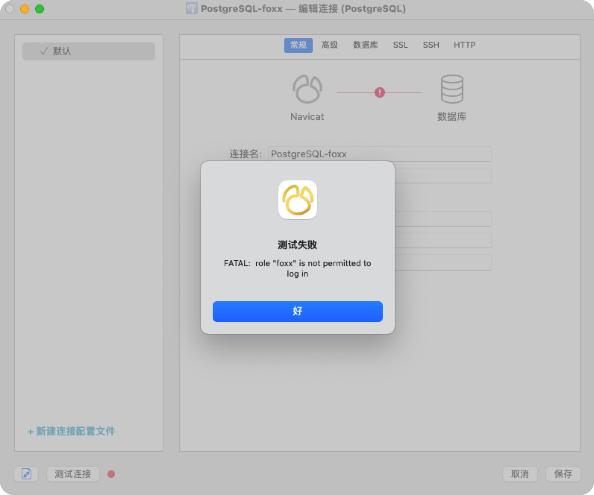


2. **Добавление привилегий для входа в базу данных**

    ```sql
    ALTER ROLE test LOGIN;
    ```

    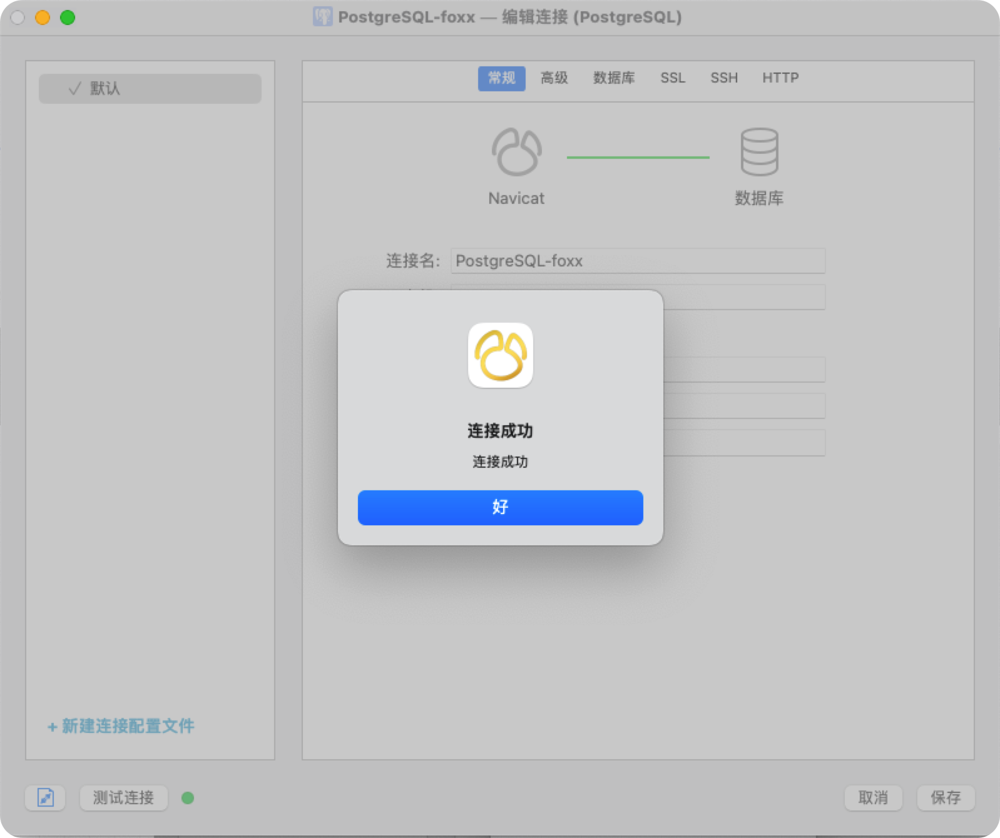

    

3. **Выдать ему доступ к базе данных**

    - Присваиваются права `SELECT`, `INSERT`, `UPDATE`

        ```sql
        GRANT SELECT, INSERT, UPDATE ON tb_portlevels TO test;
        ```

        - 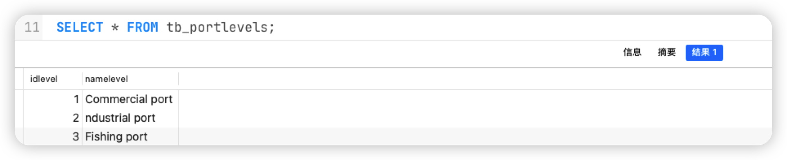

        

        - 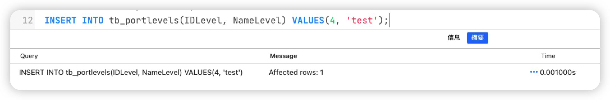

            

        - 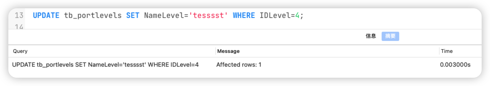

            

        - 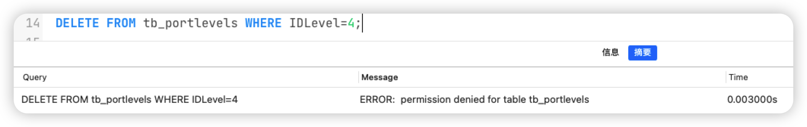

        

        

        

        

        

    - Присваиваются права `SELECT` и `UPDATE `

        ```sql
        GRANT SELECT, UPDATE ON tb_typeseacraft TO test;
        ```

        - 
        - 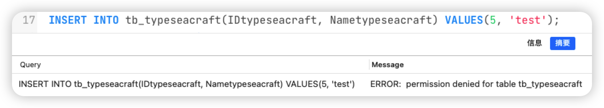
        - 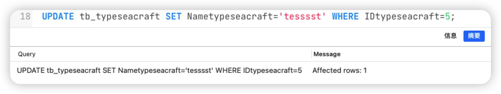
        - 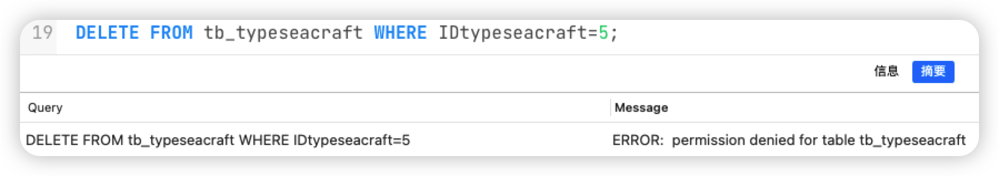

        

    - Присваивается только право `SELECT`

        ```sql
        GRANT SELECT ON tb_ports TO test;
        ```

        

    - Присвоить новому пользователю право доступа (`SELECT`) к одному из представлений

        ```sql
        -- Вывод списка подробной информации о порте
        CREATE OR REPLACE VIEW VW_Ports
        AS
        SELECT IDPort, Country, NamePort, NameLevel, Price, COUNT(IDPort) AS NumArrivals
        	FROM tb_arrivals
        		INNER JOIN tb_ports ON tb_ports.idport=tb_arrivals.portid
        		INNER JOIN tb_portlevels ON tb_ports.levelid=tb_portlevels.idlevel
        	GROUP BY IDPort, Country, NamePort, NameLevel, Price 
        	ORDER BY IDPort ASC;
        
        GRANT SELECT ON VW_Ports TO test;
        ```

        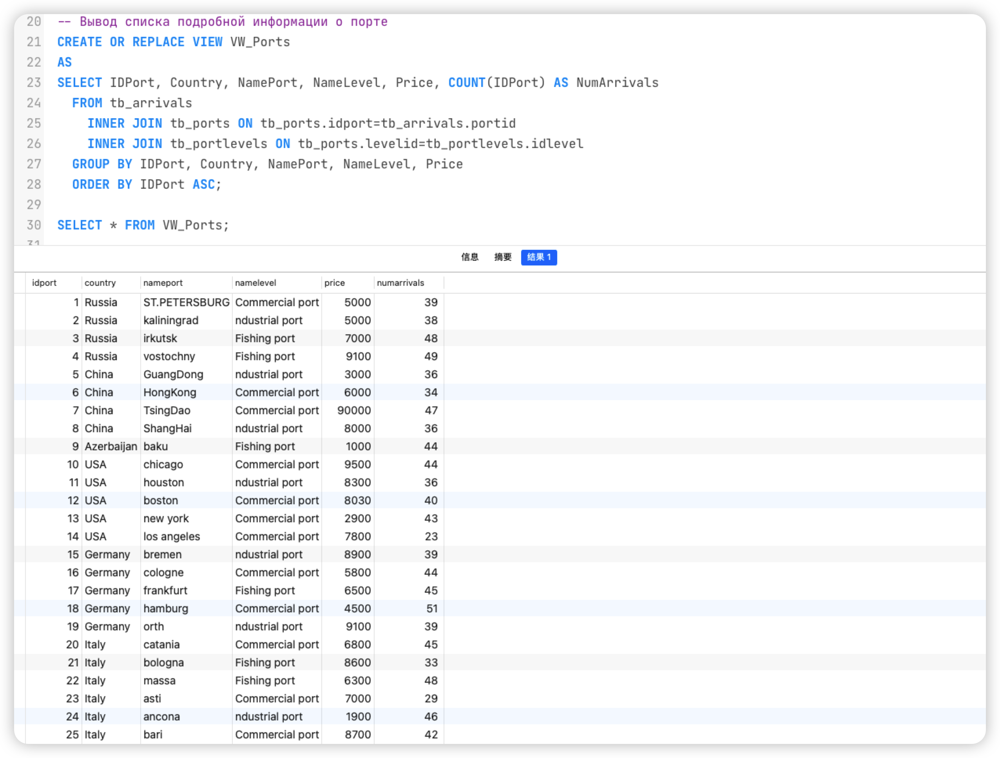

        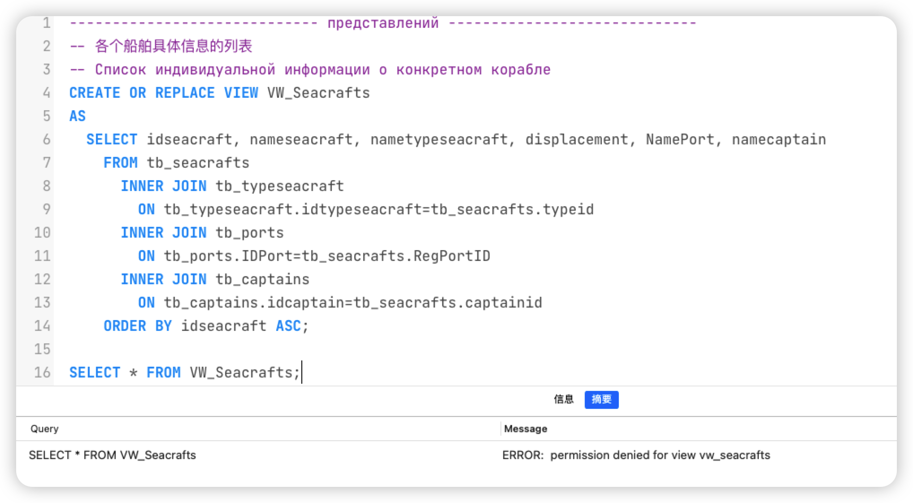
        
    - Создать стандартную роль уровня базы данных, присвоить ей право доступа (`UPDATE` на некоторые столбцы) к одному из представлений, назначить новому пользователю созданную роль.

        ```sql
        CREATE ROLE update_vw_test;
        GRANT UPDATE (NameSeacraft) ON vw_seacrafts TO update_vw_test;
        GRANT update_vw_test TO test;
        ```

        

        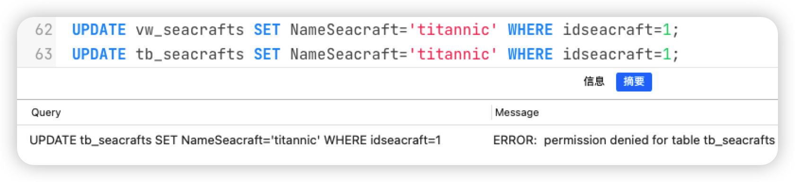

        

4. Удалите все разрешения у пользователя и удалите пользователя

    ```sql
    REVOKE ALL ON DATABASE db_port from test;
    DROP ROLE test;
    ```


---


# lab 3

## lab 3.1

> **第 46 章 PL/Python — Python 过程语言**：
>
> http://www.postgres.cn/docs/14/plpython-funcs.html（向后几页都是）
>
> https://www.cnblogs.com/whitebai/p/12924270.html
>
> http://www.postgres.cn/docs/14/performance-tips.html
>
> https://juejin.cn/post/6960674004969455623


**Постановка задачи**

Седьмое практическое задание связано с проектированием схемы базы данных для аналитики. Будем исходить из того, что приложение, для которого была сделана база данных в задании стала очень популярной и по ней каждый день можно собирать большой объем статистической информации. Результатом данного практического задания являются: **скрипты создания базы данных, хранимая процедура (генератор) для ее заполнения**, **анализ плана выполнения запроса**.


**Требования к БД**

- Как минимум одна таблица должна содержать не меньше 10 млн. записей, которые со временем теряют актуальность.

- Другая таблица, связанная с первой, должна содержать не меньше 1 млн. записей.

- В одной из таблиц с количество записей больше 1 млн. должна быть колонка с текстом, по

    которой будет необходимо настроить полнотекстовый поиск.


### ER диаграммы


### Хранимая процедура (генератор)

```sql
CREATE EXTENSION plpython3u;

------------------------------------------------------------------------------------------------------
-- 向 tb_arrivals 中插入 10000 0000 条随机数据记录
-- Вставьте 100 000 000 случайных записей данных в tb_arrivals
CREATE OR REPLACE FUNCTION fc_InsertArrivals()
	RETURNS TEXT
	AS $$
import random
import datetime


COL_NUM = 100000000


def get_random_text():
    """
    生成一段随机 `text`
    Сгенерируйте случайный `текст`.
    
    :return: text -> string
    """
    text = ''
    num_word = random.randint(1, 20)
    for i in range(num_word):
        len_word = random.randint(1, 10)
        word = ''.join(random.sample('zyxwvutsrqponmlkjihgfedcba', len_word))
        text += (word + ' ')

    return "'" + text + "'"


def get_random_start_end_time():
    """
    获取一个随机开始时间 `start_time_str` 和随机结束时间 `end_time_str` 合并之后的字符串
    Получить строку со случайным начальным временем `start_time_str` и случайным конечным временем `end_time_str`, 
    объединенными вместе
    
    :return: string -> start time and end time
    """
    start = '1900-01-01 00:00:00'
    end = '2022-04-15 00:00:00'
    frmt = '%Y-%m-%d %H:%M:%S'
    num_hour = random.randint(12, 7 * 24)
    stime = datetime.datetime.strptime(start, frmt)
    etime = datetime.datetime.strptime(end, frmt)
    time_datetime = random.random() * (etime - stime) + stime
    start_time_str = time_datetime.strftime(frmt)
    end_time_str = (time_datetime + datetime.timedelta(hours=num_hour)).strftime(frmt)

    return "'" + start_time_str + "', '" + end_time_str + "'"


if __name__ == '__main__':
    try:
        num_port = plpy.execute("SELECT COUNT(*) FROM tb_ports")[0]['count']
        num_seacraft = plpy.execute("SELECT COUNT(*) FROM tb_seacrafts")[0]['count']
        # return str(num_port)
            
        for i in range(COL_NUM):
            portid = random.randint(1, num_port)
            seacraftid = random.randint(1, num_seacraft)
            purpose = get_random_text()
            arrival_leave_time = get_random_start_end_time()
            command = 'INSERT INTO tb_Arrivals (PortID, SeacraftID, Purpose, ArrivalTime, LeaveTime) VALUES ('
            command = command + str(portid) + ', ' + str(seacraftid) + ', ' + purpose + ', ' + arrival_leave_time + ');'
            # return command
            plpy.execute(command)

    except plpy.SPIError as e:
        return "[ERROR] %s" % e.sqlstate

    else:
        return "[Info] Successful insert"
        
$$ LANGUAGE plpython3u;

----------------------------------------------------------

TRUNCATE TABLE tb_arrivals CASCADE;
SELECT fc_InsertArrivals();  -- 运行时间 13040 秒


SELECT COUNT(*) FROM tb_arrivals; -- 运行时间 26.195 秒

```


```python

------------------------------------------------------------------------------------------------------
-- 向 tb_seacraft 中插入 1000000 条随机数据记录
-- Вставьте 1 000 000 случайных записей данных в tb_arrivals
CREATE OR REPLACE FUNCTION fc_InsertSeacrafts()
	RETURNS TEXT
	AS $$
import random
import datetime


COL_NUM = 1000000


def get_random_name():
    """
    生成一段随机 `name`
    Сгенерируйте случайный `name`.
    
    :return: text -> string
    """
    len_word = random.randint(1, 10)
    word = ''.join(random.sample('zyxwvutsrqponmlkjihgfedcba', len_word))

    return word


if __name__ == '__main__':
    try:
        num_captain = plpy.execute("SELECT COUNT(*) FROM tb_captains")[0]['count']
        num_port = plpy.execute("SELECT COUNT(*) FROM tb_ports")[0]['count']
        num_type = plpy.execute("SELECT COUNT(*) FROM tb_portlevels")[0]['count']
            
        for i in range(COL_NUM):
            regportid = random.randint(1, num_port)
            captainid = random.randint(1, num_captain)
            typeid = random.randint(1, num_type)
            displacement = random.randint(10000, 1000000)
            nameseacraft = get_random_word()

            command = 'INSERT INTO tb_seacraft(NameSeacraft, Displacement, RegPortID, TypeID, CaptainID) VALUES ('
            command = command + str(nameseacraft) + ', ' + str(displacement) + ', ' + str(regportid) + ', ' + str(typeid) + str(captainid) + ');'
            # return command
            plpy.execute(command)

    except plpy.SPIError as e:
        return "[ERROR] %s" % e.sqlstate

    else:
        return "[Info] Successful insert"
        
$$ LANGUAGE plpython3u;

----------------------------------------------------------
```


### Анализ плана выполнения запроса

> http://www.postgres.cn/docs/14/performance-tips.html
>
> http://www.postgres.cn/docs/14/using-explain.html#USING-EXPLAIN-BASICS
>
> http://www.postgres.cn/docs/14/runtime-config-query.html#RUNTIME-CONFIG-QUERY-CONSTANTS
>
> https://blog.csdn.net/kmblack1/article/details/80761647


****

**Константы стоимости для планировщика**

| Константы                              | Описание                                                     | Значение по умолчанию (стоимость) |
| -------------------------------------- | ------------------------------------------------------------ | --------------------------------- |
| `cpu_tuple_cost(floating point)`       | Задаёт приблизительную стоимость обработки ==каждой строки== при выполнении запроса | 0.01                              |
| `cpu_index_tuple_cost(floating point)` | Задаёт приблизительную стоимость обработки ==каждой записи индекса== при сканировании индекса | 0.005                             |
| `cpu_operator_cost(floating point)`    | Задаёт приблизительную стоимость обработки ==оператора или функции== при выполнении запроса | 0.0025                            |


- **Запрос к одной таблице, содержащий фильтрацию по нескольким полям.**

      

    1. Получить план выполнения запроса **без использования индексов** (удаление индекса или отключение его использования в плане запроса).

        ```sql
        SELECT * FROM tb_arrivals WHERE ArrivalTime BETWEEN '2000-01-01 00:00:00'::TIMESTAMP AND '2001-01-01 00:00:00' AND PortID > 1000;
        
        DROP INDEX IX_ArriverTime;
        DROP INDEX IX_PortID;
        ```

        

    2. Получить статистику (IO и Time) выполнения запроса **без использования индексов**.

        ```sql
        db_port=# EXPLAIN ANALYZE SELECT * FROM tb_arrivals WHERE ArrivalTime BETWEEN '2000-01-01 00:00:00'::TIMESTAMP AND '2001-01-01 00:00:00' AND PortID > 1000;
                                                                                            QUERY PLAN
        -----------------------------------------------------------------------------------------------------------------------------------------------------------------------------------
         Gather  (cost=1000.00..2348941.17 rows=326215 width=97) (actual time=1.252..27359.813 rows=332165 loops=1)
           Workers Planned: 2
           Workers Launched: 2
           ->  Parallel Seq Scan on tb_arrivals  (cost=0.00..2315319.67 rows=135923 width=97) (actual time=0.427..27321.096 rows=110722 loops=3)
                 Filter: ((arrivaltime >= '2000-01-01 00:00:00'::timestamp without time zone) AND (arrivaltime <= '2001-01-01 00:00:00'::timestamp without time zone) AND (portid > 1000))
                 Rows Removed by Filter: 33222612
         Planning Time: 3.485 ms
         Execution Time: 27368.246 ms
        (8 rows)
        ```

         

    3. Создать нужные индексы, позволяющие ускорить запрос.

        ```sql
        CREATE INDEX IX_ArriverTime ON tb_arrivals(ArrivalTime);
        CREATE INDEX IX_PortID ON tb_arrivals(PortID);
        ```

        

    4. Получить план выполнения запроса с использованием индексов и сравнить с первоначальным планом.

        ```sql
        db_port=# EXPLAIN ANALYZE SELECT * FROM tb_arrivals WHERE ArrivalTime BETWEEN '2000-01-01 00:00:00'::TIMESTAMP AND '2001-01-01 00:00:00' AND PortID > 1000;
                                                                                               QUERY PLAN
        -----------------------------------------------------------------------------------------------------------------------------------------------------------------------------------------
         Gather  (cost=459271.16..1940524.67 rows=326215 width=97) (actual time=557.093..23659.834 rows=332165 loops=1)
           Workers Planned: 2
           Workers Launched: 2
           ->  Parallel Bitmap Heap Scan on tb_arrivals  (cost=458271.16..1906903.17 rows=135923 width=97) (actual time=537.187..23605.583 rows=110722 loops=3)
                 Recheck Cond: ((arrivaltime >= '2000-01-01 00:00:00'::timestamp without time zone) AND (arrivaltime <= '2001-01-01 00:00:00'::timestamp without time zone) AND (portid > 1000))
                 Rows Removed by Index Recheck: 12492294
                 Heap Blocks: exact=14079 lossy=199261
                 ->  BitmapAnd  (cost=458271.16..458271.16 rows=326215 width=0) (actual time=551.432..551.432 rows=0 loops=1)
                       ->  Bitmap Index Scan on ix_arrivertime  (cost=0.00..16861.76 rows=804919 width=0) (actual time=96.028..96.028 rows=818208 loops=1)
                             Index Cond: ((arrivaltime >= '2000-01-01 00:00:00'::timestamp without time zone) AND (arrivaltime <= '2001-01-01 00:00:00'::timestamp without time zone))
                       ->  Bitmap Index Scan on ix_portid  (cost=0.00..441246.04 rows=40527663 width=0) (actual time=448.839..448.839 rows=40516196 loops=1)
                             Index Cond: (portid > 1000)
         Planning Time: 0.142 ms
         Execution Time: 23671.716 ms
        (14 rows)
        ```

        

    5. Получить статистику выполнения запроса с использованием индексов и сравнить с первоначальной статистикой.

        |                                | **cost**              | **actual time**    | **Planning Time** | **Execution Time** |
        | ------------------------------ | --------------------- | ------------------ | ----------------- | ------------------ |
        | **без использования индексов** | 1000.00..2348941.17   | 1.252..27359.813   | 3.485 ms          | 27368.246 ms       |
        | **с использованием индексов**  | 459271.16..1940524.67 | 557.093..23659.834 | 0.142 ms          | 23671.716 ms       |
        | **Разница**                    | -866687.6599          | -4255.82           | -3.343 ms         | -3696.5299 ms      |

        

    6. Оценить эффективность выполнения оптимизированного запроса.

        После использования индекса ==приблизительная стоимость запуска(cost)== значительно увеличилась, однако ==приблизительная общая стоимость (cost)== и ==фактическое время (Execution Time)== значительно уменьшились. ==Фактическое время (Execution Time)== сократилось на 13,506%


---


- **Запрос к нескольким связанным таблицам, содержащий фильтрацию по нескольким полям**

      

    1. Получить план выполнения запроса **без использования индексов** (удаление индекса или отключение его использования в плане запроса).

        ```sql
        SELECT * FROM tb_arrivals INNER JOIN tb_seacrafts ON tb_arrivals.seacraftID=tb_seacrafts.IDSeacraft INNER JOIN tb_ports ON tb_arrivals.portID=tb_ports.IDPort WHERE NameSeacraft='cmari' AND NamePort='St Petersburg';
        
        DROP INDEX IX_NameSeacraft;
        DROP INDEX IX_NamePort;
        ```

        

    2. Получить статистику (IO и Time) выполнения запроса **без использования индексов**.

        ```sql
        db_port=# EXPLAIN ANALYZE SELECT * FROM tb_arrivals INNER JOIN tb_seacrafts ON tb_arrivals.seacraftID=tb_seacrafts.IDSeacraft INNER JOIN tb_ports ON tb_arrivals.portID=tb_ports.IDPort WHERE NameSeacraft='cmari' AND NamePort='St Petersburg';
                                                                               QUERY PLAN
        ---------------------------------------------------------------------------------------------------------------------------------------------------------
         Nested Loop  (cost=1008.31..2140204.13 rows=1 width=161) (actual time=698.274..29483.075 rows=6 loops=1)
           Join Filter: (tb_arrivals.seacraftid = tb_seacrafts.idseacraft)
           Rows Removed by Join Filter: 59539
           ->  Seq Scan on tb_seacrafts  (cost=0.00..20033.00 rows=1 width=29) (actual time=0.177..55.336 rows=1 loops=1)
                 Filter: ((nameseacraft)::text = 'cmari'::text)
                 Rows Removed by Filter: 999999
           ->  Gather  (cost=1008.31..2119427.53 rows=59488 width=132) (actual time=4.875..29424.577 rows=59545 loops=1)
                 Workers Planned: 2
                 Workers Launched: 2
                 ->  Hash Join  (cost=8.31..2112478.73 rows=24787 width=132) (actual time=6.244..29400.751 rows=19848 loops=3)
                       Hash Cond: (tb_arrivals.portid = tb_ports.idport)
                       ->  Parallel Seq Scan on tb_arrivals  (cost=0.00..2002819.67 rows=41666667 width=97) (actual time=0.345..27659.885 rows=33333333 loops=3)
                       ->  Hash  (cost=8.29..8.29 rows=1 width=35) (actual time=0.165..0.165 rows=1 loops=3)
                             Buckets: 1024  Batches: 1  Memory Usage: 9kB
                             ->  Index Scan using uq_ports_nameport on tb_ports  (cost=0.28..8.29 rows=1 width=35) (actual time=0.118..0.119 rows=1 loops=3)
                                   Index Cond: ((nameport)::text = 'St Petersburg'::text)
         Planning Time: 7.004 ms
         Execution Time: 29483.181 ms
        (18 rows)
        ```

         

    3. Создать нужные индексы, позволяющие ускорить запрос.

        ```sql
        CREATE INDEX IX_NameSeacraft ON tb_seacrafts(NameSeacraft);
        CREATE INDEX IX_NamePort ON tb_ports(NamePort);
        ```

        

    4. Получить план выполнения запроса с использованием индексов и сравнить с первоначальным планом.

        ```sql
        db_port=# EXPLAIN ANALYZE SELECT * FROM tb_arrivals INNER JOIN tb_seacrafts ON tb_arrivals.seacraftID=tb_seacrafts.IDSeacraft INNER JOIN tb_ports ON tb_arrivals.portID=tb_ports.IDPort WHERE NameSeacraft='cmari' AND NamePort='St Petersburg';
                                                                               QUERY PLAN
        ---------------------------------------------------------------------------------------------------------------------------------------------------------
         Gather  (cost=1016.76..2113212.11 rows=1 width=161) (actual time=9437.606..29046.762 rows=6 loops=1)
           Workers Planned: 2
           Workers Launched: 2
           ->  Hash Join  (cost=16.76..2112212.01 rows=1 width=161) (actual time=6601.278..29032.137 rows=2 loops=3)
                 Hash Cond: (tb_arrivals.portid = tb_ports.idport)
                 ->  Hash Join  (cost=8.46..2112203.59 rows=42 width=126) (actual time=6.039..29030.866 rows=3333 loops=3)
                       Hash Cond: (tb_arrivals.seacraftid = tb_seacrafts.idseacraft)
                       ->  Parallel Seq Scan on tb_arrivals  (cost=0.00..2002819.67 rows=41666667 width=97) (actual time=0.461..27245.982 rows=33333333 loops=3)
                       ->  Hash  (cost=8.44..8.44 rows=1 width=29) (actual time=0.353..0.356 rows=1 loops=3)
                             Buckets: 1024  Batches: 1  Memory Usage: 9kB
                             ->  Index Scan using ix_nameseacraft on tb_seacrafts  (cost=0.42..8.44 rows=1 width=29) (actual time=0.349..0.350 rows=1 loops=3)
                                   Index Cond: ((nameseacraft)::text = 'cmari'::text)
                 ->  Hash  (cost=8.29..8.29 rows=1 width=35) (actual time=0.222..0.223 rows=1 loops=3)
                       Buckets: 1024  Batches: 1  Memory Usage: 9kB
                       ->  Index Scan using ix_nameport on tb_ports  (cost=0.28..8.29 rows=1 width=35) (actual time=0.215..0.215 rows=1 loops=3)
                             Index Cond: ((nameport)::text = 'St Petersburg'::text)
         Planning Time: 3.746 ms
         Execution Time: 29047.011 ms
        (18 rows)
        ```

        

        ---

        

        Создать нужные индексы, позволяющие ускорить запрос.

        ```sql
        CREATE EXTENSION pg_trgm;
        CREATE INDEX IX_NameSeacraft ON tb_seacrafts USING GIN(NameSeacraft gin_trgm_ops);
        CREATE INDEX IX_NamePort ON tb_ports USING GIN(NamePort gin_trgm_ops);
        ```

        

        Получить план выполнения запроса с использованием индексов и сравнить с первоначальным планом.

        ```sql
        db_port=# EXPLAIN ANALYZE SELECT * FROM tb_arrivals INNER JOIN tb_seacrafts ON tb_arrivals.seacraftID=tb_seacrafts.IDSeacraft INNER JOIN tb_ports ON tb_arrivals.portID=tb_ports.IDPort WHERE NameSeacraft='cmari' AND NamePort='St Petersburg';
                                                                                         QUERY PLAN
        -----------------------------------------------------------------------------------------------------------------------------------------------------------------------------
         Gather  (cost=1088.34..2321635.00 rows=1 width=161) (actual time=11391.572..35022.070 rows=6 loops=1)
           Workers Planned: 2
           Workers Launched: 2
           ->  Hash Join  (cost=88.34..2320634.90 rows=1 width=161) (actual time=12996.658..35002.537 rows=2 loops=3)
                 Hash Cond: (tb_arrivals.portid = tb_ports.idport)
                 ->  Hash Join  (cost=80.03..2320626.48 rows=42 width=126) (actual time=10.302..34999.074 rows=3333 loops=3)
                       Hash Cond: (tb_arrivals.seacraftid = tb_seacrafts.idseacraft)
                       ->  Parallel Append  (cost=0.00..2211170.01 rows=41667034 width=97) (actual time=1.530..32921.062 rows=33333333 loops=3)
                             ->  Parallel Seq Scan on tb_arrivals tb_arrivals_1  (cost=0.00..2002819.67 rows=41666667 width=97) (actual time=1.517..31469.568 rows=33333333 loops=3)
                             ->  Parallel Seq Scan on tb_child_arrivals tb_arrivals_2  (cost=0.00..15.18 rows=518 width=60) (actual time=0.001..0.001 rows=0 loops=1)
                       ->  Hash  (cost=80.02..80.02 rows=1 width=29) (actual time=1.348..1.349 rows=1 loops=3)
                             Buckets: 1024  Batches: 1  Memory Usage: 9kB
                             ->  Bitmap Heap Scan on tb_seacrafts  (cost=76.01..80.02 rows=1 width=29) (actual time=1.346..1.347 rows=1 loops=3)
                                   Recheck Cond: ((nameseacraft)::text = 'cmari'::text)
                                   Heap Blocks: exact=1
                                   ->  Bitmap Index Scan on ix_nameseacraft  (cost=0.00..76.01 rows=1 width=0) (actual time=1.339..1.339 rows=1 loops=3)
                                         Index Cond: ((nameseacraft)::text = 'cmari'::text)
                 ->  Hash  (cost=8.29..8.29 rows=1 width=35) (actual time=0.151..0.152 rows=1 loops=3)
                       Buckets: 1024  Batches: 1  Memory Usage: 9kB
                       ->  Index Scan using uq_ports_nameport on tb_ports  (cost=0.28..8.29 rows=1 width=35) (actual time=0.083..0.084 rows=1 loops=3)
                             Index Cond: ((nameport)::text = 'St Petersburg'::text)
         Planning Time: 1.025 ms
         Execution Time: 35022.279 ms
        (23 rows)
        
        ```

        

        Получить статистику выполнения запроса с использованием индексов и сравнить с первоначальной статистикой.

        |                                     | **cost**            | **actual time**      | **Planning Time** | **Execution Time** |
        | ----------------------------------- | ------------------- | -------------------- | ----------------- | ------------------ |
        | **без использования индексов**      | 1008.31..2140204.13 | 698.274..29483.075   | 7.004 ms          | 29483.181 ms       |
        | **==с использованием индексов==**   | 1016.76..2113212.11 | 9437.606..29046.762  | 3.746 ms          | 29047.011 ms       |
        | **с использованием индексов (GIN)** | 1088.34..2321635.00 | 11180.878..35380.249 | 1.025             | 35022.279          |
        | **==Разница==**                     | -27000.469          | -9175.645            | -3.2579 ms        | -436.17 ms         |

        

    5. Оценить эффективность выполнения оптимизированного запроса.

        При добавлении индексов к двум полям `varchar` подтаблицы значительного улучшения **в скорости запросов не наблюдается**

        

---


- **Также необходимо продемонстрировать полезность индексов для организации полнотекстового поиска.**

      

    1. Получить план выполнения запроса **без использования индексов** (удаление индекса или отключение его использования в плане запроса).

        ```sql
        SELECT * FROM tb_arrivals WHERE Purpose LIKE '%at%';
        
        DROP INDEX IX_Purpose;
        ```

        

    2. Получить статистику (IO и Time) выполнения запроса **без использования индексов**.

        ```sql
        db_port=# EXPLAIN ANALYZE SELECT * FROM tb_arrivals WHERE Purpose LIKE '% at %';
                                                                      QUERY PLAN
        --------------------------------------------------------------------------------------------------------------------------------------
         Gather  (cost=1000.00..2108981.63 rows=9953 width=97) (actual time=2.708..35207.244 rows=145614 loops=1)
           Workers Planned: 2
           Workers Launched: 2
           ->  Parallel Seq Scan on tb_arrivals  (cost=0.00..2106986.33 rows=4147 width=97) (actual time=2.798..35181.150 rows=48538 loops=3)
                 Filter: (purpose ~~ '% at %'::text)
                 Rows Removed by Filter: 33284795
         Planning Time: 0.337 ms
         Execution Time: 35212.464 ms
        (8 rows)
        ```

         

    3. Создать нужные индексы, позволяющие ускорить запрос.

        ```sql
        CREATE INDEX IX_Purpose ON tb_arrivals(Purpose);
        ```

        

    4. Получить план выполнения запроса с использованием индексов и сравнить с первоначальным планом.

        ```sql
        db_port=# EXPLAIN ANALYZE SELECT * FROM tb_arrivals WHERE Purpose LIKE '% at %';
                                                                      QUERY PLAN
        --------------------------------------------------------------------------------------------------------------------------------------
         Gather  (cost=1000.00..2108981.63 rows=9953 width=97) (actual time=3.036..36736.283 rows=145614 loops=1)
           Workers Planned: 2
           Workers Launched: 2
           ->  Parallel Seq Scan on tb_arrivals  (cost=0.00..2106986.33 rows=4147 width=97) (actual time=0.982..36713.617 rows=48538 loops=3)
                 Filter: (purpose ~~ '% at %'::text)
                 Rows Removed by Filter: 33284795
         Planning Time: 5.599 ms
         Execution Time: 36741.591 ms
        (8 rows)
        ```

        ---

        

        ```sql
        CREATE INDEX IX_Purpose ON tb_arrivals USING GIN(Purpose gin_trgm_ops);
        ```

        

        ```sql
        db_port=# EXPLAIN ANALYZE SELECT * FROM tb_arrivals WHERE Purpose LIKE '% at %';
                                                                              QUERY PLAN
        -------------------------------------------------------------------------------------------------------------------------------------------------------
         Append  (cost=1277.14..38806.13 rows=9960 width=97) (actual time=711.662..21840.648 rows=145614 loops=1)
           ->  Bitmap Heap Scan on tb_arrivals tb_arrivals_1  (cost=1277.14..38735.33 rows=9953 width=97) (actual time=711.661..21829.443 rows=145614 loops=1)
                 Recheck Cond: (purpose ~~ '% at %'::text)
                 Rows Removed by Index Recheck: 8520120
                 Heap Blocks: exact=33655 lossy=137020
                 ->  Bitmap Index Scan on ix_purpose  (cost=0.00..1274.65 rows=9953 width=0) (actual time=706.322..706.322 rows=180530 loops=1)
                       Index Cond: (purpose ~~ '% at %'::text)
           ->  Seq Scan on tb_child_arrivals tb_arrivals_2  (cost=0.00..21.00 rows=7 width=60) (actual time=0.062..0.062 rows=0 loops=1)
                 Filter: (purpose ~~ '% at %'::text)
         Planning Time: 27.951 ms
         Execution Time: 21846.879 ms
        (11 rows)
        ```

        

        

    5. Получить статистику выполнения запроса с использованием индексов и сравнить с первоначальной статистикой.

        |                                | **cost**            | **actual time**  | **Planning Time** | **Execution Time** |
        | ------------------------------ | ------------------- | ---------------- | ----------------- | ------------------ |
        | **без использования индексов** | 1000.00..2108981.63 | 2.708..35207.244 | 0.337 ms          | 35212.464 ms       |
        | **с использованием индексов**  | 1000.00..2108981.63 | 3.032..36313.774 | 4.645 ms          | 36319.114 ms       |
        | с использованием индексов(GIN) |                     |                  | 27.951 ms         | 21846.879 ms       |
        | **Разница**                    | 0                   | 1106.2059        | 4.308 ms          | 1106.65 ms         |

        

    6. Оценить эффективность выполнения оптимизированного запроса.

        Несмотря на то, что для текстового поля создан индекс, база данных **не использует его для запросов**

        


- **Также необходимо продемонстрировать полезность индексов для организации полнотекстового поиска.**

      

    1. Получить план выполнения запроса **без использования индексов** (удаление индекса или отключение его использования в плане запроса).

        ```sql
        SELECT * FROM tb_arrivals WHERE char_length(Purpose) > 20;
        
        DROP INDEX IX_Purpose;
        ```

        

    2. Получить статистику (IO и Time) выполнения запроса **без использования индексов**.

        ```sql
        db_port=*# EXPLAIN ANALYZE SELECT * FROM tb_arrivals WHERE char_length(Purpose) > 20;
                                                                            QUERY PLAN
        --------------------------------------------------------------------------------------------------------------------------------------------------
         Append  (cost=0.00..3252844.33 rows=33333626 width=97) (actual time=0.522..22543.607 rows=86235207 loops=1)
           ->  Seq Scan on tb_arrivals tb_arrivals_1  (cost=0.00..3086153.00 rows=33333333 width=97) (actual time=0.521..19450.968 rows=86235207 loops=1)
                 Filter: (char_length(purpose) > 20)
                 Rows Removed by Filter: 13764793
           ->  Seq Scan on tb_child_arrivals tb_arrivals_2  (cost=0.00..23.20 rows=293 width=60) (actual time=0.026..0.026 rows=0 loops=1)
                 Filter: (char_length(purpose) > 20)
         Planning Time: 2.516 ms
         Execution Time: 24233.586 ms
        (8 rows)
        ```

         

    3. Получить план выполнения запроса с использованием индексов и сравнить с первоначальным планом.

        ```sql
        CREATE INDEX IX_Purpose ON tb_arrivals USING GIN(Purpose gin_trgm_ops);
        ```

        

        ```sql
        db_port=# EXPLAIN ANALYZE SELECT * FROM tb_arrivals WHERE char_length(Purpose) > 20;
                                                                            QUERY PLAN
        --------------------------------------------------------------------------------------------------------------------------------------------------
         Append  (cost=0.00..3252844.33 rows=33333626 width=97) (actual time=0.514..23314.352 rows=86235207 loops=1)
           ->  Seq Scan on tb_arrivals tb_arrivals_1  (cost=0.00..3086153.00 rows=33333333 width=97) (actual time=0.513..20128.237 rows=86235207 loops=1)
                 Filter: (char_length(purpose) > 20)
                 Rows Removed by Filter: 13764793
           ->  Seq Scan on tb_child_arrivals tb_arrivals_2  (cost=0.00..23.20 rows=293 width=60) (actual time=0.042..0.042 rows=0 loops=1)
                 Filter: (char_length(purpose) > 20)
         Planning Time: 0.602 ms
         Execution Time: 25058.894 ms
        (8 rows)
        ```

        

        

    4. Получить статистику выполнения запроса с использованием индексов и сравнить с первоначальной статистикой.

        |                                | **cost**         | **actual time**  | **Planning Time** | **Execution Time** |
        | ------------------------------ | ---------------- | ---------------- | ----------------- | ------------------ |
        | **без использования индексов** | 0.00..3252844.33 | 0.522..22543.607 | 2.516 ms          | 24233.586 ms       |
        |                                |                  |                  |                   |                    |
        | с использованием индексов(GIN) | 0.00..3252844.33 | 0.514..23314.352 | 0.602 ms          | 25058.894 ms       |
        |                                |                  |                  |                   |                    |

         

---


- **Также необходимо продемонстрировать полезность индексов для организации полнотекстового поиска.**

      

    1. Получить план выполнения запроса **без использования индексов** (удаление индекса или отключение его использования в плане запроса).

        ```sql
        SELECT * FROM tb_arrivals WHERE Purpose='sfrht';
        
        DROP INDEX IX_Purpose;
        ```

        

    2. Получить статистику (IO и Time) выполнения запроса **без использования индексов**.

        ```sql
        db_port=*# EXPLAIN ANALYZE SELECT * FROM tb_arrivals WHERE Purpose='sfrht';
                                                                              QUERY PLAN
        -------------------------------------------------------------------------------------------------------------------------------------------------------
         Gather  (cost=1000.00..2108005.45 rows=26 width=91) (actual time=30218.895..30220.101 rows=0 loops=1)
           Workers Planned: 2
           Workers Launched: 2
           ->  Parallel Append  (cost=0.00..2107002.85 rows=10 width=91) (actual time=30192.606..30192.609 rows=0 loops=3)
                 ->  Parallel Seq Scan on tb_arrivals tb_arrivals_1  (cost=0.00..2106986.33 rows=9 width=97) (actual time=30192.604..30192.604 rows=0 loops=3)
                       Filter: (purpose = 'sfrht'::text)
                       Rows Removed by Filter: 33333333
                 ->  Parallel Seq Scan on tb_child_arrivals tb_arrivals_2  (cost=0.00..16.47 rows=2 width=60) (actual time=0.002..0.002 rows=0 loops=1)
                       Filter: (purpose = 'sfrht'::text)
         Planning Time: 1.095 ms
         Execution Time: 30220.227 ms
        (11 rows)
        ```

         

    3. Получить план выполнения запроса с использованием индексов и сравнить с первоначальным планом.

        ```sql
        CREATE INDEX IX_Purpose ON tb_arrivals USING GIN(Purpose gin_trgm_ops);
        ```

        

        ```sql
        db_port=# EXPLAIN ANALYZE SELECT * FROM tb_arrivals WHERE Purpose='sfrht';
                                                                         QUERY PLAN
        ---------------------------------------------------------------------------------------------------------------------------------------------
         Append  (cost=2396.17..2505.33 rows=26 width=91) (actual time=657.419..657.419 rows=0 loops=1)
           ->  Bitmap Heap Scan on tb_arrivals tb_arrivals_1  (cost=2396.17..2484.20 rows=22 width=97) (actual time=657.409..657.409 rows=0 loops=1)
                 Recheck Cond: (purpose = 'sfrht'::text)
                 Rows Removed by Index Recheck: 23
                 Heap Blocks: exact=23
                 ->  Bitmap Index Scan on ix_purpose  (cost=0.00..2396.17 rows=22 width=0) (actual time=642.080..642.080 rows=23 loops=1)
                       Index Cond: (purpose = 'sfrht'::text)
           ->  Seq Scan on tb_child_arrivals tb_arrivals_2  (cost=0.00..21.00 rows=4 width=60) (actual time=0.008..0.008 rows=0 loops=1)
                 Filter: (purpose = 'sfrht'::text)
         Planning Time: 14.311 ms
         Execution Time: 657.908 ms
        (11 rows)
        ```

        

        

    4. Получить статистику выполнения запроса с использованием индексов и сравнить с первоначальной статистикой.

        |                                | **cost**         | **actual time**  | **Planning Time** | **Execution Time** |
        | ------------------------------ | ---------------- | ---------------- | ----------------- | ------------------ |
        | **без использования индексов** | 0.00..3252844.33 | 0.522..22543.607 | 2.516 ms          | 24233.586 ms       |
        |                                |                  |                  |                   |                    |
        | с использованием индексов(GIN) | 0.00..3252844.33 | 0.514..23314.352 | 0.602 ms          | 25058.894 ms       |
        |                                |                  |                  |                   |                    |


## lab 3.2

> http://www.postgres.cn/docs/14/datatype-json.html
>
> https://juejin.cn/post/6844903857009623048
>
> https://segmentfault.com/a/1190000019344353
>
> https://programmers.buzz/posts/start-exploring-database-indices/
>
> https://habr.com/ru/company/oleg-bunin/blog/646987/


