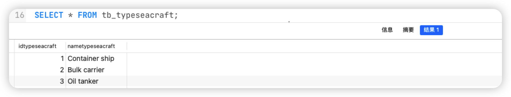

# 【lab 1.4】 Контроль целостности данных

## Результат

| **Контроль целостности данных** | грязные чтении | неповторяющиеся чтении | Потерянные изменении | фантом | **Аномалия сериализации** |
| ------------------------------- | -------------- | ---------------------- | -------------------- | ------ | ------------------------- |
| `serializable`                  | -              | -                      | -                    | -      | -                         |
| `repeatable read`               | -              | -                      | -                    | -      | +                         |
| `read commited`                 | -              | +                      | -                    | +      | +                         |
| `read uncommited`               | -              | +                      | -                    | +      | +                         |


## Аномалия сериализации

We can conclude that Postgres uses a `dependencies detection` mechanism to detect potential `read phenomena` and stop them by throwing out an error.

> Dan R. K. Ports and Kevin Grittner. 2012. Serializable Snapshot Isolation in PostgreSQL. Proceedings of the VLDB Endowment vol. 5 (12) , August 2012 
> ————————————————
>
> https://arxiv.org/pdf/1208.4179.pdf
>
> https://postgrespro.ru/docs/postgrespro/14/transaction-iso
>
> https://dev.to/techschoolguru/understand-isolation-levels-read-phenomena-in-mysql-postgres-c2e#isolation-levels-in-postgres
>
> https://blog.csdn.net/gp_community/article/details/109772336


---


# READ UNCOMMITTED

- **[-] грязные чтении & [+] неповторяющиеся чтении**

    | **Параллельный сеанс** 1                                     | **Параллельный сеанс** 2                                     |
    | ------------------------------------------------------------ | ------------------------------------------------------------ |
    | `BEGIN TRANSACTION ISOLATION LEVEL READ UNCOMMITTED;`<br />`SHOW TRANSACTION_ISOLATION;`<br /><br />>>><br />*read uncommitted* |                                                              |
    |                                                              | `BEGIN TRANSACTION ISOLATION LEVEL READ UNCOMMITTED;`<br />`SHOW TRANSACTION_ISOLATION;`<br /><br />>>><br />*read uncommitted* |
    | `SELECT price FROM tb_ports WHERE nameport='baku';`<br /><br />>>><br />1000 |                                                              |
    |                                                              | `UPDATE tb_ports SET price=2000 WHERE nameport='baku';`      |
    |                                                              | `SELECT price FROM tb_ports WHERE nameport='baku';`<br /><br />>>><br />2000 |
    | `SELECT price FROM tb_ports WHERE nameport='baku';`<br /><br />>>>==[-] грязные чтении==<br />1000 |                                                              |
    |                                                              | `COMMIT;`                                                    |
    | `SELECT price FROM tb_ports WHERE nameport='baku';`<br /><br />>>>==[-] неповторяющиеся чтении==<br />2000 |                                                              |
    | `COMMIT;`                                                    |                                                              |


- **[-] Потерянные изменении**

  - **[-] Потерянные изменении | Lost update**
  
  - | **Параллельный сеанс** 1                                     | **Параллельный сеанс** 2                                     |
      | ------------------------------------------------------------ | ------------------------------------------------------------ |
      | `BEGIN TRANSACTION ISOLATION LEVEL READ UNCOMMITTED;`<br />`SHOW TRANSACTION_ISOLATION;`<br /><br />>>><br />*read uncommitted* |                                                              |
      |                                                              | `BEGIN TRANSACTION ISOLATION LEVEL READ UNCOMMITTED;`<br />`SHOW TRANSACTION_ISOLATION;`<br /><br />>>><br />*read uncommitted* |
      | `SELECT price FROM tb_ports WHERE nameport='baku';`<br /><br />>>><br />1000 |                                                              |
      |                                                              | `UPDATE tb_ports SET price=price-100 WHERE nameport='baku';` |
      |                                                              | `SELECT price FROM tb_ports WHERE nameport='baku';`<br /><br />>>><br />900 |
      |                                                              | `COMMIT;`                                                    |
      | `UPDATE tb_ports SET price=price+100 WHERE nameport='baku';` |                                                              |
      | `ROLLBACK;`                                                  |                                                              |
      |                                                              | `SELECT price FROM tb_ports WHERE nameport='baku';`<br /><br />>>>==[-] Потерянные изменении \| Second lost update==<br />900 |
  
      **[-] Потерянные изменении | Second lost update**
  
      | **Параллельный сеанс** 1                                     | **Параллельный сеанс** 2                                     |
      | ------------------------------------------------------------ | ------------------------------------------------------------ |
      | `BEGIN TRANSACTION ISOLATION LEVEL READ UNCOMMITTED;`<br />`SHOW TRANSACTION_ISOLATION;`<br /><br />>>><br />*read uncommitted* |                                                              |
      |                                                              | `BEGIN TRANSACTION ISOLATION LEVEL READ UNCOMMITTED;`<br />`SHOW TRANSACTION_ISOLATION;`<br /><br />>>><br />*read uncommitted* |
      | `SELECT price FROM tb_ports WHERE nameport='baku';`<br /><br />>>><br />1000 |                                                              |
      |                                                              | `UPDATE tb_ports SET price=price-100 WHERE nameport='baku';` |
      |                                                              | `SELECT price FROM tb_ports WHERE nameport='baku';`<br /><br />>>><br />900 |
      | `UPDATE tb_ports SET price=price+100 WHERE nameport='baku';`<br /><br />>>> <br />БЛОКИРУЕТСЯ |                                                              |
      |                                                              | `COMMIT;`                                                    |
      | `COMMIT;`                                                    |                                                              |
      |                                                              | `SELECT price FROM tb_ports WHERE nameport='baku';`<br /><br />>>>==[-] Потерянные изменении \| Second lost update==<br />1000 |
  


- **[+] Фантом**

    | **Параллельный сеанс** 1                                     | **Параллельный сеанс** 2                                     |
    | ------------------------------------------------------------ | ------------------------------------------------------------ |
    | `BEGIN TRANSACTION ISOLATION LEVEL READ UNCOMMITTED;`<br />`SHOW TRANSACTION_ISOLATION;`<br /><br />>>><br />*read uncommitted* |                                                              |
    |                                                              | `BEGIN TRANSACTION ISOLATION LEVEL READ UNCOMMITTED;`<br />`SHOW TRANSACTION_ISOLATION;`<br /><br />>>><br />*read uncommitted* |
    | `SELECT price FROM tb_ports WHERE nameport='baku2';`<br /><br />>>><br />(0 rows) |                                                              |
    |                                                              | `INSERT INTO tb_Ports(Country, NamePort, Price, LevelID)`<br />` VALUES('Azerbaijan', 'baku2', 2222, 3);` |
    | `SELECT price FROM tb_ports WHERE nameport='baku2';`<br /><br />>>><br />(0 rows) |                                                              |
    |                                                              | `COMMIT;`                                                    |
    | `SELECT price FROM tb_ports WHERE nameport='baku2';`<br /><br />>>>==[+] Фантом==<br />2222 |                                                              |
    | `DELETE FROM tb_ports WHERE nameport='baku2';`               |                                                              |
    | `COMMIT;`                                                    |                                                              |


- **[+] Аномалия сериализации**

    | **Параллельный сеанс** 1                                     | **Параллельный сеанс** 2                                     |
    | ------------------------------------------------------------ | ------------------------------------------------------------ |
    | `BEGIN TRANSACTION ISOLATION LEVEL READ UNCOMMITTED;`<br />`SHOW TRANSACTION_ISOLATION;`<br /><br />>>><br />*read uncommitted* |                                                              |
    |                                                              | `BEGIN TRANSACTION ISOLATION LEVEL READ UNCOMMITTED;`<br />`SHOW TRANSACTION_ISOLATION;`<br /><br />>>><br />*read uncommitted* |
    | `UPDATE tb_ports SET price=2000 WHERE nameport='baku';`      |                                                              |
    |                                                              | `UPDATE tb_ports SET price=9000 WHERE nameport='ShangHai';`  |
    | `COMMIT;`                                                    |                                                              |
    |                                                              | `COMMIT;`<br />>>>==[+] Аномалия сериализации==              |

    


---


# READ COMMITTED

- **[-] Грязные чтении & [+] Неповторяющиеся чтении**

    | **Параллельный сеанс** 1                                     | **Параллельный сеанс** 2                                     |
    | ------------------------------------------------------------ | ------------------------------------------------------------ |
    | `BEGIN TRANSACTION ISOLATION LEVEL READ COMMITTED;`<br />`SHOW TRANSACTION_ISOLATION;`<br /><br />>>><br />*read committed* |                                                              |
    |                                                              | `BEGIN TRANSACTION ISOLATION LEVEL READ COMMITTED;`<br />`SHOW TRANSACTION_ISOLATION;`<br /><br />>>><br />*read committed* |
    | `SELECT price FROM tb_ports WHERE nameport='baku';`<br /><br />>>><br />1000 |                                                              |
    |                                                              | `UPDATE tb_ports SET price=2000 WHERE nameport='baku';`      |
    |                                                              | `SELECT price FROM tb_ports WHERE nameport='baku';`<br /><br />>>><br />2000 |
    | `SELECT price FROM tb_ports WHERE nameport='baku';`<br /><br />>>>==[-] Грязные чтении==<br />1000 |                                                              |
    |                                                              | `COMMIT;`                                                    |
    | `SELECT price FROM tb_ports WHERE nameport='baku';`<br /><br />>>>==[+] Неповторяющиеся чтении==<br />2000 |                                                              |
    | `COMMIT;`                                                    |                                                              |


- **[-] Потерянные изменении**

    - **[-] Потерянные изменении | Lost update**

    - | **Параллельный сеанс** 1                                     | **Параллельный сеанс** 2                                     |
        | ------------------------------------------------------------ | ------------------------------------------------------------ |
        | `BEGIN TRANSACTION ISOLATION LEVEL READ COMMITTED;`<br />`SHOW TRANSACTION_ISOLATION;`<br /><br />>>><br />*read committed* |                                                              |
        |                                                              | `BEGIN TRANSACTION ISOLATION LEVEL READ COMMITTED;`<br />`SHOW TRANSACTION_ISOLATION;`<br /><br />>>><br />*read committed* |
        | `SELECT price FROM tb_ports WHERE nameport='baku';`<br /><br />>>><br />1000 |                                                              |
        |                                                              | `UPDATE tb_ports SET price=price-100 WHERE nameport='baku';` |
        |                                                              | `SELECT price FROM tb_ports WHERE nameport='baku';`<br /><br />>>><br />900 |
        |                                                              | `COMMIT;`                                                    |
        | `UPDATE tb_ports SET price=price+100 WHERE nameport='baku';` |                                                              |
        | `ROLLBACK;`                                                  |                                                              |
        |                                                              | `SELECT price FROM tb_ports WHERE nameport='baku';`<br /><br />>>>==[-] Потерянные изменении \| Second lost update==<br />900 |

        **[-] Потерянные изменении | Second lost update**

        | **Параллельный сеанс** 1                                     | **Параллельный сеанс** 2                                     |
        | ------------------------------------------------------------ | ------------------------------------------------------------ |
        | `BEGIN TRANSACTION ISOLATION LEVEL READ COMMITTED;`<br />`SHOW TRANSACTION_ISOLATION;`<br /><br />>>><br />*read committed* |                                                              |
        |                                                              | `BEGIN TRANSACTION ISOLATION LEVEL READ COMMITTED;`<br />`SHOW TRANSACTION_ISOLATION;`<br /><br />>>><br />*read committed* |
        | `SELECT price FROM tb_ports WHERE nameport='baku';`<br /><br />>>><br />1000 |                                                              |
        |                                                              | `UPDATE tb_ports SET price=price-100 WHERE nameport='baku';` |
        |                                                              | `SELECT price FROM tb_ports WHERE nameport='baku';`<br /><br />>>><br />900 |
        | `UPDATE tb_ports SET price=price+100 WHERE nameport='baku';`<br /><br />>>> <br />БЛОКИРУЕТСЯ |                                                              |
        |                                                              | `COMMIT;`                                                    |
        | `COMMIT;`                                                    |                                                              |
        |                                                              | `SELECT price FROM tb_ports WHERE nameport='baku';`<br /><br />>>>==[-] Потерянные изменении \| Second lost update==<br />1000 |


- **[+] Фантом**

    | **Параллельный сеанс** 1                                     | **Параллельный сеанс** 2                                     |
    | ------------------------------------------------------------ | ------------------------------------------------------------ |
    | `BEGIN TRANSACTION ISOLATION LEVEL READ COMMITTED;`<br />`SHOW TRANSACTION_ISOLATION;`<br /><br />>>><br />*read committed* |                                                              |
    |                                                              | `BEGIN TRANSACTION ISOLATION LEVEL READ COMMITTED;`<br />`SHOW TRANSACTION_ISOLATION;`<br /><br />>>><br />*read committed* |
    | `SELECT price FROM tb_ports WHERE nameport='baku2';`<br /><br />>>><br />(0 rows) |                                                              |
    |                                                              | `INSERT INTO tb_Ports(Country, NamePort, Price, LevelID)`<br />` VALUES('Azerbaijan', 'baku2', 2222, 3);` |
    | `SELECT price FROM tb_ports WHERE nameport='baku2';`<br /><br />>>><br />(0 rows) |                                                              |
    |                                                              | `COMMIT;`                                                    |
    | `SELECT price FROM tb_ports WHERE nameport='baku2';`<br /><br />>>>==[+] Фантом==<br />2222 |                                                              |
    | `DELETE FROM tb_ports WHERE nameport='baku2';`               |                                                              |
    | `COMMIT;`                                                    |                                                              |


- **[+] Аномалия сериализации**

    | **Параллельный сеанс** 1                                     | **Параллельный сеанс** 2                                     |
    | ------------------------------------------------------------ | ------------------------------------------------------------ |
    | `BEGIN TRANSACTION ISOLATION LEVEL READ COMMITTED;`<br />`SHOW TRANSACTION_ISOLATION;`<br /><br />>>><br />*read committed* |                                                              |
    |                                                              | `BEGIN TRANSACTION ISOLATION LEVEL READ COMMITTED;`<br />`SHOW TRANSACTION_ISOLATION;`<br /><br />>>><br />*read committed* |
    | `UPDATE tb_ports SET price=2000 WHERE nameport='baku';`      |                                                              |
    |                                                              | `UPDATE tb_ports SET price=9000 WHERE nameport='ShangHai';`  |
    | `COMMIT;`                                                    |                                                              |
    |                                                              | `COMMIT;`<br />>>>==[+] Аномалия сериализации==              |

    


---


# REPEATABLE READ

- **[-] Грязные чтении & [-] Неповторяющиеся чтении**

    | **Параллельный сеанс** 1                                     | **Параллельный сеанс** 2                                     |
    | ------------------------------------------------------------ | ------------------------------------------------------------ |
    | `BEGIN TRANSACTION ISOLATION LEVEL REPEATABLE READ;`<br />`SHOW TRANSACTION_ISOLATION;`<br /><br />>>><br />*repeatable read* |                                                              |
    |                                                              | `BEGIN TRANSACTION ISOLATION LEVEL REPEATABLE READ;`<br />`SHOW TRANSACTION_ISOLATION;`<br /><br />>>><br />*repeatable read* |
    | `SELECT price FROM tb_ports WHERE nameport='baku';`<br /><br />>>><br />1000 |                                                              |
    |                                                              | `UPDATE tb_ports SET price=2000 WHERE nameport='baku';`      |
    |                                                              | `SELECT price FROM tb_ports WHERE nameport='baku';`<br /><br />>>><br />2000 |
    | `SELECT price FROM tb_ports WHERE nameport='baku';`<br /><br />>>>==[-] Грязные чтении==<br />1000 |                                                              |
    |                                                              | `COMMIT;`                                                    |
    | `SELECT price FROM tb_ports WHERE nameport='baku';`<br /><br />>>>==[-] Неповторяющиеся чтении==<br />1000 |                                                              |
    | `COMMIT;`                                                    |                                                              |


- **[-] Потерянные изменении**

    - **[-] Потерянные изменении | Lost update**

    - | **Параллельный сеанс** 1                                     | **Параллельный сеанс** 2                                     |
        | ------------------------------------------------------------ | ------------------------------------------------------------ |
        | `BEGIN TRANSACTION ISOLATION LEVEL REPEATABLE READ;`<br />`SHOW TRANSACTION_ISOLATION;`<br /><br />>>><br />*repeatable read* |                                                              |
        |                                                              | `BEGIN TRANSACTION ISOLATION LEVEL REPEATABLE READ;`<br />`SHOW TRANSACTION_ISOLATION;`<br /><br />>>><br />*repeatable read* |
        | `SELECT price FROM tb_ports WHERE nameport='baku';`<br /><br />>>><br />1000 |                                                              |
        |                                                              | `UPDATE tb_ports SET price=price-100 WHERE nameport='baku';` |
        |                                                              | `SELECT price FROM tb_ports WHERE nameport='baku';`<br /><br />>>><br />900 |
        |                                                              | `COMMIT;`                                                    |
        | `UPDATE tb_ports SET price=price+100 WHERE nameport='baku';`<br /><br />>>> <br />ERROR:  could not serialize access due to concurrent update |                                                              |
        | `ROLLBACK;`                                                  |                                                              |
        |                                                              | `SELECT price FROM tb_ports WHERE nameport='baku';`<br /><br />>>>==[-] Потерянные изменении \| Second lost update==<br />900 |

        **[-] Потерянные изменении | Second lost update**

        | **Параллельный сеанс** 1                                     | **Параллельный сеанс** 2                                     |
        | ------------------------------------------------------------ | ------------------------------------------------------------ |
        | `BEGIN TRANSACTION ISOLATION LEVEL REPEATABLE READ;`<br />`SHOW TRANSACTION_ISOLATION;`<br /><br />>>><br />*repeatable read* |                                                              |
        |                                                              | `BEGIN TRANSACTION ISOLATION LEVEL REPEATABLE READ;`<br />`SHOW TRANSACTION_ISOLATION;`<br /><br />>>><br />*repeatable read* |
        | `SELECT price FROM tb_ports WHERE nameport='baku';`<br /><br />>>><br />1000 |                                                              |
        |                                                              | `UPDATE tb_ports SET price=price-100 WHERE nameport='baku';` |
        |                                                              | `SELECT price FROM tb_ports WHERE nameport='baku';`<br /><br />>>><br />900 |
        | `UPDATE tb_ports SET price=price+100 WHERE nameport='baku';`<br /><br />>>> <br />БЛОКИРУЕТСЯ |                                                              |
        |                                                              | `COMMIT;`                                                    |
        | >>><br />ERROR:  could not serialize access due to concurrent update |                                                              |
        | `COMMIT;`<br /><br />>>><br />ROLLBACK                       |                                                              |
        |                                                              | `SELECT price FROM tb_ports WHERE nameport='baku';`<br /><br />>>>==[-] Потерянные изменении \| Second lost update==<br />900 |


- **[-] Фантом**

    | **Параллельный сеанс** 1                                     | **Параллельный сеанс** 2                                     |
    | ------------------------------------------------------------ | ------------------------------------------------------------ |
    | `BEGIN TRANSACTION ISOLATION LEVEL REPEATABLE READ;`<br />`SHOW TRANSACTION_ISOLATION;`<br /><br />>>><br />*repeatable read* |                                                              |
    |                                                              | `BEGIN TRANSACTION ISOLATION LEVEL REPEATABLE READ;`<br />`SHOW TRANSACTION_ISOLATION;`<br /><br />>>><br />*repeatable read* |
    | `SELECT price FROM tb_ports WHERE nameport='baku2';`<br /><br />>>><br />(0 rows) |                                                              |
    |                                                              | `INSERT INTO tb_Ports(Country, NamePort, Price, LevelID)`<br />` VALUES('Azerbaijan', 'baku2', 2222, 3);` |
    | `SELECT price FROM tb_ports WHERE nameport='baku2';`<br /><br />>>><br />(0 rows) |                                                              |
    |                                                              | `COMMIT;`                                                    |
    | `SELECT price FROM tb_ports WHERE nameport='baku2';`<br /><br />>>>==[-] Фантом==<br />(0 rows) |                                                              |
    | `DELETE FROM tb_ports WHERE nameport='baku2';`               |                                                              |
    | `COMMIT;`                                                    |                                                              |


- **[+] Аномалия сериализации**

    | **Параллельный сеанс** 1                                     | **Параллельный сеанс** 2                                     |
    | ------------------------------------------------------------ | ------------------------------------------------------------ |
    | `BEGIN TRANSACTION ISOLATION LEVEL REPEATABLE READ;`<br />`SHOW TRANSACTION_ISOLATION;`<br /><br />>>><br />*repeatable read* |                                                              |
    |                                                              | `BEGIN TRANSACTION ISOLATION LEVEL REPEATABLE READ;`<br />`SHOW TRANSACTION_ISOLATION;`<br /><br />>>><br />*repeatable read* |
    | `UPDATE tb_ports SET price=2000 WHERE nameport='baku';`      |                                                              |
    |                                                              | `UPDATE tb_ports SET price=9000 WHERE nameport='ShangHai';`  |
    | `COMMIT;`                                                    |                                                              |
    |                                                              | `COMMIT;`<br />>>>==[+] Аномалия сериализации==              |

    


---


# SERIALIZABLE

- **[-] Грязные чтении & [-] Неповторяющиеся чтении**

    | **Параллельный сеанс** 1                                     | **Параллельный сеанс** 2                                     |
    | ------------------------------------------------------------ | ------------------------------------------------------------ |
    | `BEGIN TRANSACTION ISOLATION LEVEL SERIALIZABLE;`<br />`SHOW TRANSACTION_ISOLATION;`<br /><br />>>><br />*serializable* |                                                              |
    |                                                              | `BEGIN TRANSACTION ISOLATION LEVEL SERIALIZABLE;`<br />`SHOW TRANSACTION_ISOLATION;`<br /><br />>>><br />*serializable* |
    | `SELECT price FROM tb_ports WHERE nameport='baku';`<br /><br />>>><br />1000 |                                                              |
    |                                                              | `UPDATE tb_ports SET price=2000 WHERE nameport='baku';`      |
    |                                                              | `SELECT price FROM tb_ports WHERE nameport='baku';`<br /><br />>>><br />2000 |
    | `SELECT price FROM tb_ports WHERE nameport='baku';`<br /><br />>>>==[-] Грязные чтении==<br />1000 |                                                              |
    |                                                              | `COMMIT;`                                                    |
    | `SELECT price FROM tb_ports WHERE nameport='baku';`<br /><br />>>>==[-] Неповторяющиеся чтении==<br />1000 |                                                              |
    | `COMMIT;`                                                    |                                                              |


- **[-] Потерянные изменении**

    - **[-] Потерянные изменении | Lost update**

    - | **Параллельный сеанс** 1                                     | **Параллельный сеанс** 2                                     |
        | ------------------------------------------------------------ | ------------------------------------------------------------ |
        | `BEGIN TRANSACTION ISOLATION LEVEL SERIALIZABLE;`<br />`SHOW TRANSACTION_ISOLATION;`<br /><br />>>><br />*serializable* |                                                              |
        |                                                              | `BEGIN TRANSACTION ISOLATION LEVEL SERIALIZABLE;`<br />`SHOW TRANSACTION_ISOLATION;`<br /><br />>>><br />*serializable* |
        | `SELECT price FROM tb_ports WHERE nameport='baku';`<br /><br />>>><br />1000 |                                                              |
        |                                                              | `UPDATE tb_ports SET price=price-100 WHERE nameport='baku';` |
        |                                                              | `SELECT price FROM tb_ports WHERE nameport='baku';`<br /><br />>>><br />900 |
        |                                                              | `COMMIT;`                                                    |
        | `UPDATE tb_ports SET price=price+100 WHERE nameport='baku';`<br /><br />>>> <br />ERROR:  could not serialize access due to concurrent update |                                                              |
        | `ROLLBACK;`                                                  |                                                              |
        |                                                              | `SELECT price FROM tb_ports WHERE nameport='baku';`<br /><br />>>>==[-] Потерянные изменении \| Second lost update==<br />900 |

        **[-] Потерянные изменении | Second lost update**

        | **Параллельный сеанс** 1                                     | **Параллельный сеанс** 2                                     |
        | ------------------------------------------------------------ | ------------------------------------------------------------ |
        | `BEGIN TRANSACTION ISOLATION LEVEL SERIALIZABLE;`<br />`SHOW TRANSACTION_ISOLATION;`<br /><br />>>><br />*serializable* |                                                              |
        |                                                              | `BEGIN TRANSACTION ISOLATION LEVEL SERIALIZABLE;`<br />`SHOW TRANSACTION_ISOLATION;`<br /><br />>>><br />*serializable* |
        | `SELECT price FROM tb_ports WHERE nameport='baku';`<br /><br />>>><br />1000 |                                                              |
        |                                                              | `UPDATE tb_ports SET price=price-100 WHERE nameport='baku';` |
        |                                                              | `SELECT price FROM tb_ports WHERE nameport='baku';`<br /><br />>>><br />900 |
        | `UPDATE tb_ports SET price=price+100 WHERE nameport='baku';`<br /><br />>>> <br />БЛОКИРУЕТСЯ |                                                              |
        |                                                              | `COMMIT;`                                                    |
        | >>><br />ERROR:  could not serialize access due to concurrent update |                                                              |
        | `COMMIT;`<br /><br />>>><br />ROLLBACK                       |                                                              |
        |                                                              | `SELECT price FROM tb_ports WHERE nameport='baku';`<br /><br />>>>==[-] Потерянные изменении \| Second lost update==<br />900 |


- **[-] Фантом**

    | **Параллельный сеанс** 1                                     | **Параллельный сеанс** 2                                     |
    | ------------------------------------------------------------ | ------------------------------------------------------------ |
    | `BEGIN TRANSACTION ISOLATION LEVEL SERIALIZABLE;`<br />`SHOW TRANSACTION_ISOLATION;`<br /><br />>>><br />*serializable* |                                                              |
    |                                                              | `BEGIN TRANSACTION ISOLATION LEVEL SERIALIZABLE;`<br />`SHOW TRANSACTION_ISOLATION;`<br /><br />>>><br />*serializable* |
    | `SELECT price FROM tb_ports WHERE nameport='baku2';`<br /><br />>>><br />(0 rows) |                                                              |
    |                                                              | `INSERT INTO tb_Ports(Country, NamePort, Price, LevelID)`<br />` VALUES('Azerbaijan', 'baku2', 2222, 3);` |
    | `SELECT price FROM tb_ports WHERE nameport='baku2';`<br /><br />>>><br />(0 rows) |                                                              |
    |                                                              | `COMMIT;`                                                    |
    | `SELECT price FROM tb_ports WHERE nameport='baku2';`<br /><br />>>>==[-] Фантом==<br />(0 rows) |                                                              |
    | `DELETE FROM tb_ports WHERE nameport='baku2';`               |                                                              |
    | `COMMIT;`                                                    |                                                              |


- **[-] Аномалия сериализации**

    | **Параллельный сеанс** 1                                     | **Параллельный сеанс** 2                                     |
    | ------------------------------------------------------------ | ------------------------------------------------------------ |
    | `BEGIN TRANSACTION ISOLATION LEVEL SERIALIZABLE;`<br />`SHOW TRANSACTION_ISOLATION;`<br /><br />>>><br />*serializable* |                                                              |
    |                                                              | `BEGIN TRANSACTION ISOLATION LEVEL SERIALIZABLE;`<br />`SHOW TRANSACTION_ISOLATION;`<br /><br />>>><br />*serializable* |
    | `UPDATE tb_ports SET price=2000 WHERE nameport='baku';`      |                                                              |
    |                                                              | `UPDATE tb_ports SET price=9000 WHERE nameport='ShangHai';`  |
    | `COMMIT;`                                                    |                                                              |
    |                                                              | `COMMIT;`<br />>>>==[-] Аномалия сериализации==<br />ERROR:  could not serialize access due to read/write dependencies among transactions<br/>DETAIL:  Reason code: Canceled on identification as a pivot, during commit attempt.<br/>HINT:  The transaction might succeed if retried. |
    
    


---


# 【lab】2.1

1. **Создать пользователя test** 

```sql
-- CREATE USER fox;
CREATE ROLE test;
ALTER ROLE test PASSWORD '123';
```


2. **Добавление привилегий для входа в базу данных**

    ```sql
    ALTER ROLE test LOGIN;
    ```

    

    

3. **Выдать ему доступ к базе данных**

    - Присваиваются права `SELECT`, `INSERT`, `UPDATE`

        ```sql
        GRANT SELECT, INSERT, UPDATE ON tb_portlevels TO test;
        ```

        - 

        

        - 

            

        - 

            

        - 

        

        

        

        

        

    - Присваиваются права `SELECT` и `UPDATE `

        ```sql
        GRANT SELECT, UPDATE ON tb_typeseacraft TO test;
        ```

        - 
        - 
        - 
        - 

        

    - Присваивается только право `SELECT`

        ```sql
        GRANT SELECT ON tb_ports TO test;
        ```

        

    - Присвоить новому пользователю право доступа (`SELECT`) к одному из представлений

        ```sql
        -- Вывод списка подробной информации о порте
        CREATE OR REPLACE VIEW VW_Ports
        AS
        SELECT IDPort, Country, NamePort, NameLevel, Price, COUNT(IDPort) AS NumArrivals
        	FROM tb_arrivals
        		INNER JOIN tb_ports ON tb_ports.idport=tb_arrivals.portid
        		INNER JOIN tb_portlevels ON tb_ports.levelid=tb_portlevels.idlevel
        	GROUP BY IDPort, Country, NamePort, NameLevel, Price 
        	ORDER BY IDPort ASC;
        
        GRANT SELECT ON VW_Ports TO test;
        ```

        

        
        
    - Создать стандартную роль уровня базы данных, присвоить ей право доступа (`UPDATE` на некоторые столбцы) к одному из представлений, назначить новому пользователю созданную роль.

        ```sql
        CREATE ROLE update_vw_test;
        GRANT UPDATE (NameSeacraft) ON vw_seacrafts TO update_vw_test;
        GRANT update_vw_test TO test;
        ```

        

        

        

4. Удалите все разрешения у пользователя и удалите пользователя

    ```sql
    REVOKE ALL ON DATABASE db_port from test;
    DROP ROLE test;
    ```


